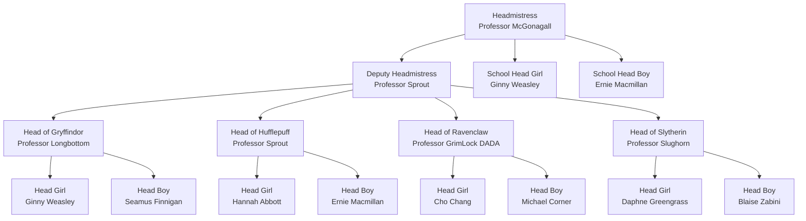

|

```mermaid
graph TD
    A[Headmistress<br>Professor McGonagall] --> B[Deputy Headmistress<br>Professor Sprout]

    %% Heads of Houses
    B --> C[Head of Gryffindor<br>Professor Longbottom]
    B --> D[Head of Hufflepuff<br>Professor Sprout]
    B --> E[Head of Ravenclaw<br>Professor GrimLock DADA]
    B --> F[Head of Slytherin<br>Professor Slughorn]

    %% Gryffindor Leaders
    C --> C1[Head Girl<br>Ginny Weasley]
    C --> C2[Head Boy<br>Seamus Finnigan]

    %% Hufflepuff Leaders
    D --> D1[Head Girl<br>Hannah Abbott]
    D --> D2[Head Boy<br>Ernie Macmillan]

    %% Ravenclaw Leaders
    E --> E1[Head Girl<br>Cho Chang]
    E --> E2[Head Boy<br>Michael Corner]

    %% Slytherin Leaders
    F --> F1[Head Girl<br>Daphne Greengrass]
    F --> F2[Head Boy<br>Blaise Zabini]

    %% Overall School Leadership
    A --> Z1[School Head Girl<br>Ginny Weasley]
    A --> Z2[School Head Boy<br>Ernie Macmillan]
```

