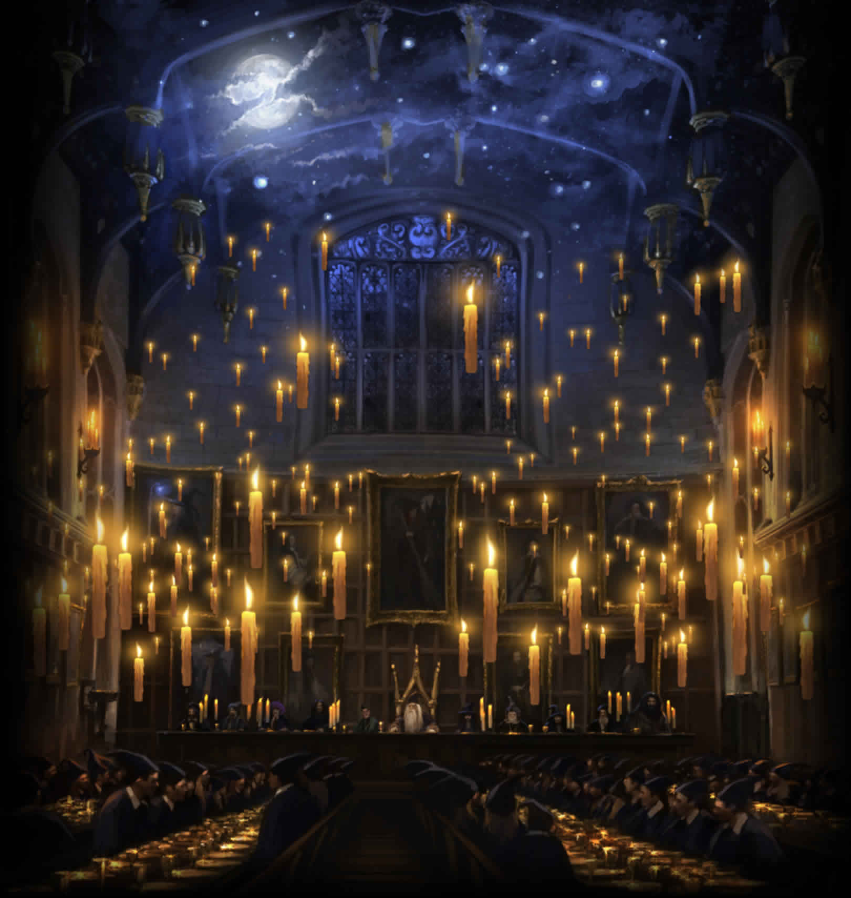

|     | WW WW WWWW Waa aa aaaa ann nn nnnn ndd dd dddd dss ss ssss && && &&&& WW WW WWWW Wii ii iizz zii iz zzzz zaa aa aaaa arr rr rrrr rdd dd dddd dss ss ssss s & s |     |
| --- | -------------------------------------------------------------------------------------------------------------------------------------------------------------- | --- |

|  | WW.A.A.N.N.D.D.S.S. . RRuulleebbooookk |  |  |
|---|---|---|---|

Wands & Wizards is unofficial Fan Content permitted under the Fan Content Policy. Not approved/endorsed by Wizards. Portions Wands & Wizards is unofficial Fan Content permitted under the Fan Content Policy. Not approved/endorsed by Wizards. Portions Wands & Wizards is unofficial Fan Content permitted under the Fan Content Policy. Not approved/endorsed by Wizards. Portions Wands & Wizards is unofficial Fan Content permitted under the Fan Content Policy. Not approved/endorsed by Wizards. Portions Wands & Wizards is unofficial Fan Content permitted under the Fan Content Policy. Not approved/endorsed by Wizards. Portions Wands & Wizards is unofficial Fan Content permitted under the Fan Content Policy. Not approved/endorsed by Wizards. Portions
Wands & Wizards is unofficial Fan Content permitted under the Fan Content Policy. Not approved/endorsed by Wizards. Portions Wands & Wizards is unofficial Fan Content permitted under the Fan Content Policy. Not approved/endorsed by Wizards. Portions Wands & Wizards is unofficial Fan Content permitted under the Fan Content Policy. Not approved/endorsed by Wizards. Portions
of the materials used are property of Wizards of the Coast. ©Wizards of the Coast LLC. Not approved/endorsed by J.K. Rowling or of the materials used are property of Wizards of the Coast. ©Wizards of the Coast LLC. Not approved/endorsed by J.K. Rowling or of the materials used are property of Wizards of the Coast. ©Wizards of the Coast LLC. Not approved/endorsed by J.K. Rowling or of the materials used are property of Wizards of the Coast. ©Wizards of the Coast LLC. Not approved/endorsed by J.K. Rowling or of the materials used are property of Wizards of the Coast. ©Wizards of the Coast LLC. Not approved/endorsed by J.K. Rowling or of the materials used are property of Wizards of the Coast. ©Wizards of the Coast LLC. Not approved/endorsed by J.K. Rowling or
of the materials used are property of Wizards of the Coast. ©Wizards of the Coast LLC. Not approved/endorsed by J.K. Rowling or of the materials used are property of Wizards of the Coast. ©Wizards of the Coast LLC. Not approved/endorsed by J.K. Rowling or of the materials used are property of Wizards of the Coast. ©Wizards of the Coast LLC. Not approved/endorsed by J.K. Rowling or
Warner Bros. Entertainment Inc. Portions of the materials used are property of J.K. Rowling or Warner Bros. Entertainment Inc. Warner Bros. Entertainment Inc. Portions of the materials used are property of J.K. Rowling or Warner Bros. Entertainment Inc. Warner Bros. Entertainment Inc. Portions of the materials used are property of J.K. Rowling or Warner Bros. Entertainment Inc. Warner Bros. Entertainment Inc. Portions of the materials used are property of J.K. Rowling or Warner Bros. Entertainment Inc. Warner Bros. Entertainment Inc. Portions of the materials used are property of J.K. Rowling or Warner Bros. Entertainment Inc. Warner Bros. Entertainment Inc. Portions of the materials used are property of J.K. Rowling or Warner Bros. Entertainment Inc.
Warner Bros. Entertainment Inc. Portions of the materials used are property of J.K. Rowling or Warner Bros. Entertainment Inc. Warner Bros. Entertainment Inc. Portions of the materials used are property of J.K. Rowling or Warner Bros. Entertainment Inc. Warner Bros. Entertainment Inc. Portions of the materials used are property of J.K. Rowling or Warner Bros. Entertainment Inc.

### Contents Contents
### Introduction Introduction
3	Appendices ...........................................................................	89
Appendix A: Potion Brewing ................................................	89 Differences from 5e ..................................................................	3
Appendix B: Patronus Rolling Tables .................................	93 Levels and Hogwarts Years .....................................................	3
Appendix C: Chocolate Frog Cards .....................................	99
### Part 1 Part 1
Glossary .............................................................................	116
Chapter 1: Houses ...........................................................	4
Hogwarts Houses ......................................................................	4
Beauxbatons and Durmstrang ...............................................	6
Credits - Created by u/Murphen44
Ilvermorny Houses ....................................................................	7
Version 1.4, published on 7/11/2022
Chapter 2: Casting Styles .........................................	9
r/WandsAndWizards - Discord Server
Base Sorcerer Features .........................................................	10
Excerpts from
The Willpower Caster ............................................................	11
Writings by J.K. Rowling The Technique Caster ............................................................	13
Sorting Hat Chats The Intellect Caster ................................................................	15
Harry Potter Fandom Wiki
Chapter 3: Schools of Magic .............................	17
Bloomsbury Harry Potter Glossary
Charms ......................................................................................	17
Artwork by
Jinxes, Hexes, and Curses .....................................................	18
Atomhawk/Pottermore Transfiguration ........................................................................	19
Even Amundsen - IG - Twitter - ArtStation Healing ......................................................................................	22
Frida Lundqvist - IG - Twitter Divination .................................................................................	23
Gergely Gizella - IG - Twitter - Behance Magizoology .............................................................................	25
Jeff Brown - DeviantArt - Website
Chapter 4: Wands ..........................................................	27	Raph Lomotan - DeviantArt - ArtStation
UptheHill Art - IG - Tumblr - DeviantArt
Wand Components .................................................................	27
Backgrounds ............................................................................	28
Special Thanks to
Chapter 5: Wizarding Equipment ...................	39	Everyone who's encouraged me and joined the
Wands & Wizards subreddit and Discord
Starting Equipment ................................................................	39
Everyone at the Discord of Many Things
Tools ...........................................................................................	39
Aughts / u/aughts for wand backgrounds
Wealth ........................................................................................	40
Blake / u/Rain-Junkie for dragon stat blocks
Cloaks ........................................................................................	40
CaelReader / u/CaelReader for Houses as Races
Wizarding Gear .......................................................................	40
Carric#4730 for animagus forms
Potions ......................................................................................	41
DCixen / u/tharian83 for Ilvermorny Houses
Magical Pets .............................................................................	49
Entrench / u/devikyn for Adaptive Ranger's
beast companion rules
Chapter 6: Wizarding Feats .................................	53
Izzy for feedback and class guidance
Innate Feats ..............................................................................	53
Jay / u/CKSalamander for chocolate frog cards
Standard Feats ........................................................................	54
Jared Ondricek / u/flamableconcrete for image
watercolor stains
Chapter 7: Wizarding Skills ................................	56
Jeff Venancio / u/Hageshii01 for apparition,
expecto patronum and more spells
Chapter 8: Dark Magic Corruption ..............	57
MadManNBlueBox for starting equipment and
background equipment
### Part 2 Part 2
59 59
Matt Mercer for Corruption Rules (Dark Magic),
and Dezidério for telling me about them
Chapter 9: Spells ............................................................	59
Made using GMBinder.
Spellcasting ..............................................................................	59
Unique Spells ..........................................................................	61
Spell Conversions ...................................................................	63
Spell List ...................................................................................	65
Spell Descriptions ..................................................................	66

### Introduction Introduction
### I
### f you are a fan of both Dungeons & Dragons and	A Harry Potter Spellcaster	A Harry Potter Spellcaster
Harry Potter, I present to you Wands & Wizards, a
Harry Potter 5e Adaptation. Joining the magic of the	For character classes, you'll see three different casting styles.
Wizarding World with the gameplay of D&D 5e, this	Although these represent three different classes, all three are
comprehensive Wizarding Alternative for Novelty	built on the chassis of the 5e Sorcerer. Additionally, because
Dungeoneering Stories (or W.A.N.D.S.) Rulebook	they're all the same class at their core, they all have the same
substitutes 5e races, classes, subclasses,	spell list. In W&W, everyone has access to the same spells
backgrounds, feats, skills, equipment, and spells. Like the 5e	(with some clear exceptions).
PHB, Part 1 of the W.A.N.D.S. Rulebook contains new
### The Role of the HM The Role of the HM
character creation options. Part 2 focuses on the changes
made to spellcasting and all of the new spells from the Harry
HM stands for Headmaster or Headmistress, which is used
Potter series. If you are unfamiliar with any of the Harry
specifically to represent the Game Master running the game
Potter references, please review the Glossary at the end of
of W&W. That abbreviation is used throughout the document
the W.A.N.D.S. Rulebook.
to refer to this person, whereas the term "headmaster" will
### Differences from 5e Differences from 5e	mean the head professor of Hogwarts.
### Levels and Hogwarts Years Levels and Hogwarts Years
While all the core mechanics and rules of D&D still apply, all
the character creation options have been replaced. None of
A character’s early levels can be associated with the magical
5e's default character options are available in W&W: no
abilities acquired through different years of school. Levels 1-2
races, classes, backgrounds, feats, or equipment are
correspond to average first-year students, just being
compatible (unless specifically noted, like a handful of feats).
introduced to schools of magic. Level 3 is second year and
The process of character creation remains unchanged, so you
level 4 is third year, and at this point, they have learned to
need only progress through the W.A.N.D.S. Rulebook
exercise some control over their magic. The threats they face
sequentially, just like you would with the PHB. Below is a
are relatively minor, usually only posing a danger to other
table that converts the 5e terminology into W&W
children or small villages.
terminology.
Level 5 will typically be covered in the fourth year. Fifth-
year students are levels 6-7, while sixth-year students are
levels 8-9. This is when young witches and wizards really
come into their own, learning powerful spells and abilities

| Character Creation Conversion Table 5e W&W |  |
|---|---|
| Race | House |
| Class Casting Style |  |
| Subclass or Archetype | School of Magic |
| Background Wand or Background |  |

from their school of magic and becoming capable of facing
dangers that threaten adult wizards.
Seventh year students are level 10 while Hogwarts
graduates and the majority of adult wizards are levels 11-12.
Only well-practiced wizards reach levels 13-16, like Aurors,
Hogwarts teachers and members of the Order of the Phoenix
(back in the Second Wizarding War). These characters have
reached a level of power that makes them special even
among wizards, confronting threats to whole regions or
wizard academies.
At levels 17-20, characters achieve the pinnacle of their
school of magic’s features, becoming heroic (or villainous)
archetypes in their own right. The fate of magical
governments or even the entire muggle world might hang in
Aside from character creation, there have been a few other
the balance during their adventures. changes to the system. Firstly, some skills have been added,
removed, or replaced to better represent the skills used in the
wizarding word. The skill conversion table can be found on
page 40, which outlines how old 5e skills correspond with
W&W skills. These are not simply renamings; new W&W
skills can have different definitions and applications.
Most importantly, you will not be using the normal 5e spell
lists. You will only use the spells in this rulebook, but quite a
few 5e spells have been renamed or slightly modified. If a 5e
spell has been included in W&W, it will be shown in the spell
conversion tables on pages 45 and 46.

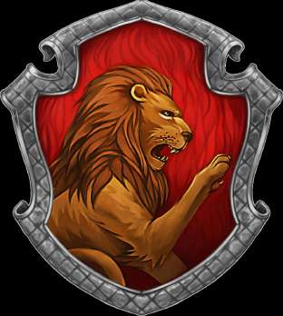
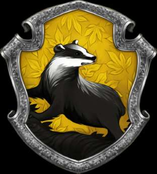
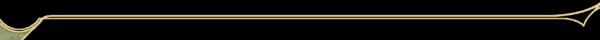

### Chapter 1: Houses (Races) Chapter 1: Houses (Races)
### H
ogwarts students are divided up into four	Ability Score Increase. Your Constitution score,
houses by the Sorting Hat when they first	Charisma score, and one other ability score of choice
arrive at Hogwarts. Houses at Hogwarts are	increase by 1.
both the living and learning communities for	Bravehearted. You have advantage on saving throws
its students. Each year's group of students in	against being frightened from any source other than a
the same house shares their dormitory and	Dementor.
many classes, acting as a sort of family. The	True Gryffindor. In times of dire need, the Sword of
houses compete by earning points for the House Cup and	Gryffindor may present itself to you.
playing for the Inter-House Quidditch Cup.
Feat. You gain one feat of your choice.
Each house has stereotypical traits that are grounded in
### Hufflepuff Hufflepuff
reality, but students are quite diverse. Some young witches
and wizards share traits with another house, like Hermione
Granger's Ravenclaw-like brilliance. Others might appear the	Hufflepuffs value hard work,
exact opposite of their house, like Neville Longbottom's lack	patience, loyalty, and fair play,
of confidence (needing time to grow into bravery) or Luna	represented by the sturdy
Lovegood's ostensible disconnection from facts (keeping a	badger. Although often
creative, open mind and being perceptive). The Sorting Hat	disparaged by others for their
places students in the house that will benefit them the most.	lack of competitiveness, the
The way you decide your character's house is not always by	house has produced great
what they do, but what would make them proudest if they	wizards – not least Newt
were strong enough to do it. Your sorting is what you want to	Scamander, notable
be and what you believe in.	magizoologist and author.
Hufflepuff's house colors are
### Gryffindor Gryffindor
yellow and black.
### Compassion and Empathy Compassion and Empathy
With a lion as its crest,
Gryffindor is the house
Hufflepuffs value people and community. They base their
which most values the
decisions on who is in need and who they can help. They
virtues of determination,
value fairness because everyone is a person. Even directly
courage, and chivalry.
wronged, Hufflepuffs will often give a second (or fifth) chance.
Some call these traits
But Hufflepuffs aren't inherently tolerant, like Gryffindors
recklessness or "pointless
aren't inherently moral. They believe that all people deserve
heroics," but a Gryffindor
some type of kindness or decency, but they can redefine
is sure to take action.
"person" to exclude anyone who doesn't meet their standards.
Gryffindor's house colors
are red and gold.
### Hard Workers Hard Workers
### Champions of Justice Champions of Justice
Hufflepuffs toil. Their strength comes from consistency and
the integrity of their method. They have a certain steadiness,
Gryffindors trust their moral intuitions and have a need and a
naturally becoming the lynchpin of a community. While
drive to live by them. They feel what’s right in their gut, and
stereotyped as being social, a Hufflepuff might also be an
that matters and guides them. It feels immoral to ignore that.
introverted misanthrope who runs on hard work alone.
However, just because they operate on what “feels right,”
### that doesn’t mean Gryffindors are all impetuous, emotional	Hufflepuff Traits	Hufflepuff Traits
hellions. Gryffindors can still be intelligent and deliberate,
weighing their decisions and moralities carefully.	You can rely on them to have certain attributes in common.
Ability Score Increase. Your Constitution score, Wisdom
### Fighting Spirit Fighting Spirit
score, and one other ability score of choice increase by 1.
Steadfast Loyalty. You have advantage on saving throws
Gryffindors charge. They meet the world head-on and
against any effect that would make you attack or work against
challenge it to do its worst. Gryffindors are honest, brash,
a creature you would normally consider an ally.
and bold in pursuit of things they care about. Known for their
Kitchen Trips. Your experience with the Hogwarts house
bravery, it is almost a moral matter to stay true to themselves
elves has taught you how to politely address and interact with
in any situation.
magical beings. Oh, and you can get tons of snacks.
### Gryffindor Traits Gryffindor Traits
Feat. You gain one feat of your choice.
Through their camaraderie, Gryffindors bolster each other's
confidence and endeavors.

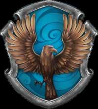
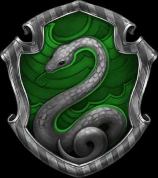

### Ravenclaw     Ravenclaw	Slytherin	Slytherin
Ravenclaws prize wit,	Slytherin produces more than its share of Dark wizards, but
learning, and wisdom.	also turns out leaders who are proud, ambitious, resourceful,
It's an ethos etched into	and cunning. Merlin is one particularly famous Slytherin.
founder Rowena	What others may call cheating or manipulation, a Slytherin
Ravenclaw's diadem: 'wit	calls "playing the game." Slytherin's house colors are green
beyond measure is man's	and silver.
greatest treasure.' Despite
### Inner Circle Inner Circle
the house's reputation for
eccentricity and reclusiveness,
Slytherins are fiercely loyal to the people they care for most.
Ravenclaws tend to make their
Slytherin is the place where "you’ll make your real friends";
mark on the world. Ravenclaw's
they prioritize individual loyalties and find their moral core in
house colors are blue and bronze.
protecting and caring for the people they are closest to.
### A Systematic Mind A Systematic Mind	Slytherin’s reputation for ambition comes from prioritizing
themselves and the select people they deem important.
Ravenclaws construct systems to test their decisions against	Ambition is something you can find in all four houses, but
before they feel comfortable calling something right. Their	Slytherin’s looks most obviously selfish.
systems give them a way to frame the world and a confidence
### Machiavellian Maneuvers Machiavellian Maneuvers
in their ability to interact with it.
Ravenclaws do not lack intuition, but often distrust gut
Slytherins improvise. They are the
instinct. Although they go about it differently, a Ravenclaw
most adaptive, finding their
can be just as morally motivated as a Gryffindor.
strength in responding quickly
### Contingency Planners Contingency Planners	                 to whatever a situation
throws at them. They
Ravenclaws plan. They collect information, they strategize.	                     improvise differently
They have tools. They run hypotheticals and try to plan ahead	                   than Gryffindors, trying
for things that might come up. They build things (of varying	                 new angles instead of
degrees of actual usefulness) that they can use later, whether	                 strong-arming the situation.
that’s an emergency supply pack or vast knowledge in a niche	                 They might have different
topic. They feel less at home in improvisation and more	                   "faces" for different
comfortable taking the time to be prepared.	                 situations, only truly being
themselves when they’re
### Ravenclaw Traits Ravenclaw Traits
finally alone or feeling safe.
With a library in their common room, Ravenclaws will always
share studious habits.
### Slytherin Traits Slytherin Traits
Ability Score Increase. Your Intelligence score, Wisdom
score, and one other ability score of choice increase by 1.
Although Slytherins like to keep their secrets, there are some
In-Depth Knowledge. Whenever you make an Intelligence
obvious traits they all have.
or Wisdom ability check that lets you add your proficiency
Ability Score Increase. Your Dexterity score, Charisma
bonus, you can treat a d20 roll of 5 or lower as a 6.
score, and one other ability score of choice increase by 1.
Rowena's Library. You can easily research a desired topic
Compromising Information. Whenever you make a
through enlisting your housemates' help and browsing books
Charisma check related to using a person's secrets, you are
exclusively found in the Ravenclaw common room.
considered proficient in the appropriate skill and add double
Feat. You gain one feat of your choice.
your proficiency bonus to the check, instead of your normal
proficiency bonus.
A Noble Quality. You're able to adopt a persona of
importance to blend in among high-ranking officials and
prestigious witches and wizards.
Feat. You gain one feat of your choice.

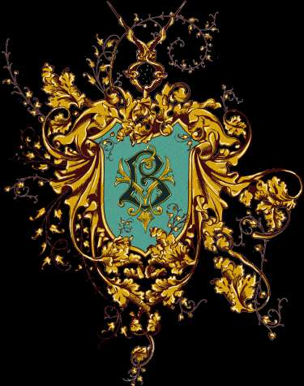
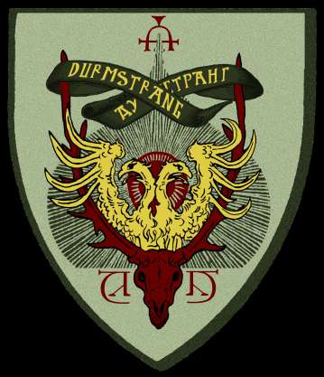

### Beauxbatons Beauxbatons	Durmstrang	Durmstrang
Located in the mountains of France,	Even among the magical community, the Durmstang
the Académie de Magie Beauxbâtons	Institute's location is a closely guarded secret, a symptom of
or Beauxbatons Academy of Magic is	the magical school's distrust of outsiders. Some believe it to
the choice of magical education	be somewhere in the Nordic countries or Russia, but the only
for young witches and wizards	thing that's certain is that it accepts students from Northern,
living in Western, Southern,	Central and Eastern European countries. Historically,
and sometimes even Central	Durmstrang has also refused to accept Muggleborn students,
Europe. For wizards in the UK,	although that might be attributed to a previous headmaster's
Beauxbatons is most notable for its	association with Britain's Death Eaters. Its modern policies
friendly rivalry to Hogwarts, and the	are unknown.
two schools have often supported
### Unorthodox Curriculum Unorthodox Curriculum
each other throughout history.
Beauxbatons is widely recognized
Durmstrang is notorious for its acceptance of the Dark Arts,
for the elegance of its castle, its
and was known to have educated (and later expelled) Gellert
majestic gardens and its well-
Grindelwald before his ascension as one of history's most
prepared cuisine.
dangerous Dark wizards.
### Tradition and Discipline Tradition and Discipline	Contrary to its reputation, Durmstrang doesn't specialize
in the Dark Arts themselves, but in combative magic. The
Etiquette and respect are at the forefront of Beauxbatons	school is simply open-minded about the use of Dark Arts, and
customs. The students stand at attention whenever their	so most topics studied at Durmstrang incorporate Dark
headmaster or headmistress enters a room and continue	elements other schools would forswear.
doing so until they take a seat or order everyone to return to
### Strength Through Hardship Strength Through Hardship
their tasks.
There is a strong atmosphere of school pride, and the
The stern and militaristic culture that has pervaded the
Academy's traditions are treasured by staff and students
Durmstrang Institute is mirrored in its harsh surroundings.
alike. While taught to be polite, that pride often shows
Brutal winters, rigorous physical exercise regimens and
through when students of Beauxbatons travel abroad.
swimming in ice cold lakes are all part of the character-
### building school experience. A Delicate Approach to Magic A Delicate Approach to Magic
Although some parents feel the approach is too extreme,
Beauxbatons Academy of Magic teaches its students to	everything is designed to produce resilient and resourceful
approach magic with control and finesse, instead of	wizards and witches who will survive any combat.
clumsiness or brute force. The studies revolve around proper
### Durmstrang Student Traits Durmstrang Student Traits
dueling forms, taxonomies and knowledge deeply grounded
in magical theory.
The Durmstrang coursework and philosophy strongly define
To an untrained eye, the deliberate movements of
its students' attributes.
Beauxbatons duelists might resemble a choreographed
dance, but it's closer to the precision, quickness and lethality
Ability Score Increase.
of Muggle fencing.
Your Strength score,
Constitution score, and
### Beauxbatons Student Traits Beauxbatons Student Traits
one other ability score of
choice increase by 1.
The traits of Beauxbatons students originate from their
Cold Efficiency. You
school's dueling style and from their travels abroad.
add the bombarda spell
Ability Score Increase. Your Dexterity score, Wisdom
to your list of known spells.
score, and one other ability score of choice increase by 1.
It does not count against
Nimble Evasion. Whenever you take the dodge action, add
your cantrips known, and
half your proficiency bonus to your AC and your Dexterity
cannot be forgotten to learn
saving throws.
another cantrip.
Exchange Student. You're familiar with the workings of
Dark Education. You have
the International Confederation of Wizards and other
advantage on any rolls made to
international associations.
resist gaining Corruption effects
Feat. You gain one feat of your choice.
from Dark magic.
Feat. You gain one feat of your choice.

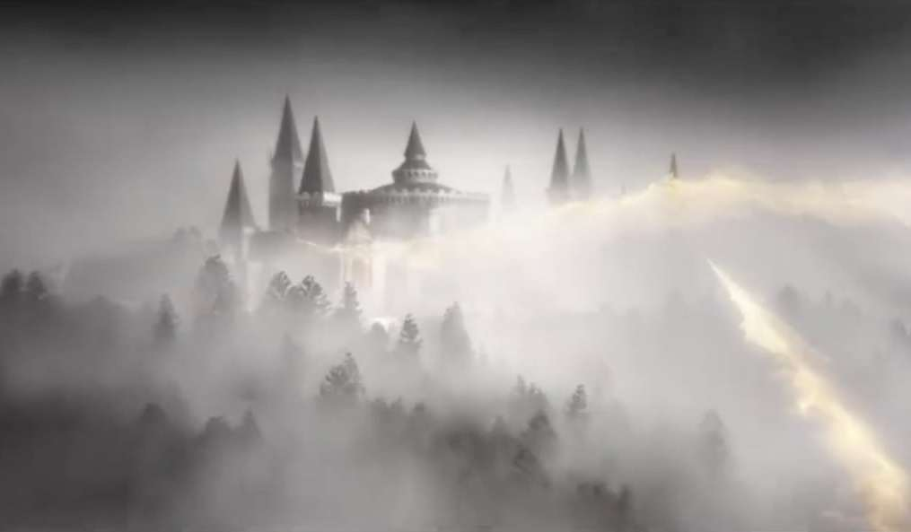
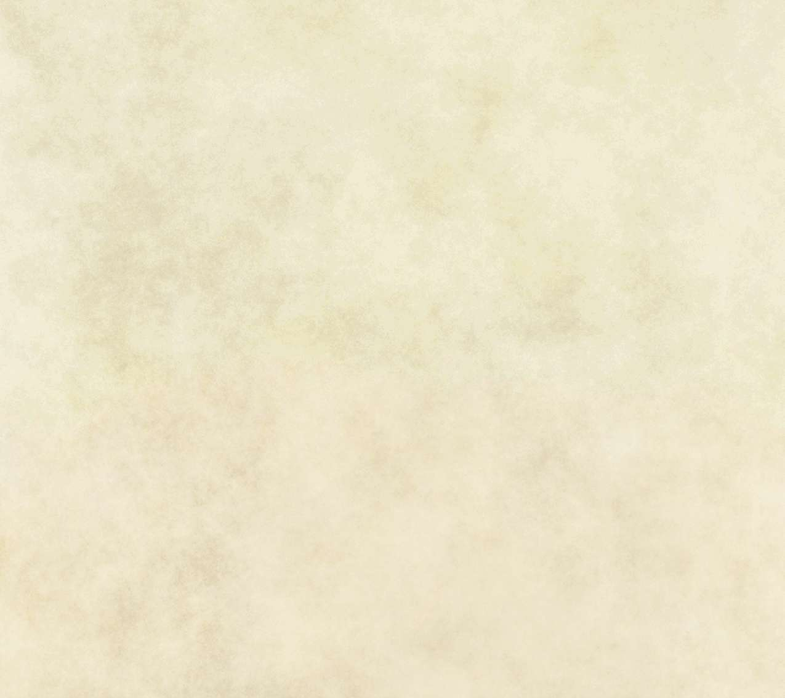
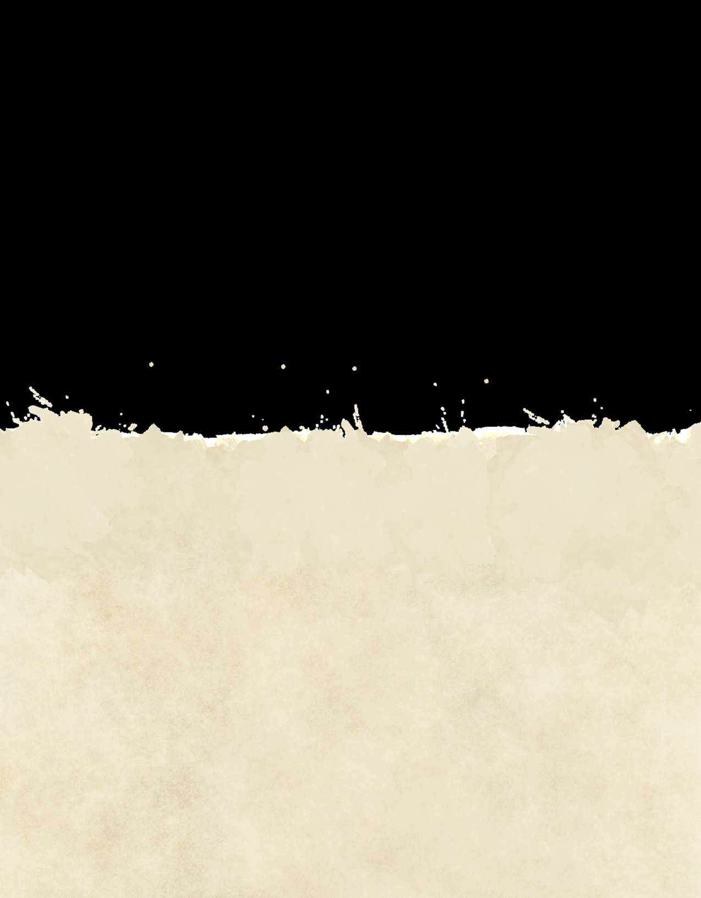

### Horned Serpent Horned Serpent
Procedural Thinking. You enjoy testing yourself with riddles
and logic puzzles. If you get stuck on one, you might
### (Ilvermorny) (Ilvermorny)
subconsciously connect a few dots.
Feat. You gain one feat
Horned Serpent is the house of scholars. Isolt Sayre, the
of your choice.
founder of Ilvermorny, named her house for her friendship
### Wampus Wampus with a horned serpent and her ability to understand
Parseltongue. Horned Serpent represents the mind of the
### (Ilvermorny) (Ilvermorny)
wizard, since Isolt's passion for learning has been preserved
in Horned Serpent.
The house represents the
### Natural Academics Natural Academics
body of the wizard. Wampus
was chosen by Webster Boot,
Because of Horned Serpent's reputation for studiousness,
one of the first students of
parallels are often drawn with the Ravenclaw house at
Ilvermorny and one of Isolt
Hogwarts, but Hogwarts and Ilvermorny houses are not
Sayre's adopted children.
equivalent to each other.
Wampus favors warriors, taking after
While it would be common to find a Horned Serpent
Webster's career in the British colonies
student at the top of their class, you're just as likely to find
as a prominent "Auror for hire."
them heading out to obtain first-hand practical experience. A
### certain appreciation of nature is another notable trait of	Warriors at Heart	Warriors at Heart
Horned Serpent.
Wampus is named after the wampus cat, an extremely
### Horned Serpent Traits Horned Serpent Traits
dangerous magical creature found in America. The wampus
cat is XXXXX classified by the Ministry of Magic: "Known
Horned Serpents consistently like to test their well-rounded
wizard killer / impossible to train or domesticate," which is
intellect.
fitting for the Ilvermorny house's reputation.
Ability Score Increase. Your Intelligence score, Charisma
Wampuses rarely back down from a fight, whether it's in
score, and one other ability score of choice increase by 1.
the form of an argument, fisticuffs or exchanged hexes. They
Scholar's Mind. You add half your proficiency bonus to any
place great value on swift action and self-defense. Fiercely
Intelligence or Wisdom ability check you make that doesn't
loyal too, a Wampus is a good person to have on your side
already include your proficiency bonus.
and terrible to have against you.

### Wampus Traits Wampus Traits	Pukwudgie	Pukwudgie
### Wampuses' traits can be very useful in times of conflict and	(Ilvermorny)	(Ilvermorny)
turmoil.
Ability Score Increase. Your Dexterity score, Constitution
The Pukwudgie house
score, and one other ability score of choice increase by 1.
represents the heart of the
Warrior's Endurance. When you roll a 16 or higher on a
wizard, and is commonly
death saving throw, you instantly regain 1 hit point. You can't
associated with healers.
use this feature again until you finish a long rest.
This house was named by
Contagious Valor. Your moxie can be inspiring, and those
James Steward, famous
around you feel more inclined to accompany you into battle
for being the co-founder of
against your foes.
Ilvermorny, husband of Isolt
Feat. You gain one feat of your choice.
Sayre, adoptive father of Chadwick
and Webster Boot and the only
### Thunderbird (Ilvermorny) Thunderbird (Ilvermorny)
known no-maj wandmaker.
### Supportive and Self-Sufficient Supportive and Self-Sufficient
Thunderbird is said to represent the soul of the wizard and is
home to adventurers. The house was named and created by
James chose this house because a pukwudgie named William
Chadwick Boot, Webster Boot's older brother, Isolt Sayre's
had accompanied Isolt. A mix between European goblins and
other adopted son, and one of the first students of Ilvermorny.
house-elves in both appearance and magical capabilities,
The Thunderbird house has been associated with Chadwick's
pukwudgies are traditionally aloof from human-kind. William
later accomplishments as an international traveller and
later saved the lives of Isolt, James, and the Boots, and
author of magical textbooks.
because of the respect showed by James, William and his
### Discovery and Creation Discovery and Creation
descendants became Ilvermorny's guards and caretakers.
Students of the Pukwudgie house are often quite caring
The house is named after the awe-inspiring thunderbird,
and compassionate. They easily empathize, even with an
whose natural habitat is in southwestern United States.
enemy, and enjoy seeing others achieve their goals. However,
Thanks to its ability to create storms and its wide-ranging
Pukwudgies are just as capable of taking care of themselves
travels around North America, it's the most widely known
and won't forget to prioritize their own happiness.
magical creatures among indigenous No-Maj communities.
### Pukwudgie Traits Pukwudgie Traits Thunderbird students similarly feel a yearning to venture
beyond the ordinary.
Pukwudgies' perspective gives them common attributes.
That desire can be expressed
Ability Score Increase. Your Wisdom score, Charisma through literal or conceptual
score, and one other ability score of choice increase by 1. exploration, as Thunderbirds
Healer's Knack. Whenever you make a are just as likely to
Wisdom (Medicine) check to stabilize a forge new paths in
creature, add half your proficiency bonus to their chosen field as
your roll. forge new paths through
the untamed wilderness. 
	            A Diplomatic Touch. If you assist a hostile being in
a meaningful way, they're more likely to reconsider Wherever they go, they'll
their hostility towards you, potentially defusing the go boldy.
situation.
### Thunderbird Traits Thunderbird Traits
Feat. You gain one feat of your choice.
One thing that's a constant for all
Thunderbirds is change.
Ability Score Increase. Your Strength
score, Charisma score, and one other ability score of choice
increase by 1.
Adventurer's Footing. Moving through nonmagical
difficult terrain costs you no extra movement.
Dependable Bearings. You have a good sense of direction
and can easily use notable landmarks and geography to
remember the general layout of areas.
Feat. You gain one feat of your choice.

### Chapter 2: Casting Styles (Classes) Chapter 2: Casting Styles (Classes)
### W
hile any wizard can cast a wide variety of	Casting styles are the wizarding equivalent of classes.
spells, a young wizard's approach to magic	Casting style determines a character's Hit Dice, spellcasting
defines his own unique casting style. Casting	ability score, saving throw proficiencies, and two skills.
styles separate wizards and affect how they	Although all wizards and witches are based what a Muggle
learn and use magic. The three available	would call a Sorcerer, each casting style will have slightly
casting styles to choose from are Willpower,	different class features, number of spells known, sorcery
Technique, and Intellect. A wizard can only	points, and metamagic progression.
have one casting style and cannot multiclass or gain levels in
any other casting styles.

| Casting Hit Primary Saving Style Description Die Ability Throws Skill Proficiency Options |  |  |  |  |  |  |
|---|---|---|---|---|---|---|
| Willpower |  | An inspirational survivor, who has a heart of a warrior | d10 | CHA | CON & CHA | Athletics, Deception, Intimidation, Magical Theory, Persuasion, Sleight of Hand, Survival |
| A powerful specialist, with INT Acrobatics, Herbology, Insight, Perception, Technique d6 WIS immense control over spells & WIS Potion-Making, Sleight of Hand, Stealth |  |  |  |  |  |  |
| Intellect |  | A versatile academic, with a solution for every problem | d8 | INT | DEX & INT | Acrobatics, Herbology, Insight, Investigation, Magical Creatures, Magical Theory, Medicine, Muggle Studies and Survival |

Similarly, a witch's interests and background will lead her to	A wizard of any casting style can study any school of magic,
specialize in a particular school of magic (Chapter 3).	but some combinations will synergize particularly well. Each
Studying a school of magic grants special abilities and	school of magic will have its own subclass features and some
knowledge related to that favored branch of magic, typically	schools of magic have a list of spells — its school of magic
connecting to a future wizarding profession. A witch can only	spells — that you learn once you gain a spell slot of the level
have one school of magic and cannot gain levels in any other	noted in the school of magic description. Once you gain a
school of magic. Schools of magic are the wizarding	school of magic spell, it's added to your spells known, it
equivalent of subclasses, but schools of magic are not	doesn’t count against your number of spells known, and it
restricted to certain casting styles.	cannot be forgotten to learn another spell.

| School of Magic Description Suggested Class |  |  |
|---|---|---|
| Charms | A non-lethal dueling master casting a spell for every situation and enchanting artifacts | Technique or Intellect |
| A combatant going toe-to-toe with Dark wizards Jinxes, Hexes, and Curses Willpower and nullifying ancient curses and harmful magic |  |  |
| Transfiguration | An innovator manipulating the elements or shapeshifting into an animal form | Technique |
| A skilled professional saving lives through the Healing Willpower or Intellect treatment of magical ailments and injuries |  |  |
| Divination | A mystic unraveling visions of the future or probing minds for the answers they seek | Willpower or Technique |
| A researcher bonding with fearsome beasts and Magizoology Intellect facing off with dark creatures |  |  |

### Heightened Spell Heightened Spell Base Sorcerer Features Base Sorcerer Features
When you cast a spell that forces a creature to make a saving
### throw to resist its effects, you can spend 3 sorcery points to Font of Magic Font of Magic
give one target of the spell disadvantage on its first saving
Sorcery Points Sorcery Points	throw made against the spell.
You can never have more sorcery points than shown on the
Quickened Spell Quickened Spell
table for your level. You regain all spent sorcery points when
When you cast a spell that has a casting time of 1 action, you
you finish a long rest.
can spend 2 sorcery points to change the casting time to 1
Flexible Casting Flexible Casting	Bonus Action for this casting.
You can use your sorcery points to gain additional spell slots,
Subtle Spell Subtle Spell
or sacrifice spell slots to gain additional sorcery points.
When you cast a spell, you can spend 1 sorcery point to cast it
Creating Spell Slots. You can transform unexpended
without any somatic or verbal Components.
sorcery points into one spell slot as a bonus action on your
turn. The created spell slots vanish at the end of a long rest.
Twinned Spell Twinned Spell
Slot Level	SP Cost	Slot Level	SP Cost	When you cast a spell that targets only one creature and
doesn’t have a range of self, you can spend a number of

| 2 | 4th | 6 |
|---|---|---|

1st
sorcery points equal to the spell’s level to target a second
2nd	3	5th	7	creature in range with the same spell (1 sorcery point if the
spell is a cantrip).

| 5 |  |  |
|---|---|---|

3rd
Converting a Spell Slot to Sorcery Points. As a bonus
action on your turn, you can expend one spell slot and gain a
number of sorcery points equal to the slot's level.

| ots per Level st 2nd 3rd 4th 5th 6th 7th 8th 9th |  |  |  |  |  |  |
|---|---|---|---|---|---|---|
| — — | — | — | — | — | — | — |
| ─ — — — — — — — |  |  |  |  |  |  |
| 2 ─ | ─ | ─ | — | — | — | — |
| 3 — — — — — — — |  |  |  |  |  |  |
| 3 2 | — | — | — | — | — | — |
| 3 3 — — — — — — |  |  |  |  |  |  |
| 3 3 | 1 | — | — | — | — | — |
| 3 3 2 — — — — — |  |  |  |  |  |  |
| 3 3 | 3 | 1 | — | — | — | — |
| 3 3 3 2 — — — — |  |  |  |  |  |  |
| 3 3 | 3 | 2 | 1 | — | — | — |
| 3 3 3 2 1 — — — |  |  |  |  |  |  |
| 3 3 | 3 | 2 | 1 | 1 | — | — |
| 3 3 3 2 1 1 — — |  |  |  |  |  |  |
| 3 3 | 3 | 2 | 1 | 1 | 1 | — |
| 3 3 3 2 1 1 1 — |  |  |  |  |  |  |
| 3 3 | 3 | 2 | 1 | 1 | 1 | 1 |
| 3 3 3 3 1 1 1 1 |  |  |  |  |  |  |
| 3 3 | 3 | 3 | 2 | 1 | 1 | 1 |
| 3 3 3 3 2 2 1 1 |  |  |  |  |  |  |

### Metamagic Metamagic
Level	1st You can use only one Metamagic option on a spell when you
cast it, unless otherwise noted.
1st	2
Careful Spell Careful Spell
2nd	3
When you cast a spell that forces other creatures to make a
3rd	4
saving throw, you can protect some of those creatures from
4th	4 the spell’s full force. To do so, you spend 1 sorcery point and
choose a number of those creatures up to your spellcasting
5th	4
ability modifier (minimum of one creature). A chosen
6th	4 creature automatically succeeds on its saving throw.
7th	4 Distant Spell Distant Spell
When you cast a spell that has a range of 5 feet or greater,	8th	4
you can spend 1 sorcery point to double the spell's range.
9th	4
When you cast a spell that has a range of touch, you can
spend 1 sorcery point to make the range of the spell 30 feet.	10th	4
11th	4 Empowered Spell Empowered Spell
When you roll a spell's damage, you can spend 1 sorcery	12th	4
point to reroll a number of damage dice up to your
13th	4
spellcasting ability modifier (minimum one). You must use the
new rolls.
14th	4
You can use Empowered Spell even if you have already
15th	4
used a different Metamagic option during the spell's casting.
16th	4
Extended Spell Extended Spell
17th	4
When you cast a spell that has a duration of 1 minute or
longer, you can spend 1 sorcery point to double its duration,
18th	4
to a maximum duration of 24 hours.
19th	4
20th	4

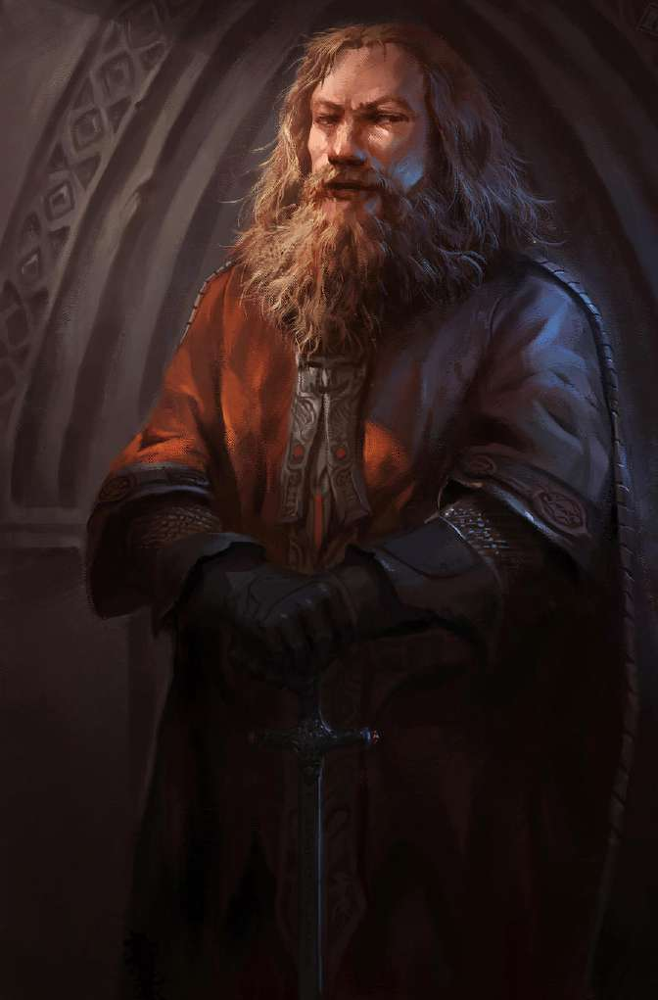
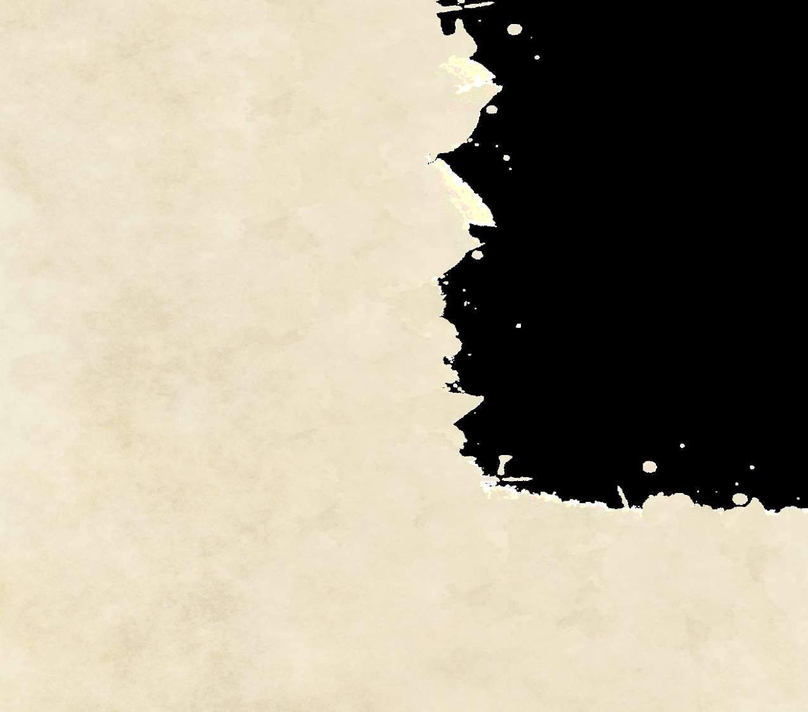

### The Willpower  The Willpower
### Caster Caster
### W
hen witches and wizards cast with feeling,
they put all of their energy into their spells.
Their “gut instinct” approach to magic taps
into that willpower, but teaches them to take
shortcuts. These wizards often have strong
personalities and gravitate to the frontlines.
### Class Features Class Features
As a Willpower caster, you gain the following class features.
Hit Points Hit Points
Hit Dice: 1d10 per Willpower level
Hit Points at 1st Level: 10 + your Constitution modifier
Hit Points at Higher Levels: 1d10 (or 6) + your Constitution
modifier per Willpower level after 1st
Proficiencies Proficiencies
Saving Throws: Constitution, Charisma
Skills: Choose two from Athletics, Deception, Intimidation,
Magical Theory, Persuasion, Sleight of Hand and Survival
Art by Raph Lomotan Art by Raph Lomotan Art by Raph Lomotan Art by Raph Lomotan Art by Raph Lomotan Art by Raph Lomotan
Art by Raph Lomotan Art by Raph Lomotan Art by Raph Lomotan
Equipment Equipment
You start with the following equipment, in addition to the
equipment granted by your background: a wand, a student's
pack, a winter cloak, and a magical pet of your choice.
Spellcasting Spellcasting
exceed your highest available level of spell slots. This does
Charisma is your spellcasting ability for your spells. You use
not count against your number of Metamagic options.
your Charisma whenever a spell refers to your spellcasting
ability. In addition, you use your Charisma modifier when	Metamagic: Resistant Spell	Metamagic: Resistant Spell

| pe | l |
|---|---|

setting the saving throw DC for a spell you cast and when
At 3rd level, when you cast a spell, you can spend 1 sorcery
making an attack roll with one.
point per increased level to make your spell be treated by
You must use a wand as a spellcasting focus for your spells.
spell deflection, finite incantatem, or reparifors as if your
Your spell slot progression is the standard for full casters.
spell was cast using a spell slot higher than its original level,
Additionally, when you gain a level in this class, you can
making your spell more resistant. The spell's higher level
choose two of the cantrips or spells you know and replace
cannot exceed your highest available level of spell slots. This
them with two new cantrips or spells, which also must be of a
does not count against your number of Metamagic options.
level for which you have spell slots.
Apparition Lessons Apparition Lessons
Sorcerous Resilience Sorcerous Resilience
When you reach 9th level, you gain the Apparition ability.
The accidental magic in your early childhood never stopped
protecting you. Your AC equals 13 + your Dexterity modifier.	Signature Spells	Signature Spells
When you reach 20th level, you gain mastery over two
Font of Magic, Metamagic, and Ability Font of Magic, Metamagic, and Ability
powerful spells and can cast them with little effort. Choose
Score Improvement Score Improvement
two of your known 3rd-level spells as your signature spells.
Unless differences are shown in the Willpower class table, a	You can cast each of them once at 3rd level without
Willpower caster has all Font of Magic, Sorcery Points,
expending a spell slot. When you do so, you can’t do so again
Flexible Casting, Metamagic, and Ability Score Improvement	until you finish a short or long rest.
class features from a 5e Sorcerer.
### Schools of Magic Schools of Magic
Metamagic: Fierce Spell Metamagic: Fierce Spell
Choose from the available Schools of Magic found in Chapter
At 3rd level, when you cast a spell, you can spend 2 sorcery
3 to determine your subclass. You have access to the full spell
points to cast that spell as if it were cast using a spell slot one
list and can learn spells of any school of magic, except where
level higher than its original level, or 4 sorcery points to cast
signified with an asterisk in the Spell List in Chapter 9.
that spell two levels higher. The spell's higher level cannot

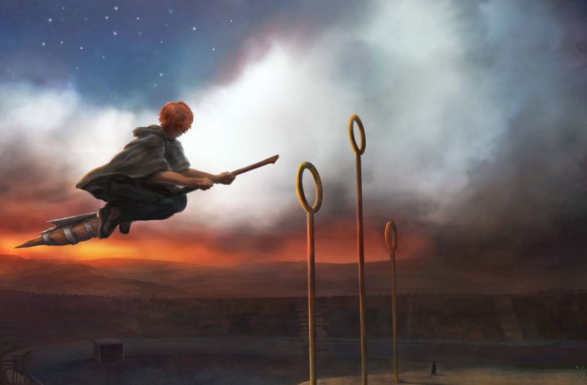
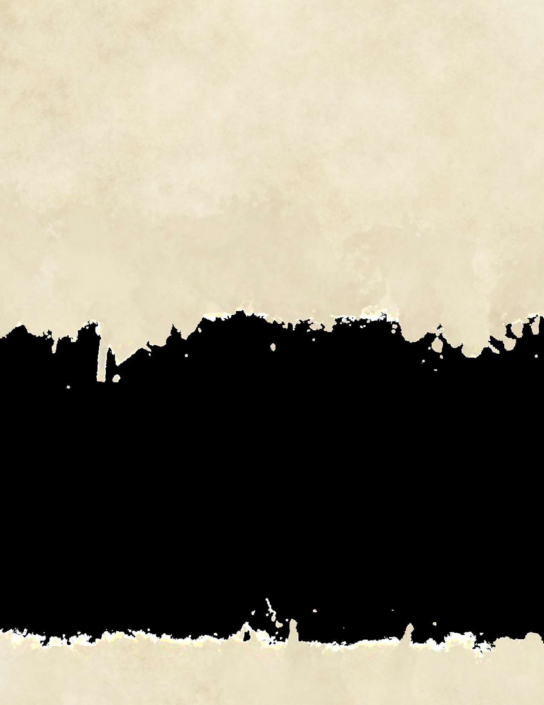
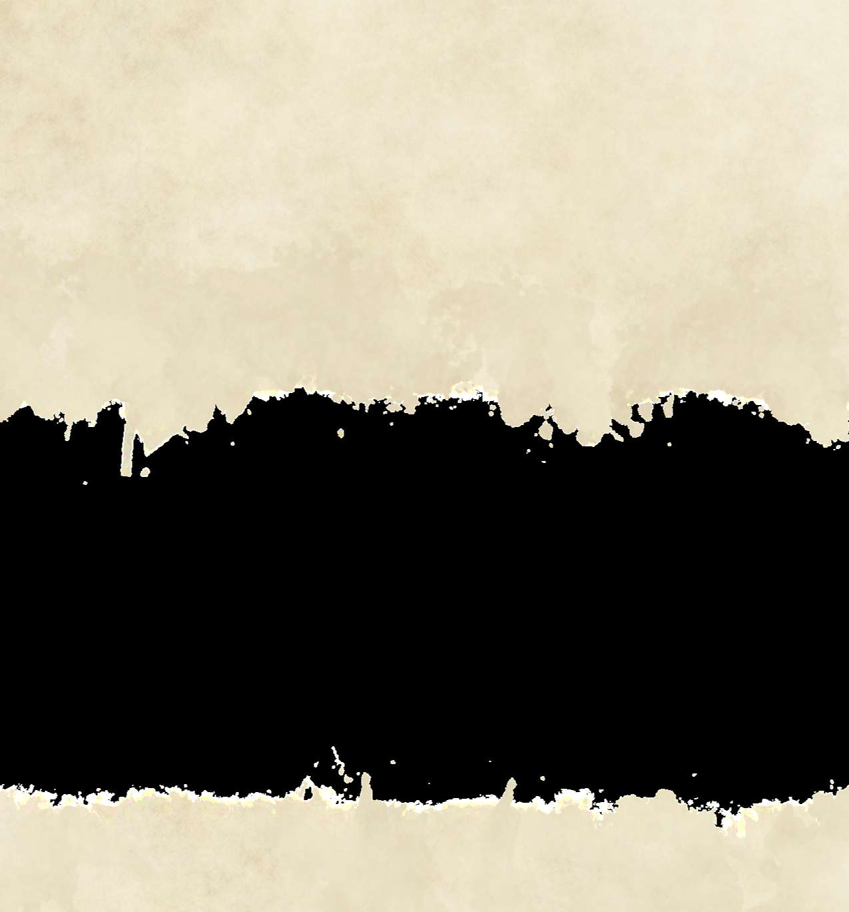

| Willpower Proficiency Sorcery Cantrips Spells Level Bonus Points Metamagic Features Known Known |  |  |  |  |  |  |
|---|---|---|---|---|---|---|
| 1st | +2 | — | — | Spellcasting, Sorcerous Resilience, School of Magic | 4 | 3 |
| 2nd +2 2 — Font of Magic 4 4 |  |  |  |  |  |  |
| 3rd | +2 | 3 | 2 | Metamagic, Fierce Spell, Resistant Spell | 4 | 5 |
| 4th +2 4 2 Ability Score Improvement 5 6 |  |  |  |  |  |  |
| 5th | +3 | 5 | 2 | ─ | 5 | 8 |
| 6th +3 6 2 School of Magic Feature 5 8 |  |  |  |  |  |  |
| 7th | +3 | 7 | 2 | ─ | 6 | 10 |
| 8th +3 8 2 Ability Score Improvement 6 11 |  |  |  |  |  |  |
| 9th | +4 | 9 | 2 | Apparition Lessons | 6 | 13 |
| 10th +4 10 3 School of Magic Feature, Metamagic 7 14 |  |  |  |  |  |  |
| 11th | +4 | 11 | 3 | ─ | 7 | 15 |
| 12th +4 12 3 Ability Score Improvement 7 15 |  |  |  |  |  |  |
| 13th | +5 | 13 | 3 | ─ | 8 | 17 |
| 14th +5 14 3 School of Magic Feature 8 17 |  |  |  |  |  |  |
| 15th | +5 | 15 | 3 | ─ | 8 | 18 |
| 16th +5 16 3 Ability Score Improvement 8 18 |  |  |  |  |  |  |
| 17th | +6 | 17 | 4 | Metamagic | 9 | 20 |
| 18th +6 18 4 School of Magic Feature 9 20 |  |  |  |  |  |  |
| 19th | +6 | 19 | 4 | Ability Score Improvement | 9 | 20 |
| 20th +6 20 4 Signature Spells 9 20 |  |  |  |  |  |  |

Art by Atomhawk / Art by Atomhawk / Art by Atomhawk / Art by Atomhawk / Art by Atomhawk / Art by Atomhawk /
Art by Atomhawk / Art by Atomhawk / Art by Atomhawk /
© Pottermore Limited © Pottermore Limited © Pottermore Limited © Pottermore Limited © Pottermore Limited © Pottermore Limited
© Pottermore Limited © Pottermore Limited © Pottermore Limited

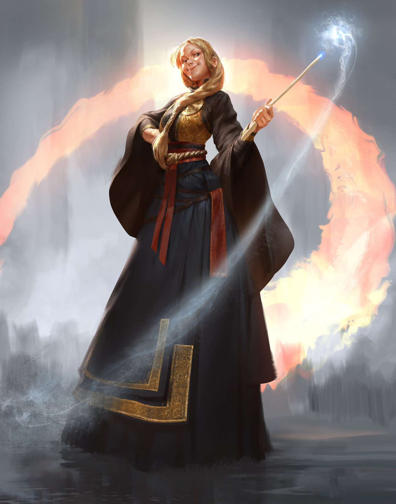

### The  The
### Technique  Technique
### Caster Caster
### T
hese spellcasters
have practiced countless
hours to obtain their level
of control of magic. They are
specialists: powerful and reactive.
Their eye for detail them makes them
formidable foes in the dueling world,
and often are credited as the best of their field.
### Class Features Class Features
As a Technique caster, you gain the following class features.
Hit Points Hit Points
Hit Dice: 1d6 per Technique level
Hit Points at 1st Level: 6 + your Constitution modifier
Hit Points at Higher Levels: 1d6 (or 4) + your Constitution
modifier per Technique level after 1st
Proficiencies Proficiencies
Upon deflection, you automatically succeed on your
Saving Throws: Wisdom, Intelligence
saving throw against the spell and you can direct the
Skills: Choose two from Acrobatics, Herbology, Insight,
spell's effect to a creature within 10 feet of you, if desired.
Perception, Potion-Making, Sleight of Hand and Stealth
If the spell does not have a saving throw, it has no effect on
Equipment Equipment	you. If a creature was also targeted by the spell or included in
the area of the spell, you cannot redirect the spell to that
You start with the following equipment, in addition to the
creature.
equipment granted by your background: a wand, a student's
pack, a winter cloak, and a magical pet of your choice.
Font of Magic, Metamagic, and Ability Font of Magic, Metamagic, and Ability
Spellcasting Spellcasting	Score Improvement	Score Improvement
Wisdom is your spellcasting ability for your spells. You use	Unless differences are shown in the Technique class table, a
your Wisdom whenever a spell refers to your spellcasting	Technique caster has all Font of Magic, Sorcery Points,
ability. In addition, you use your Wisdom modifier when	Flexible Casting, Metamagic, and Ability Score Improvement
class features from a 5e Sorcerer. setting the saving throw DC for a spell you cast and when
making an attack roll with one.
Apparition Lessons Apparition Lessons
You must use a wand as a spellcasting focus for your spells.
When you reach 9th level, you gain the Apparition ability. Your spell slot progression is the standard for full casters (22
slots at level 20).
Sorcerous Restoration Sorcerous Restoration
Additionally, when you gain a level in this class, you can
When you reach 20th level, you regain 4 expended sorcery
choose two of the cantrips or spells you know and replace
points whenever you finish a short rest.
them with two new cantrips or spells, which also must be of a
level for which you have spell slots.
### Schools of Magic Schools of Magic
Spell Deflection Spell Deflection
Choose from the available Schools of Magic found in Chapter
At 3rd level, when you are the target of a spell or included in
3 to determine your subclass. You have access to the full spell
the area of a spell, you can deflect the spell as a reaction. The
list and can learn spells of any school of magic, except where
spell must be on your list of known spells and you spend a
signified with an asterisk in the Spell List in Chapter 9.
number of sorcery points equal to twice that spell's level.

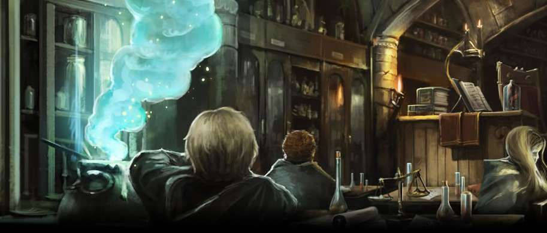
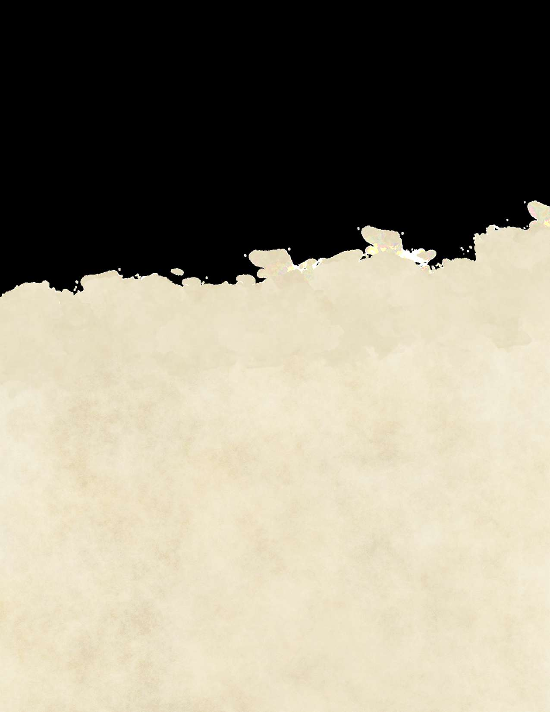
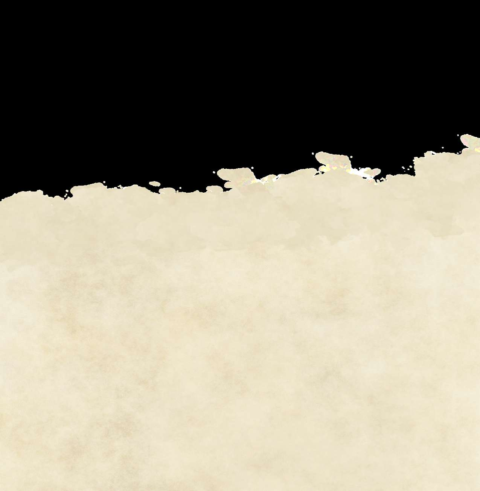

| Technique Proficiency Sorcery Cantrips Spells Level Bonus Points Metamagic Features Known Known |  |  |  |  |  |  |
|---|---|---|---|---|---|---|
| 1st | +2 | — | — | Spellcasting, School of Magic | 4 | 4 |
| 2nd +2 3 — Font of Magic 4 5 |  |  |  |  |  |  |
| 3rd | +2 | 4 | 2 | Metamagic, Spell Deflection | 4 | 6 |
| 4th +2 5 2 Ability Score Improvement 5 7 |  |  |  |  |  |  |
| 5th | +3 | 7 | 3 | Metamagic | 5 | 10 |
| 6th +3 8 3 School of Magic Feature 5 11 |  |  |  |  |  |  |
| 7th | +3 | 9 | 4 | Metamagic | 6 | 12 |
| 8th +3 10 4 Ability Score Improvement 6 13 |  |  |  |  |  |  |
| 9th | +4 | 12 | 5 | Apparition Lessons, Metamagic | 6 | 16 |
| 10th +4 13 5 School of Magic Feature 7 17 |  |  |  |  |  |  |
| 11th | +4 | 14 | 5 | ─ | 7 | 18 |
| 12th +4 15 6 Ability Score Improvement, Metamagic 7 18 |  |  |  |  |  |  |
| 13th | +5 | 17 | 6 | ─ | 8 | 21 |
| 14th +5 18 6 School of Magic Feature 8 21 |  |  |  |  |  |  |
| 15th | +5 | 19 | 7 | Metamagic | 8 | 22 |
| 16th +5 20 7 Ability Score Improvement 8 22 |  |  |  |  |  |  |
| 17th | +6 | 22 | 7 | ─ | 9 | 25 |
| 18th +6 23 8 School of Magic Feature, Metamagic 9 25 |  |  |  |  |  |  |
| 19th | +6 | 24 | 8 | Ability Score Improvement | 9 | 25 |
| 20th +6 25 8 Sorcerous Restoration 9 25 |  |  |  |  |  |  |

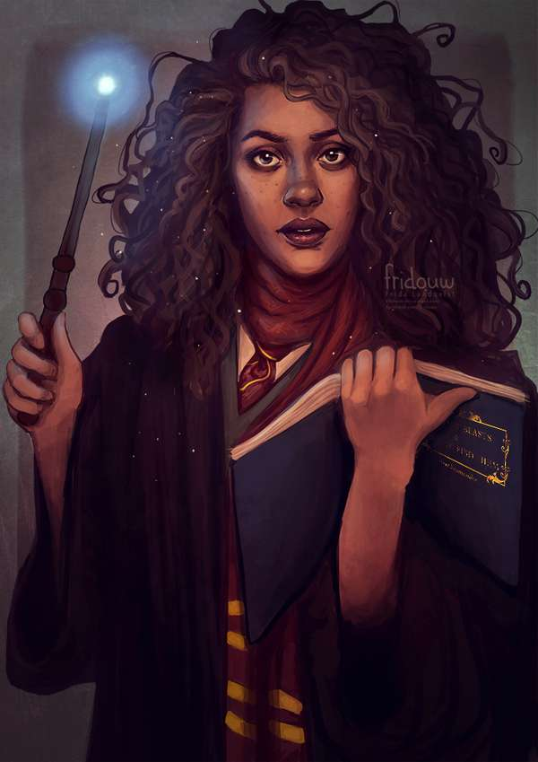
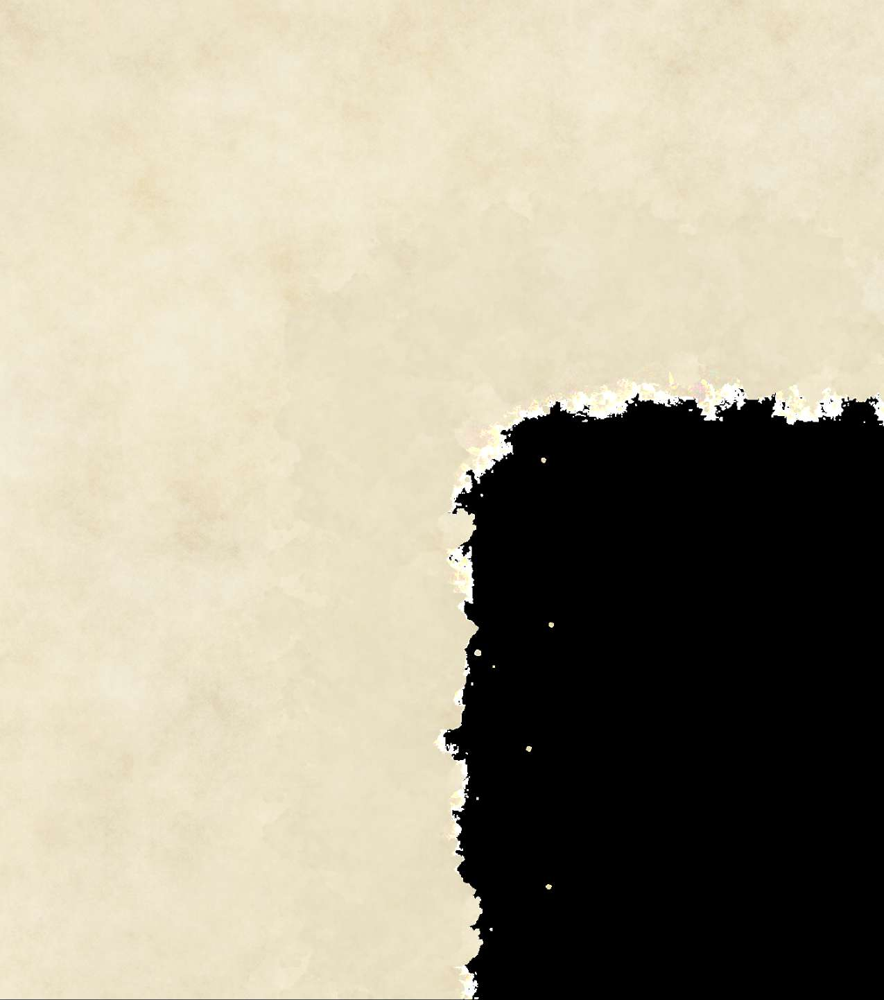
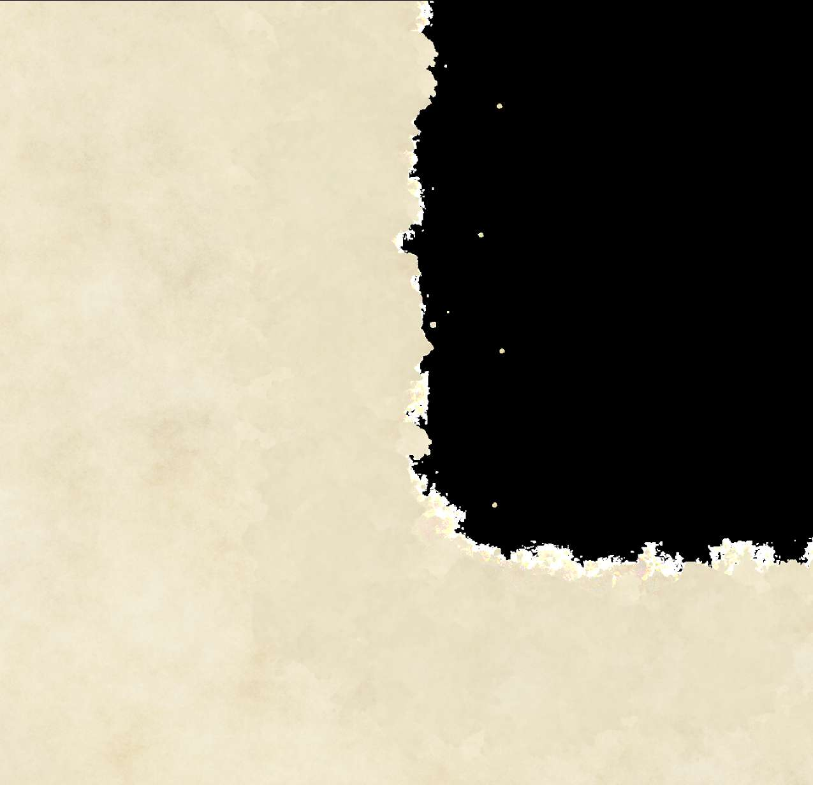

### The Intellect Caster The Intellect Caster
### C
lever wizards delve into the underlying theory of	Diverse Studies	Diverse Studies
magic. These academics are able to learn a wide
At 3rd level, you gain both level 1 features of your chosen
variety of spells, although they might struggle in
School of Magic.
the heat of battle. Their expertise and magical
versatility makes them invaluable companions	Apparition Lessons	Apparition Lessons
across the wizarding world.
When you reach 9th level, you gain the Apparition ability.
### Class Features Class Features
Arcane Recovery Arcane Recovery
When you reach 20th level, you have learned to regain some
As an Intellect caster, you gain the following class features.
of your magical energy by studying in your free time.
Whenever you finish a short rest, you can choose expended
Hit Points Hit Points
spell slots to recover. The spell slots can have a combined
Hit Dice: 1d8 per Intellect level
level that is equal to or less than 10, and none of the slots can
Hit Points at 1st Level: 8 + your Constitution modifier
be 6th level or higher.
Hit Points at Higher Levels: 1d8 (or 5) + your Constitution
modifier per Intellect level after 1st
Proficiencies Proficiencies
Saving Throws: Dexterity, Intelligence
Skills: Choose two from Acrobatics, Herbology, Insight,
Investigation, Magical Creatures, Magical Theory,
Medicine, Muggle Studies and Survival
Equipment Equipment
You start with the following equipment, in addition to the
equipment granted by your background: a wand, a student's
pack, a winter cloak, and a magical pet of your choice.
Spellcasting Spellcasting
Intelligence is your spellcasting ability for your spells. You
use your Intelligence whenever a spell refers to your
spellcasting ability. In addition, you use your Intelligence
modifier when setting the saving throw DC for a spell you
cast and when making an attack roll with one.
You must use a wand as a spellcasting focus for your spells.
Your spell slot progression is the standard for full casters (22
slots at level 20).
Additionally, when you gain a level in this class, you can
choose two of the cantrips or spells you know and replace
them with two new cantrips or spells, which also must be of a
level for which you have spell slots.
Ritual Casting Ritual Casting
Your ability to recall information allows you to freely cast
spells, as long as you have enough time to stop and focus. At
1st level, you can cast a spell as a ritual if that spell has the
Art by Frida Lundqvist Art by Frida Lundqvist Art by Frida Lundqvist ritual tag and you know the spell. A ritual version of a spell	Art by Frida Lundqvist	Art by Frida Lundqvist	Art by Frida Lundqvist
Art by Frida Lundqvist Art by Frida Lundqvist Art by Frida Lundqvist
takes only 1 minute longer to cast than normal. It also doesn't	@fridouw	@fridouw	@fridouw	-	-	-
@fridouw  @fridouw @fridouw	-	--	- @fridouw @fridouw @fridouw	-	-
expend a spell slot, which means the ritual version of a spell
can't be cast at a higher level.
Font of Magic, Metamagic, and Ability Font of Magic, Metamagic, and Ability
Score Improvements Score Improvements
### Unless differences are shown in the Intellect Progression	Schools of Magic	Schools of Magic
table, an Intellect caster has all Font of Magic, Sorcery
Points, Flexible Casting, Metamagic, and Ability Score	Choose from the available Schools of Magic found in Chapter
Improvement class features from a 5e Sorcerer.	3 to determine your subclass. You have access to the full spell
list and can learn spells of any school of magic, except where
signified with an asterisk in the Spell List in Chapter 9.

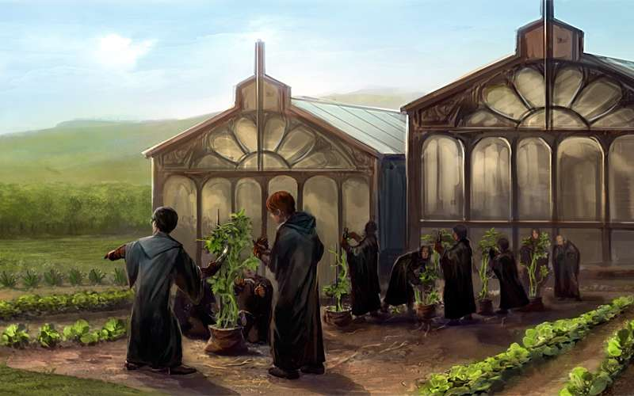
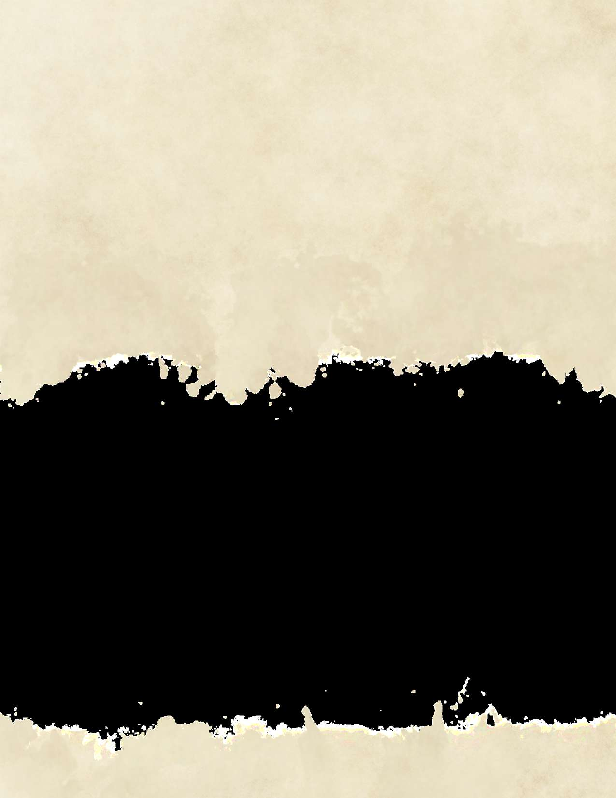
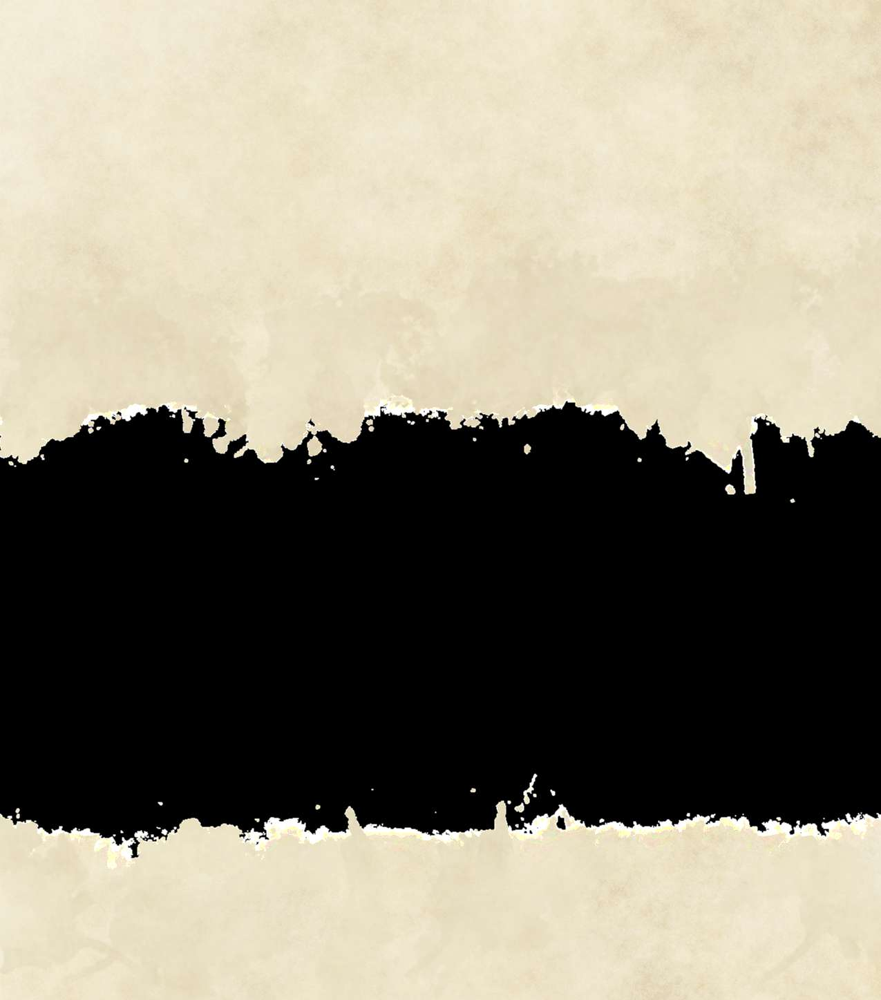

| Intellect Proficiency Sorcery Cantrips Spells Level Bonus Points Metamagic Features Known Known |  |  |  |  |  |  |
|---|---|---|---|---|---|---|
| 1st | +2 | — | — | Spellcasting, Ritual Casting, School of Magic | 6 | 6 |
| 2nd +2 2 — Font of Magic 6 8 |  |  |  |  |  |  |
| 3rd | +2 | 3 | 1 | Metamagic, Diverse Studies | 7 | 10 |
| 4th +2 4 1 Ability Score Improvement 7 12 |  |  |  |  |  |  |
| 5th | +3 | 4 | 1 | ─ | 8 | 16 |
| 6th +3 5 1 School of Magic Feature 8 18 |  |  |  |  |  |  |
| 7th | +3 | 6 | 2 | Metamagic | 9 | 20 |
| 8th +3 7 2 Ability Score Improvement 9 22 |  |  |  |  |  |  |
| 9th | +4 | 7 | 2 | Apparition Lessons | 10 | 26 |
| 10th +4 8 2 School of Magic Feature 10 28 |  |  |  |  |  |  |
| 11th | +4 | 9 | 2 | ─ | 11 | 30 |
| 12th +4 10 2 Ability Score Improvement 11 30 |  |  |  |  |  |  |
| 13th | +5 | 10 | 3 | Metamagic | 12 | 34 |
| 14th +5 11 3 School of Magic Feature 12 34 |  |  |  |  |  |  |
| 15th | +5 | 12 | 3 | ─ | 13 | 36 |
| 16th +5 13 3 Ability Score Improvement 13 36 |  |  |  |  |  |  |
| 17th | +6 | 13 | 3 | ─ | 14 | 40 |
| 18th +6 14 3 School of Magic Feature 14 40 |  |  |  |  |  |  |
| 19th | +6 | 15 | 3 | Ability Score Improvement | 15 | 40 |
| 20th +6 15 3 Arcane Recovery 15 40 |  |  |  |  |  |  |

Art by Atomhawk / Art by Atomhawk / Art by Atomhawk / Art by Atomhawk / Art by Atomhawk / Art by Atomhawk /
Art by Atomhawk / Art by Atomhawk / Art by Atomhawk /
© Pottermore Limited © Pottermore Limited © Pottermore Limited © Pottermore Limited © Pottermore Limited © Pottermore Limited
© Pottermore Limited © Pottermore Limited © Pottermore Limited

### Chapter 3: Schools of Magic Chapter 3: Schools of Magic
### (Subclasses) (Subclasses)
Professional Charmer. You've learned to weave your
### Charms Charms
enchantments throughout objects. If you cast a single target
Charm with a duration longer than Instantaneous on an
Charms, a type of spell that alters properties of a thing, can
individual object, the effects have a permanent duration, if
be some of the most powerful spells in existence. The
desired, until dispelled by you. This feature does not remove
Fidelius Charm, for example, can completely hide a person or
Concentration or Dedication requirements.
a place in such a way that no one can find them unless given
the Secret. Memory Charms can be so strong as to remove a
Unique Talents Unique Talents
person's memory or damage their mind permanently.
At 10th level, you gain one of the following features.
### Duelists Duelists	Muggle Dueling. You've trained in non-magical dueling as
a last-ditch effort. Add your proficiency bonus to your damage
Many charms have been weaponized for magical combat. A	rolls for unarmed strikes and to any Strength checks involved
wizard's duel is a formal practice in wizarding culture in	with grappling or disarming a wizard.
which wizards or witches faced each other and, at the count
Obliviator. Instead of simply erasing memories, when you
of three, attempted to disarm, stun, injure, defeat, or kill each
cast oblivate, you can choose to implant very detailed false
other in order to force submission. A duelist is a master of
memories. These memories are undetectable by the target of
this art, competing in organized, refereed, and non-lethal
the spell, but if others examine the target's memories
duels to test and hone their skills.
(through Legilimency or a Penseive), they might be able to
detect that they're false.
### Enchanters Enchanters
Refined Techniques Refined Techniques
Other wizards try their hand at enchantments, a nearly
At 14th level, you gain one of the following features. permanent charm placed on an inanimate object. These
Wand and Shield. You've uncovered an ancient dueling bewitched objects can range from handy (like a self-stirring
style, allowing both offense and defense at the same time. coffee mug), to complex (like a top-tier racing broom), to
When you cast protego or protego maxima, you can bizarre (like a book acting like a rabid version of its subject
matter). An enchanted or bewitched object can be powerful in	transition the spell's casting to your off-hand, freeing up your
the hands of the right wizard.	wand to cast other spells. The spell's dedication now expends
a bonus action instead of an action, and you are able to cast
School of Magic Spells
and maintain another concentration or dedication spell with
Spell Level	Spell	your wand. Any factor that affects maintaining concentration
is applied individually to each effect (e.g. upon taking damage
2nd	muffliato
make a Constitution saving throw for each spell).
4th	capacious extremis	A Duty to Protect. When you cast piertotum locomotor,
concentration is no longer required, twice as many objects
5th	obliviate, piertotum locomotor
can be animated, and the duration is extended to 1 hour.
### Subclass Features Subclass Features	Pinnacle of Casting	Pinnacle of Casting
At 18th level, you gain one of the following features.
Bewitching Studies Bewitching Studies
Lightning-Fast Wand. You've honed your skills in the
At 1st level, you gain one of the following features.
dueling ring to be able to cast spells twice as fast as the
Called Shot. You've honed your aim to be able to strike	average wizard. If you don't already have it, Quickened Spell
very specifically with your dueling Charms. When casting a	is added to your metamagic options and does not count
Charm, you can target specific items or body parts, as well as	towards your metamagic count. When you use the Quickened
restrict the effects of the charm to only that specific item or	Spell metamagic to cast a spell as a bonus action, you are
body part.	able to cast any spell as your action and the normal bonus
Protective Enchantments. Any charm spell you cast that	action spellcasting rules do not apply.
affects an area (cube, line, sphere, or cone) has its area's size	Secret-Keeper. You add the fidelius mysteria celare spell
doubled.	to your list of known spells. It does not count against your
number of spells known, and cannot be forgotten to learn
Advanced Charmswork Advanced Charmswork
another spell.
At 6th level, you gain one of the following features.
Target Practice. Your steady hand and hours of practice
have given you an edge. Whenever you add your spellcasting
ability modifier to a spell attack roll, add half your Dexterity
modifier (rounded up) as a bonus as well.

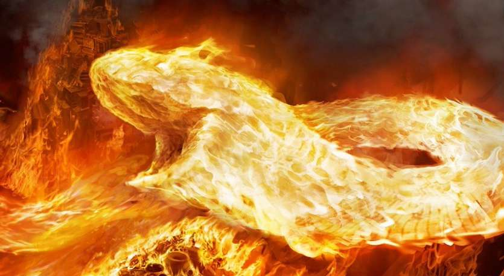
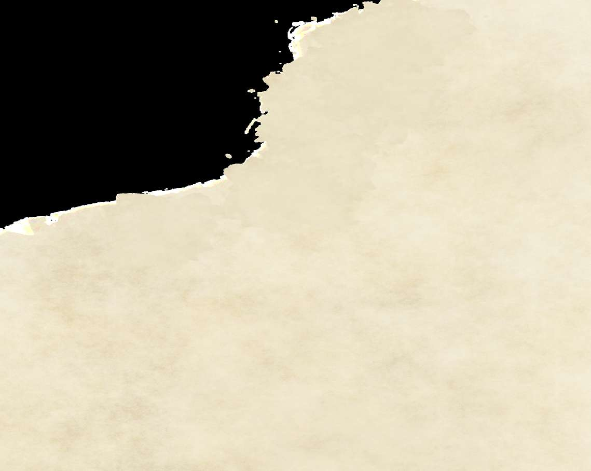
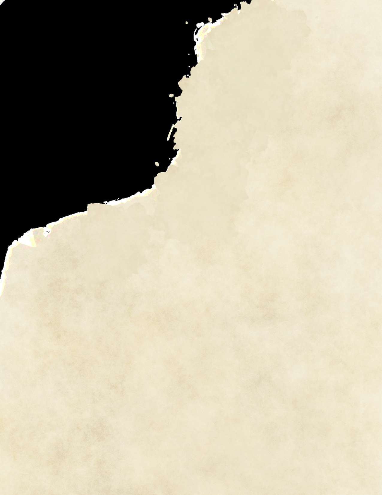

Curse-Breaking. Your curiosity in taking apart spells and
enchantments has found an outlet. Gain a set of Curse-
breakers' Tools and gain proficiency in Curse-breakers' Tools.
Combat-Ready Combat-Ready
At 6th level, you gain one of the following features.
Forceful Magic. You cast every spell as if it were life-or-
death. When you cast a spell that deals damage, add 1d6 to
one damage roll.
Magical Adrenaline. Your magic invigorates you in times
of dire need. As a bonus action, you can spend one hit die to
recover hit points as you normally would after a short rest,
equal to hit die + Constitution modifier. You have a number of
uses equal to your proficiency bonus, and all uses are
restored after a long rest.
Specialized Skills Specialized Skills
### Jinxes, Hexes, and Curses Jinxes, Hexes, and Curses
At 10th level, you gain one of the following features.
Dark Traces. You've learned the patterns and styles of
Formally referred to as Dark charms, jinxes, hexes and	Dark magic. You have advantage on any Investigation,
curses are often associated with the Dark Arts because they	Insight, or Perception roll that is involved with detecting
inflict malicious effects on the target. While jinxes are mostly	Dark magic or a Dark wizard.
irritating and hexes are a little worse or more painful, curses	Ward-Breaker. Curse-Breaking required. It is impossible
are the worst kind of Dark magic. All three Unforgivables are	for anyone to magically detect the act of you successfully
classified as curses, and the average civilian wizard could go	breaking a curse, removing an enchantment, or taking down
their whole life without casting a serious curse.	a ward. If someone sees you curse-breaking or is actively
looking for the removed magic, they will notice the magic's
### Aurors Aurors
absence. If a spell is designed to notify the caster in some
way, it no longer works and the caster will not be notified.
Curses are mainstays in the arsenals of Aurors, highly-trained
specialist officers tasked with upholding the law and
Cursemaster Cursemaster
protecting their magical communities from large-scale
At 14th level, you gain one of the following features.
threats. To be successful, an Auror must be capable across a
Dark Duelist. Your experience fighting Dark wizards has variety of skills, like curses, counter-spells, transfiguration,
taught you how to use their own techniques against them.
poisons, antidotes, concealment, disguise, and tracking.
You have advantage on any saving throws made against Dark
### Curse-Breakers Curse-Breakers
spells, and any Dark spells you cast are automatically cast
one level higher than the consumed spell slot, not exceeding
On the other end of the spectrum, a curse-breaker removes,
the highest available level of spell slots you have.
counters or breaks curses placed on objects or places for a
Defensive Arts. You've learned how to block the most
living. Whilst curse-breakers could work for the Ministry of
dangerous of spells. Defensive spells are automatically cast
Magic, the term is also used to denote a number of
two levels higher than the consumed spell slot, not exceeding
adventurous bankers employed by Gringotts Wizarding Bank,
the highest available level of spell slots you have.
tasked with disabling and countering curses in ancient tombs
or historical sites to bring back gold and treasure.
Legendary Legendary
At 18th level, you gain one of the following features. School of Magic Spells
Auror Alert. As a prominent combatant of Dark magic, you
Spell Level	Spell
have connections in the Department of Magical Law

| 3rd lang | lock |
|---|---|

Enforcement. You can call in a two-man auror team to
apparate in on your location. You can’t use this feature again
4th	sectumsempra
until you finish a long rest.

| 5th nullu | m effugium, omnifracto |
|---|---|

Unravelling Magic. Automatically succeed whenever
casting finite incantatem.
### Fractured Soul. Your pursuit of Dark magic has uncovered Subclass Features Subclass Features
the writings of Herpo the Foul. You can create a Horcrux by
performing the Horcrux Ritual, committing murder, and Practical Studies Practical Studies
selecting a target to become the Horcrux. Only one Horcux
At 1st level, you gain one of the following features.
may exist at one time.
Auror Training. You've already started practicing the
required skills to become an Auror. You learn one common
potion recipe and gain proficiency in two of the following:
Investigation, Potion-Making, Stealth, Survival.

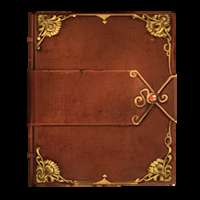

### Transfiguration Prodigy Transfiguration Prodigy Transfiguration Transfiguration
At 6th level, you gain one of the following features.
Animagus Transformation. You can use your action to Transfiguration is a branch of magic that focuses on the
magically assume the shape of your animagus form (see Your alteration of the form or appearance of an object, via the
Animagus Form below). You can use this feature twice. You manipulation of the object's molecular structure.
regain expended uses when you finish a short or long rest. Transfiguration is regarded as “very hard work” and is “more
Elementalist. Your study of Alchemy has given you scientific” than any other form of magic, i.e. the practicing
insights in the nature of elements. Any spell that involves only witch or wizard has to get it exactly right for the
transfiguration to be successful.	fire, water, earth, or air is automatically cast one level higher
than the consumed spell slot, not exceeding the highest
### Animagi Animagi
available level of spell slots you have.
The most legendary practitioner of transfiguration is an
Precise Control Precise Control
Animagus, a witch or wizard who can self-transfigure into an
At 10th level, you gain one of the following features.
animal at will. It takes skill, practice, and patience for wizards
Partial Transfiguration. Your understanding of magical
and witches to become Animagi. The process is long and
theory has enabled you to compartmentalize your magic. Any
arduous, and has the potential to backfire and cause the
transfiguration spell can be intentionally cast as a partial
transformation to go horribly wrong. As a result, there are
transfiguration, converting only the desired portion of the
very few Animagi, and the power they possess requires
target. All the same capabilities and restrictions of casting
registration with the Ministry of Magic.
those spells at higher levels apply.
### Alchemists Alchemists
Molding the Elements. You've learned to bend the
elements to your will. Any spell that involves only fire, water,
A far less known application of
earth, or air can be cast in a different shape than the original
transfiguration is Alchemy, the
spell intended. The new shape cannot exceed the
branch of magic and an
approximate area or volume of the original spell.
ancient science concerned
with the study of the structure,	Magically Reinforced	Magically Reinforced
composition, and magical
At 14th level, you gain one of the following features.
properties of the four basic
Durable Constructs. You imbue your constructs of
elements (earth, air, fire, and
creatures with a more potent magic. Your transfigured or
water), as well as the
conjured living constructs gain additional hit points equal to
transmutation of substances.
your level and deal an additional 1d6 of damage.
Intimately connected with
Fortified Structures. You've learned to make magical
potion-making, chemistry and
objects stronger than the real thing. Your transfigured or
transfiguration, there are many
conjured objects have twice as many hit points before
who hold it to be the most
breaking, and can support three times as much weight as
difficult magic.	© Pottermore Limited	© Pottermore Limited	© Pottermore Limited	© Pottermore Limited	© Pottermore Limited	© Pottermore Limited	© Pottermore Limited	© Pottermore Limited	© Pottermore Limited
their mundane equivalents.
School of Magic Spells
Molecular Manipulator Molecular Manipulator
Spell Level	Spell
At 18th level, you gain one of the following features.
Apex Predator. Animagus Transformation required. You've 2nd	orbis, reparifarge
achieved complete mastery over the mystical art of animagus
3rd	ignis laqueis
transformations. You can transform on your turn as a bonus
action, instead of an action Additionally, you can select two 4th	lapifors
additional creatures as your animagus shapes, and you can
choose to keep these shapes hidden from the Ministry of
### Subclass Features Subclass Features
Magic. You may also choose to use any of these animals as
your corporeal patronus.
Scientific Studies Scientific Studies
True Alchemist. Your lifelong study of Flamel's and
At 1st level, you gain one of the following features.
Dumbledore's writings has finally come to fruition. You can
Anatomy Textbook. Your knowledge of the inner workings
create a Philosopher’s Stone, turning any metal into gold and
of a creature make your transfigurations easier. If a
producing the Elixir of Life. You cannot die of natural causes,
Transfiguration spell must be cast at a higher level to involve
and you age at a slower rate. For every 10 years that pass,
a living creature, you can involve a living creature and
your body ages only 1 year. Only one Philosopher’s Stone
consume a spell slot one level lower than what's required.
may exist at one time.
Intuitive Conversion. Conceptualizing a transfiguration
just comes easily to you. When you cast vera verto, it
automatically affects targets one size larger than specified by
the spell slot level.

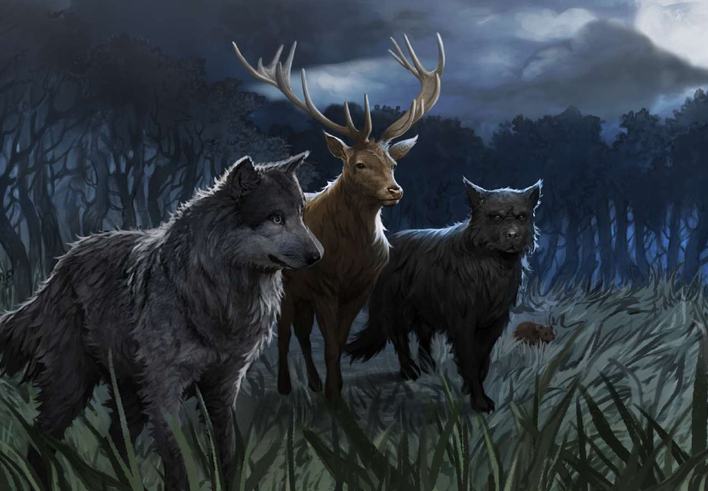
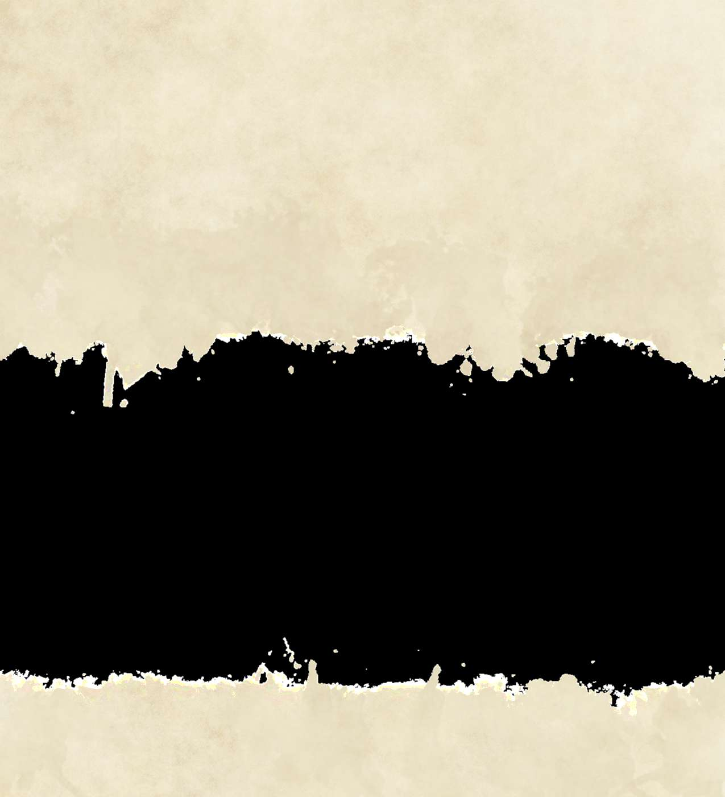

### You retain the benefit of any features from your class, Your Animagus Form Your Animagus Form
race, or other source and can use them if the new form is
physically capable of doing so. You can stay in animagus form for a number of hours equal to
Your equipment merges into your new form and has no half your transfiguration level (rounded down). You then
effect until you leave the form. revert to your normal form unless you expend another use of
this feature. You can revert to your normal form earlier by
When you gain the Animagus Transformation feature, you
using a bonus action on your turn. You automatically revert if
must decide between the two types of forms: Combat form or
you fall unconscious, drop to 0 hit points, or die.
Evasion form. This is a permanent, one-time choice and will
While you are transformed, the following rules apply:
determine the stats and abilities of your animagus form.
Your game statistics are replaced by the statistics of the
Combat Form Combat Form
beast, but you retain your alignment, personality, and
A Combat animagus form is a large or powerful predator that
intelligence, wisdom, and charisma scores. You also retain
can hold its own against dangerous creatures. It is both
all of your skill and saving throw proficiencies, in addition
sturdy and capable of fighting back with lethal force.
to gaining those of the creature. If the creature has the
Your form must be classified into one of two categories:
same proficiency as you, use the higher bonus.
Land or Water. If your chosen animal breathes and lives
When you transform, you assume the beast's hit points
underwater, it must be Water. Otherwise, it will be Land, an
and hit dice. When you revert, you return to the hit points
air-breathing animal that lives on land and is incapable of
you had before you transformed. If you revert as a result of
flight. This classification will determine certain statistics and
dropping to 0 hit points, any excess damage carries over
traits of your animagus form's stat block.
to your normal form. For example, if you take 10 damage
Combat forms can be one of two sizes: Medium or Large.
in animagus form and have only 1 hit point left, you revert
Your form's size should be determined by the creature's and take 9 damage.
actual size; for instance, all dogs would be Medium, not You can't cast spells, and the actions you can take are
Large. You need your HM's approval to choose a Large-sized dependent on your beast form's physical capabilities.
animagus form, and transforming into a Large animal may
Transforming doesn't break your concentration or prevent
mean you'll be unable to transform in cramped spaces.
actions that are part of an already-cast spell, but
Dedication spells end upon transforming.
Art by Atomhawk / Art by Atomhawk / Art by Atomhawk / Art by Atomhawk / Art by Atomhawk / Art by Atomhawk /
Art by Atomhawk / Art by Atomhawk / Art by Atomhawk /
© Pottermore Limited © Pottermore Limited © Pottermore Limited © Pottermore Limited © Pottermore Limited © Pottermore Limited
© Pottermore Limited © Pottermore Limited © Pottermore Limited

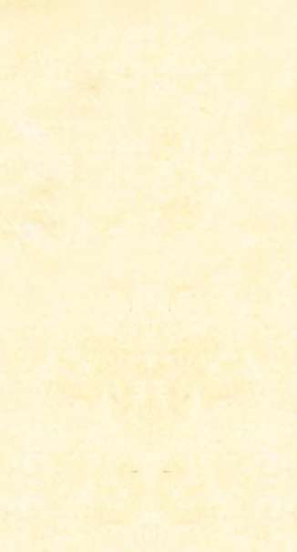

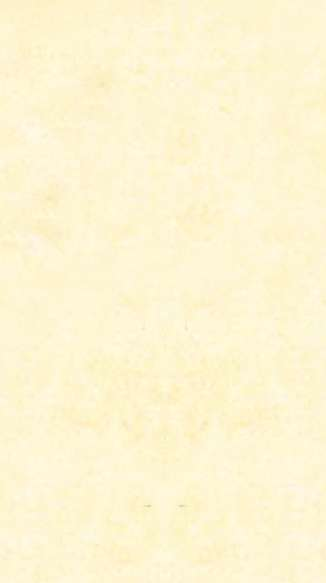

Evasion Form Evasion Form	Choosing an Animal	Choosing an Animal
An Evasion animagus form is a small and discreet animal	Your animagus form is the same animal as your corporeal
that would not typically attract a lot of attention. It is likely	patronus. Choose your animagus form from the animals
prey in the natural word, surviving by being quiet, mobile and	listed in Appendix B: Patronus Rolling Tables. You should
alert. Evasion forms are largely useless in combat, but can	choose a patronus based on your desired animagus attributes
hide, escape and get to hard-to-reach places.	(Combat vs. Evasion, Land vs. Water vs. Air). Your animagus
form cannot be a magical beast. If you roll a magical beast Your form must be classified into one of two categories:
(91-00 or 0) while determining your corporeal patronus, you Land, Water or Air. If your chosen animal breathes and lives
must re-roll your patronus animal. underwater, it must be Water. If it is an air-breathing animal
that lives on land and is incapable of flight, it must be Land. If
it is capable of sustained flight, it must be Air. This
### classification will determine certain statistics and traits of	Evasion Animagus	Evasion Animagus
your animagus form's stat block.
Tiny, Small or Medium Evasion forms can be one of three sizes: Tiny, Small or
Medium. Your form's size should be determined by the
creature's actual size; for instance, a cat would be Tiny and a
Armor Class [10 + PB]
hawk would be Small.
Hit Points [10 times PB] - 20 (Air Only),
[15 times PB] - 30 (Land and Water Only)
Speed 5 ft., fly 60 ft. (Air Only), 40 ft. (Land Only),
0 ft., swim 30 ft. (Water Only)
### Combat Animagus Combat Animagus	STR	DEX	CON	INT	WIS	CHA
10 (+0)	16 (+3)	8 (-1)	–	–	–
Medium or Large
Skills Investigation, Perception, Sleight of Hand,
Armor Class 12 + [PB]
Stealth
Hit Points 15 + [15 times PB]
Senses darkvision 60 ft. (Air and Land Only),
Speed 30 ft. (Land), swim 30 ft. (Water)
blindsight 60 ft. (Water Only)
Languages understands languages of its human form
but can't speak
STR	DEX	CON	INT	WIS	CHA
18 (+4)	14 (+2)	16 (+3)	–	–	–
Cunning Action. The animagus can take the Dash,
Disengage, or Hide action as a bonus action on each
Skills Intimidation, Perception	of its turns.
Senses darkvision 60 ft. (Land Only),
Keen Senses (Air and Land Only). The animagus has
blindsight 60 ft. (Water Only)
advantage on Wisdom (Perception) checks that rely
Languages understands languages of its human form
on sight, hearing or smell.
but can't speak
Water Breathing (Water Only). The animagus can
Blood Frenzy (Water Only). The animagus has	breathe only underwater.
advantage on melee attack rolls against any creature
### Actions Actions
that doesn't have all its hit points.
Rake. Melee Weapon Attack: +[PB - 3] to hit, reach 5
Keen Smell (Land Only). The animagus has advantage
ft., one target. Hit: [1 + PB] slashing damage.
on Wisdom (Perception) checks that rely on smell.
*PB: Your Proficiency Bonus Pack Tactics (Land Only). The animagus has
advantage on an attack roll against a creature if at
least one of the animagus's allies is within 5 ft. of
the creature and the ally isn't incapacitated.
Water Breathing (Water Only). The animagus can
breathe only underwater.	Different Mobilities
### It may make sense for a land animal to have Actions Actions
different speeds. Work with your HM to customize
Maul. Melee Weapon Attack: +[2 + PB] to hit, reach	your animagus form, like giving an otter swim
5 ft., one target. Hit: [half PB]d10 + [2 times PB]	speed, a monkey climb speed or a mole burrow
piercing damage.	speed. To compensate, the usual speed of 40 ft.
should then be reduced to 30 ft.
*PB: Your Proficiency Bonus

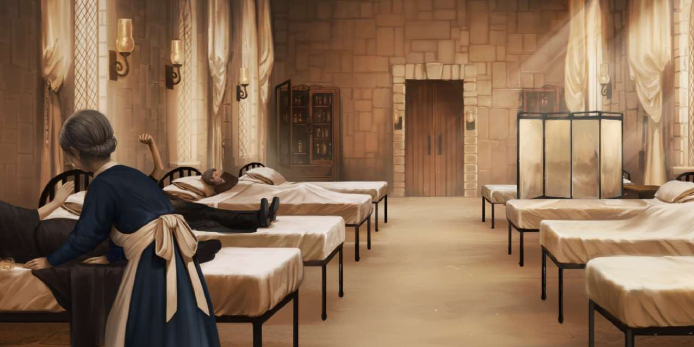

### Healing Healing
Healing magic is devoted to improving the physical and
mental condition. With many different spells and potions,
healing magic requires a wizard to be well-versed in magical
conditions and their different remedies.
### Healers Healers
A healer is the wizarding world equivalent of a Muggle
doctor. They tend to the sick and injured, often finding
employment in St Mungo's Hospital for Magical Maladies and
Injuries, England's primary wizarding hospital. Healers may
find themselves facing artifact accidents, Dark creature bites,
magical diseases, potion poisoning, or spell damage.
### Mediwizards Mediwizards
A mediwizard takes a much more active role in preserving
life; if a healer is a doctor, then a mediwizard is a first
responder. Mediwitches travel with research expeditions,
watch over professional Quidditch, accompany monster
hunters, and dive into war to save lives.
Empathic Bond. You feel others' pain deeply, which gives
insight into their suffering. When you cast a Healing spell on
School of Magic Spells
another creature, they gain additional hit points and you lose
Spell Level	Spell
hit points equal to your proficiency bonus, unless their hit
Cantrip	anapneo	points are fully restored by the Healing spell or unless this
effect would reduce your hit points to 0.
3rd	intus sunt
Combat Medic Combat Medic 6th	protego totalum, vulnera sanentur
At 14th level, you gain one of the following features.
### Subclass Features Subclass Features	Extended Assistance. You've pushed the limits of your
healing magic to saves lives on the front lines. All of your
Medical Studies Medical Studies
Healing spells' ranges are doubled. If a Healing spell has a
range of touch, its new range is 60 feet. At 1st level, you gain one of the following features.
A Saving-People Thing. You will throw yourself in the line Natural Remedies. Your interest in healing has led you to
of fire to protect others. If a creature you can see within 10 study potions and poultices. You learn the recipe for star
feet of you is targeted by a spell or attack, you can use your grass salve and gain proficiency in one of the following skills:
reaction to cast protego and leap in front of that creature, Herbology, Medicine, Potion-Making.
becoming the new target of the attack. If the spell or attack
Unshakable Nerves. Your study of injuries and magical
affects both of you and you step in front of that creature, you
diseases have given you a strong stomach and iron will. You
will be subject to the effects of that spell or attack twice.
have advantage on saving throws against being frightened.
Savior Savior
Dedicated Protector Dedicated Protector
At 18th level, you gain one of the following features.
At 6th level, you gain one of the following features.
Phoenix Tears. Your saint-like devotion to others and
Accelerated Recovery. Your healing spells are more
bravery in the face of danger has earned the respect of effective. Whenever you use a spell of 1st level or higher to
phoenixes. If you spend 8 hours reaching out with your
restore hit points to a creature, the creature regains
magic, a phoenix will appear in a flash of fire and shed tears
additional hit points equal to 2 + the spell’s level.
into a vial for you. Phoenix tears remove all curses, diseases,
Durable Shielding. Your shield spells are more effective.
and poisons affecting a creature. Also, the creature regains
Whenever you use a defensive spell of 1st level or higher that
all its hit points. A phoenix will only appear and fill a vial with
improves a creature’s AC or grants temporary hit points, the
tears when you do not have any other tears, and the phoenix
creature gains additional temporary hit points equal to 2 +
tears will lose their healing properties if anyone other than
the spell’s level, which last the duration of the spell's effect.
you possesses the tears or tries to administer them.
Healing Pulse. Your healing and defensive magic have Moral Support Moral Support
intertwined, energizing nearby allies. Whenever you cast a
At 10th level, you gain one of the following features.
defensive spell, each non-hostile creature within 30 feet of
Phoenix Song. You have a soothing presence. You gain
you (including you) is healed a number of hit points equal to
proficiency in Persuasion and advantage on Charisma checks
half its level.
to ease someone's pain or help them maintain composure.

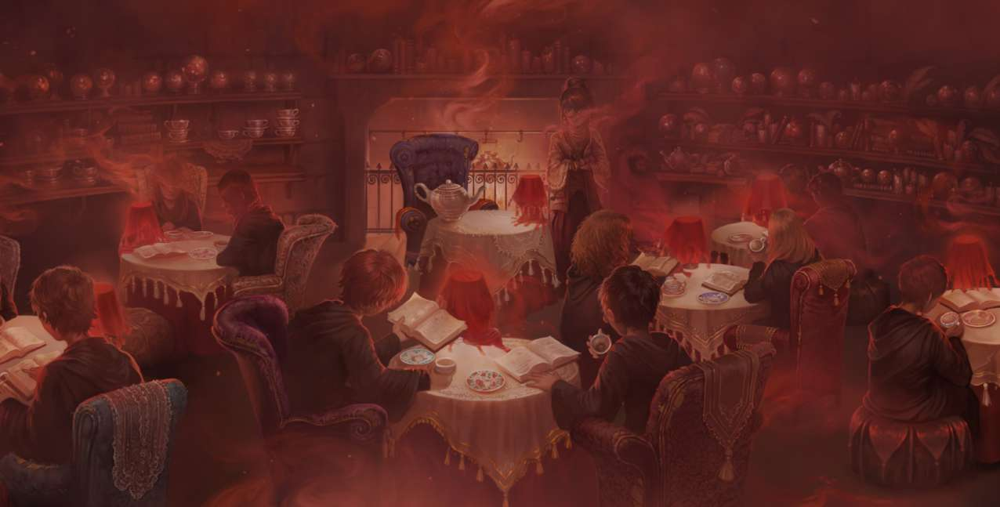
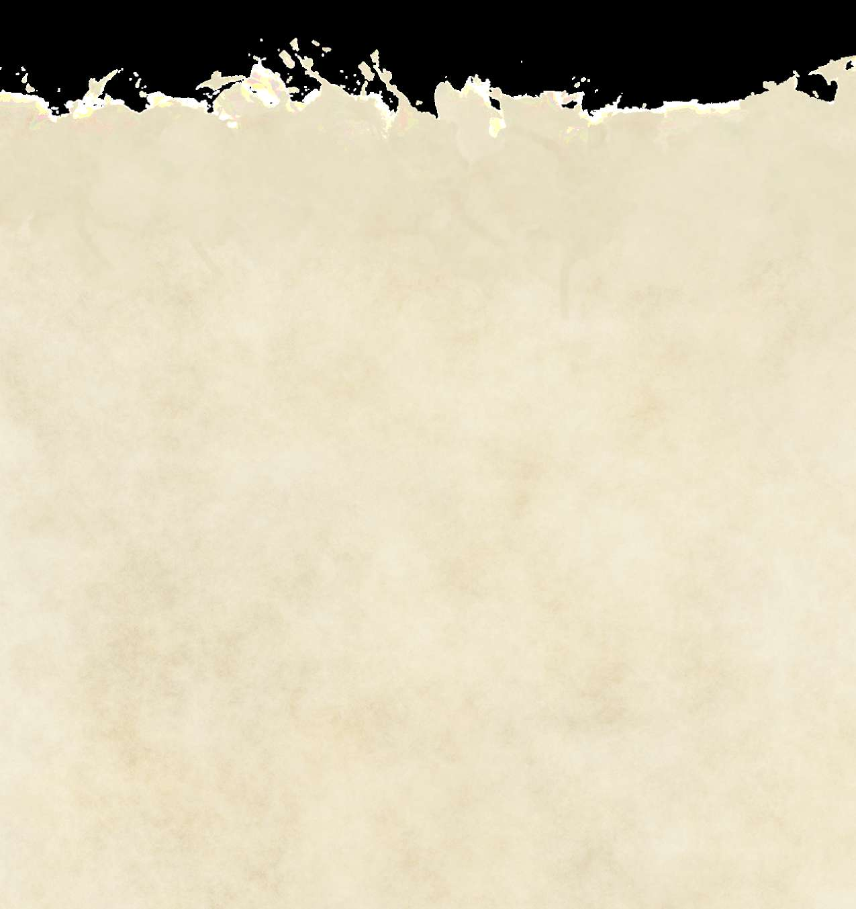

### Divination Divination
### Subclass Features Subclass Features
Divination is an unusual branch of magic involving gathering
insights into past, present and future events. It is an inexact
Clairvoyant Studies Clairvoyant Studies
science, requiring interpretation of tea leaves and omens.
At 1st level, you gain one of the following features. Some believe true divination involves meditation and a belief
Fortune Teller. You've particularly taken to astronomy, of non-self to access the Inner Eye, while Centaurs have a
tasseography, and crystal gazing. You gain a Diviner's Kit and unique way of practicing divination by observing the
proficiency in using a Diviner's Kit. movement of planets, moons, and stars.
Sensing Danger. You add half your proficiency bonus to
### Seers Seers
your Initiative and cannot be surprised while conscious.
Naturally gifted in divination, a seer is a wizard or witch who
Farseeing Farseeing
can see into the future with their Inner Eye. While some
At 6th level, you gain one of the following features.
seers unknowingly utter prophecies about strangers, other
Foresight. You start to see omens everywhere you look.
seers will glimpse their own futures. Albus Dumbledore
After a long rest, roll two d20s and record those rolls as your
believed that seeing into the future is incredibly difficult,
two foresight rolls.
because the complexity of every action and its consequences.
When you or a creature you can see is about to make an
### Legilimens Legilimens
attack roll, saving throw, or ability check, you can expend one
of your foresight rolls to use that number, once per turn. After
Legilimency is a far more tangible ability, navigating through
a long rest, you lose and reroll your foresight rolls. At level 10,
the many layers of a person's mind and interpreting one's
you gain another foresight roll, for a total of 3.
findings. Muggles call this “mind-reading,” but practitioners
Legilimency. You add the legilimens spell to your list of
disdain the term as naive. They often practice occlumency,
known spells. It does not count against your number of spells
shielding your mind from the invasion of another legilimens.
known, and cannot be forgotten to learn another spell.
Although rare natural legilimens exist, it is a field of study
that requires great dedication and care.
The Unseeable The Unseeable
At 10th level, you gain one of the following features.
School of Magic Abilities	Palmistry. You've mastered reading life lines. After
observing a creature for 30 seconds, as an action, you can Required Level	Ability
sense its current hit points.

| 2nd | Cleromancy |
|---|---|

Skilled Occlumens. Legilimens and veritaserum will not
3rd	Tasseomancy	work on you, unless you allow it. You can choose to let
legilimens continue and reveal false information, false

| 7th | Cartomancy |
|---|---|

emotions, or false memories of your choosing.
9th	Crystal-gazing

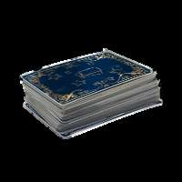
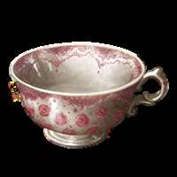

Crystal-gazing Crystal-gazing Revealed Intentions Revealed Intentions
By gazing into the cloudy depths of the crystal ball, you can At 14th level, you gain one of the following features.
spend 7 sorcery points to see a particular creature you Aura Reading. Your connection with your Inner Eye allows
choose for 10 minutes. The target must make a Wisdom you to see colorful auras around intelligent beings. You can
saving throw, which is modified by how well you know the immediately sense if a being is hostile, friendly or neutral.
target and the sort of physical connection you have to it. If a
Darting Eyes. Legilimency required. As a bonus action,
target knows you're using this ability, it can fail the saving
you can cast legilimens in combat to see the next spell or
throw voluntarily if it wants to be observed.
action a creature is planning, as long as their eyes are visible.
Knowledge	Save Modifier
Mystical Knowledge Mystical Knowledge

| Secondhand (you have heard of the target) | 0 |
|---|---|

At 18th level, you gain one of the following features.
Vivid Visions. Your connection to your Inner Eye gives you	Firsthand (you have met the target)	-5
a lucid visions of the immediate future. As a bonus action,

| Familiar (you know the target well) | -10 |
|---|---|

you can see a vision of your next action and its immediate
consequences, rolling any required rolls and hearing a
On a successful save, the target isn't affected, and you can't description of the results. If you choose that action, your
use this ability against it again for 24 hours. vision becomes reality, using all the same rolls. The vision is
On a failed save, this ability lets you see as if you were instantaneous, and takes up no time. After you use this ability,
there, within 10 feet of the target. Your view moves with the you can’t use it again until you finish a long rest.
target, remaining within 10 feet of it for the duration. Master of Minds. Legilimency required. Your skill in
Instead of targeting a creature, you can choose a location navigating thoughts is unparalleled. You can now cast
you have seen before as the target of this ability. When you legilimens at-will, verbally or non-verbally. Any attempt to
do, your view shows that location and doesn't move. resist your legilimens spell is made at disadvantage.
### Divination Abilities Divination Abilities
All of the following abilities can only be performed by using a
Diviner's Kit. If you are not proficient in using the Diviner's
Kit, there's a 33 percent chance your ability fails and you
receive a random reading. You will not know your ability has
failed. The HM makes this roll in secret.
Cartomancy Cartomancy
You gain insight into the past, present, and future of a being
other than yourself by performing a tarot card reading. Your
subject asks a single question concerning a specific goal,
© Pottermore Limited © Pottermore Limited © Pottermore Limited © Pottermore Limited © Pottermore Limited © Pottermore Limited © Pottermore Limited © Pottermore Limited © Pottermore Limited
event, or activity to occur within 7 days. By spending 6
sorcery points and 10 minutes, the cards tell you a story (a
truthful reply from the HM). The cards' meaning might be a	Tasseomancy	Tasseomancy
short phrase, a cryptic rhyme, or an omen.
The future is revealed through a uniquely complex reading of
This ability doesn't take into account any possible
symbols and patterns within residual tea leaves a cup
circumstances that might change the outcome, such as a
recently consumed by a being other than yourself. After ten
different use of magic or the loss or gain of a companion.
minutes of preparation, you can spend 3 sorcery points to
If you perform a reading two or more times before finishing
interpret the cup's omens and predict the results of a specific
your next long rest, there is a cumulative 25 percent chance
course of action that your subject plans to take within the
for each reading after the first that you get a random reading.
next 30 minutes. The HM chooses from the following
The HM makes this roll in secret.
possible omens:
Cleromancy Cleromancy
Weal, for good results
You focus your inner eye upon rune-inscribed sticks or	Woe, for bad results
Grindylow bones as you cast them on the ground. As an	Weal and woe, for both good and bad results
action, you can spend 2 sorcery points to interpret their	Nothing, for results that aren't especially good or bad
meaning and advise one being of your choice within 30 feet
This ability doesn't take into account any possible
of you. The next time the being makes an ability check, attack
circumstances that might change the outcome, such as a
roll or saving throw within the next 10 minutes, the target
different use of magic or the loss or gain of a companion.
can roll a d4 and add the number rolled to the attack roll or
If you cast the spell two or more times before completing
saving throw. This effect can only be active on one target at a
your next long rest, there is a cumulative 25 percent chance
time. If you are concentrating on a spell at the time of
for each casting after the first that you get a random reading.
interpreting the sticks or bones, you lose concentration.
The HM makes this roll in secret.

If the spell requires a target, the spell can only target one
### Magizoology Magizoology
triggering creature, or if it affects an area, the spell's area of
effect is centered on the triggering creature. If the spell
Magizoologists study magical creatures. As they work with
conjures hostile creatures, they appear as close as possible to
many different creatures, the Department for the Regulation
the triggering creature and attack. If the spell requires
and Control of Magical Creatures at the Ministry of Magic
concentration, it lasts its full duration. A trap can be detected
created a classification of every known beast, being and
by a successful Intelligence (Investigation) check against your
spirit, ranging from X to XXXXX. Whether harmless or an
spell save DC, or by casting specialis revelio.
untameable wizard-killer, magizoologists record the unique
Outdoorswizard Outdoorswizard traits of beasts for wizardkind’s safety.
At 10th level, you gain one of the following features.
### Dragon-Keepers Dragon-Keepers
Survivalist. You are particularly adept at traveling through
and surviving in natural environments.
Dragon-keepers call the dragon reserve home, caring for the
You gain proficiency in either Herbology or Survival. most famous XXXXX classified creature among wizards and
Between Herbology and Survival, choose one that you're Muggles alike. Spending day after day with them, dragon-
proficient in; your proficiency bonus is doubled when you keepers often learn to see through the eyes of their ward and
make any check using that chosen skill. Also, you and your empathize with the plight of many magical beasts. They seek
group gain the following benefits: to understand dragons for the benefit of all.
Difficult terrain doesn’t slow your group’s travel.
### Monster Hunters Monster Hunters
Your group can't be surprised while resting, as long as you
are keeping watch.
Alternatively, some take a confrontational style of protection.
If a hit die roll is lower than their proficiency bonus, your
When a wizarding village is plagued by a growing community
group can reroll it once and take the higher result.
of trolls, or they suspect a vampire is the cause of their dead
livestock, they turn to a monster hunter. Dark creatures blur	Monster Hunting. You have vast experience studying,
into the magical being category, so a monster hunter must	tracking, and hunting creatures, allowing you to quickly adapt
deal with intelligent demi-humans just as well as corral a	to threats. If you spend 10 minutes studying a beast or dark
stray beast. It is up to the monster hunter to approach a	being's tracks, you automatically learn what the creature is,
situation wand blazing or seeking a peaceful resolution.	its size, and its speed. If you choose, that creature becomes
and remains Hunted until you use this feature again.
### Subclass Features Subclass Features
You have advantage on Wisdom checks to track a Hunted
creature and on Intelligence checks to recall information
Biological Studies Biological Studies
about them. While you're within 30 feet of a Hunted creature
At 1st level, you gain one of the following features.
that you're actively tracking, you can sense its direction
Caretaker. Your study of magical creatures has taught you
relative to you and distance in feet away from you.
about their injuries and physiologies. You can cast any known
Genus Genius Genus Genius
Healing spells on beasts.
Folio Bruti. You have your own personal notebook of	At 14th level, you gain one of the following features.
beasts where you record your findings. Whenever you add
Beast Whisperer. You've learned the body language and
Magical Creatures proficiency to an Ability check, add your
social rituals of many beasts. As an action, you can use a
Intelligence modifier as a bonus as well.
Wisdom (Magical Creatures) check to attempt to soothe and
calm a hostile beast. On success, the beast believes you mean
Way of the Wild Way of the Wild
it no harm and is neutral to the party. The effect is canceled if
you or a party member inflicts any damage or condition on At 6th level, you gain one of the following features.
that beast or any identical beasts. You cannot use this feature Wizard's Best Friend. Your care and compassion towards
again until you complete a short or long rest. creatures earns you their trust and respect. You can have a
beast companion (see Your Beast Companion below).	Exploited Vulnerabilities. You know exactly how to hit
where it hurts. As a bonus action, you can call out an enemy's Prepared Ambush. In learning to combat dangerous
weaknesses to your allies. The target takes an additional 2d8 targets, you know how to place a magical trap, waiting to be
damage from your allies' damaging spells until the start of sprung. When you cast a spell that targets a single creature
your next turn. You have a number of uses equal to your or area using a spell slot of 1st level or higher, you can weave
Intelligence modifier, and uses are restored after a long rest. that spell into your surroundings, having no immediate effect.
The spell is cast when it is triggered by something, which you
Sixth Sense Sixth Sense
decide at the time of setting the trap, such as entering an
area, getting within a certain distance, or manipulating an	At 18th level, you gain one of the following features.
object. You can also set conditions for creatures that don't
Draconic Empathy. Wizard's Best Friend required. Your
trigger the spell, such as specific people or those who say a
dedication as a dragon-keeper allows you to deeply
certain password.
understand dragons. If you've ever raised a dragon from an
Using this ability expends a spell slot two levels higher than	egg, it will view you as an ally and can serve as your beast
the intended spell. For example, to set a 1st level spell as a	companion. Tamed dragons have their own hit points, hit
magical trap, you must expend a 3rd level spell slot.	dice, and ability scores, and use natural attack actions.

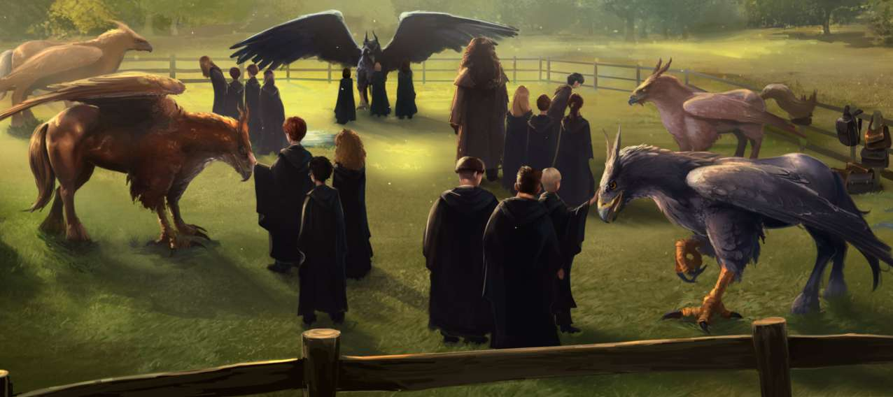
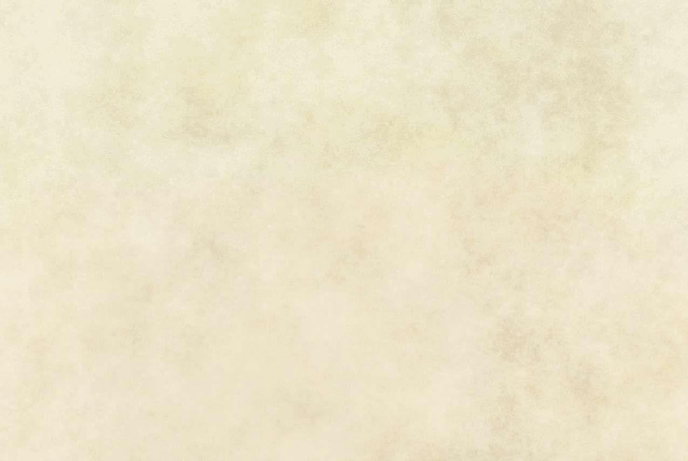
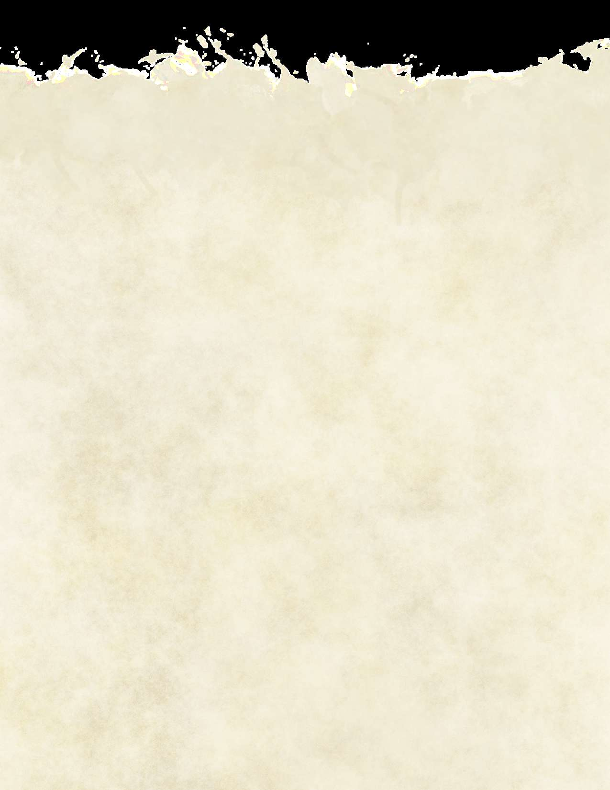

Commanding Your Beast Commanding Your Beast
You train your companion to follow certain commands. You
Hunter's Reflexes. You've precisely honed your instincts in
have a number of Command Dice equal to half your level
combat. As a reaction to a creature you can see casting a
(rounded down) + your Wisdom modifier. A command die is a
spell or attacking, you can cast a spell with a casting time of
d6, and it is used to issue specifically trained commands to
one action, bonus action, or reaction, targeting only that
beasts, including your beast companion.
creature. Conditions and damage are applied before the
You can issue one command at a time to a beast within 120
target completes their action. Damage dealt to the target
feet of you that can hear you; the beast must be able to hear
imposes disadvantage on its attack roll. You cannot use this
you to follow the command, and the command is wasted if the
feature again until you complete a short or long rest.
beast doesn't fulfill it before the end of its next turn. When a
### command die is rolled, its use is expended. Your command Your Beast Companion Your Beast Companion
die becomes a d8 when you reach 14th level.
You regain all command dice when you finish a long rest.
Bonding with Your Beast Bonding with Your Beast
With 8 hours of uninterrupted communication and bonding,	Beast Commands
you can call upon a non-hostile beast to serve as your faithful
Your companion knows two beast commands of your choice.
companion. When you gain this feature, select your
It learns an additional command when you reach 14th level.
companion from any Medium or larger single beast of
You can also teach any friendly beast other than your
challenge rating 1/4 or lower. You can have only one beast
companion only one beast command by spending at least 1
companion at a time.
hour per day for 7 days training the creature.
Your beast companion obeys your commands as best it
Attack. You can use your bonus action and roll a command
can. The beast moves and acts during your turn, but you
die to issue this command. Your companion can use its action
determine its actions, decisions, attitudes, and so on. You and
to take one of its natural attack actions. However, it can't use
your companion can move and act in any order you choose. If
its Multiattack action, if it has one. If the attack hits, add the
you are incapacitated or absent, your companion acts on its
result of the command die to the damage roll.
own.
Down. You can use your bonus action and roll a command
Your companion will fight in unison with you. The
die to issue this command. Your companion uses its reaction
following rules apply while it is bonded to you by this feature:
to fall prone and attempt to Hide, adding the result of the
command die to its Dexterity (Stealth) check. The first attack
It can't use its natural attack actions, but it can make
it makes while hidden in this way also adds the result of the
unarmed
strikes. Its damage die for unarmed strikes
command die to its attack roll.
becomes a d4.
Find. You can use your bonus action and roll a command
It is proficient in two saving throws and two skills of your
die to issue this command. Your companion uses its reaction
choice, in addition to its normal proficiencies.
to attempt to Search for hidden creatures or objects, adding
It uses your proficiency bonus for attacks, as well as for
the result of the command die to the Search's skill check.
saving throws and skills in which it is proficient.
Grab. When your companion makes an opportunity attack, It adds your proficiency bonus to its armor class.
you can use your reaction and roll a command die to issue
To find your companion's maximum hit points, take the stat
this command. If the attack hits, your companion can attempt
block's hit points and add 5 times your caster level. Whenever
to grapple the target as part of the attack, adding the result of
you gain an Ability Score Improvement, you can also allocate
the command die to the skill check it makes for the attempt.
two points among your companion's ability scores. If your
Rush. You can use your bonus action and roll a command
beast companion is ever slain or dismissed, a bond may be
die to issue this command. Your companion uses its reaction
formed with another beast and that beast will progress
to take the Help action, aiding the next attack against a
according to your current level.
creature within its reach that it can see. If this attack hits, add
the result of the command die to the attack's damage.

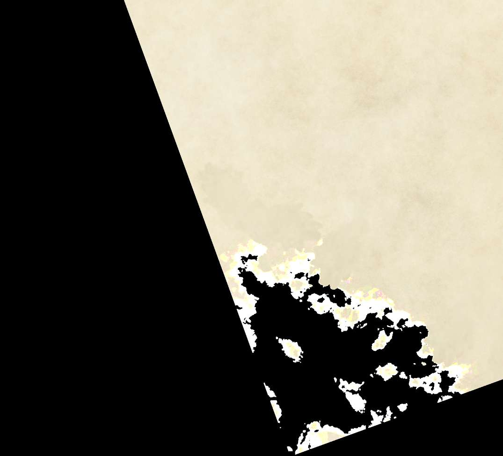
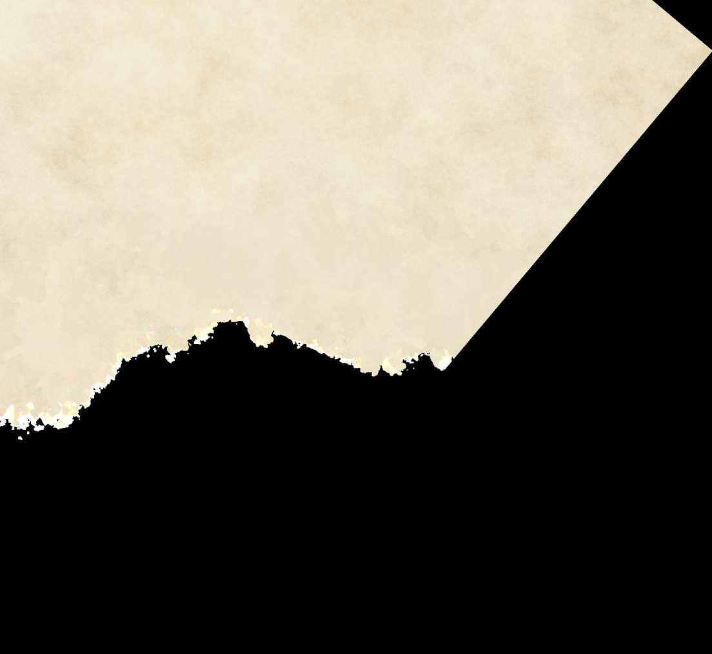
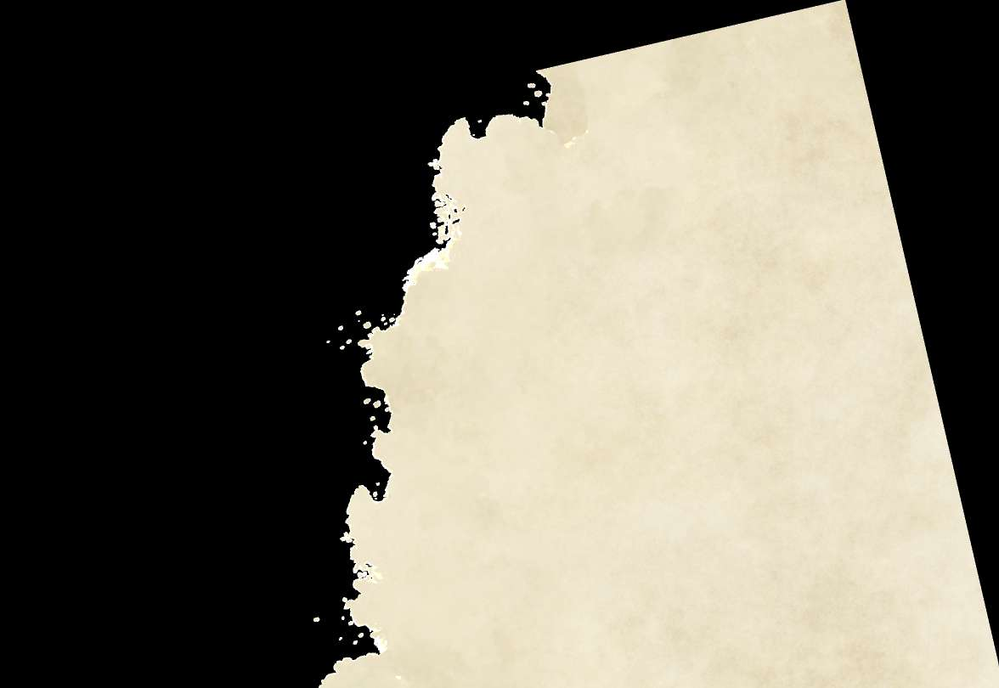
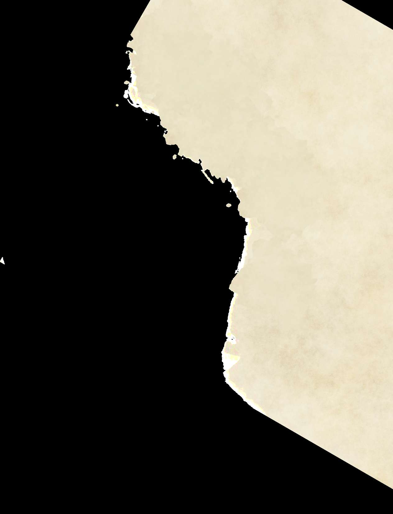

### Chapter 4: Wands (Backgrounds) Chapter 4: Wands (Backgrounds)
### E
very witch and wizard purchases a wand
### Wand Components Wand Components
before their first year at Hogwarts, and
spends their entire life using that wand,
### Wood Wood
unless they break it or win another wand in
combat. The conduit through which their
Only a minority of trees produce wand quality wood (just as a
magic flows, a wand is a deeply personal
minority of humans can produce magic), so it takes years of
and valuable possession to wizards. Those
experience to tell which trees have the gift. A wand’s wood
knowledgable in wandlore will often describe a wand as if it
determines the core personality of the wand. As Garrick
can think and feel. Every single wand is unique and its
Ollivander said, the wand chooses the wizard, and so the
character will depend on the particular tree and magical
wood of a wand tells you about the wizard who wields it.
creature from which it derives its materials. Moreover, each
### wand, from the moment it finds its ideal owner, will begin to	Cores	Cores
learn from and teach its human partner.
Unicorn Hair Unicorn Hair
Unicorn hair generally produces
the most consistent magic, and is
least subject to fluctuations and
blockages. Wands with unicorn
cores are generally the most
difficult to turn to the Dark Arts.
They are the most faithful of all
wands, and usually remain
strongly attached to their first
owner, irrespective of whether he
or she was an accomplished witch
or wizard. Minor disadvantages of
unicorn hair are that they do not
make the most powerful wands
(although the wand wood may
compensate) and that they are
prone to melancholy if seriously
mishandled, meaning that the hair
may ‘die’ and need replacing.
Dragon Heartstring                                 Dragon Heartstring
As a rule, dragon heartstrings produce
wands with the most power, and which are
capable of the most flamboyant spells. Dragon
wands tend to learn more quickly than other
types. While they can change allegiance if won from
their original master, they always bond strongly with
the current owner. The dragon wand tends to be easiest
to turn to the Dark Arts, though it will not incline that way
of its own accord. It is also the most prone of the three cores
to accidents, being somewhat temperamental.
Phoenix Feather Phoenix Feather
Phoenix feather is the rarest core type. Phoenix feathers are
capable of the greatest range of magic, though they may take
longer than either unicorn or dragon cores to reveal this.
They show the most initiative, sometimes acting of their own
accord, a quality that many witches and wizards dislike.
Phoenix feather wands are always the pickiest when it
comes to potential owners, for the creature from which they
are taken is one of the most independent and detached in the
world. These wands are the hardest to tame and to
personalize, and their allegiance is usually hard won.

If you want the experience of the wand choosing the wizard, Uncommon Wand Cores Uncommon Wand Cores
all wand attributes have rolling tables for random selection.
Those three wand cores are the only kinds of wands crafted
by Garrick Ollivander, but many other wand cores exist.	d100	Wand Wood
Around the world and in the shops of other wand makers,

| 1-2 | Acacia |
|---|---|

you might find wands with cores of Kelpie hair, Dittany stalk,
Kneazle whisker, Veela hair, coral, or even troll whisker.	3-6	Alder
These unusual cores have a reputation for being less reliable,

| 7-9 | Ash |
|---|---|

but sometimes an uncommon core produces a wand that's
the perfect match for a one-of-a-kind wizard.	10-11	Apple

| 12-13 | Aspen |
|---|---|

### Length Length
14-16	Beech
Many wandmakers simply match the wand length to the size

| 17 | Blackthorn |
|---|---|

of the witch or wizard who will use it, but this is a crude
measure, and fails to take into account many other, important
18-19	Black Walnut
considerations. Longer wands might suit taller wizards, but

| 20-22 | Cedar |
|---|---|

they tend to be drawn to bigger personalities, and those of a
more spacious and dramatic style of magic. Neater wands
23	Cherry
favour more elegant and refined spell-casting. However, no

| 24-25 | Chestnut |
|---|---|

single aspect of wand composition should be considered in
isolation of all the others, and the type of wood, the core and
26-28	Cypress
the flexibility may either counterbalance or enhance the
attributes of the wand’s length.

| 29-32 | Dogwood |
|---|---|

Most wands will be in the range of nine and fourteen
33-34	Ebony
inches. Extremely short wands (eight inches and under) and

| 35 | Elder |
|---|---|

very long wands (over fifteen inches) are exceptionally rare.
In the latter case, a physical peculiarity demanded the
36-37	Elm
excessive wand length. However, abnormally short wands

| 38-40 | English Oak |
|---|---|

usually select those in whose character something is lacking,
rather than because they are physically undersized.
41-44	Fir
### Flexibility Flexibility

| 45-47 | Hawthorn |
|---|---|

Wand flexibility or rigidity denotes the degree of adaptability
48-50	Hazel
and willingness to change possessed by the wand-and-owner

| 51 | Holly |
|---|---|

pair. Although, again, this factor ought not to be considered
separately from the wand wood, core and length, nor of the
52-54	Hornbeam
owner’s life experience and style of magic, all of which will

| 55-57 | Larch |
|---|---|

combine to make the wand in question unique.
58-60	Laurel
### Backgrounds Backgrounds

| 61-63 | Mahogany |
|---|---|

Wand woods are grouped into backgrounds based on their
64-66	Maple
general traits, which help define your character and

| 67-69 | Pear |
|---|---|

determine your background skill proficiencies and
background feature. Once you've selected your background,
70-72	Pine
choose a wood. Then select your remaining wand

| 73-75 | Poplar |
|---|---|

components: core, length, and flexibility. You are free to
create any combination of Ideals, Bonds, and Flaws to match
76-77	Red Oak
the personality of your witch or wizard.

| 78-79 | Redwood |
|---|---|

80-83	Rowan

| 84-85 | Silver Lime |
|---|---|

Mix-and-Match Wandmaking
Like 5e, character backgrounds are entirely
86-88	Spruce
customizable. Even wand woods are mere

| 89-91 | Sycamore |
|---|---|

suggestions, and any wood can be paired with any
background. Feel free to work with your HM to
92-93	Vine
modify an existing background or create a brand

| 94-97 | Walnut |
|---|---|

new one to bring your character concept to life.
98-99	Willow

| 00 | Yew |
|---|---|

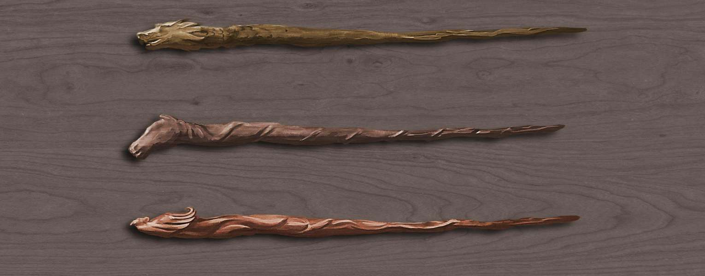
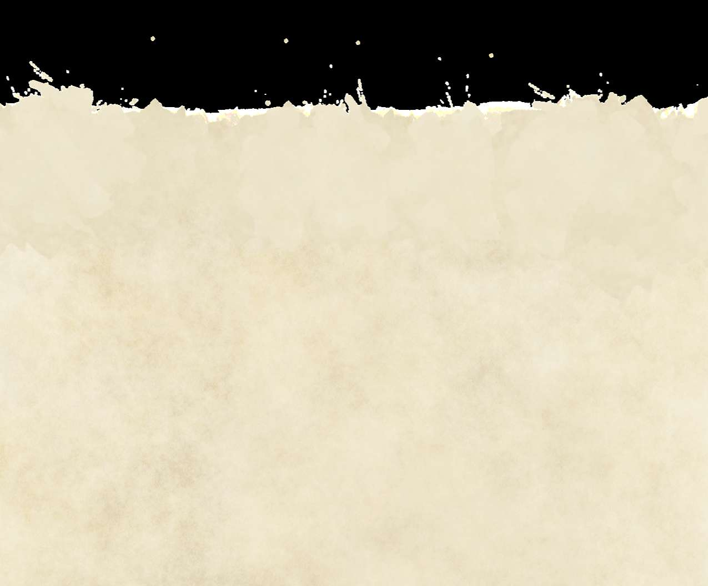

### Artist Artist
vital and adventurous, and with such an owner, it
You see yourself as an observer of the world around you,
demonstrates a highly-prized capacity to learn and adapt.
capturing little glimpses of that world. You express yourself
through those glimpses, satisfying your need to create and
d6 Core (Ideal)
communicating your own unique perspective. Your chosen

| 1-2 | Unicorn Hair: Beauty. When I create, I make the world better than it was. |
|---|---|

medium might be magically developed moving photographs,
a painted portrait with a personality, a bewitched sculpture or
even enchanted cartography.
Dragon Heartstring: People. I want to make an
Skill Proficiencies: Insight, Performance	3-4
impact on everyone who experiences my work.
Equipment: The tools of the art medium of your choice

| 5-6 | Phoenix Feather: Honesty. Art should reflect the soul; it should come from within and reveal who we really are. |
|---|---|

(e.g. painter's supplies, musical instrument, costume, etc.),
and a sketch pad with charcoal sticks
Background Feature: Apprentice Background Feature: Apprentice
Although you're not yet able to create original works, you
d6 Length (Bond)
have enough knowledge and rudimentary skills to begin an

| 1-2 | 10": I owe my mentors a great debt for shaping me into the person I am today. |
|---|---|

apprenticeship under a mentor, should you find one willing to
teach you. Additionally, you've become practiced in hand-eye
coordination and precise work.
11.5": I have a family, but I have no idea where
3-4
they are. One day, I hope to see them again.
d6	Wood (Personality Traits)

| 5-6 | 13": My camera/easel/instrument is my most treasured possession, and it reminds me of someone I love. |
|---|---|

| 1-2 | Pine |
|---|---|

3-4	Red Oak

| 5-6 | Sycamore |
|---|---|

d6 Flexibility (Flaw)

| 1-2 | Reasonably Firm: In fact, the world does revolve around me. |
|---|---|

Pine Pine
Pine wands always choose an independent, individual master
who may be perceived as a loner, intriguing and perhaps	Slightly Swishy: There's no room for caution in a
3-4
mysterious. Pine wands enjoy being used creatively, and	life lived to the fullest.
unlike some others, will adapt unprotestingly to new methods

| 5-6 | Quite Yielding: I'll do anything to win fame and renown. |
|---|---|

and spells. Many wandmakers insist that pine wands are able
to detect, and perform best for, owners who are destined for
long lives. The pine wand is one of those that are sensitive to
non-verbal magic.	Variant Artist: Performer	Variant Artist: Performer
Even moreso than visual artists, you're compelled to express
Red Oak Red Oak
yourself, your experiences and your emotions. While you
You will often hear the ignorant say that red oak is an
aren't immune to bouts of uncertainty and performance
infallible sign of its owner’s hot temper. In fact, the true
anxiety, you generally seem to be quite extraverted. You've
match for a red oak wand is possessed of unusually fast
found your calling in at least one of the performing arts:
reactions, making it a perfect duelling wand. Less common
singing, dancing, playing an instrument or magical theater.
than English oak, its ideal master is light of touch, quick-
witted and adaptable, often the creator of distinctive,
trademark spells, and a good man or woman in a fight.
Variant Feature: Dramatic Entrance Sycamore Sycamore
Your flair for the dramatic means you can always do
The sycamore makes a questing wand, eager for experience
things in the most attention-grabbing way as
and losing brilliance in mundane activities. These may
possible. This often makes for an excellent
combust if allowed to become ‘bored,’ and many aging
distraction or starts to build a crowd.
witches and wizards are disconcerted to find their wand
bursting into flame as they ask it, one more time, to fetch
their slippers. The sycamore’s ideal owner is curious,

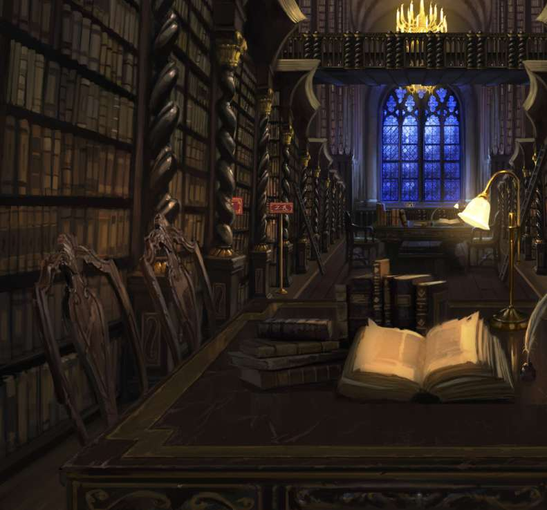
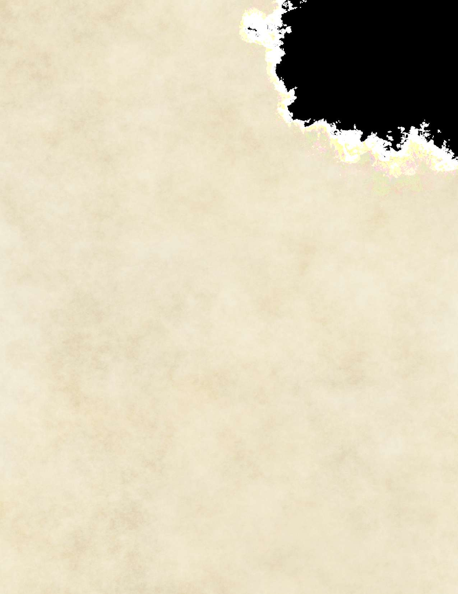

### Bookworm Bookworm
You've always been known to have your nose in a book,
whether obsessing over homework or escaping reality into a
world of fiction. You often solve your problems through
research and study. Because you absorb so much from
others, you've learned things, traveled places, felt emotions,
and seen wonders far beyond your own experiences.
Skill Proficiencies: Magical Theory, Investigation
Equipment: Your favorite book, a book you're
currently reading, and a small back-up quill
Background Feature: Teacher's Pet Background Feature: Teacher's Pet
Because you are a bright individual, teachers and those in
positions of authority are more likely to interpret your actions
and intentions favorably. You might be in a better position to
enlist their help, or have plausible deniability based on your
academic reputation.
d4	Wood (Personality Traits)

| 1 | Beech |
|---|---|

2 Hornbeam
d6 Core (Ideal)

| 3 | Vine |
|---|---|

| 1-2 | Unicorn Hair: Creativity. The world is in need of new ideas and bold action. |
|---|---|

4 Walnut
Dragon Heartstring: Knowledge. The path to
Beech Beech	3-4	power and self-improvement is through
knowledge.
The true match for a beech wand will be, if young, wise
beyond his or her years, and if full-grown, rich in

| 5-6 | Phoenix Feather: Self-improvement. The goal of a life of study is the betterment of oneself. |
|---|---|

understanding and experience. Beech wands perform very
weakly for the narrow-minded and intolerant. When properly
matched, the beech wand is capable of a subtlety and artistry
d6 Length (Bond)
not seen in any other wood, hence its lustrous reputation.

| 1-2 | 10": I want my life's work to be magical textbooks related to a specific field. |
|---|---|

Hornbeam Hornbeam
Hornbeam, a fine-tuned and sentient wand, selects for its life
12.5": I've been searching my whole life for the
mate the talented witch or wizard with a single, pure passion.
3-4
answer to a certain question.
Hornbeam wands adapt more quickly to their owner’s style of
magic and become so personalized, so quickly, that others

| 5-6 | 13": My family has an ancient text of terrible secrets that must not fall into the wrong hands. |
|---|---|

will find them extremely difficult to use. They likewise absorb
their owner’s code of honor and will refuse to perform acts -
good or ill - conflicting with their master’s principles.
d6 Flexibility (Flaw)
Vine Vine

| 1-2 | Unyielding: Uncovering knowledge is worth any price, even a piece of my own humanity. |
|---|---|

Vine wands are among the less common types, and their
ideal owners are nearly always those witches or wizards who
Reasonably Supple: I let my need to win
seek a greater purpose, have a vision beyond the ordinary and
3-4
arguments overshadow friendships and harmony.
frequently astound those who think they know them best.

| 5-6 | Pliant: I overlook obvious solutions in favor of complicated ones. |
|---|---|

Vine wands seem strongly attracted by personalities with
hidden depths, and often instantly detect a match.
Walnut Walnut
Variant Bookworm: Prodigy Variant Bookworm: Prodigy
Walnut wands are often found in the hands of highly
intelligent magical innovators and inventors; this is a	You've always exhibited unusual control over your magical
handsome wood possessed of unusual versatility and	abilities. Where others struggle, things come naturally to you.
adaptability. Walnut wands will, once subjugated, perform any	The ease with which you gain knowledge or skills sometimes
task its owner desires, provided that the user is of sufficient	results in arrogance or naivete. You've also been burdened
brilliance. This makes for a truly lethal weapon in the hands	with greater expectations and if you entered wizarding school
of a witch or wizard of no conscience, for the wand and the	early or skipped a year, you're accustomed to being younger
wizard may feed on each other in an unhealthy manner.	than your peers.

### Redwood Redwood Dreamer Dreamer
Wand-quality redwood is in short supply due to its reputation
Your dreams fill your thoughts, distracted by all of life's
for bringing good fortune. As usual with wandlore, the
possibilities. Introspection comes easily to you and frankly,
populace has it backwards: redwood wands are not
you don't understand how a person can live without looking
themselves lucky, but are strongly attracted to witches and
for meaning, thinking deeply about society's values, or being
wizards who already possess the admirable ability to fall on
overcome with wonder. You might even feel out of place in a
their feet, to make the right choice, to snatch advantage from
world of people focused on material success and just getting
catastrophe. One can expect to hear of exciting exploits when
through the day.
such a witch or wizard wields a redwood wand.
Skill Proficiencies: Insight, Perception
Silver Lime Silver Lime
Tool Proficiencies: Astronomer's tools

| i | me |
|---|---|

Equipment: Astronomer's tools, and a mystical trinket you	This unusual and highly attractive wand wood was greatly in
believe gives you protection (but doesn't)	vogue in the nineteenth century, and demand consistently
outstripped supply. The reasons for these wands’ desirability
Background Feature: Stargazer Background Feature: Stargazer
lay not only in their unusually handsome appearance, but
Many of your nights are spent staring up at space,
also because they had a reputation for performing best for
contemplating existence. You're a natural at Astronomy and
Seers and those skilled in Legilimency, mysterious arts both,
share the Centaurs' views on the importance of the heavens.
which consequently gave the possessor of a silver lime wand
Your affinity for the ethereal also leads ghosts to be more
considerable status.
trusting of you and more forthcoming with information.
d6 Core (Ideal)
d10	Wood (Personality Traits)

| -2 | Unicorn Hair: Honesty. Lies, hypocrisy and inauthenticity cause the most spiritual harm to a person's soul. |
|---|---|

| 1-2 | Black Walnut |
|---|---|

3-4	Cedar
Dragon Heartstring: Change. All good and bad

| 5-6 | Hazel |
|---|---|

3-4 things must come to an end. Change is the
7-8	Redwood	nature of existence.

| 9-1 | 0 Silver Lime |
|---|---|

Phoenix Feather: Independence. My spirit is free,
5-6
and no one else has authority over my life.
Black Walnut Black Walnut
d6 Length (Bond) Less common than the standard walnut wand, black walnut
wands seek a master of good instincts and powerful insight.

| -2 | 9.5": I'm seeking enlightenment, but it always eludes me. |
|---|---|

Black walnut is a very handsome wood, but is not the easiest
to master. If the wand is paired with a sincere, self-aware
11.5": I see what others are blind to, and I need owner, however, it becomes one of the most loyal and
3-4
to open their eyes. impressive wands of all, with a particular flair in all kinds of
charmwork.

| -6 | 14": I suffer recurring dreams of a terrible event in the future and will do anything to prevent it. |
|---|---|

Cedar Cedar
Never matched to the easily-fooled, the cedar wand finds its
d6 Flexibility (Flaw) perfect home where there is perspicacity and perception.
Some wandmakers would go further than that, saying one

| -2 | Rigid: I can't keep a secret to save my life, or anyone else's. |
|---|---|

should never cross the owner of a cedar wand, especially if
harm is done to their allies or kin. The witch or wizard who is
Slightly Yielding: I am dogmatic in my thoughts
well-matched with cedar carries the potential to be a
3-4
and philosophy.
frightening adversary, which often comes as a shock to those
who have thoughtlessly challenged them.

| -6 | Surprisingly Swishy: I am easily distracted and if there's a plan, I'll forget it. If I don't forget it, I'll ignore it. |
|---|---|

Hazel Hazel
A sensitive wand, hazel often reflect its owner’s emotional
state and works best for a master who understands and can
manage their own feelings. Others should be careful handling
a hazel wand if its owner has been angered or disappointed,
because the wand will absorb such energy and discharge it
unpredictably. It is capable of outstanding magic in the hands
of the skilful and is so devoted to its owner that it often ‘wilts’
at the end of their master's life.

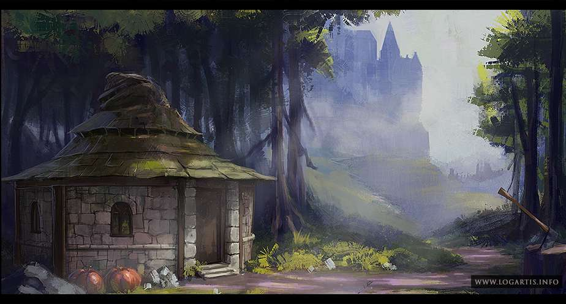
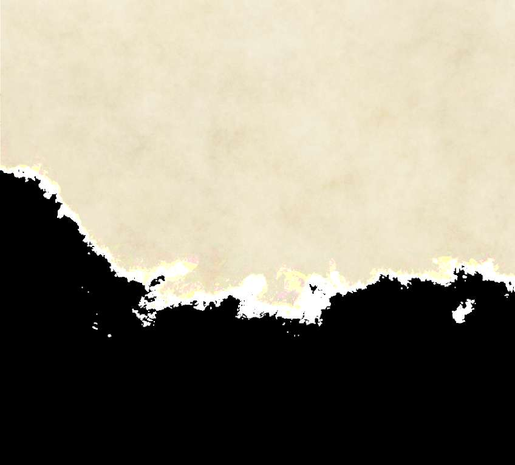
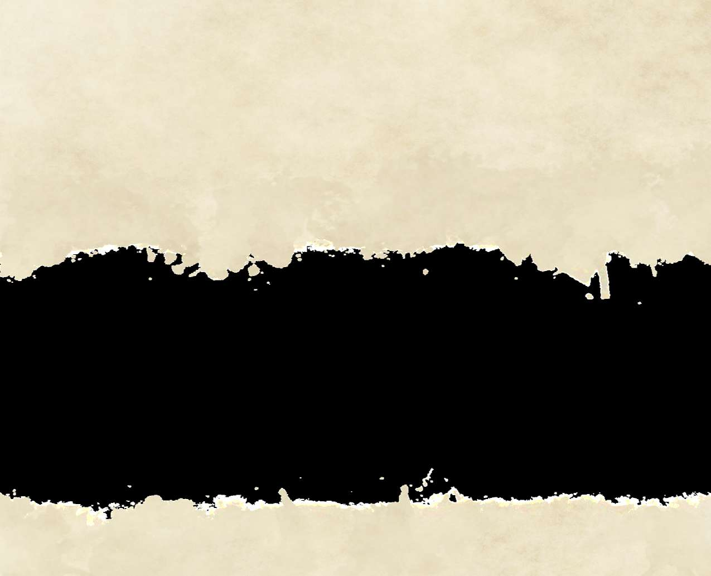

### English Oak English Oak Groundskeeper Groundskeeper
A wand for good times and bad, this is a friend as loyal as the
Your childhood has always been spent outdoors, climbing
wizard who deserves it. Wands of English oak demand
trees or capturing insects. You've always felt an intense
partners of strength, courage and fidelity. Less well-known is
connection to all forms of life around you, and that drives you
the propensity for owners of English oak wands to have
to be considerate towards other beings. Going without fresh
powerful intuition, and, often, an affinity with the magic of the
air leaves you feeling trapped, but some greenery and a ray of
natural world, with the creatures and plants that are
sunshine is all it takes to put you in a great mood.
necessary to wizardkind.
Skill Proficiencies: Survival, Magical Creatures
Maple Maple
Tool Proficiencies: Herbologist's tools
Equipment: Herbologist's tools, and a compass	Garrick Ollivander found that witches and wizards chosen by
maple wands, a beautiful and desirable wood, are by nature
Background Feature: Value All Life Background Feature: Value All Life
travelers and explorers. They are not stay-at-home wands,
You've earned a reputation for your compassionate demeanor.
and prefer ambition in their owner, otherwise their magic
Magical beings and intelligent beasts are more likely to treat
grows lackluster. Fresh challenges and regular changes of
you favorably or grant you an audience. If they have any
scene cause this wand to literally shine, burnishing itself as it
prejudices against wizardkind, you'll have the chance to prove
grows with its partner in ability and status, earning its
yourself and become exempt from those prejudices.
reputation as the wand of high achievers.
Poplar Poplar
d4	Wood (Personality Traits)
Poplar wands can be relied upon, wands of consistency,

| 1 Ch | estnut |
|---|---|

strength and uniform power. Always happiest when working
with a witch or wizard of clear moral vision, some wizards 2 English Oak
joke that a poplar wand has never chosen a politician.

| 3 M | aple |
|---|---|

However, two of the Ministry’s most accomplished Ministers
for Magic, Eldritch Diggory and Evangeline Orpington, were 4 Poplar
possessors of fine, Ollivander-made poplar wands.
Chestnut Chestnut
d6 Core (Ideal)
This is a most curious, multi-faceted wood, which takes a
great deal of colour from the personality that possesses it.	Unicorn Hair: Redemption. There’s a spark of
1-2
good in everyone. The wand of chestnut is attracted to witches and wizards
who are skilled tamers of magical beasts and those who are
Dragon Heartstring: Community. We have to take
3-4 natural fliers. However, three successive heads of the
care of each other, because no one else will.
Wizengamot have possessed chestnut and unicorn wands, for
Phoenix Feather: Nature. The natural world is this combination shows a predilection for those concerned
5-6
more precious than all of so-called civilization. with all manner of justice.
d6 Length (Bond)
10.5": An injury to unspoiled wilderness is an
1-2
injury to me.
11": I owe my life to the wizard who took me in
3-4
when my parents died.
13.5": It is my duty to preserve and sustain
5-6
Art by Gergely Gizella Art by Gergely Gizella Art by Gergely Gizella Art by Gergely Gizella Art by Gergely Gizella Art by Gergely Gizella
endangered creatures. Art by Gergely Gizella Art by Gergely Gizella Art by Gergely Gizella
www.logartis.info www.logartis.info www.logartis.info www.logartis.info www.logartis.info www.logartis.info
www.logartis.info www.logartis.info www.logartis.info

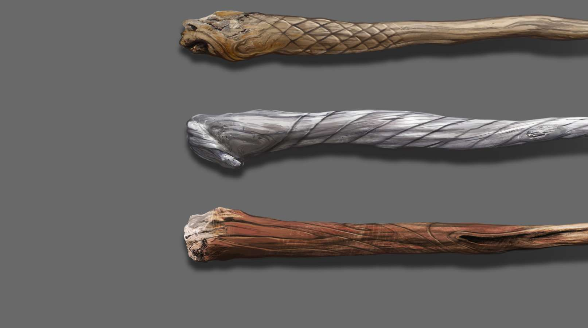
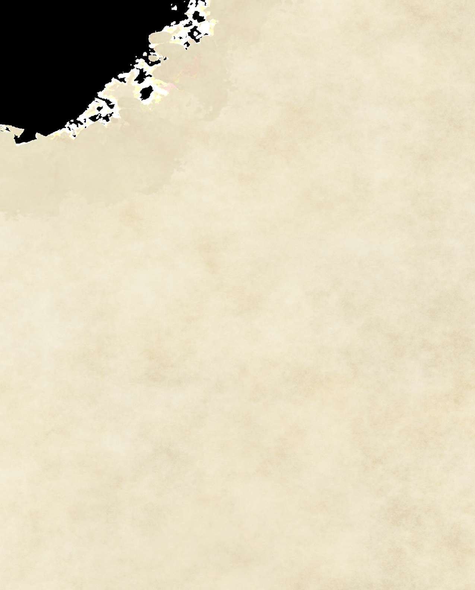
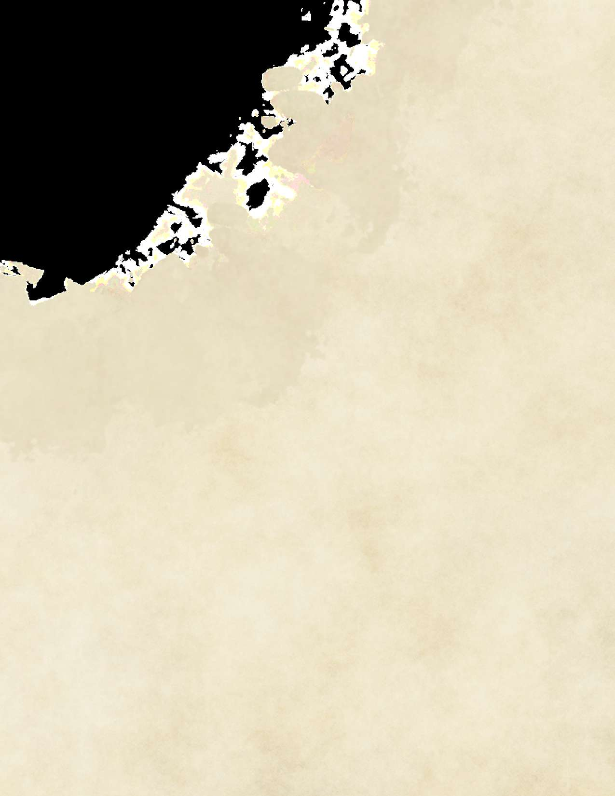

Cypress Cypress
Cypress wands are associated with nobility and dying a
heroic death, historically. Fortunately, the possessors of
cypress wands are rarely called upon to lay down their lives,
but doubtless many of them would do so if required. Wands of
cypress find their soulmates among the brave, the bold and
the self-sacrificing: those who are unafraid to confront the
shadows in their own and others’ natures.
Willow Willow
Willow is an uncommon wand wood with healing power, and
© Pottermore Limited © Pottermore Limited © Pottermore Limited © Pottermore Limited © Pottermore Limited © Pottermore Limited
© Pottermore Limited © Pottermore Limited © Pottermore Limited	their ideal owner often has some (usually unwarranted)
insecurity, however well they may try and hide it. With a
handsome appearance and well-founded reputation for
enabling advanced, non-verbal magic, the willow wands have
consistently selected those of greatest potential, rather than
those who feel they have little to learn.
d6 Flexibility (Flaw)
d6 Core (Ideal)

| 1-2 | Brittle: I am suspicious of strangers and suspect the worst of them. |
|---|---|

| 1-2 | Unicorn Hair: Greater Good. The most noble cause is to lay down our lives to defend others. |
|---|---|

Slightly Springy: I speak quite tactlessly, without
Dragon Heartstring: Respect. All people—rich or 3-4
really thinking through my words.
3-4 poor, powerful or weak, magical or muggle—

| 5-6 | Quite Bendy: Don't expect me to save those who can't save themselves. It is nature's way that the strong thrive and the weak perish. |
|---|---|

deserve respect.

| 5-6 | Phoenix Feather: Sincerity. There's no good pretending to be something I'm not. |
|---|---|

### Klutz Klutz
d6 Length (Bond)
Maybe you're an incredibly uncoordinated person, or perhaps

| 1-2 | 9": Someone is depending on me, and I'll never forgive myself if I let them down. |
|---|---|

you inherited a particularly petty curse. Whatever the cause,
you continually find yourself in the middle of mishaps and
12.5": I have to prove to that I'm not a blunders. Since being accident-prone is a very dangerous
3-4
disappointment to my family, mentors or peers. thing to be in the wizarding world, you tend to be
hypervigilant and wary of your surroundings.

| 5-6 | 14": I will be fiercely loyal to anyone who doesn't see me for my faults, but for who I am. |
|---|---|

Skill Proficiencies: Medicine, Perception
Equipment: A lucky charm, and a package of plasters
Background Feature: Walking Disaster Background Feature: Walking Disaster	d6	Flexibility (Flaw)
You've seen so many situations go completely awry that

| 1-2 | Inflexible: I am slow to trust that others' words are sincere, because of some bad experiences. |
|---|---|

you've started being able to predict all the ways things can go
wrong. If you're looking to hinder something or bring about a
Slightly Pliant: I follow the rules, even if they
dangerous accident, you'll have no shortage of ideas.	3-4
aren't what's best.

| 5-6 | Very Supple: I'm always putting my foot in my mouth, invariably insulting or embarrassing others. |
|---|---|

d6	Wood (Personality Traits)

| 1-2 | Ash |
|---|---|

3-4	Cypress

| 5-6 | Willow |
|---|---|

Variant Feature: Punching Bag
Ash Ash
You may not be coordinated, but at least you've
learned how to take a punch. You have resistance The ash wand clings to its one true master and ought not to
to damage dealt by falling, traps or inanimate be passed on or gifted from the original owner, because it will
objects. You also have disadvantage on saving lose power and skill. Witches and wizards best suited to ash
throws made to avoid or resist traps, any rolls
wands are not lightly swayed from their beliefs or purposes.
made to detect traps and Dexterity (Acrobatics)
However, a brash or over-confident witch or wizard will be
checks.
disappointed by its effects. The ideal owner may be stubborn,
and will certainly be courageous, but never crass or arrogant.
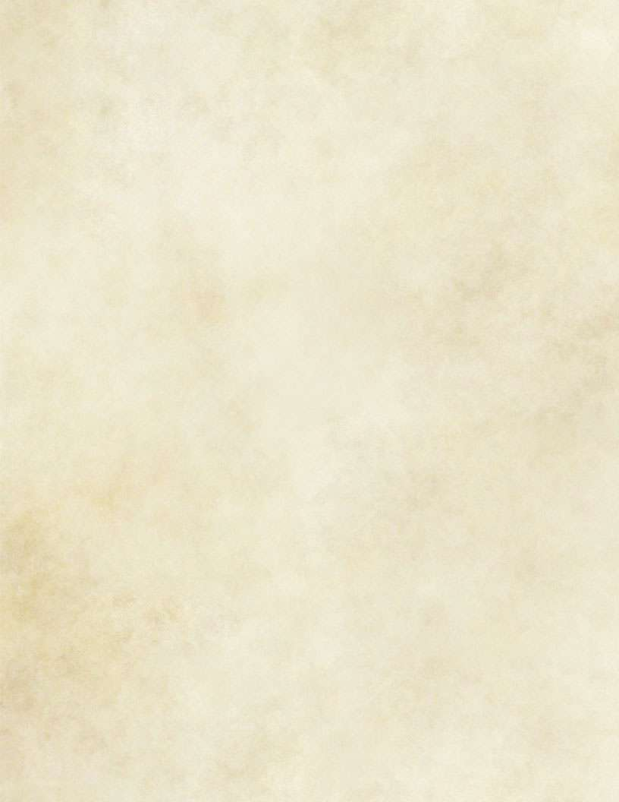
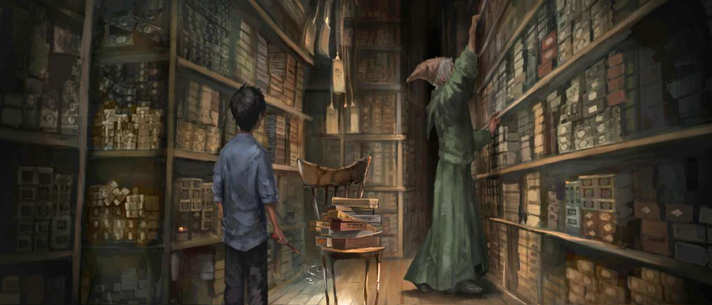
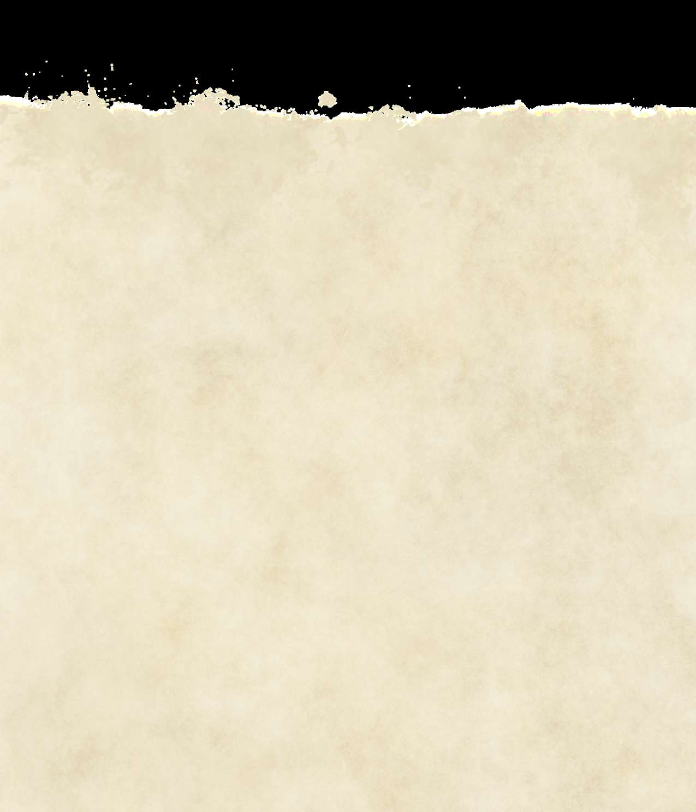

### Potioneer Potioneer
are Muggle-borns. Of all wand woods, elm produces the More than once, you've been accused of perfectionism, but
fewest accidents, the least foolish errors, and the most your attention to detail allows you to succeed where others
elegant charms and spells; these are sophisticated wands, fail. This trait shines when you turn your focus to brewing
capable of highly advanced magic in the right hands.
potions. You approach situations with drive and vigor, and live
with strong conviction in your values and principles.
Larch Larch
Skill Proficiencies: Herbology, Potion-making
Larch wands have a reputation for instilling confidence and
Tool Proficiencies: Potioneer's kit
courage in the user. The celebrated wandmaker Garrick
Equipment: A potioneer's kit, and a muggle notebook with
Ollivander found that larch always created wands of hidden
a ballpoint pen
talents and unexpected effects, which likewise describes the
Background Feature: Regular Customer Background Feature: Regular Customer	master who deserves it. It is often the case that the witch or
wizard who belongs to the larch wand may never realize the
You're a familiar face to any prominent wizarding apothecary,
full extent of their considerable talents until paired with it,
and as a frequent customer, you get access to new and
but that they will then make an exceptional match.
unusual inventory that potion supplies stores may not want to
open up to the public. You've also picked up one common and
Laurel Laurel
one uncommon potion recipe of your choice.
It is said a laurel wand cannot perform a dishonourable act,
although in the owner’s quest for glory, laurel wands can
d4	Wood (Personality Traits)
perform powerful and sometimes lethal magic. The laurel

| 1 A | cacia |
|---|---|

wand seems unable to tolerate laziness in a possessor, and in
that case, can be won away from their owner most easily.
2 Elm
Otherwise, it will cleave happily to its first match and issue a

| 3 L | arch |
|---|---|

spontaneous zap if another attempts to steal it.
d6 Core (Ideal) 4 Laurel

| 1-2 | Unicorn Hair: Tradition. The ways of the past must never be forgotten, for they teach us who we are. |
|---|---|

Acacia Acacia
This very unusual wand wood creates tricky wands that often
refuse to produce magic for any but their owner, and also
Dragon Heartstring: Aspiration. I work hard to be
3-4
withholds their best effects from all but those most gifted.
recognized as the best there is at my craft.
This makes them difficult to place, and wandmakers often

| 5-6 | Phoenix Feather: Live and Let Live. Meddling in the affairs of others only causes trouble. |
|---|---|

keep only a small stock for those witches or wizards of
sufficient subtlety, for acacia is not suited to what is
commonly known as ‘bangs-and-smells’ magic. When well-
matched, an acacia wand matches any for power, though it is
d6 Length (Bond)
often underrated due to the peculiarity of its temperament.

| 1-2 | 9": I will face any challenge to win the approval of my family. |
|---|---|

Elm Elm
Elm wands prefer owners with presence, magical dexterity
10.5": I idolize legendary wizards and measure
3-4
and a certain native dignity. Although some wizards have
my deeds against theirs.
spread rumors that elm wands’ magic requires blood purity,

| 5-6 | 12": I am the only one carrying on my name, and it is up to me to immortalize it in history. |
|---|---|

there have been perfect matches of elm wands who

d6 Flexibility (Flaw)
Mahogany Mahogany
Hard: I'm convinced of my work's significance,	The mahogany tree symbolizes strength, safety,
1-2 and blind to my shortcomings and the risk of	protectiveness, and practicality, and these traits are mirrored
failure.
in a mahogany wand’s suitable match. With plenty of power
and a knack for transfiguration, the owners of mahogany
Barely Yielding: Once I pick a goal, I become
wands are often reliable and serve as cornerstones for their
3-4 obsessed with it to the detriment of everything
local wizard community.
else in my life.

| 5-6 | Quite Flexible: I'm horribly jealous of anyone who outshines my work. Everywhere I go, I'm surrounded by rivals. |
|---|---|

Rowan Rowan
Rowan wood has always been much-favored for wands,
because it is reputed to be more protective than any other
and renders all manner of defensive charms especially strong
and difficult to break. It is also commonly stated that no dark
### Protector Protector
witch or wizard ever owned a rowan wand. Rowan is most
happily placed with the clear-headed and the pure-hearted,
You have a strong sense of justice and do everything you can
but this reputation for virtue ought not to fool anyone – these
to stand up for victims, likely because of an instinctive
wands frequently outperform others in duels.
empathy or your own history of being victimized. Seeing a
narcissist take advantage of someone else makes you feel
Yew Yew
sick. You've made sure you're physically capable of stopping
Yew wands are among the rarer kinds, and their ideal
the people you care about from being hurt, so you make an
matches are likewise unusual and occasionally notorious.
excellent ally to the downtrodden.
The wand of yew is reputed to endow the power of life and
Skill Proficiencies: Athletics, Intimidation
death, retaining a fearsome reputation in the spheres of
Equipment: A Beater's bat, and a picture of a loved one
duelling and curses. However, a witch or wizard might
equally prove a fierce protector. Where wizards have been Background Feature: People's Champ Background Feature: People's Champ
buried with wands of yew, the wand generally sprouts into a
The way you carry yourself makes people comfortable and
tree guarding the owner’s grave. A yew wand never chooses
confident that you can help them when they're feeling
either a mediocre or a timid owner.
harrassed or imperiled. As long as you live up to your
reputation, your noble deeds can make you a shoo-in for
d6 Core (Ideal)
prefect, team captain or other small positions of authority.

| 1-2 | Unicorn Hair: Charity. I always try to help those in need, no matter what the personal cost. |
|---|---|

d10	Wood (Personality Traits)

| 1-2 | Blackthorn |
|---|---|

Dragon Heartstring: Fairness. No one should get
3-4 preferential treatment, and no one is above
3-4	Hawthorn
justice.

| 5-6 | Mahogany |
|---|---|

| 5-6 | Phoenix Feather: Might. History is written by the victors, and the strong will always win. |
|---|---|

7-8	Rowan

| 9-10 | Yew |
|---|---|

d6 Length (Bond)

| 1-2 | 9.5": I owe a debt I can never repay to someone who once defended me. |
|---|---|

Blackthorn Blackthorn
A very unusual wand wood, blackthorn wands have the
10.5": Nothing is more important than honoring reputation of being best suited to a warrior. One finds
3-4
a pledge I make. blackthorn wands among the Aurors as well as among the
denizens of Azkaban. These wands appear to need to pass

| 5-6 | 13.5": I protect those who cannot protect themselves. |
|---|---|

through danger or hardship with their owners to become
truly bonded. Given this condition, the blackthorn wand will
become a loyal and faithful servant.
d6 Flexibility (Flaw)
Hawthorn Hawthorn

| 1-2 | Very Solid: I have little respect for anyone who is not willing to stand up for what is right. |
|---|---|

Hawthorn wands may be particularly suited to healing magic,
but they are also adept at curses, and it has been generally
Mildly Flexible: Secretly, I believe that things observed that the hawthorn wand seems most at home with a
3-4 would be better if I were a tyrant, ruling over
conflicted nature or a period of turmoil. Hawthorn wands are
everyone else.
not easy to master, however, and one should only ever be
placed in the hands of a witch or wizard of proven talent.

| 5-6 | Whippy: Too often, violence is my answer to almost any situation. |
|---|---|

Hawthorn wands have a notable peculiarity: their spells can,
when badly handled, backfire.

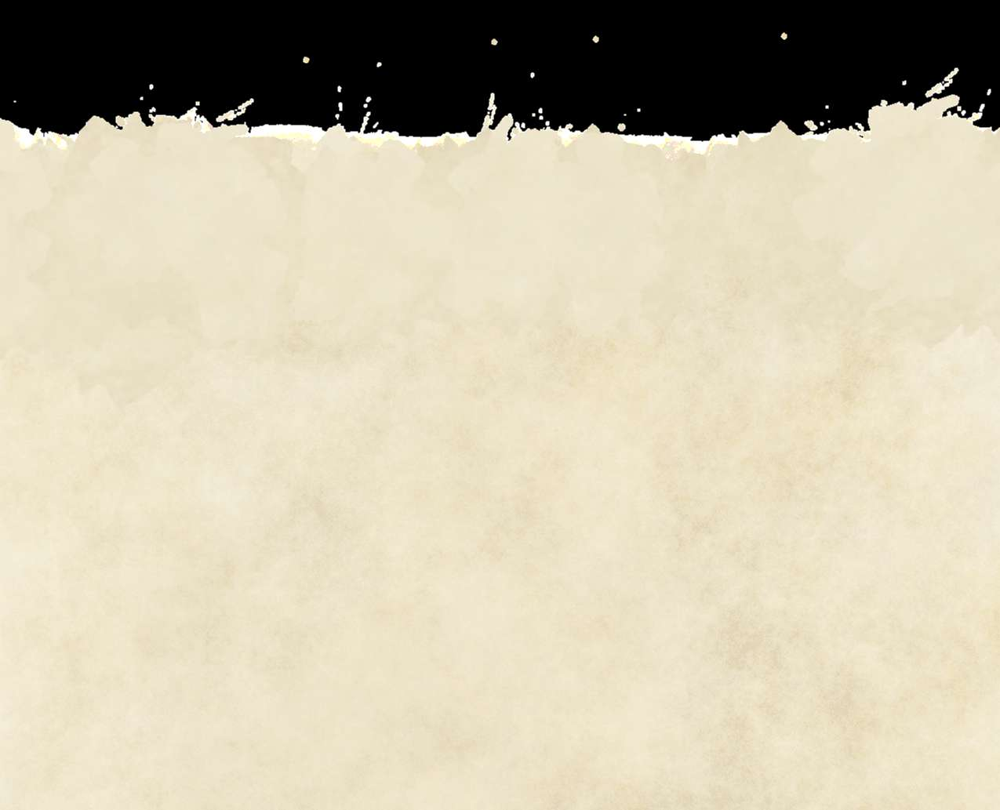

Variant Protector: Bully Variant Protector: Bully
of the living tree makes for a frivolous or merely ornamental
wand, for cherry wood often makes a wand that possesses
When you feel powerless, you hurt those weaker than you to
truly lethal power, whatever the core.
regain some semblance of control. It might be a necessary
coping mechanism, an assertive demeanor or an innately
Fir Fir
sadistic nature. You might even be very selective about your
One wandmaker called wands of fir wood ‘the survivor’s
victims or only lash out in relatively harmless ways.
wand’, because he had sold it to three wizards who
Regardless, you're a bully and you thrive off of feeling
subsequently passed through mortal peril unscathed. There
superior.
is no doubt that this wood, coming as it does from the most
resilient of trees, produces wands that demand staying power
and strength of purpose in their true owners. Fir wands are
Variant Feature: Common Thug
particularly suited to Transfiguration, and favour owners of
Everyone who's heard of you has heard of your	focused, strong-minded and, occasionally, intimidating
misdeeds, and they will know to come to you when
demeanor.
they need someone to take care of their dirty work.
Spruce Spruce The faint of heart will immediately fear you and try
to escape your ire by letting you boss them around.
Spruce wands are ill-matched with cautious or nervous
natures, becoming positively dangerous in fumbling fingers.
They require a firm hand, because they seem to have their
own ideas about what magic it ought to produce. However,
when a spruce wand meets its match in a bold spell-caster
### Quidditch Fan Quidditch Fan
with a good sense of humor, it becomes a superb helper.
Intensely loyal to owners, the wands are capable of producing
Whether your fondest childhood memories were at your local
particularly flamboyant and dramatic effects.
team's matches or you just discovered the sport upon arriving
at Hogwarts, you love quidditch. It makes complete sense,
d6 Core (Ideal)
given your competitive streak and affinity for rough-housing.
You use your common sense and ability to take initiative to

| 1-2 | Unicorn Hair: Friends. I’m loyal to my friends, and anyone else can go soak their head. |
|---|---|

get by.
Skill Proficiencies: Acrobatics, Athletics
Dragon Heartstring: Retribution. Wrongdoers
Tool Proficiencies: Vehicle (Broomstick)	3-4
should suffer the same misery they've inflicted.
Equipment: A quaffle, and a chocolate frog card of your

| 5-6 | Phoenix Feather: Competition. The struggle to win and survive drives greatness. |
|---|---|

favorite quidditch player
Background Feature: Superfan Background Feature: Superfan
It seems like you can only think about broomsticks and
d6 Length (Bond)
quaffles. You're always on top of recent matches, the latest

| 1-2 | 9.5": I will be incredible at my chosen pursuits, the greatest that ever lived |
|---|---|

brooms, and quidditch tactics. Also, you can easily strike up
conversation and build rapport with a fellow enthusiast.
11": I'll never forget a crushing defeat or the d6	Wood (Personality Traits)
3-4
opponent who dealt it.

| 1-2 C | herry |
|---|---|

| 5-6 | 14": Those who fight beside me are those worth dying for. |
|---|---|

3-4	Fir

| 5-6 S | pruce |
|---|---|

d6 Flexibility (Flaw)
Cherry Cherry

| 1-2 | Unbending: My hatred of my enemies is blind and unreasoning. |
|---|---|

This very rare wand wood creates a wand of strange power,
most highly prized by the wizarding students of the school of
Fairly Supple: Despite my best efforts, I am
3-4
Mahoutokoro in Japan, where those who own cherry wands
unreliable to my friends.
have special prestige. The Western wand-purchaser should

| 5-6 | Very Pliant: I too often hear veiled insults and threats in innocent words, and I'm quick to anger. |
|---|---|

dispel from their minds any notion that the pink blossom

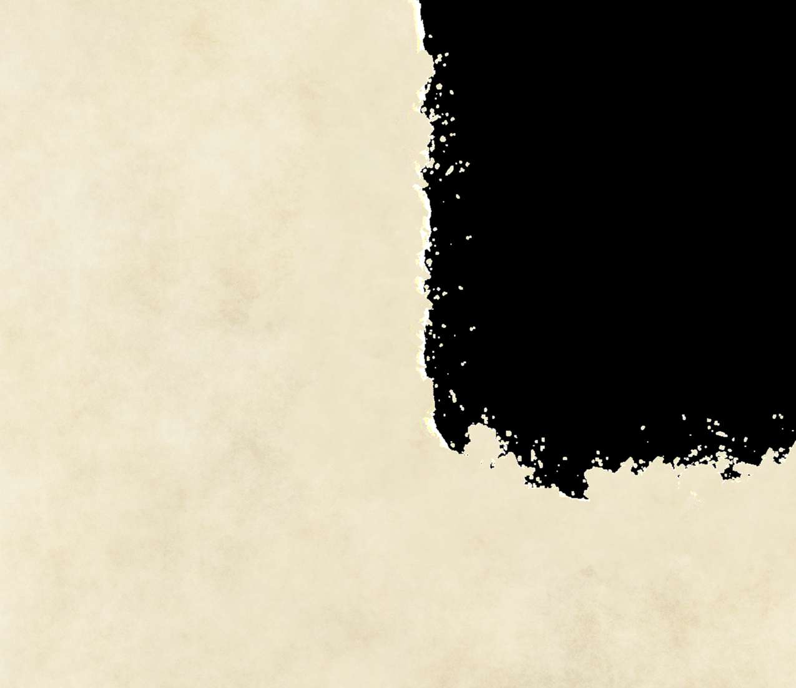

d6 Core (Ideal)
### Socialite Socialite

| 1-2 | Unicorn Hair: People. I like seeing smiles on people’s faces. That’s all that matters. |
|---|---|

You seem to make friends wherever you go. It might be your
forceful personality or the delicious gossip, but no matter
Dragon Heartstring: Might. The strong are meant
what it is, people are drawn to you. You enjoy being the
3-4
to lead and the weak will follow.
center of attention and feel invigorated by lively crowds, but

| 5-6 | Phoenix Feather: Destiny. Nothing and no one can steer me away from my higher calling. |
|---|---|

you might get carried away with impressing your admirers.
Skill Proficiencies: Deception, Persuasion
Equipment: A ring with a family crest or another type of
heirloom jewelry, and a peacock feather quill
d6 Length (Bond)
Background Feature: Rumor-Monger Background Feature: Rumor-Monger

| 1-2 | 10": I want to be famous, whatever it takes. |
|---|---|

Your skill at making connections has earned you inroads with
12": Family and institutions are most important--
people in the know. When you attempt to uncover a	3-4
friends and sycophants come and go.
particularly juicy secret or a dangerous rumor, your sources

| 5-6 | 13": It is my duty to lead and inspire others. |
|---|---|

may be able to help you or point you in the right direction.
d4	Wood (Personality Traits)
d6 Flexibility (Flaw)

| 1 | Alder |
|---|---|

| 1-2 | Solid: I'm never satisfied with what I have--I always want more. |
|---|---|

2 Apple

| 3 | Aspen |
|---|---|

Reasonably Springy: I secretly believe that
3-4
everyone is beneath me.
4 Pear

| 5-6 | Swishy: I'm a (misguided) romantic and a sucker for a pretty face. |
|---|---|

Alder Alder
While the wood itself is unyielding, the ideal owner of an
alder wand is not stubborn or obstinate, but often helpful,
considerate and most likeable. When an alder wand is
happily placed, it becomes a magnificent, loyal helpmate. Of
all wand types, alder is best suited to non-verbal spell work,
whence comes its reputation for being suitable only for the
most advanced witches and wizards.
Apple Apple
Applewood wands are not made in great numbers. They are
powerful and best suited to an owner of high aims and ideals,
as this wood mixes poorly with Dark magic. It is said that the
possessor of an apple wand will be well-loved and long-lived,
and wizards of great personal charm often find their perfect
match in an applewood wand.
Aspen Aspen
Wand-quality aspen wood is prized for its stylish resemblance
to ivory and usually outstanding charmwork. The proper
owner of the aspen wand is often an accomplished duellist,
for the aspen wand is particularly suited to martial magic. An
infamous and secretive eighteenth-century duelling club, the
Silver Spears, only admitted owners of aspen wands. Owners
are generally strong-minded and determined, likely to be
attracted by quests; this is a wand for revolutionaries.
Pear Pear
The golden-toned wood of pear produces wands of splendid
magical powers. Possessors of pear wands are usually
popular and well-respected, and no one knows of a single
instance where a pear wand was in the possession of a Dark
witch or wizard. Pear wands are among the most resilient,
and they commonly keep a remarkable appearance of
newness, even after many years of hard use.

Variant Socialite: Follower Variant Socialite: Follower	Ebony	Ebony
Instead of building social status through the force of your	Ebony wands are impressive in appearance and reputation,
own personality, you've found success by following someone	being highly suited to Transfiguration and combative magic.
who is more influential or popular than you are. You know	Ebony is happiest in the hand of those with the courage to be
how to stay useful to them and use their reputation to	themselves. Frequently non-conformist or comfortable with
influence others. Whether you see yourself as a hero's	being an outsider, the ebony wand’s perfect match will not be
sidekick or a bully's sycophant, you're happy to watch from	swayed lightly from their beliefs and purpose.
the sidelines and be second best.
Elder Elder
The rarest wand wood of all, and reputed to be unlucky (a
baseless superstition), elder wands are trickiest to master.
Variant Feature: Forgettable Face
They contain powerful magic, but scorn any owner who is not
If a person were to take you at face value, you'd
a superior caster; it takes a remarkable wizard to keep an
come across as inconsequential and they would
elder wand. The truth is that only a highly unusual person
assume your unimportance. It's also unusually
will find their perfect match in elder, but that witch or wizard
difficult to pick your face out from a crowd, making
in question is certainly marked out for a special destiny.
it easier for you to blend in and harder for someone
to blame you in particular.	Holly	Holly
Holly is one of the rarer kinds of wand woods; traditionally
considered protective, it works most happily for those who
may need help overcoming a tendency to anger and
impetuosity. At the same time, holly wands often choose
### Troublemaker Troublemaker
owners engaged in some dangerous and often spiritual quest.
Holly is a notoriously difficult wood to team with phoenix
Whether you consider yourself a purveyor of pranks or simply
feather, but should such a pairing find its match, nothing and
a curious soul, trouble tends to follow you wherever you go.
nobody should stand in their way.
As a result, you've learned to be a little more careful and
avoid the obvious pitfalls of rule-breaking. That's very useful,
d6 Core (Ideal)
as there's no shortage of messes you get yourself into.

| 1-2 | Unicorn Hair: Aspiration. I'm going to prove that I'm worthy of a better life. |
|---|---|

Skill Proficiencies: Sleight of Hand, Stealth
Equipment: A fake hall pass, and a small pack of
Exploding Whizz Poppers
Dragon Heartstring: Cynicism. I only help the
3-4
people who help me; that’s how you survive.
Background Feature: Creative Thinker Background Feature: Creative Thinker

| 5-6 | Phoenix Feather: Freedom. When people follow rules blindly, they imprison themselves. |
|---|---|

Having found yourself in some predicaments, you're quick to
look for a way out; "work smart, not hard" is your motto. Your
invented alibis always sound half-reasonable to others, and
you're good at finding figurative and literal shortcuts. Also,
d6 Length (Bond)
rule-breakers are more willing to share their secrets with you.

| 1-2 | 9": An impudent joke once earned me a horrible beating, and I will take my revenge on any bully I encounter. |
|---|---|

d4	Wood (Personality Traits)

| 1 D | ogwood |
|---|---|

11.5": I will do anything to prove myself superior
3-4
to my hated rival. 2 Ebony

| 3 El | der |
|---|---|

| 5-6 | 13.5": No one else is going to have to endure the hardships I've been through. |
|---|---|

4 Holly
d6 Flexibility (Flaw)
Dogwood Dogwood

| 1-2 | Stiff: Once someone questions my courage, I never back down no matter how dangerous the situation. |
|---|---|

Dogwood wands are quirky, noisy, and mischievous; they have
playful natures and insist upon partners who provide
excitement and fun. It would be quite wrong to think
dogwood wands aren’t capable of serious magic; they
Slightly Bendy: I remember every insult I've
perform outstanding spells in difficult conditions, and with a
3-4 received and nurse a silent resentment toward
suitably clever owner, can produce dazzling enchantments.	anyone who's ever wronged me.

| 5-6 | Flexible: I'll say anything to avoid having to do extra work. |
|---|---|

### Chapter 5: Wizarding Equipment Chapter 5: Wizarding Equipment
### E
very witch and wizard remembers their first	Hogwarts also requires some fundamental supplies from a
visit to Diagon Alley: a bustling street lined	potioneer's kit, like a full-size cauldron and measuring scales,
with vendors hawking their extraordinary	and herbologist's tools, like dragon-hide gloves. Despite them
wares. The vibrant energy reaches its peak	being on the official shopping list, these items won't be
during school shopping in the summer.	carried around by your average Hogwarts student and require
From broomsticks to boomslang skin to	the appropriate toolset to keep them handy.
Bertie Bott's Every Flavour Beans, you can
### Tools Tools
find it in those wondrous stores. Being properly equipped is
essential in the wizarding world, whether you're buying
A tool helps you to do a number of things, usually associated school supplies for your first year at Hogwarts or stocking up
with a Hogwarts subject or wizarding profession. A defining for cursebreaking an ancient tomb.
factor of all of these tools is that they come in a compact and
### Starting Equipment Starting Equipment
convenient container. These cases will either fit within or
alongside a standard schoolbag.
Wizards and witches start their journey at a very young age	Astronomer's Tools. This tubular case contains a
and most of their expenses are covered by their parents or	featherlight-charmed travel telescope, a sextant, an astro-
Hogwarts. Because of this, a typical student will be given a	compass, several star charts, spare parchment, ink and a
Student's Pack and a small amount of spending money.	quill.
Curse-breakers' Tools. The Curse-breakers' tools include
a curse sneakoscope, a compact secrecy sensor, an eye loupe
set, a collapsible retriever tool with a hook on the end, a small
mirror and a very large pair of tweezers. Proficiency with
Equipment Packs and Family Finances
these tools lets you add your proficiency bonus to any ability
Because a first-year student at Hogwarts is typically
check you make using finite incantatem or to remove a curse
11 years old, a character starting at level 1 will
from an object or an area.
depend on their family to buy their school supplies.
Diviner's Kit. The Diviner's kit is a small carpet bag
Their financial situation decides how much
containing a wide range of divination equipment, including
spending money they start with and what quality of
tea leaves, a tea cup and saucer, a travel tea pot, grindylow
equipment they receive. Choose from the options
bones, rune inscribed sticks, a deck of tarot cards and a small
below, and use this starting wealth instead of the
crystal ball. Proficiency with this kit allows you to make more
starting wealth granted by your background.
accurate predictions with your Divination Abilities. Divination
Hand-Me-Down Student's Pack. Includes a
Abilities cannot be performed without this kit.
patched-up schoolbag, 3 sets of darned and worn
Herbologist's Tools. This set of tools includes a trowel,
work robes (black) with name tags sewn in, a
hand cultivator, pruning shears, dragon-hide gloves, twine, crumpled pointed hat (black), a 10-foot roll of
small burlap sacks, a few small pots and a pair of earmuffs. parchment, a quill, and a bottle of black ink. When
receiving this pack for the first time, it also	Potioneer's Kit. The Potioneer's Kit includes a set of brass
includes a pouch containing 5 sickles.	scales, silver knife, cutting board, mortar and pestle,
Standard Student's Pack. Includes a standard	measuring cups, eye dropper and vials, jars and flasks, as
schoolbag, 3 sets of plain work robes (black) with
well as some staple ingredients that aren't included in
name tags sewn in, a plain pointed hat (black), 2
recipes.
10-foot rolls of parchment, 3 quills, and 2 bottles
of black ink. When receiving this pack for the first
time, it also includes a pouch containing 15
sickles.
Wealthy Student's Pack. Includes a rip-proof
schoolbag, 3 sets of luxurious work robes (black)
with name tags sewn in, a fancy pointed hat
(black), 3 10-foot rolls of parchment, 5 quills, 2
bottles of black ink, a bottle of emerald green ink,
and a bottle of scarlet ink. When receiving this
pack for the first time, it also includes a pouch
containing 2 galleons.

Silk Cloak. All of the concealing benefits of a cloak with
### Wealth Wealth
none of the unwieldy bulk, a silk cloak is the preferred travel
wear of experienced duelists. The smooth and lightweight
### Optional Coinage Optional Coinage
material allows for a full range of movement and nimbleness.
Shield Cloak. Popular in times of war and always in high
Wizard money can often seem strange and incomprehensible
demand among Aurors, a shield cloak is a standard silk cloak
to Muggles, so they may be more comfortable using terms
that's been enchanted with the protego charm. While
they're familiar with, like gold pieces. However, it's actually
nowhere near as effective as the actual Shield Charm, the
not too hard to keep straight the values of the copper, silver,
enchantment provides minor spell resistance that can make
and gold coins issued by Gringott’s, when you convert it to
the difference between life and death.
Muggle value (United States Dollars are used in the following
Demiguise Cloak. A demiguise cloak is a rough cloak
examples).
woven with a thick silvery-white fiber. The outer layer is made
The copper Knut is the smallest denomination. 29 Knuts
from the hair of a Demiguise, a rare and elusive magical
make one silver Sickle. 17 Sickles (or 493 Knuts) make one
creature from Asia with the ability to turn invisible at will.
Galleon, the large gold coin. Approximately speaking, one
The cloak functions as perfect camouflage from all angles,
Knut is worth one nickel ($0.05), which means a Sickle is
but when the wearer moves, there is a perceptible delay
$1.45 and a Galleon is $24.65. A Gringott’s Standard ruby is
before the cloak matches its new surroundings. In combat,
worth 20 galleons (or $493).
this often gives its wearer a visible but blurred appearance.
Disillusionment Cloak. Created by weaving pellucidi Exchange Rates (Rounded)
pellis and a few other enchantments into a silk cloak, the
Name	Conversion	USD	GBP	D&D
disillusionment cloak has no delay, functioning as an effective

| t | - | - $0.05 | £0.04 | 1/5 cp |
|---|---|---|---|---|

Knut
invisibility cloak. However, in a certain light, an onlooker may
be able to see a slightly distorted outline of the cloak's shape.
£1.20 Sickle	29 Knuts	$1.50	6 cp
In combat, it's quite effective, but as with any invisibility

| eon | 17 Sickles | $25.00 | £20.00 | 1 gp |
|---|---|---|---|---|

cloak, the wearer becomes partially visible if they open it to
cast a spell.
£400.00 Ruby	20 Galleons	$500.00	2 pp
### Donning and Doffing Cloaks Donning and Doffing Cloaks
### Cloaks (Armor) Cloaks (Armor)
The time it takes to don (put on) a cloak is one action, and the
time it takes to doff (take off) a cloak is also one action.
In the wizarding world, mundane armor is useless against
spells. The best way to survive a duel is to avoid being hit.
### Wizarding Gear Wizarding Gear
Winter Cloak. One of the required supplies for attendance
at Hogwarts, this heavy winter cloak keeps its wearer quite
Coming soon!
warm in cold, snowy winters. A winter cloak helps conceal a
duelist's intended movements from their opponents, but the
weight and bulk can be a hindrance.

| mor ak Cost Armor Class (AC) Stealth Weight |  |  |  |  |
|---|---|---|---|---|
| nter Cloak | 9 g | 11 + Dex modifier (max 2) | Disadvantage | 20 lb. |
| Cloak 25 g 11 + Dex modifier — 12 lb. |  |  |  |  |
| eld Cloak | 75 g | 12 + Dex modifier | ─ | 12 lb. |
| miguise Cloak 400 g 13 + Dex modifier (max 2) Advantage 18 lb. |  |  |  |  |
| illusionment Cloak | 750 g | 14 + Dex Modifier | Advantage | 10 lb. |

Cloak

### Antidotes Antidotes Potions Potions
If a potion is listed as an antidote to another potion or spell,
Potions fulfill a variety of purposes that spells alone cannot
the effects of that potion or spell immediately end. If the
accomplish, and the more adventuresome wizards know that
antidote has a duration, you are immune to the effects of the
having the right potions at hand can be the difference
countered potions or spells for the duration.
between life and death. Almost every potion must be drunk to
receive its effects, but if not, it will be clearly stated.
The below tables connect new potion names to equivalent

| Poison Conversions New Potion Equivalent 5e Potion/Spell |  |
|---|---|
| Bloodroot Poison | Pale Tincture |
| Death-Cap Draught Purple Worm Poison |  |
| Draught of Living Death | Imprisonment |
| Essence of Insanity Eyebite |  |
| Garrotting Gas | Drow Poison |
| Herbicide Potion Blight |  |
| Moonseed Poison | Serpent's Venom |
| Noxious Potion Burnt Othur Fumes |  |
| Weedosoros | Wyvern Poison |

5e potion or spell names. Players shouldn't assume that just
because there's an equivalent 5e potion or spell, the Harry
Potter potion will operate in exactly the same way or have the
exact same description.

| Potion Conversions New Potion Equivalent 5e Potion/Spell |  |
|---|---|
| Antidote of Common Poisons | Antitoxin |
| Baruffio's Brain Elixir Enhance Ability |  |
| Confusing Concoction | Confusion |
| Draught of Peace Calm Emotions |  |
| Essence of Dittany | Potion of Supreme Healing, Regenerate |
| Felix Felicis Foresight |  |
| Fire Protection Potion | Potion of Fire Resistance |
| Fungiface Potion Vicious Mockery |  |
| Gillyweed | Alter Self |
| Girding Potion False Life |  |
| Invigoration Draught | Potion of Superior Healing |
| Murtlap Essence Potion of Greater Healing |  |
| Shrinking Solution | Potion of Diminution |
| Sleeping Draught Sleep |  |
| Star Grass Salve | Potion of Healing |
| Strengthening Solution Potion of Hill Giant Strength |  |
| Swelling Solution | Potion of Growth |
| Veritaserum Zone of Truth |  |
| Vitamix Potion | Enhance Ability |
| Volubilis Potion Actor (Feat) |  |
| Wideye Potion | Potion of Vitality |
| Wound-cleaning Potion Healer's Kit |  |

Looking at Love Potions
The morality of love potions is questionable at
best. While love potions are often handled
humorously in the original series, we must
recognize the importance of consent. Love potions
do not allow for consent and should not be used to
cross any character's boundaries. If you are going
to play W&W with love potions, please have a
conversation with your table to ensure everyone is
comfortable and will behave respectfully.
Otherwise, do not include them in your game.

| Love Potion Conversions New Potion Equivalent 5e Potion/Spell |  |
|---|---|
| Amortentia | Dominate Person |
| Beguiling Bubbles Philter of Love |  |
| Gregory's Unctuous Unction | Charm Person |
| Heartbreak Teardrops Suggestion |  |
| Kissing Concoction | Compulsion |
| Twilight Moonbeams Enthrall |  |

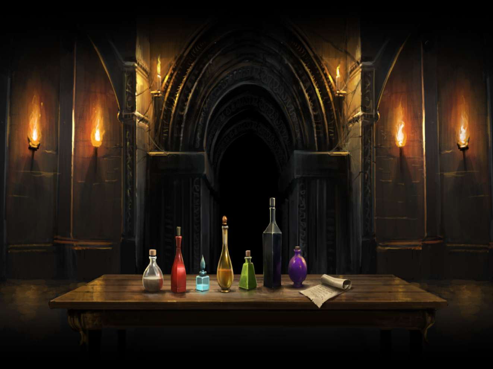
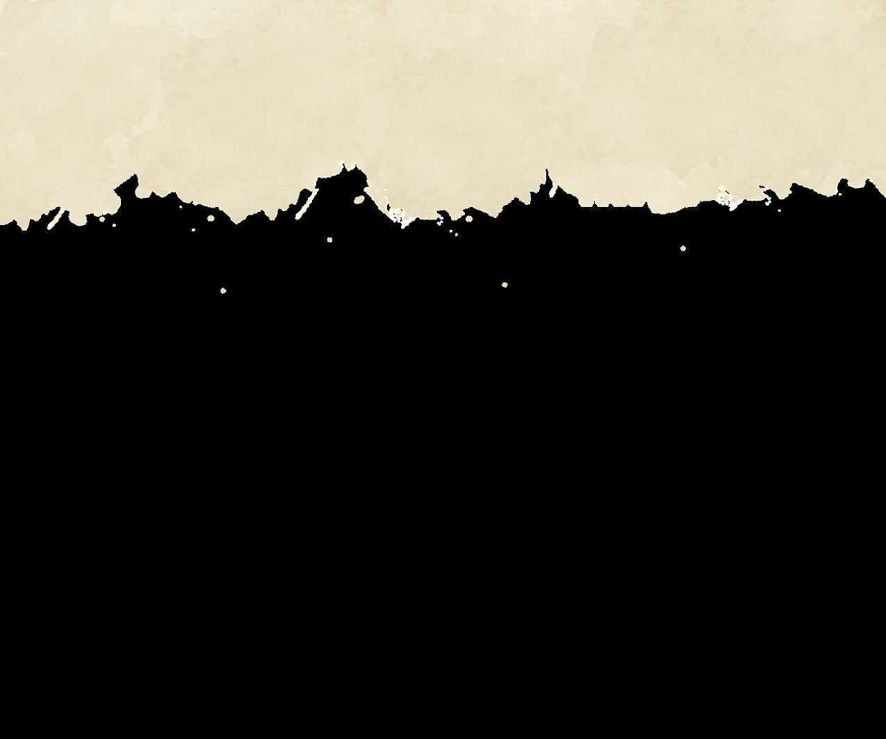
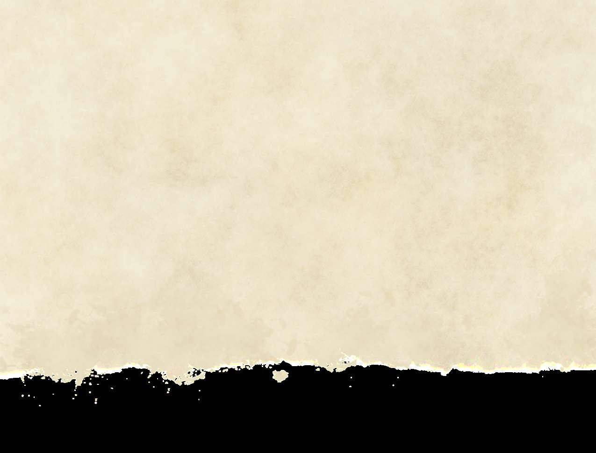
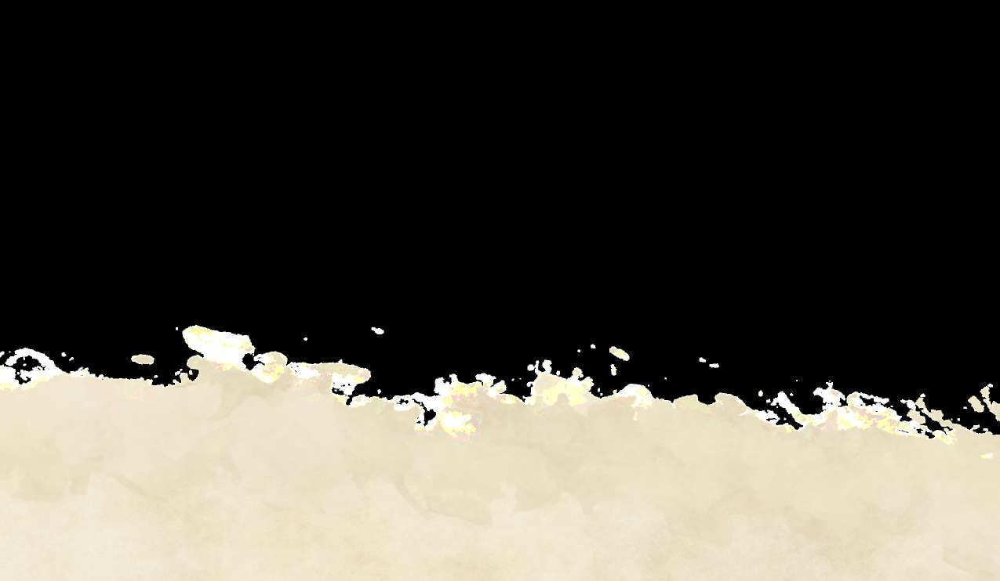

Moonseed Poison	Exstimulo Potion	Invigoration Draught
### Potion List Potion List
Oculus Potion	Fatiguing Fusion	Invisibility Potion
Pepperup Potion	Fire Protection Potion	Kissing Concoction
Common Potions
Pet Tonic	Gillyweed	Mandrake Restorative
Antidote of Common
Regerminating Potion	Girding Potion	Draught
Poisons
Shrinking Solution	Gregory's Unctuous Unction	Skele-Gro
Babbling Beverage
Star Grass Salve	Memory Potion	Weedosoros
Baneberry Poison
Swelling Solution	Murtlap Essence	Wit-Sharpening Potion
Blemish Blitzer
Wound-Cleaning Potion	Noxious Potion
Confusing Concoction
Very Rare Potions
Sleeping Draught
Cupid Crystals
Uncommon Potions
Amortentia
Strengthening Solution
Doxycide
Aging Potion	Death-Cap Draught	Twilight Moonbeams
Dr. Ubbly's Oblivious
Antidote of Uncommon	Draught of Living Death	Vitamix Potion
Unction
Poisons	Essence of Dittany	Volubilis Potion
Dreamless Sleep Potion
Baruffio's Brain Elixir	Polyjuice Potion	Wideye Potion
Elixir to Induce Euphoria
Beautification Potion	Wolfsbane Potion
Wiggenweld Potion
Forgetfulness Potion
Befuddlement Draught
Fungiface Potion	Legendary Potions
Rare Potions
Beguiling Bubbles
Garrotting Gas
Drink of Despair Blood-Replenishing Potion	Erumpent Potion
Heartbreak Teardrops
Felix Felicis
Bloodroot Poison	Essence of Insanity
Herbicide Potion
Veritaserum
Draught of Peace	Hate Potion
Hiccoughing Solution
Art by Atomhawk / © Pottermore Limited Art by Atomhawk / © Pottermore Limited Art by Atomhawk / © Pottermore Limited Art by Atomhawk / © Pottermore Limited Art by Atomhawk / © Pottermore Limited Art by Atomhawk / © Pottermore Limited
Art by Atomhawk / © Pottermore Limited Art by Atomhawk / © Pottermore Limited Art by Atomhawk / © Pottermore Limited

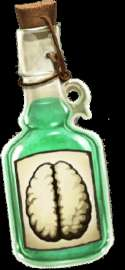
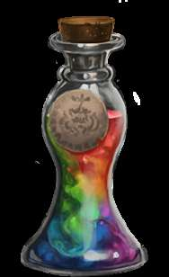
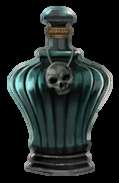

Until this poison ends, the creature cant be healed by any Aging Potion Aging Potion
means. After seven successful saving throws, the effect ends
Potion, uncommon
and the creature can heal normally.
When you drink this potion, your age is increased by 4d10
Baruffio's Brain Elixir Baruffio's Brain Elixir
years for 1 hour. This effect authentically changes your age,
Potion, uncommon but doesn't reduce your lifespan or introduce maladies due to
aging. One quarter, one half, or three quarters of this potion
When you drink this potion, you have advantage
may be drunk, modifying the effect to 1d10, 2d10, or 3d10.
on Intelligence checks for 1 hour. Your thoughts
become louder and faster, making it easy to
Amortentia Amortentia
© Niantic, Inc. © Niantic, Inc. © Niantic, Inc. © Niantic, Inc. © Niantic, Inc. © Niantic, Inc. © Niantic, Inc. © Niantic, Inc. © Niantic, Inc.
focus.
Love potion, very rare
Antidote to: Befuddlement Draught,
confundo, Confusing Concoction, infirma
When a being drinks this potion, they are overwhelmingly
cerebra
charmed by the brewer of this potion for 1 week. The
charmed subject believes the brewer to be their one true love
Beautification Potion Beautification Potion
and will perform any request the brewer asks, to the best of
their ability. All thoughts will be colored by a powerful	Potion, uncommon
obsession with the brewer, but their personality will
When you drink this potion, your appearance
otherwise be unchanged. This charmed effect can only be
is transformed to be more attractive for 10
removed by an antidote to this potion.
minutes. For the duration, when you make a
Charisma (Deception), Charisma Antidote of Common Poisons Antidote of Common Poisons
(Performance) or Charisma (Persuasion)
Potion, common
check, you roll a d4 and add the number
rolled to the check.
When you drink this potion, simple poisons in your system
are neutralized and you gain advantage on saving throws
Befuddlement Draught Befuddlement Draught
against poison for 1 hour. If you took poison damage in the	© Pottermore Limited	© Pottermore Limited	© Pottermore Limited
© Pottermore Limited © Pottermore Limited © Pottermore Limited © Pottermore Limited © Pottermore Limited © Pottermore Limited
Potion, uncommon previous minute, you regain half of your hit points lost to
poison damage, up to a maximum of 15 hit points.
When you drink this potion, you become belligerent and
Antidote to: Baneberry Poison, Doxycide, Garrotting Gas,
reckless for 1 hour. For the duration, you have disadvantage
Moonseed Poison
© Pottermore Limited © Pottermore Limited © Pottermore Limited © Pottermore Limited © Pottermore Limited © Pottermore Limited © Pottermore Limited © Pottermore Limited © Pottermore Limited	on Intelligence checks and Wisdom checks, and you have
advantage on saving throws against being frightened from
Antidote of Uncommon Poisons Antidote of Uncommon Poisons
any source other than a Dementor.
Potion, uncommon
Beguiling Bubbles Beguiling Bubbles
When you drink this potion, this more
potent antidote counteracts poisons and 
	Love potion, uncommon
you gain advantage on saving throws against
When a being drinks this potion, they become charmed by a
poison for 1 hour. If you took poison damage
chosen being for 1 hour. The chosen being is selected by the
in the previous minute, you regain all of your
brewer speaking their name into the potion during brewing. If
hit points lost to poison damage, up to a
the chosen being is someone the charmed subject would
maximum of 30 hit points.
normally be attracted to, they regard that being as their true
Antidote to: Baneberry Poison, Bloodroot Poison,
love while they are charmed.
Doxycide, Garrotting Gas, Moonseed Poison, Noxious Potion
Blemish Blitzer Blemish Blitzer
Babbling Beverage Babbling Beverage
Potion, common
Potion, common
This specially formulated potion will magically remove any
When you drink this potion, every word you try to say comes
acne or blemishes from your face when applied.
out as gibberish or complete nonsense for the next 1 minute.
Antidote to: Fungiface Potion, furnunculus
Baneberry Poison Baneberry Poison
Blood-Replenishing Potion Blood-Replenishing Potion
Poison, common
Potion, uncommon
While this poison doesn't actually cause any harm in the
Typically administered in an emergency, this healing potion
body, its toxins interfere with blood clotting and produce an
helps replenish blood lost from injuries. If the next rest you
overall sickly feeling. A creature that ingests this poison must
take is a short rest, the amount of hit points gained from
succeed on a DC 13 Constitution saving throw or become
rolling hit dice is doubled during that short rest. If the next
poisoned. The poisoned creature must repeat the saving
rest you take is a long rest, you regain all spent hit dice.
throw every 24 hours.
Antidote to: Baneberry Poison, Bloodroot Poison

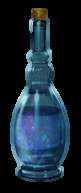
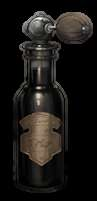

If you are targeted by legilimens, you can make a Wisdom Bloodroot Poison Bloodroot Poison
saving throw to resist its initial effects, and if you are targeted
Poison, uncommon
by imperio, you have advantage on the first Charisma saving
throw.
The Bloodroot Poison gets into the bloodstream and causes a
very gradual internal necrosis. A creature that ingests this
Draught of Living Death Draught of Living Death
poison must succeed on a DC 16 Constitution saving throw
or take 7 (2d6) poison damage and become poisoned. The	Poison, very rare
poisoned creature must repeat the saving throw every 24
The drinker of this infamous and challenging poison falls into
hours, taking 7 (2d6) poison damage on a failed save.
a deep sleep and can't be awoken by any means, aside from
Until this poison ends, the damage the poison deals can’t
administering an antidote. The creature will breathe
be healed by any means. After seven successful saving
normally, but cannot be suffocated in this state. It also doesn't
throws, the effect ends and the creature can heal normally.
need to eat or drink. The creature will age normally, and it
can die of old age while under the effects of this poison.
Confusing Concoction Confusing Concoction
© Pottermore  © Pottermore © Pottermore © Pottermore © Pottermore © Pottermore © Pottermore © Pottermore © Pottermore
Potion, common	Limited	Limited	Limited	Draught of Peace	Draught of Peace	Limited	Limited	Limited
Limited Limited Limited
Potion, uncommon
When you drink this potion, you become utterly
discombobulated for 6 seconds. You can’t take actions or
When you drink this potion, all strong emotions are
reactions and you roll a d10. If you roll 1-8, you must use all of
suppressed for 1 hour, putting you into a neutral and
your movement to move in a random direction. To determine
relaxed disposition. Any charmed or frightened
the direction, assign a direction to each number 1-8. If you
condition is removed and you have advantage on
roll a 9-10, you don't move.
saving throws against being charmed or frightened.
Unfortunately, the feeling of this potion wearing off
Cupid Crystals Cupid Crystals
has been described as experiencing all of the
Love potion, common
suppressed emotions at once, and some suppressed
conditions may resume.
When a being drinks this potion, they will become infatuated
Additionally, if you are hostile, you will become
with the next being they see within 10 minutes. They become
indifferent to the targets of your hostility. This indifference
charmed by that being for 1 hour.
ends if you are attacked or harmed by a spell or if you
witnesses any of your friends being harmed.
Death-Cap Draught Death-Cap Draught
Antidote to: Beguiling Bubbles, Cupid Crystals, Elixir to
Poison, very rare
Induce Euphoria, exhilaro, Gregory's Unctuous Unction,
Heartbreak Teardrops, Twilight Moonbeams
Death cap mushrooms are the key ingredient to one of the
most deadly poisons. A creature that ingests this poison must
Dreamless Sleep Potion Dreamless Sleep Potion
make a DC 19 Constitution saving throw, taking 84 (24d6)
Potion, common poison damage and becoming poisoned for 1 day on a failed
save, or half as much damage and poisoned for 1 minute on a
When you drink this potion, you immediately fall asleep and
successful one.
gain the benefits of a long rest after 4 hours of uninterrupted
sleep. However, your sleep is far deeper than usual, and
Doxycide Doxycide	© Pottermore	© Pottermore	© Pottermore	© Pottermore	© Pottermore	© Pottermore
© Pottermore © Pottermore © Pottermore
someone using their action to shake you or taking damage is
Limited Limited Limited Poison, common	Limited	Limited	Limited	Limited	Limited	Limited
the only way for you to wake before 4 hours have passed.
Delivered as a mist via a spray bottle, this	Drink of Despair	Drink of Despair
mild poison is a household staple to deal
Poison, legendary
with pests. A creature that inhales this
poison must succeed on a DC 13	When a creature drinks this fabled poison, it hallucinates all
Constitution saving throw, taking 2 (1d4)	of its worst fears and memories, vividly reexperiencing its
poison damage on a failed save, or half as
deepest regrets and darkest traumas. It is incapacitated for
much damage on a successful one.
30 seconds, it is reduced to 1 hit point and its gains 4 levels
If the victim of this poison is a tiny Beast,	of exhaustion.
it is paralyzed for 1 hour on a failed save.
Elixir to Induce Euphoria Elixir to Induce Euphoria
Dr. Ubbly's Oblivious Unction Dr. Ubbly's Oblivious Unction
Potion, common
Potion, common
When you drink this potion, your emotions are overpowered
When you drink this potion, your brain's perception is	by a sudden inexplicable happiness, with the side effects of
softened for 1 hour to protect it from harmful thoughts. For	spontaneous singing and nose-tweaking. You gain resistance
the duration, you have disadvantage on Wisdom checks.	to psychic damage for 1 hour. For the duration, you have
disadvantage on Dexterity (Stealth), Charisma (Intimidation),
and Charisma (Deception) checks.

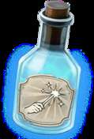
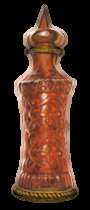
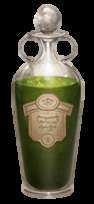

This potion has been stated to greatly resemble molten gold. Erumpent Potion Erumpent Potion
It is meant to be used sparingly, however, as it causes
Potion, rare
giddiness, recklessness, and dangerous overconfidence if
taken in excess. Felix Felicis is highly toxic in large quantities.
As an action, you can throw a bottle of Erumpent Potion at a
point up to 60 feet away, releasing a violent explosion and
© Pottermore  © Pottermore © Pottermore © Pottermore © Pottermore © Pottermore © Pottermore © Pottermore © Pottermore
Fire Protection Potion Fire Protection Potion
shockwave. Each creature within 10 feet of that point must
Limited Limited Limited Limited Limited Limited Limited Limited Limited
make a DC 14 Dexterity saving throw, taking 10d6	Potion, uncommon
bludgeoning damage on a failed save, or half as much
When you drink this potion, you gain
damage on a successful one. Each creature within 30 feet of
resistance to fire damage for 1 hour.
that point takes 4d8 thunder damage. This potion is highly
Forgetfulness Potion Forgetfulness Potion volatile and will explode if it is poured out of its container.
Potion, common
Essence of Dittany Essence of Dittany
When you drink this potion, you forget
Potion, very rare
everything you perceived in the last minute
This highly concentrated liquid rapidly heals and regenerates	and you won't be able to remember anything
open wounds, helping you regain 10d4 + 20 hit points when	you perceive in the next 10 minutes.
applied. If the target has lost body members (fingers, legs,
Fungiface Potion Fungiface Potion
and so on) and the severed part is held to its place, applying
this potion causes the limb to heal back on immediately.
Potion, common
Essence of Insanity Essence of Insanity	When you drink this potion, you gain the effects of the
furnunculus spell, sprouting dense and itchy mushrooms on
Poison, rare
your face instead of pimples. This effect lasts 1 hour.
Instead of attacking the body, this oil attacks the mind. A
Garrotting Gas Garrotting Gas creature that makes contact with this poison is overwhelmed
with paranoia and becomes poisoned for 1 hour. It is
Poison, common
frightened of the nearest creature for the duration. On its
This gas produces a choking or suffocating sensation, which, next turn, the victim must take the dash action and move
given the fact it's colorless, can be quite dangerous. A away from that creature by the safest and shortest available
route, unless there is nowhere to move.	creature that inhales this poison must succeed on a DC 13
Constitution saving throw or be poisoned for 1 hour. If the
Exstimulo Potion Exstimulo Potion	saving throw fails by 5 or more, the creature is unconscious
while poisoned in this way. The creature wakes up if it takes
Potion, uncommon
damage or a creature shakes it awake as an action.
When you drink this potion, the next spell	As an action, you can throw a bottle of Garrotting Gas at a
you cast within the next 8 hours will be as	point up to 60 feet away, releasing the gas and exposing
if it were cast using a spell slot one level	creatures within 5 feet of that point.
higher than its original level.
Gillyweed Gillyweed
Fatiguing Fusion Fatiguing Fusion
Potion, uncommon
Poison, uncommon
© Niantic, Inc. © Niantic, Inc. © Niantic, Inc. © Niantic, Inc. © Niantic, Inc. © Niantic, Inc. © Niantic, Inc. © Niantic, Inc. © Niantic, Inc.
When you eat this plant, your body adapts to an aquatic
environment, sprouting gills and growing webbing between A creature that ingests or inhales this
your fingers for 1 hour. You can breathe underwater and gain tiresome poison must succeed on a DC 13 Constitution
a swimming speed equal to your walking speed. However, you saving throw or gain 3 levels of exhaustion. This poison
lose the ability to breathe air, following the rules for cannot cause you to reach more than 5 levels of exhaustion.
suffocating if you emerge from water.
Felix Felicis Felix Felicis
Girding Potion Girding Potion
Potion, legendary
Potion, uncommon
Also known as "liquid luck," this potion makes you
When you drink this potion, you gain 6d4 + 6 exceptionally lucky for 1d4 hours, to the point of succeeding
temporary hit points for 1 hour. This feels like at everything you attempt. For the duration, your Charisma
an abnormal amount of physical stamina and score is raised to 21, you can’t be surprised and have
pain tolerance. advantage on attack rolls, ability checks, and saving throws.
Additionally, other creatures have disadvantage on attack
rolls against you for the duration.
© Pottermore Limited © Pottermore Limited © Pottermore Limited © Pottermore Limited © Pottermore Limited © Pottermore Limited © Pottermore Limited © Pottermore Limited © Pottermore Limited

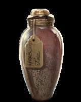
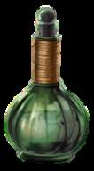
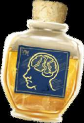

Gregory's Unctuous Unction Gregory's Unctuous Unction	Invigoration Draught	Invigoration Draught
Love potion, uncommon	Potion, rare
When you drink this potion, you are charmed by the giver of	You regain 8d4 + 8 hit points when you drink this
the potion for 1 hour. The charmed subject believes the giver	shimmering orange potion.
is their very best friend.
© Pottermore  © Pottermore © Pottermore © Pottermore © Pottermore © Pottermore	Invisibility Potion	Invisibility Potion © Pottermore © Pottermore © Pottermore
Limited Limited Limited Hate Potion Hate Potion	Limited	Limited	Limited	Limited	Limited	Limited
Potion, rare
Love potion, rare
When you drink this silvery potion, you gain the effects of
pellucidi pellis for 10 minutes (no concentration required). When a being drinks this potion, they
The potion's effect ends if you attack or cast a spell. This view a chosen being as their most
potion can also be poured over an object for a similar effect. hated enemy for 10 minutes. If the
brewer does not select a chosen being
Kissing Concoction Kissing Concoction
by speaking their name into the potion
during brewing, the drinker will be	Love potion, rare
hostile towards the next being they see
When a being drinks this potion, they become charmed by a within the potion's duration. If this
chosen being and powerfully compelled to kiss them for 1 potion is used as an antidote, it has no
hour. The chosen being is selected by the brewer speaking effect beyond acting as an antidote for
their name into the potion during brewing. If the charmed the same duration.
subject sees the chosen being, they must use as much of their
Antidote to: Amortentia, Beguiling Bubbles, Cupid
movement as possible to move to the chosen being and kiss Crystals, Gregory's Unctuous Unction, Heartbreak
them, ending the potion's effect. Teardrops, Kissing Concoction, Twilight Moonbeams
If the brewer uses a bonus action to tell the charmed
subject where the chosen being might be, the charmed Heartbreak Teardrops Heartbreak Teardrops
subject must use as much of their movement as possible to
Love potion, common
move in that direction on their next turn. They can take their
action before they move. They won't be compelled to move When a being drinks this potion, they are overcome with the
into an obviously deadly hazard, but they will provoke fear of being rejected by the object of their desire for 1 hour.
opportunity attacks. If no relationship or attraction exists, a new one will be
magically created. The being is susceptible to the next
Mandrake Restorative Draught Mandrake Restorative Draught
suggested course of action to try to avoid rejection. The
suggestion does not need to logically prevent rejection, but it	Potion, rare
must be reasonable and not be obviously harmful. It pursues
When this healing potion is administered, it ends one of the the course of action you described to the best of its ability,
following effects on the target: until the course of action is complete or until the potion's
effect wears off.
One effect that charmed, paralyzed or petrified the target.
One Transfiguration spell that's changed the target's form.
Herbicide Potion Herbicide Potion
Memory Potion Memory Potion Poison, common
Potion, uncommon
When this poison is poured directly on a magical
plant, the plant immediately withers and dies.
When you drink this potion, lost memories
There is only enough poison to affect a plant
are restored to you and you're able to recall
that fits within a 5 foot cube. If the magical
more details than usual. You have
plant is larger than a 5 foot cube, the affected
advantage on Intelligence (Herbology),
area will wither, but the plant will not die
Intelligence (Magical Theory) and
until the entire plant is withered.
Intelligence (Muggle Studies) checks for
10 minutes.
© Pottermore Limited © Pottermore Limited © Pottermore Limited © Pottermore Limited © Pottermore Limited © Pottermore Limited © Pottermore Limited © Pottermore Limited © Pottermore Limited
Antidote to: Forgetfulness Potion,
obliviate
Hiccoughing Solution Hiccoughing Solution
© Niantic, Inc. © Niantic, Inc. © Niantic, Inc. © Niantic, Inc. © Niantic, Inc. © Niantic, Inc. © Niantic, Inc. © Niantic, Inc. © Niantic, Inc.
Potion, common
When you drink this potion, you come down with a bad case
of the hiccups for 1 hour. For the duration, you have
disadvantage on Charisma checks. If you try to cast a spell
verbally, roll a d10. On a 1, the casting fails and the spell is
wasted.

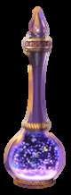
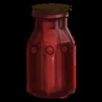

Moonseed Poison Moonseed Poison	Polyjuice Potion	Polyjuice Potion
Poison, common	Potion, very rare
The moonseed vine, its leaves and its berries give their	After adding the hair, nail clipping, or other part of a human,
toxicity to this basic poison. A creature that ingests this	drinking this potion perfectly transforms you into that human
poison must succeed on a DC 11 Constitution saving throw,	for 1 hour, changing your height, weight, facial features,
taking 21 (6d6) poison damage on a failed save, or half as	sound of your voice, hair length and coloration. None of your
much damage on a successful one.	statistics change, but your size may change to match the
targeted human.
Murtlap Essence Murtlap Essence
The potion works for part-humans, but not half-humans.
The consistency of the potion is always like a thick mud, but
Potion, uncommon
the color and flavor change based on the targeted human,
This solution of strained and pickled tentacles of Murtlaps	typically tasting very unpleasant.
soothes painful cuts and abrasions, helping you regain 4d4 +
Regerminating Potion Regerminating Potion 4 hit points when applied.
Potion, common
Noxious Potion Noxious Potion
When this potion is poured on the roots of a dying plant, it is Poison, uncommon
revitalized. It also accelerates the growth of healthy seedlings.
The liquid and fumes of this potion are equally dangerous,	Antidote to: Herbicide Potion
allowing for creatively nefarious uses. A creature that ingests
or inhales this poison must succeed on a DC 13 Constitution	Shrinking Solution	Shrinking Solution
saving throw or take 21 (6d6) poison damage, and must
Potion, common
repeat the saving throw at the start of each of its turns. On
each successive failed save, the character takes 7 (2d6)	When you drink this potion, you gain the effects of the
poison damage. After three successful saves, the poison ends.	diminuendo spell for 1d4 hours (no concentration required).
As an action, you can throw a bottle of Noxious Potion at a	This potion can also be poured over an object for the effects
point up to 60 feet away, releasing the gas and exposing	of reducio.
creatures within 5 feet of that point.	Antidote to: engorgio, Swelling Solution
Oculus Potion Oculus Potion	Skele-Gro	Skele-Gro
Potion, common	Potion, rare
Drinking this deep orange potion removes the blind	Used to rapidly regrow and repair bones, this healing potion
condition, restoring your eyesight to its normal state.	is a staple in a mediwizard's potion case. If the next rest you
Antidote to: conjunctivia	take is a short rest, you regain hit points equal to half your hit
point maximum. If the next rest you take is a long rest, you
Pepperup Potion Pepperup Potion
regain all spent hit dice and gain temporary hit points equal
to twice your caster level.
Potion, common
Sleeping Draught Sleeping Draught When you drink this deep red potion, jets of steam shoot out
of your ears, you're cured of the common cold and you feel
Potion, uncommon
quite warm throughout your body, rendering you immune to
gaining exhaustion from cold environments for 1 hour. One	When you drink this potion, you fall
level of exhaustion is removed for the duration, but it is	unconscious into a deep sleep. You can't be
regained at the end of the potion's effects.	awoken by any means for 1 hour, aside from
administering an antidote. After that, the
Pet Tonic Pet Tonic
sleep is natural, so you would sleep only as
long as you normally would or until woken
Potion, common
by taking damage or someone shaking or
When this potion is given to a magical	    slapping you awake.
pet, all of its hit points are restored, any
diseases and conditions are removed	© Pottermore Limited	© Pottermore Limited	© Pottermore Limited	© Pottermore Limited	© Pottermore Limited	© Pottermore Limited
© Pottermore Limited © Pottermore Limited © Pottermore Limited
and it gains 1d4 temporary hit points
for 1 hour.	Star Grass Salve	Star Grass Salve
Potion, common
© Pottermore Limited © Pottermore Limited © Pottermore Limited © Pottermore Limited © Pottermore Limited © Pottermore Limited © Pottermore Limited © Pottermore Limited © Pottermore Limited
You regain 2d4 + 2 hit points when you apply this medicinal
balm to your injuries.

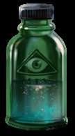
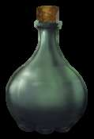
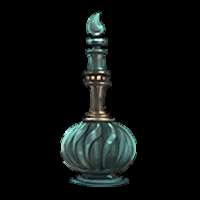

Weedosoros Weedosoros
Strengthening Solution Strengthening Solution
Poison, rare
Potion, uncommon
Named after the mysterious magical plant, weed of sorrows,
When you drink this potion, your Strength score is raised to
this poison is reputed to fill the victim with deep regret in
21 for 1 hour. The potion has no effect on you if your
their final moments. A creature that ingests this poison must
Strength is equal to or greater than that score.
make a DC 15 Constitution saving throw, taking 49 (14d6)
poison damage and being poisoned for 1 day on a failed save, Swelling Solution Swelling Solution
or half as much damage and poisoned for 1 minute on a
Potion, common
successful one.
When you drink this potion, you gain the
effects of the engorgio spell for 1d4 hours (no
Wideye Potion Wideye Potion concentration required). This potion can also
be poured over an object for a similar effect.
Potion, uncommon
Antidote to: diminuendo, reducio,
Shrinking Solution	Also known as the Awakening Potion,
drinking this potion removes up to two
© Pottermore Limited © Pottermore Limited © Pottermore Limited © Pottermore Limited © Pottermore Limited © Pottermore Limited © Pottermore Limited © Pottermore Limited © Pottermore Limited
Twilight Moonbeams Twilight Moonbeams
levels of exhaustion. Other uses are
Love potion, uncommon	awakening someone from non-magical
drugging or concussion, and side effects
When a being drinks this potion, they become charmed by a
include restlessness and insomnia.
chosen being for 1 hour. The chosen being is selected by the
brewer speaking their name into the potion during brewing.
Wiggenweld Potion Wiggenweld Potion
The charmed subject's mind is clouded with daydreams and
Potion, uncommon
has disadvantage on Wisdom (Perception) checks to notice
anything other than the chosen being.
This healing potion is the antidote for magically induced
sleep, immediately waking the victim.
Veritaserum Veritaserum
Antidote to: Draught of Living Death, Sleeping Draught,
Potion, legendary
stupefy
A creature subjected to this potion must succeed on a DC 21
Wit-Sharpening Potion Wit-Sharpening Potion
Charisma saving throw. On a failed save, the creature is
Potion, rare
compelled to tell the whole truth to any questions asked of it
within the next 10 minutes. You know whether the creature
When you drink this potion, your brain's neurological
succeeds or fails on its saving throw, based on the dull and
functioning is maximized, raising your Intelligence and
dazed look in its eyes.
Wisdom scores to 20 for 1 hour. The potion has no effect if
On a successful save, the creature is aware of the potion's
your ability scores are equal to or greater than that score.
effect for the next 10 minutes, and can avoid answering
Antidote to: Befuddlement Draught, Common and
questions to which it would normally respond with a lie. Such
Uncommon Love Potions, confundo, Confusing Concoction,
creatures can be evasive in their answers as long as they
infirma cerebra
remain within the boundaries of the truth.
Wolfsbane Potion Wolfsbane Potion
Vitamix Potion Vitamix Potion
Potion, very rare
Potion, uncommon
When a lycanthrope drinks this potion once a day for the
When you drink this potion, you have advantage
entire week before the full moon, their alignment does not
on Dexterity checks for 1 hour. Drinking it feels
change and they are not placed under HM control during
like 'a burst of energy', greatly sharpening one's
their transformation. If the drinker misses a single dose in
reflexes.
the preceding week, the potion has no effect.
Antidote to: digitus wibbly, locomotor wibbly
Wound-Cleaning Potion Wound-Cleaning Potion
© Pottermore Limited © Pottermore Limited © Pottermore Limited © Pottermore Limited © Pottermore Limited © Pottermore Limited © Pottermore Limited © Pottermore Limited © Pottermore Limited
Potion, common
Volubilis Potion Volubilis Potion
When you apply this potion to open wounds, it stings, smokes
Potion, uncommon
and perfectly sterilizes the area. A bottle contains ten doses,
and one dose stabilizes a creature that has 0 Hit Points, When you drink this potion, you have an advantage on
without needing to make a Wisdom (Medicine) check. Charisma (Deception) and Charisma (Performance) checks
when trying to pass yourself off as a different person for 10
minutes. It magically alters your voice to sound like someone
else's, or if your voice is lost, it will restore it.
Antidote to: silencio

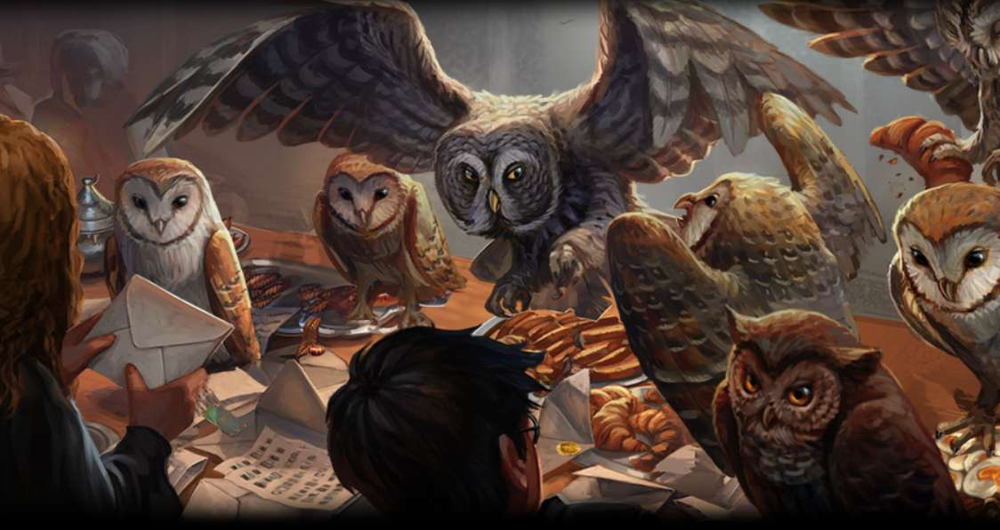
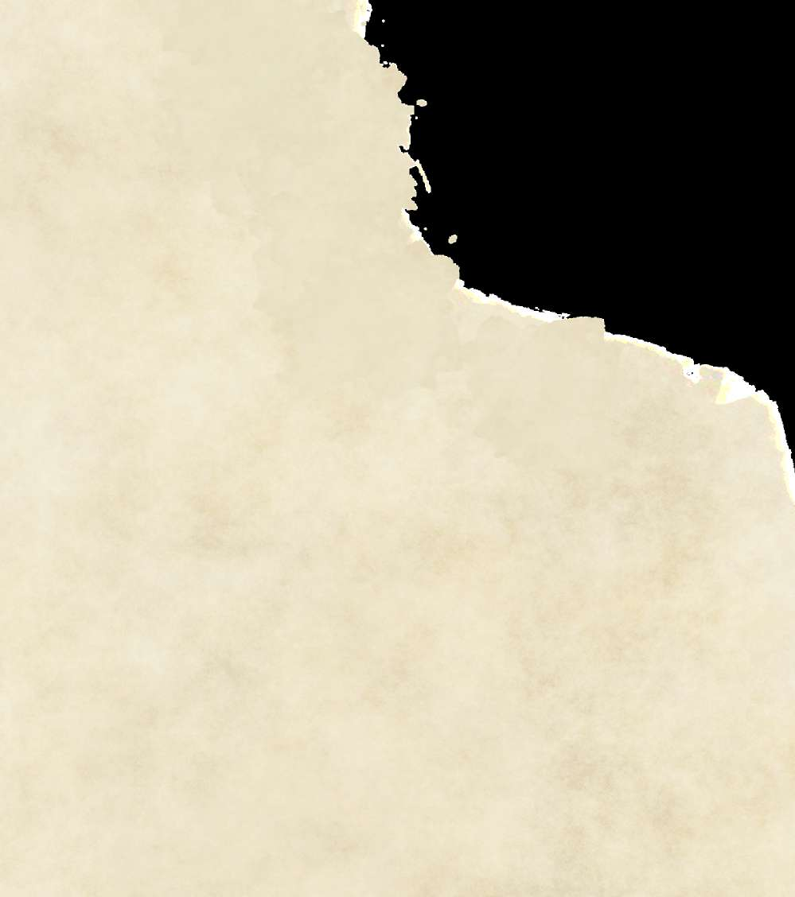
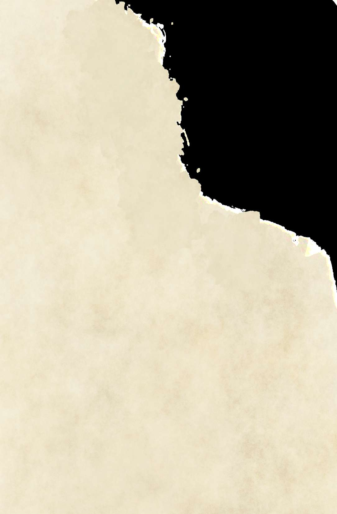
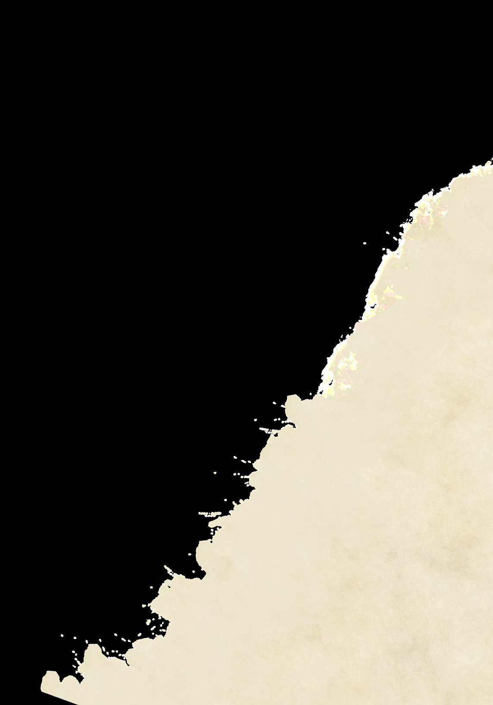

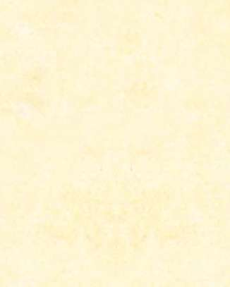

### Magical Pets Magical Pets
From owls and rats to toads and cats,
Hogwarts students have been helped and
hindered by various creature companions.
Animals of all shapes and sizes have long
been associated with magic. Muggles often
called them familiars, and thought them to
have supernatural abilities assisting with
the practice of magic. The animals owned
by Hogwarts students aren’t familiars in
this sense; they are largely pets, rather than
supernatural creatures.
When you select a magical pet, it forms a special
connection with you and understands one language you
speak. Your magical pet acts independently of you, but it
always obeys your verbal commands to the best of its ability.
In combat, it rolls its own initiative and acts on its own turn.
A magical pet can attack and take other actions as normal.
Hogwarts only allows one magical pet per student.
### Owls Owls
The old British superstition that it is unlucky to see owls
flying by daylight is readily explained, for when wizards break
### Pet Owl Pet Owl
cover to send messages by day, something dramatic must be
afoot in the magical world. As a (mostly) nocturnal bird of
Tiny beast, unaligned
prey, the owl is inevitably seen as sinister by Muggles, but
they are faithful servants and the most common method used
Armor Class 11 by wizardkind across the world for magical communication.
Hit Points 1 (1d4-1)
The advantages of owls as messengers are those very
Speed 5 ft., fly 60 ft.
qualities that make them suspicious to Muggles: they operate
in the darkness; they have exceptionally well-developed night
vision; and are agile and stealthy. Whether because they
STR	DEX	CON	INT	WIS	CHA
possess an innate magic or their ancestors have been trained
3 (-4)	13 (+1)	8 (-1)	4 (-3)	12 (+1)	7 (-2) for it, owls learn very quickly and thrive on tracing the witch
or wizard for whom their letters are intended.
Trained owls are expensive, and it is quite usual for a	Skills Perception +3, Stealth +3
wizarding family to share a single owl, or else only use Postal	Senses Darkvision 120 Ft., passive Perception 13
owls. However, when a witch or wizard has their own
personal owl, they can enjoy the convenience of sending	Flyby. The owl doesn't provoke opportunity attacks
anyone a letter or package for free.	when it flies out of an enemy's reach.
Keen Hearing and Sight. The owl has advantage on
Wisdom (Perception) checks that rely on hearing or d8	Owl Breeds
sight.

| 1 | Tawny Owl |
|---|---|

Magical Post. When given a note, letter, or package,
2	Screech Owl
the owl will magically know the location of the
recipient and fly to deliver the letter.

| 3 | Snowy Owl |
|---|---|

4	Barn Owl

| 5 | Great Grey Owl |
|---|---|

6	Scops Owl

| 7 | Eagle Owl |
|---|---|

8	Barred Owl

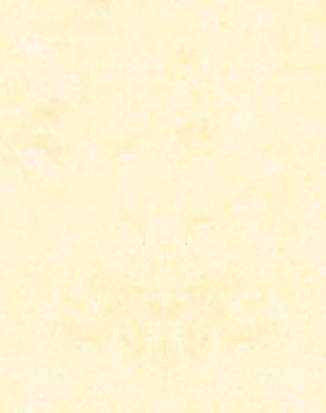

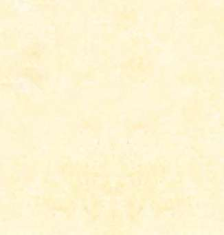

### Cats Cats	Toads	Toads
Cats are the creatures most commonly associated with	Of the approved animals permitted to students as pets at
magic. We’ve all seen images of a witch sat on her broomstick	Hogwarts, the toad is by far the least popular. As a species,
accompanied by her black cat. It’s an association that goes	toads have as long an association with witchcraft as owls and
back centuries. In the Salem Witch Trials of 1692, Tituba,	cats do, but they have gradually appeared less and less
one of the first to be accused of witchcraft, was said to have	frequently as pets at Hogwarts.
both a black and a red cat. Malleus Maleficarum, the best-	History tells us that toads were particularly useful as
known treatise against witchcraft, mentions cats and their	ingredients in the folk cures practiced in the Dark Ages, and
untrustworthy nature. As clever and independent creatures,	as magical pets, they seem to have a particular link with what
maybe it’s not surprising that cats have been linked with	were known in 16th century Europe as ‘cunning folk’. These
witches and maligned by ignorant Muggles.	were so-called white witches and healers who practised folk
Cats are believed to be the most intelligent companions for	medicine using natural ingredients. Ursula Kemp, an English
witches and wizards, and, depending on the breed (and	cunning woman and midwife (tried for witchcraft in 1582),
amount of Kneazle heritage), can often be trained to perform	was said to have had a black toad called Pygine.
complex tasks, as long as the owner has earned their loyalty.	While toads are looked down upon, their usefulness is
found in their role as magical guinea pigs. Whether
practicing harmless charms or tweaking the effects of minor
### potions, toads will unprotestingly play the subject of an Pet Cat Pet Cat
experiment, easily absorbing liquids through their skin. As
long as the magical effect doesn’t cause pain, the toad won’t Tiny beast, unaligned
think any less of its owner.
Armor Class 12
Hit Points 2 (1d4)
### Pet Toad Pet Toad Speed 40 ft., climb 30 ft.
Tiny beast, unaligned
STR	DEX	CON	INT	WIS	CHA
Armor Class 11 3 (-4) 15 (+2)	10 (+0) 6 (-2)	12 (+1)	7 (-2)
Hit Points 2 (1d4)
Speed 20 ft., swim 20 ft.
Skills Perception +3, Stealth +4
Senses passive Perception 13
STR	DEX	CON	INT	WIS	CHA
Hunting Instincts. The cat can follow or patrol for a
1 (-5)	13 (+1)	10 (+0)	2 (-4)	8 (-1)	3 (-4) specific target. When doing so, it has advantage on
Dexterity (Stealth) checks.
Skills Perception +1, Stealth +3
Keen Smell. The cat has advantage on Wisdom
Senses Darkvision 30 ft., passive Perception 11
(Perception) checks that rely on smell.
.
### Actions Actions
Amphibious. The frog can breathe air and water
Claws. Melee Weapon Attack: +4 to hit, reach 5 ft.,	Standing Leap. The frog's long jump is up to 10 ft.
one target. Hit: (1d1) slashing damage.	and its high jump is up to 5 ft., with or without a
running start.
d10	Cat Breeds

| 1 | Black Cat |
|---|---|

d8	Toad Species
2	Calico Cat

| 1 | Common Toad |
|---|---|

| 3 | Ginger Cat |
|---|---|

2	Crested Toad
4	Manx Cat

| 3 | Dragon Toad |
|---|---|

| 5 | Nebelung Cat |
|---|---|

4	Giant Purple Toad
6	Ocicat

| 5 | Harlequin Toad |
|---|---|

| 7 | Tabby Cat |
|---|---|

6	Horned Toad
8	Tonkinese Cat

| 7 | Three-Toed Tree Toad |
|---|---|

| 9 | Tortoiseshell Cat |
|---|---|

8	Western Green Toad
10	White Cat

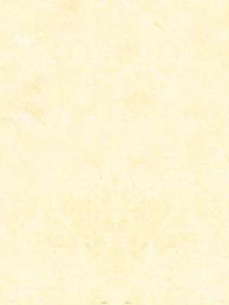

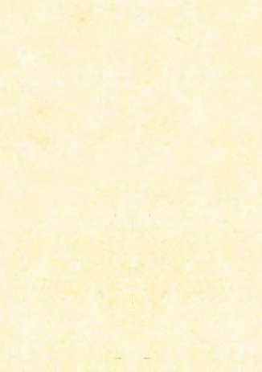
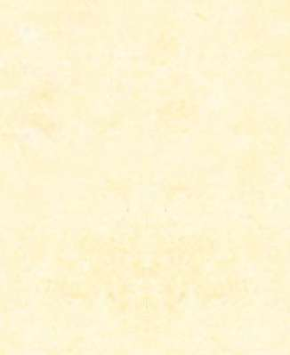

### Alternative Pets Alternative Pets
### Pet Goliath Tarantula Pet Goliath Tarantula
In modern times, Hogwarts is not nearly as strict on students’
pets as it has been. Students are allowed a variety of magical
Tiny beast, unaligned
pets, with permission obtained prior to the start of the school
year. Pets are required to fit within a standard owl cage and
Armor Class 12
have an XX rating or lower by the Department for the
Hit Points 3 (1d4+1)
Regulation and Control of Magical Creatures.
Speed 20 ft., climb 20 ft.
Pets found in the wizarding world are almost always
smarter than their mundane counterparts, thus earning the
title of magical pets. No matter what the species, a magical
STR	DEX	CON	INT	WIS	CHA
pet will form a bond with its owner and can often serve as an
3 (-4) 14 (+2)	12 (+1) 2 (-4)	10 (+0)	2 (-4)
extra set of eyes, alerting their owner when they spot
something amiss or locate a familiar person.
Skills Stealth +4
d10	Alternative Pets
Senses Darkvision 30 ft., passive Perception 12

| 1 | Fruit Bat |
|---|---|

Spider Climb. The goliath tarantula can climb difficult
2	Pipistrelle Bat
surfaces, including upside down on ceilings, without
needing to make an ability check.

| 3 | Goliath Tarantula |
|---|---|

Web Sense. While in contact with a web, the goliath 4	Miniature Firecrab
tarantula knows the exact location of any other

| 5 | Adder |
|---|---|

creature in contact with the same web.
6	Grass Snake
Web Walker. The goliath tarantula ignores movement
restrictions caused by webbing.
7	Puffskein
### Actions Actions
8	Pygmy Puff

| 9 | Black Rat |
|---|---|

Bite. Melee Weapon Attack: +4 to hit, reach 5 ft.,
one target. Hit: (1d1) piercing damage.
10	Dumbo Rat
### Pet Bat Pet Bat
### Pet Miniature Firecrab Pet Miniature Firecrab
Tiny beast, unaligned
Tiny beast, unaligned
Armor Class 13
Hit Points 1 (1d4-1)	Armor Class 14 (Natural Armor)
Hit Points 4 (1d4+2) Speed 10 ft., fly 60 ft.
Speed 15 ft., swim 15 ft.
STR	DEX	CON	INT	WIS	CHA
STR	DEX	CON	INT	WIS	CHA
1 (-5)	16 (+3)	9 (-1)	3 (-4)	12 (+1)	4 (-3)
4 (-3)	10 (+0)	14 (+2)	3 (-4)	8 (-1)	3 (-4)
Skills Stealth +5
Senses Blindsight 60 Ft., passive Perception 11	Senses passive Perception 9
Echolocation. The bat can't use its blindsight while	Blast-Ended. A very small burst of fire may come out
deafened.	of the firecrab's rear end, which ignites flammable
objects that aren’t being worn or carried.
Flyby. The bat doesn't provoke opportunity attacks
when it flies out of an enemy's reach.	Hold Breath. The firecrab can hold its breath for 1
hour.
Keen Hearing. The bat has advantage on Wisdom
### Actions Actions (Perception) checks that rely on hearing.
### Actions Actions
Claw. Melee Weapon Attack: +2 to hit, reach 5 ft.,
one target. Hit: (1d1) bludgeoning damage.
Bite. Melee Weapon Attack: +5 to hit, reach 5 ft.,
one target. Hit: (1d1) piercing damage.

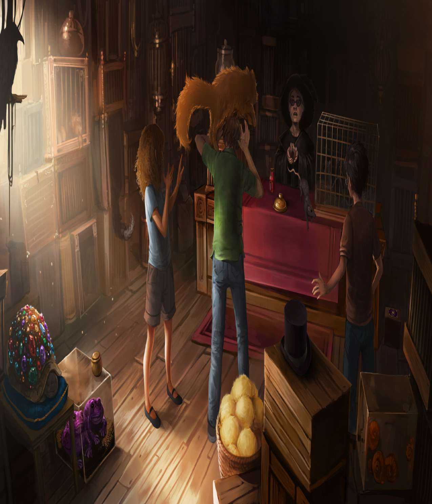
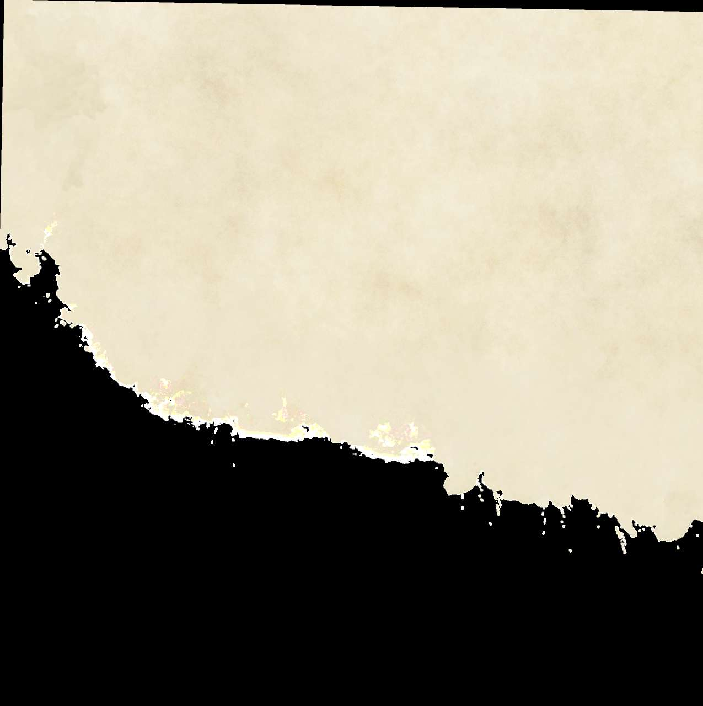
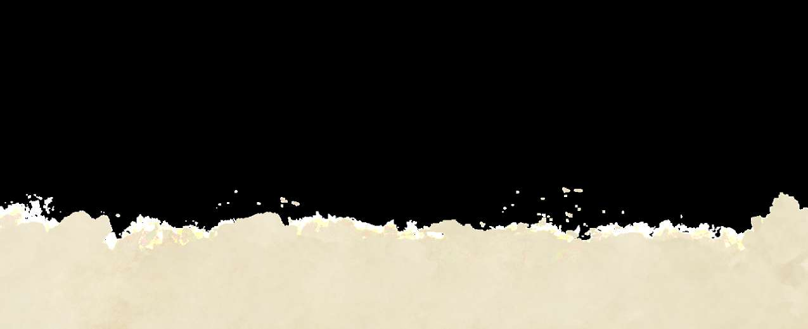
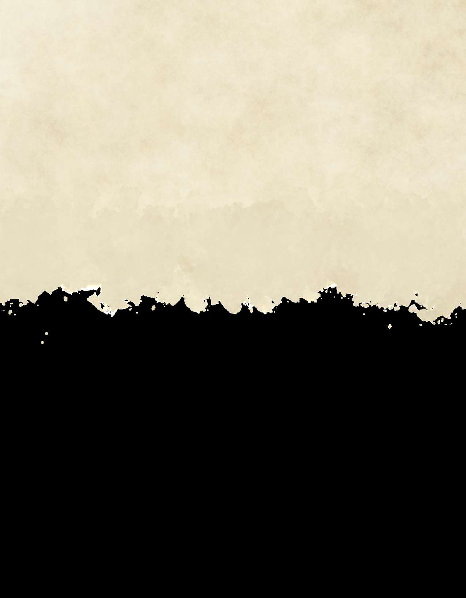

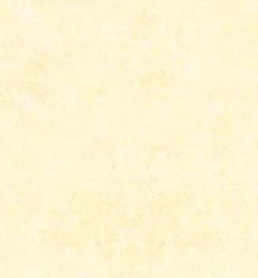

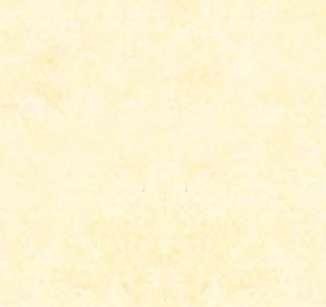
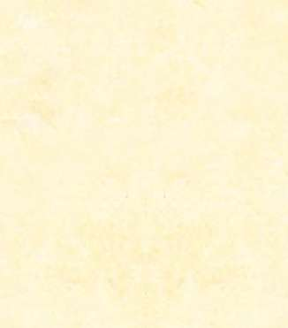
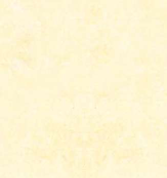

| Pet Adder Tiny beast, unaligned Armor Class 12 Hit Points 2 (1d4) Speed 20 ft., swim 20 ft. STR DEX CON INT WIS CHA 2 (-4) 14 (+2) 11 (+0) 5 (-3) 10 (+0) 3 (-4) Senses Blindsight 10 ft., passive Perception 10 Actions Bite. Melee Weapon Attack: +4 to hit, reach 5 ft., one target. Hit: (1d1) piercing damage plus (1d4) poison damage. The target must succeed on a DC 10 Constitution saving throw or take the poison damage. | Pet Puffskein Tiny beast, unaligned Armor Class 11 Hit Points 1 (1d4-1) Speed 20 ft. STR DEX CON INT WIS CHA 1 (-5) 12 (+1) 8 (-1) 5 (-3) 12 (+1) 14 (+2) Skills Stealth +3 Senses passive Perception 10 Fluffy. The puffskein appears to be a living ball of fluff; its cuteness might be distracting to some, much like carrying around an adorable kitten. Prehensile Tongue. The puffskein has a disproportionately long tongue that it can use to grab or manipulate small objects. |
|---|---|
| Pet Snake Tiny beast, unaligned Armor Class 13 Hit Points 2 (1d4) Speed 20 ft., swim 20 ft. STR DEX CON INT WIS CHA 2 (-4) 16 (+3) 11 (+0) 5 (-3) 10 (+0) 3 (-4) Senses Blindsight 10 ft., passive Perception 10 Actions Bite. Melee Weapon Attack: +5 to hit, reach 5 ft., one target. Hit: (1d1) piercing damage. AAArrrtt t b bbyyy A AAttotoommmhhhaaawwwkkk / // |  |
|  | Pet Rat Tiny beast, unaligned Armor Class 12 Hit Points 1 (1d4-1) Speed 30 ft. STR DEX CON INT WIS CHA 2 (-4) 15 (+2) 9 (-1) 5 (-3) 10 (+0) 4 (-3) Senses Darkvision 30 ft., passive Perception 10 Keen Smell. The rat has advantage on Wisdom (Perception) checks that rely on smell. Actions Bite. Melee Weapon Attack: +4 to hit, reach 5 ft., one target. Hit: (1d1) piercing damage. |
| AAArrrtt t b bbyyy A AAttotoommmhhhaaawwwkkk / // |  |
| AAAAAArrrrrrtttt tt bb bbbbyyyyyy AA AAAAttttoottoooommmmmmhhhhhhaaaaaawwwwwwkkkkkk // //// |  |
| ©©©©©©©©© PPP PPPPPPooooooooottttttttt ttteeettteeeeeerrrrrrrrrmmmmmmmmmooooooooorrrrrrrrreeeeeeeee LLL LLLLLLiiiiiimmmiiimmmmmmiiiiiitttiiittteeettteeeeeeddddddddd |  |

| ke |  | i |
|---|---|---|

### Chapter 6: Wizarding Feats Chapter 6: Wizarding Feats
### S
ome wizards will show a natural aptitude or
predilection for certain abilities. Others will
dedicate their free time to self-improvement. A
small percentage will have rare powers or traits
inherited from their ancestors. Regardless of the
Wizarding Heritage
reason, feats represent a witch or wizard's
Every wizard is human, but wizards are often
additional abilities, and all the standard 5e rules
distinguished by how much magical heritage is in
apply to obtaining feats.
their family tree. Very rarely, wizards will be part-
human, inheriting blood and traits from a magical
### Innate Feats Innate Feats
being in their ancestry. Slight prejudices remain
around part-human or Muggleborn wizards, but the
The following feats are defining traits that certain wizards
myths around blood purity have been dispelled.
have at birth. These feats must be taken at level 1, through
house traits at character creation, and cannot be gained at	A Witch's Childhood
any other time.
Think about how your character's heritage
### influenced their childhood experiences, and Giant's Blood Giant's Blood
consider how those experiences have shaped your
character's personality and worldview.
Even though they are few and far between, it's hard for half-
Muggle-borns. Muggle-borns are wizards and
giants and part-giants to hide their genealogy; they tend to
witches born to Muggle parents, non-magical folk.
turn heads wherever they go. With a broad build, impressive
Muggle-borns enter an entirely new world when
strength and a genetic resistance to magic, wizards with
they receive their letter from Hogwarts. Although
giant blood are powerful allies.
they’ll have to adapt to wizarding culture, the
lessons they’ve learned from the Muggle world will Increase your Strength score by 1, to a maximum of 20.
serve them well and help them see things from a Adult part-giants are between 7 and 9 feet tall and weigh
different perspective. Additionally, living in a world
between 300 and 420 pounds. Your size is Medium.
without magic means they know how to do things
You are considered one size larger when determining
the hard way.
carrying capacity and weight you can push, drag, or lift.
Half-bloods. The vast majority of human wizards
When a spell or other magical effect inflicts a condition on
are considered half-bloods, wizards that have some
you, you can use your reaction to resist one condition of
combination of magical and Muggle ancestry.
your choice. You can’t use this ability again until you finish
Originally used to describe a child of a magical
a long rest.
wizard and a non-magical Muggle, half-blood has
### become an encompassing term. While many half- Goblin Cunning Goblin Cunning
bloods are raised in the wizarding world, it’s not
uncommon for a half-blood to be unaware of their The rarest racial combination of all, part-goblins can have
magical side of their family, having a very similar goblin ancestry anywhere in their family tree, and it will still
experience to Muggle-borns. make a very noticeable difference. At an average of 4 feet tall,
Purebloods. Purebloods come from a long line of part-goblins may feel out of place in a larger world. However,
wizards and witches, without a drop of Muggle
these small wizards have inherited goblins’ cleverness and
blood in their veins. Raised in wizarding culture,
often come with big hearts and big personalities.
purebloods have grown up riding broomsticks,
playing Quidditch in the yard, and hearing the Adult part-goblins are between 3 and 5 feet tall and weigh
nursery rhymes of Beedle the Bard. Well acquainted around 110 pounds. Your size is Small.
with this world, they enter Hogwarts with a little You can move through the space of any creature that is of
extra confidence. a size larger than yours.
You have advantage on all Intelligence and Wisdom saving
throws against magic.
You can speak, read, and write Gobbledegook.

### Metamorph Magic Metamorph Magic	Standard Feats	Standard Feats
Once in a great many years, a metamorphmagus is born to a
These feats might come from latent natural talent, but are
wizarding family with their very particular talent: morphing
often manifested through hard work and long hours of study.
every aspect of their human appearance. Before becoming an
These feats are not restricted to being gained at level 1.
adult, a metamorphmagus will not have complete control
### over this ability, often letting their emotions or stress get the	Aerial Combatant	Aerial Combatant
better of them and losing control.
You're able to keep yourself oriented and lead your targets
At will, you can transform your appearance. As an action,
while flying a broomstick. You gain the following benefits.
you decide what you look like, including your height,
weight, facial features, sound of your voice, hair length,	You gain tool proficiency in Vehicles (Broomstick).
coloration, and distinguishing characteristics, if any. None	You no longer suffer disadvantage on attack rolls due to
of your statistics change, you don't appear as a creature of	flying.
a different size than you, and your basic shape stays the
### Detecting Traces Detecting Traces
same. If you're bipedal, you can't use this spell to become
quadrupedal, for instance. At any time, you can use your
You've learned to feel magic and recognize styles of spells
action to change your appearance in this way again.
and curses. Using concentration, you sense the presence of
You can also adapt your body to an aquatic environment,
magic within 30 feet of you. If you sense magic in this way,
growing webbing between your fingers. As an action, you
you can use your action to see a faint aura around any visible
gain a swimming speed equal to your walking speed.
creature or object in the area that bears magic, and you learn
### Parseltongue Parseltongue	the associated spell's school of magic, if any. This ability can
penetrate most barriers, but is blocked by 1 foot of stone, 1
Almost exclusively hereditary, to speak Parseltongue is to	inch of common metal, or 3 feet of wood or dirt.
magically comprehend and verbally communicate with all
### Lycanthropy Lycanthropy
snakes and snake-like beasts, like the Runespoor and
Basilisk. This oral language has been associated with Dark
You've been attacked by a transformed werewolf, infecting
wizards, owing to Salazar Slytherin's status as a Parselmouth
you with the blood curse of lycanthropy. You gain the
which was passed on to the Gaunt family and Tom Riddle.
following benefits.
However, outside of Wizarding Britain, no such association
exists.
Increase your Strength and Constitution scores by 1, to a
maximum of 20.
You can speak Parseltongue.
You have advantage on Wisdom (Perception) checks that
### Veela Charm Veela Charm	rely on smell.
You also gain the following penalties.
Just like part-giants, it’s very rare to find a part-veela. A wizard
or witch who inherited veela blood will almost always be the
From sunset to sunrise on the night of the full moon, you
center of attention, a picture of grace and beauty. Unlike half-
undergo your werewolf transformation. During the
veela or quarter-veela, part-veela are just as likely to be male
transformation, your alignment changes to Chaotic Evil
as female.
and your character is placed under HM control.
For the day of and three days after your werewolf
You gain proficiency in one Charisma skill of your choice.
transformation, you suffer a -3 penalty to your
As an action, you can attempt to charm a humanoid you
Constitution score, gain two levels of exhaustion that
can see within 30 ft, who would be attracted to you. It
cannot be removed and have disadvantage on Constitution must make a Wisdom saving throw, (if hostile, with
saving throws.
advantage). If it fails, it is charmed by you for one hour or
If your condition becomes known, fellow witches and
until you or your companions harm it. The charmed
wizards might fear or discriminate against you.
creature regards you as a friendly acquaintance and feels
compelled to impress you or receive your attention. After,
the creature knows it was charmed by you. You can’t use
this ability again until you finish a long rest.

### Martial Artist Martial Artist	Vampirism	Vampirism
Whether as a childhood extracurricular activity or a	You gain the following benefits:
supplement to your magical dueling, you're trained in striking
You can see in dim light within 120 feet of you as if it were
and grappling. You gain the following benefits.
bright light, and in darkness as if it were dim light. You
Your unarmed strike uses a d6 for damage.	can’t discern color in darkness, only shades of gray.
When you hit a creature with an unarmed strike on your	You are stuck at the age and form you were at the time of
turn, you can try to grapple the target as a bonus action.	your undeath. You can't die of old age, you suffer none of
You have advantage on attack rolls against creatures you	the drawbacks of old age, and you can't be aged magically.
are grappling.	You gain proficiency in Charisma (Persuasion).
While a creature is grappled by you, you can use your
You also gain the following penalties:
action and make another grapple check to try one of the
following maneuvers:
You take 1 damage when you start your turn in direct
Pin. If you succeed, you and the creature are both
sunlight.
restrained until the grapple ends.
You have disadvantage on attack rolls and on Wisdom
Takedown. If you succeed, you make an unarmed
(Perception) checks that rely on sight when you, the target
strike and the creature is knocked prone.
of your attack, or whatever you are trying to perceive is in
Disarm. If you succeed, the creature is forced to
direct sunlight.
drop one item of your choice that it's holding. You
You can't enter a residence without an invitation from one
can choose to take the item, ending the grapple.
of the occupants.
### You are repelled by the smell of garlic, and touching or Occlumency Training Occlumency Training
eating it causes intense pain.
Instead of food and water, you must drink animal, human You have developed the presence of mind to resist a mental
or magical being blood to sustain yourself.
invasion. When targeted by legilimens, you make a Wisdom
saving throw to resist its initial effects, and you have
### Wandless Magic Wandless Magic
advantage on the Intelligence contests. If you fail your initial
saving throw, you are immediately aware that the spell is
Through studying ancient tomes or channeling some of the
targeting you. If you succeed on a saving throw or contest,
volatile magic of your youth, you're able to perform small
you can let the spell continue and reveal false information,
magical feats without your wand. If you know any of the
false emotions, or false memories of your choosing.
following spells, you can cast them without needing a wand
Veritaserum will not work on you, unless you allow it.
or somatic component: accio, alohomora, colovaria,
illegibilus, incendio glacia, pereo, wingardium leviosa.
### Remarkable Aim Remarkable Aim
You cannot expend a higher level spell slot when casting in
this way.
You have unerring accuracy with projectile spells. Your
ranged spell attacks ignore half cover and treat three-
quarters cover as if it were half cover.
### Steady Caster Steady Caster
More Feats
You're able to maintain focus, even in stressful situations. You	The following 5e Feats are also available.
have advantage on Constitution saving throws that you make
Actor to maintain concentration on a spell when you take damage.
Athlete
Dungeon Delver
Durable
Keen Mind
Linguist
Observant
Skilled

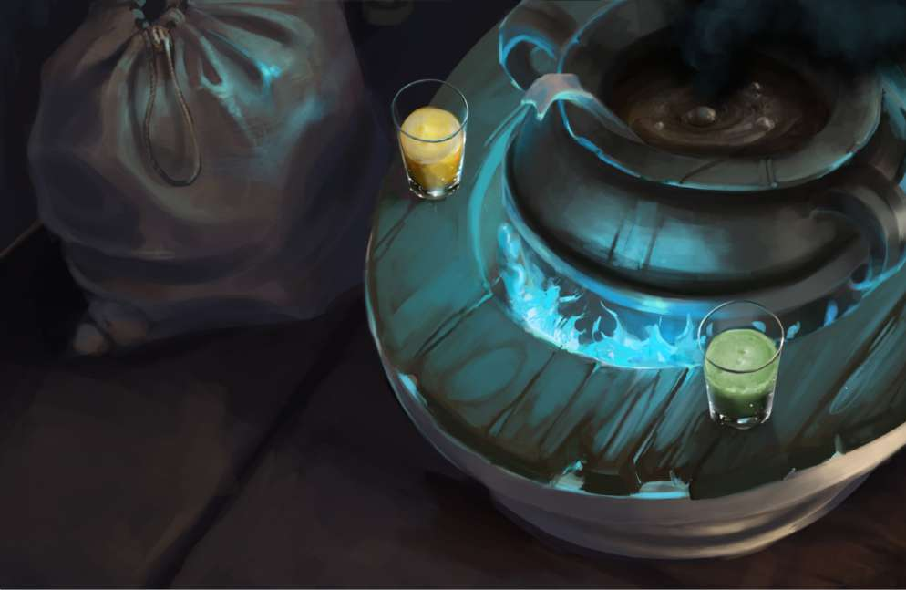
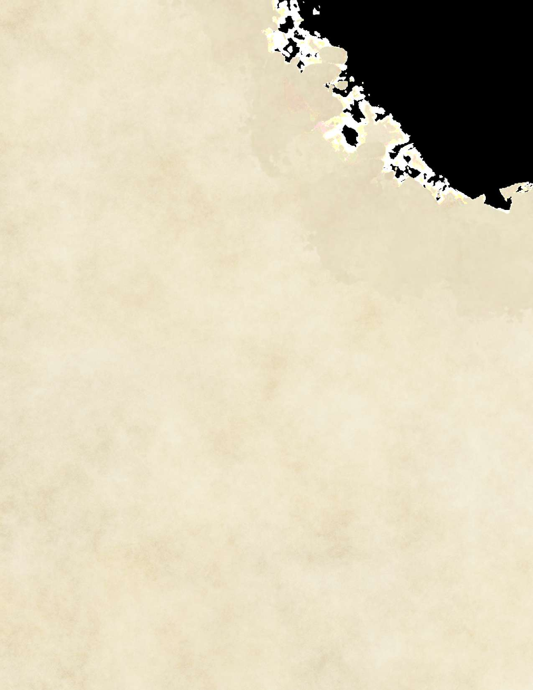

### Chapter 7: Chapter 7:
### Wizarding Skills Wizarding Skills
### D
ue to the nature of the Wizarding World of
Harry Potter, unique skills are needed in a
wizard's daily life. Some of the traditional 5e
skills are not intended for use with this
supplement and have been listed below as
deprecated. To replace them, new wizarding
skills have been added to cover the variety of
subjects taught at Hogwarts School of Witchcraft and
Wizardry. Even when there's a direct conversion from old to
new, applications are distinct from 5e descriptions.
### New Skills New Skills
### Intelligence (Herbology) Intelligence (Herbology)
Your Intelligence (Herbology) check measures your ability to
Skill Conversions
recall lore about mundane or magical plants.
Deprecated
	Equivalent New
### Intelligence (Magical Theory) Intelligence (Magical Theory)
5e Skill	Wizarding Skill

| INT (Arcan | a) INT (Magical Theory) |
|---|---|
| INT (History) INT (Muggle Studies) |  |
| INT (Natur | e) INT (Herbology) |
| INT (Religion) ─ |  |
| WIS (Animal Ha | ndling) WIS (Magical Creatures) |
| ─ WIS (Potion-Making) |  |

Your Intelligence (Magical Theory) check measures your
comprehension of the workings of magic and spell invention.
It also checks whether you can recall lore about the invention
of spells, legendary wizards and witches, wizarding
mythology, and historical events in the wizarding world.
### Intelligence (Muggle Studies) Intelligence (Muggle Studies)
An Intelligence (Muggle Studies) check tests your familiarity
with Muggle culture, history, arts and sciences, your success
when trying to blend in with Muggles, and your ability to
understand or interact with Muggle technology.
### Wisdom (Magical Creatures) Wisdom (Magical Creatures)
### Deprecated 5e Skills Deprecated 5e Skills
When there is any question whether you can calm down a
magical creature or intuit a non-magical animal’s intentions,
### Intelligence (Arcana) Intelligence (Arcana)	that would call for a Wisdom (Magical Creatures) check. You
also make a Wisdom (Magical Creatures) check to keep your
Replaced by Intelligence (Magical Theory). Redundant.
head around dangerous creatures and recall their lore.
### Intelligence (History) Intelligence (History)
### Wisdom (Potion-Making) Wisdom (Potion-Making)
Replaced by Intelligence (Magical Theory) / (Muggle Studies).
Your Wisdom (Potion-Making) check is used whenever trying
Redundant.
to understand and apply alchemical ingredients' effects, stir a
brewing potion in just the right way, or experiment and
### Intelligence (Nature) Intelligence (Nature)
uncover secret potion-making techniques.
Replaced by Intelligence (Herbology) / (Magical Creatures) /
(Muggle Studies). Redundant.
Interacting with Magic
### Intelligence (Religion) Intelligence (Religion)
If a character interacts with a complex piece of
magic requiring theoretical knowledge, it might call
Replaced by Intelligence (Muggle Studies). Not applicable.
for an Intelligence (Magical Theory). However, the
### Wisdom (Animal Handling) Wisdom (Animal Handling)	majority of interactions with magic should use a
character's spellcasting ability modifier.
Replaced by Intelligence (Magical Creatures). Redundant.

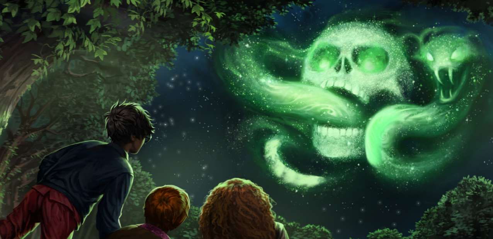
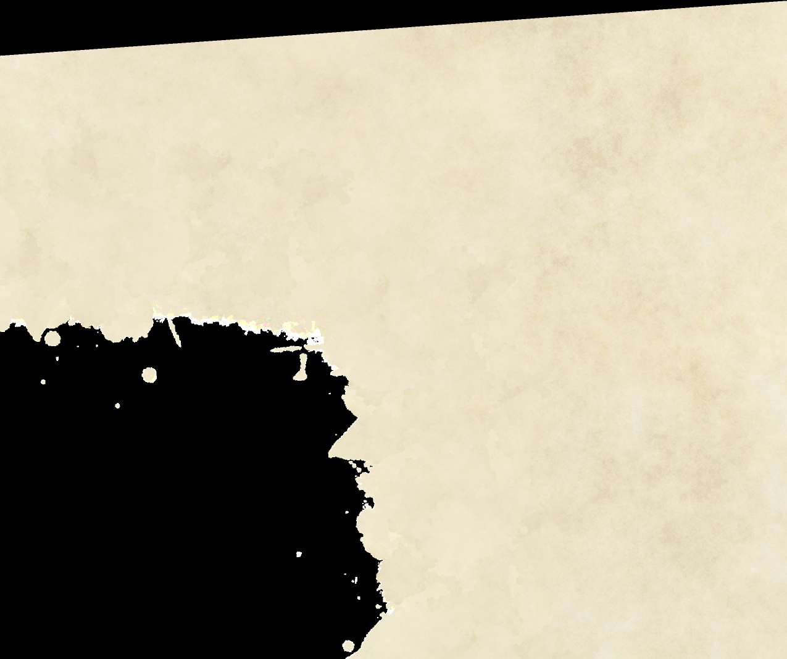
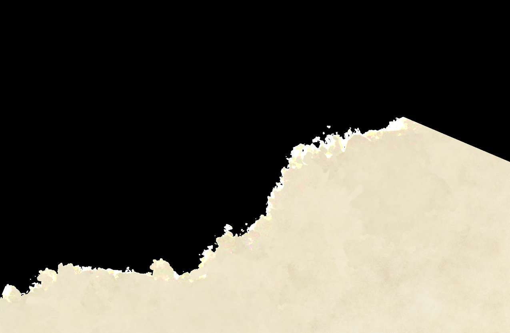
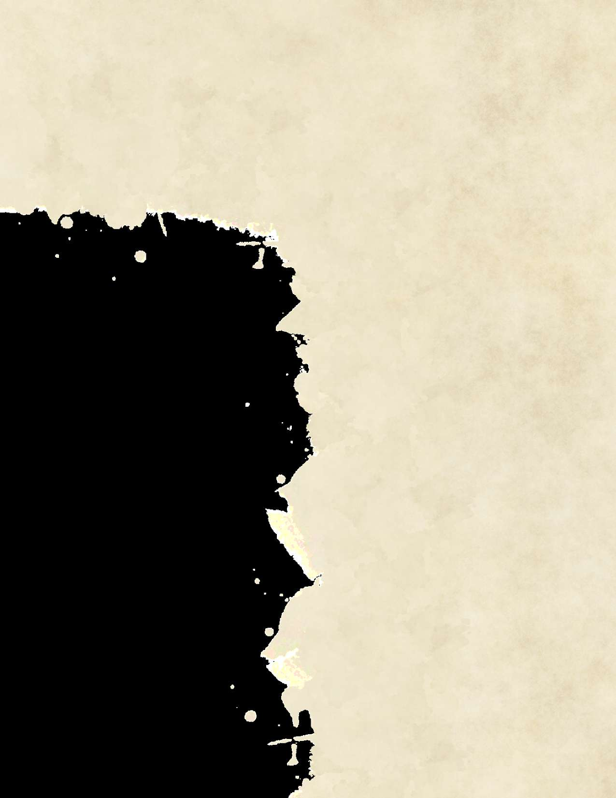
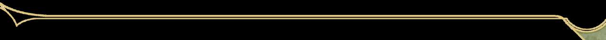

### Chapter 8: Dark Magic Corruption Chapter 8: Dark Magic Corruption
### B
esides, the world isn’t split into good people and	Killing a being by reducing it to 0 hit points with a Dark
Death Eaters. We’ve all got both light and dark	spell, when it could've been spared
inside of us. What matters is the part we choose	Casting an Unforgivable Curse, whether anyone witnesses
to act on. That’s who we really are.” - Sirius	it or not
Black, Order of the Phoenix.

	Betraying an ally that trusted you, for your own gain
As a wizard delves into the foul tomes of	Harming innocents in a foreseeable and preventable way
Dark magic, changes will begin to take place.	Manipulating someone into abandoning their morals
Experimenting with Dark magic almost always results from	Acting in a way contrary to alignment
an unquenchable thirst for power, an incredibly intense fear
As a character reaches higher corruption tiers, the DC of
or a deep well of hatred. By using twisted magic and
the saving throw increases. Additionally, the higher tiers
committing unspeakable acts, that inner darkness takes a toll
grant a corruption boon and inflict a corruption effect on the
on a Dark witch's physical and mental well-being.
character. Upon reaching a corruption tier with an effect, the
### Gaining Corruption Points Gaining Corruption Points	character must roll the appropriate die to determine which
effect they receive from the corruption effect tables on the
Although a wizard's descent into darkness is gradual, their	next page. If appropriate, the HM and the character's player
life is usually marked by definitive moments when the line is	can also come to an agreement on which corruption effect a
finally crossed. Murder, betrayal, and twisted experiments are	character receives. These effects are cumulative with the
common in the histories of Dark wizards and witches.	effects of lower tiers of corruption.
Whenever a character commits an act that represents their	These effects are intended to slightly shape a character's
growing cruelty, the HM can call for a Wisdom saving throw.	personality and action. Roleplaying how the Dark magic is
The DC of the saving throw is determined by their corruption	twisting the character is strongly encouraged, and an HM
tier in the table below. If the character fails that saving throw,	may remind players of their corruption effects.
they gain a single corruption point. Some examples of events
that might prompt a corruption roll are:
Corruption Tiers
Pure-Hearted 
	Pragmatic	Devious	Vicious	Vile
(0 points)	(1-4 points)	(5-7 points)	(8-11 points)	(12+ points)

| Save DC | 10 | 12 | 16 | 22 | - |
|---|---|---|---|---|---|

Alignment Shift	-	-	Neutral	-	Dark

| Corruption Boon | - | Empowered Darkness | - | Heightened Darkness | Inferi Ritual |
|---|---|---|---|---|---|

One Mild 
	One Severe	One Severe
Corruption Effect	-	-
Effect	Effect	Effect
### Removing Corruption Points Removing Corruption Points
The only way to remove corruption is through true,
meaningful remorse. Typically, someone must feel remorse
for the specific actions that caused the corruption in the first
place, but the remorse can also be more general, based on an
entire life of wrongdoing. There must be an amount of
suffering that is comparable to the suffering inflicted on
others.
Based on the actions and inner thoughts of the character,
the HM decides if a character is able to remove a corruption
point. The factors required for true remorse might be:
Acknowledging responsibility for the harm caused
Feeling a deep sadness and regret over the actions
Seeking to make amends in whatever way possible
If enough corruption points are removed to reach a lower
Art by Atomhawk / Art by Atomhawk / Art by Atomhawk / Art by Atomhawk / Art by Atomhawk / Art by Atomhawk /
Art by Atomhawk / Art by Atomhawk / Art by Atomhawk /	tier, the boon and effect from the previous higher tier are also
© Pottermore Limited © Pottermore Limited © Pottermore Limited © Pottermore Limited © Pottermore Limited © Pottermore Limited	removed.
© Pottermore Limited © Pottermore Limited © Pottermore Limited

### Hoarder. You are compelled to collect anything that might Corruption Boons Corruption Boons
be remotely useful in protecting you from your greatest fears.
Appropriate items stumbled upon must be gathered and     Empowered Darkness. When you have Empowered Spell
carried, if able, until at carrying capacity. as one of your metamagic options and use it on a Dark spell,
it costs 0 sorcery points.	Jittery. You become far too easy to spook or startle. You
have disadvantage on initiative rolls. Heightened Darkness. You can use the Heightened Spell
metamagic when casting a Dark spell, whether it's one of	Mildly Phobic. You begin to obsess over a specific
creature or person, believing them to be the cause of your your metamagic options or not. When you use Heightened
demise. During the first round of combat with a creature of Spell on a Dark spell, it costs 1 sorcery point.
the chosen type, you are frightened. Inferi Ritual. By focusing for 10 minutes and expending a
5th level spell slot, this ritual creates an undead servant.	Paranoid. You no longer trust the people you meet. You do
Choose a corpse of a Medium or Small humanoid you can	not count as a "friendly" creature to strangers and
acquaintances, and they do not count as "friendly" to you, in touch. Your spell imbues the target with a foul mimicry of life,
regards to abilities or spells. You can only target yourself and raising it as an inferius (the HM has the creature’s stats).
your closest allies with your beneficial spells and abilities. As a bonus action, you can mentally command any of your
inferi if one is within 60 feet of you (if you control multiple,	Phobic. A specific creature or person invades your dreams,
you can command any or all with the same command). You	turning them to nightmares. When you enter combat with a
creature of the chosen type, you must make a Wisdom saving decide its action and movement during its next turn, or you
throw (DC is 10 + your total corruption points). On a failure, can issue a general command, such as to guard a particular
you are frightened of them for 1 minute. corridor. If you issue no commands, the creature only
defends itself against hostile creatures. Once given an order,	Reckless. You've become impulsive in the face of
the creature continues to follow it until its task is complete.	dangerous situations. The first attack made against you in
The Dark magic that binds the corpse is permanent. The	any combat encounter has advantage on the attack roll.
inferius will only deanimate if you die or if it is destroyed.	Sadistic. Your bloodlust makes you become entranced by
the pain you cause. Whenever you deal damage, the next
### Corruption Effects Corruption Effects
attack made against you by anything other than the creature
you damaged has advantage on the attack roll.
Scent of Decay. Your body emits a faint stench of death.
d6 Mild Effects	d8	Severe Effects
You have disadvantage on Charisma (Persuasion) checks.
1 Hoarder	1	Phobic
Unnatural Pallor. Your skin has become pale and waxy
and your features oddly distorted. You have disadvantage on
2 Compulsive	2	Jittery
Charisma ability checks, except for Charisma (Intimidation)
3 Cough	3	Unnatural Pallor
and Charisma saving throws.
4 Reckless	4	Paranoid
### Restricted Dark Spells Restricted Dark Spells
5 Scent of Decay	5	Crimson Pupils
The following spells simply cannot be cast by your average
6 Mildly Phobic	6	Distracted
wizard. They require a more intimate understanding of the
darker sides of magic. The Cruciatus Curse is specifically
7 Hallucinations
fueled by the desire to inflict pain and the Killing Curse
8 Sadistic	requires pure, unadulterated hatred to end a person's life.
Neither of these will have a fraction of the effect without the
proper feeling behind it.
Compulsive. You begin to exhibit a mild, compulsive ritual
of the HM's choice, likely associated with some fear. This can
Spell Name	Required Corruption Points
manifest as quadruple-checking locks and defensive

| transmogrify | 2 |
|---|---|

measures, inspecting behind curtains, doors, and bushes for
hidden attackers, or refusing to consume anything until you
crucio	4
can get a small animal to test it for poison, for example. You

| azreth | 7 |
|---|---|

take 1.5 times as long to complete a short rest.
Cough. You develop an uncontrollable cough that creeps
avada kedavra	11
up every now and then. You have disadvantage on Dexterity
(Stealth) checks.
Once you've reached the required number of corruption
Crimson Pupils. Your eyes are bloodshot and in the right
points, you are now able to add that spell to your list of
lighting, even the blackest part of your pupils seem to shine
known spells through the usual methods of learning a spell.
red. You have disadvantage on attack rolls when you are
Once you add a restricted Dark spell to your spell list, you
facing the sun or a bright light.
can keep that spell, even if your corruption points return to a
Distracted. Your mind has grown scattered and easily
number lower than the required amount.
clouded. You have disadvantage on Intelligence ability checks,
except for Intelligence saving throws.
Hallucinations. Strange visions and sourceless whispers
occasionally tug at your perception. You have disadvantage
on Wisdom (Perception) checks.

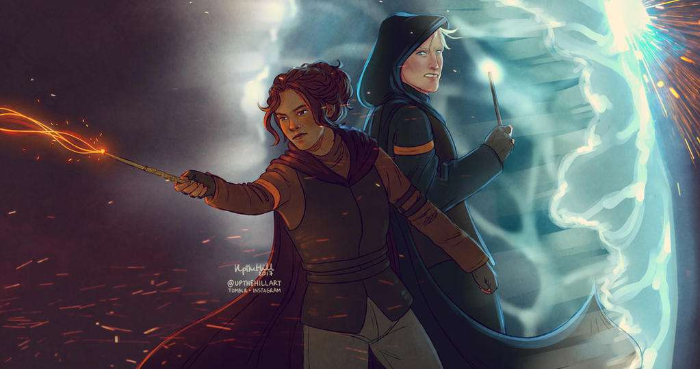
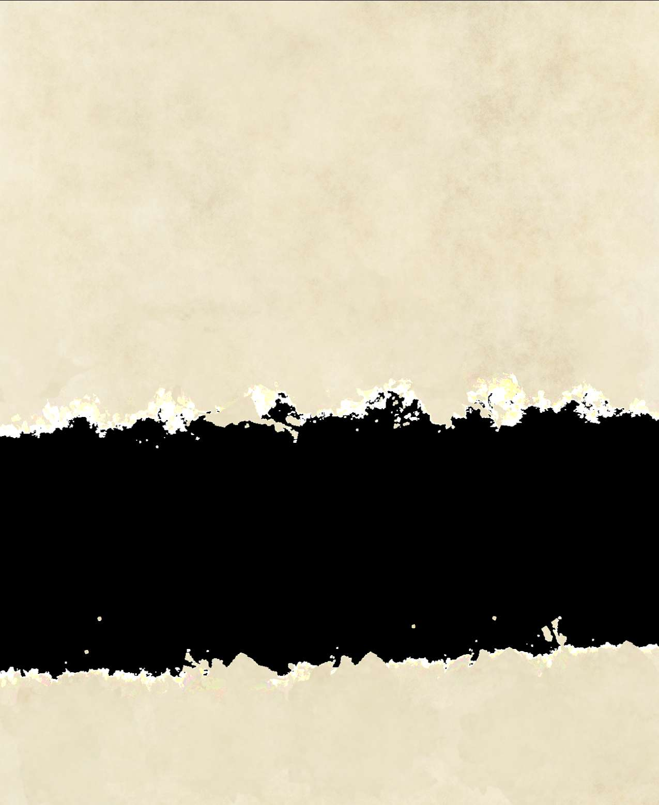
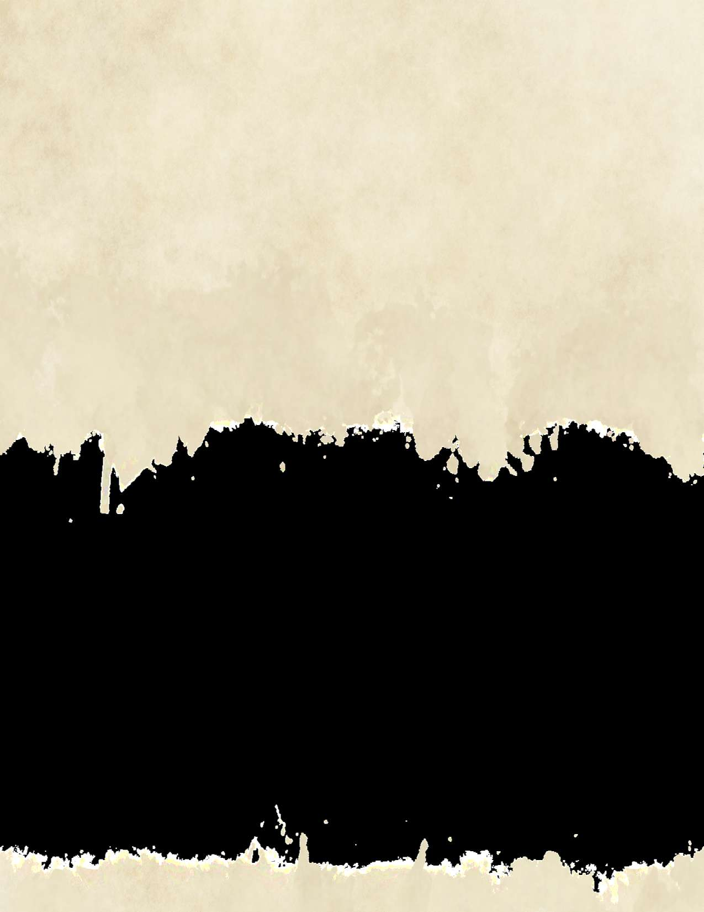

### Chapter 9: Spells Chapter 9: Spells
### M
Non-Lethal Magic Non-Lethal Magic agic in the Wizarding World of Harry
Potter works in a very fluid and flexible
A creature cannot be killed by standard spells, no matter the
way, limited only by a wizard's
intent of the caster. If a creature is reduced to 0 hit points by
knowledge and experience. Some
a standard spell (and if applicable, fails all of their death
spells are entirely dependent on feeling
saving throws), that creature will be knocked out, non-lethally.
a specific emotion, while others require
Lethal Magic Lethal Magic
mental focus and precise wand
movements. Spellcasting is a very personal thing, giving
Dark spells differ from regular spells in one important way:
different witches their own signature styles and repertoires.
damage dealt by Dark spells is potentially lethal. If a creature
Because Wands & Wizards focuses exclusively on	is reduced to 0 hit points by a Dark spell (and if applicable,
spellcasters, some extra attention has been given to how	fails all of their death saving throws), that creature dies. It is
spells work. Not every spell can kill, which allows wizards	possible to use damaging Dark spells to injure a creature,
and witches to engage in the non-lethal combat expected by	and then finish them off with a damaging spell that isn’t Dark,
wizarding society. Pay extra attention to the Spell Tags listed	to non-lethally incapacitate it.
in the spell descriptions.
### Duration Duration
### Spellcasting Spellcasting
Wands & Wizards maintains all of the standard 5e rules and
conventions regarding spell duration and concentration, but
### Damaging Spells Damaging Spells
the addition of dedication spells requires more strategic use
of a handful of spells. Many spells deal some kind of damage to the target. However,
because magic is deeply linked to a specific spell’s intent, the
effect on the target can vary greatly. Spells can either be
lethal or non-lethal. Many dueling spells are designed to be
non-lethal, but violent, combative Dark magic will kill.
Art by @upthehillart Art by @upthehillart Art by @upthehillart Art by @upthehillart Art by @upthehillart Art by @upthehillart
Art by @upthehillart Art by @upthehillart Art by @upthehillart

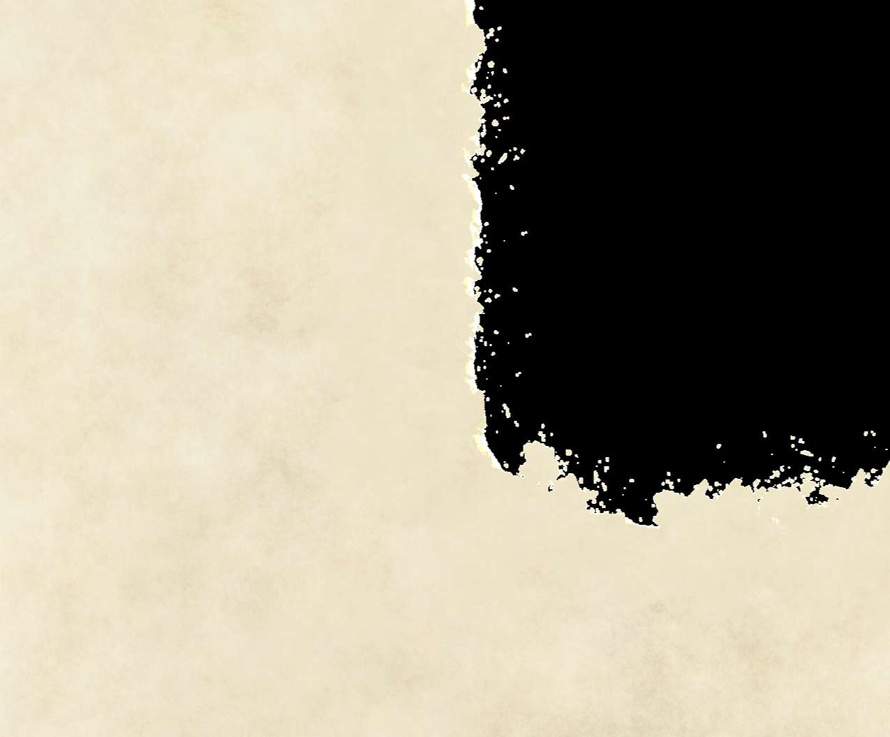
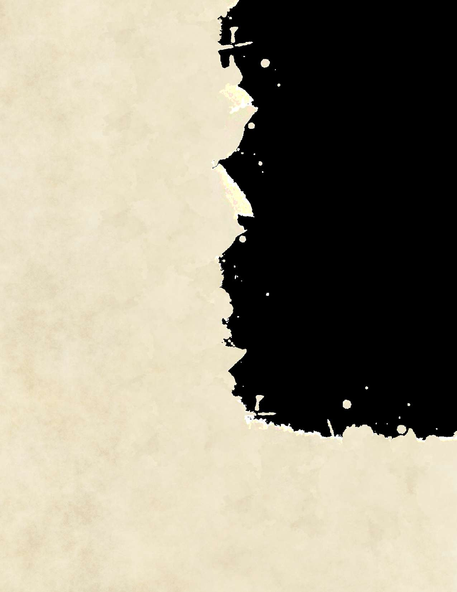
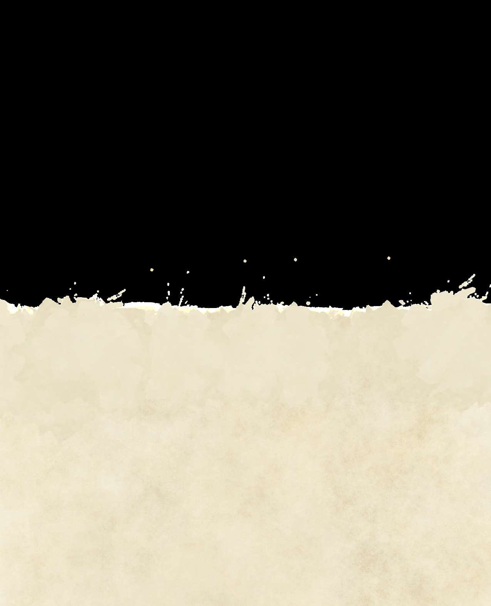

Being Being
Dedication Dedication
A Being is one of the three classifications used by the
If a spell is marked as a dedication spell in its Duration entry,
Ministry of Magic to catalogue the various magical Creatures
you must maintain concentration on that spell and use an
that inhabit the wizarding world (the others being Beast and
action at the start of each of your turns to maintain your
Spirit). The definition of a Being is any creature that has
dedication. If you lose dedication, the spell ends.
Like
sufficient intelligence to understand the laws of the magical
concentration, you can end dedication at any time (no action).
community and to bear part of the responsibility in shaping
The following factors can break dedication:
those laws.
Casting another spell. It doesn't matter if the other spell	All humans are beings, as are goblins, vampires, hags,
requires dedication or not. Even if you use your bonus	giants, house-elves, veela, werewolves, merpeople and
action to cast another spell, your dedication is lost.	centaurs. Dementors, boggarts and poltergeists are neither
Losing your line of sight to your target. This only	Beings nor Beasts, as they are Non-Beings.
applies if your spell affects a specific target. You cannot
Beast Beast
lose dedication by losing line of sight to area spells.
Losing concentration. If your concentration is broken by	A Beast is any living thing that is does not fit the criteria of a
taking damage or being incapacitated, your dedication is	Being. Wild animals and all the creatures students learn
broken.	about in Care of Magical Creatures are classified as Beasts.
Some creatures appear to fit the qualifications that define
### Spell Tags Spell Tags
Being (intelligent speech), such as Acromantulas, Sphinxes,
Manticores, and Erklings. These have not been offered Being
Dark Dark
status due to their extremely violent and even lethal
The Dark Arts, also known as Dark magic, refers to any type
tendencies, which interferes with their role in a lawful
of magic that is mainly used to cause harm to, exert control
society. They are thus classified as Beasts.
over, or even kill the victim. The Dark Arts encompass many
spells and actions ranging from the powerful Unforgivable
Curses to brewing harmful or poisonous potions and
breeding Dark creatures, all of which are often illegal or at
least discouraged. Practicing certain Dark magics is rumored
to damage the wizard’s very soul, and require some sort of
malicious intent in order to cast. However, despite being
labelled “dark,” the Dark Arts are not necessarily “evil.” Many
prominent wizards and Aurors have been known to rely on
Dark spells to carry out their duty, in dire circumstances.
Because of their lethal effects, the use of Dark spells on
beings will surely gain your character some attention and
may cause people to question that character’s motivations
and loyalties. If the Dark tag is accompanied by Unforgivable,
this is an Unforgivable Curse, illegal under all circumstances
and guaranteed to be punished with a life sentence in
Azkaban. Casting Unforgivable Curses or killing a being with
a Dark spell should prompt a corruption roll, as outlined in
Chapter 8: Dark Magic Corruption.
Defensive Defensive
Defensive magic is a classification of charms, jinxes, and
other types of spells that are specifically focused on nullifying
and countering magic. Shield charms, anti-apparition jinxes,
and countercurses are just a few examples of defensive
magic. Nearly every wizard will rely on Defensive spells at
some point in their life, but some wizards will be particularly
in tune with this aspect of magic, favoring spells of this type.
School of Magic School of Magic
A school of magic spell is a spell that cannot be learned via
the usual methods. These spells cannot be chosen upon
leveling up, but instead is granted by a school of magic
whenever you gain a spell slot of that spell's level. Once you
gain a school of magic spell, it's added to your spells known, it
doesn’t count against your number of spells known, and it
cannot be forgotten to learn another spell.
\columnbreak
### Targets Targets

As an action, you can attempt to disapparate. Make an Object Object
ability check using your spellcasting ability. Other modifiers
An object is quite simply that, an inanimate object. Don’t let
may add to or subtract from your total. The final result
movement, imitations of life or even intelligent speech
determines if you arrive successfully. If you do, you
deceive you; there are many enchantments and bewitched
immediately apparate in an unoccupied space within the
objects out there in the magical world that can make an
distance allowed by the spell slot you expended, automatically
inanimate object quite animate. Never trust something that
compensating for any creatures or objects that may be in
thinks if you don’t see a place for its brain.
your intended space. Because apparition is not a spell, it
cannot be countered. Spirit Spirit
Leisurely Departure. For most adults, apparition is a
The Spirit classification was formed when ghosts complained
straight-forward process to get to work, run errands or even
that it was insensitive to classify them as “beings,” when they
go downstairs, and there are no immediate threats
were so clearly “has-beens.” They’ve often been dissatisfied
distracting you. Some good reasons for not having a leisurely
with governments focusing more on the matters of the living
departure are: being under fire, being in the presence of a
than on the matters of the dead.
particularly terrifying creature, or suffering significant
### Unique Spells Unique Spells	wounds (missing half your hit points). Leisurely departure is
decided by the HM and grants advantage on your apparition
ability check.
### Apparition Apparition
Apparition is the method by which many adult witches and
wizards choose to travel from place to place. When one
Ability
apparates, they turn on the spot, "feeling [their] way into
Apparition Result Check
nothingness," and vanish from their present location to

| 15 or higher | You disapparate properly and arrive safely. |
|---|---|

reappear a second later in a new location, accompanied by a
loud cracking or popping sound.
Apparition, much like muggle driving, requires the	11-14	You disapparate but arrive off-target (d20).
individual take an exam to acquire a license at the age of 17.

| 7-10 | The disapparition feels off and you stop yourself. Nothing happens. |
|---|---|

To prepare, 16-year-olds can take lessons in apparition,
usually by practicing short jumps of only a few feet in the
presence of an instructor. This is because the process can be	You suffer a minor splinch and arrive off-target
5-6
dangerous; if the witch or wizard does not have the proper	(d20).
focus when they apparate, they may leave a part of
4 or You suffer a major splinch and arrive off-target
themselves behind.
lower	(d100).
How to Apparate How to Apparate
In order to apparate, you must have a proficiency bonus of +4
or greater; the process demands a certain level of magical
Destination, Determination, Destination, Determination,
skill that is beyond younger witches and wizards.
Deliberation Deliberation
Though apparition is not technically a spell, it taxes the
You must visualize your destination when you attempt to body much like a spell, and requires you to expend a spell
slot. Longer distances require more power and higher level	apparate. Typically, this means a wizard can only apparate to
a location they've been to before and can clearly remember. spell slots. Apparition also requires a wand.
Apparating to a new location that is in close proximity to a
known location may be possible, but may remove the benefit
of leisurely departure or even apply disadvantage to the
Slot Level	Apparition Range
ability check. How difficult it is to apparate to your desired

| 1st | 10 ft |
|---|---|

destination is decided by the HM.
Off-Target. If you apparate off-target, you appear a random
2nd	50 ft
distance away from the destination in a random direction.

| 3rd | 200 ft |
|---|---|

Distance off-target is determined by a die roll that gives you
the percent of the distance that was to be traveled (i.e. if you
4th	1,000 ft
meant to travel 120 miles, and rolled a 15, you would be 15%

| 5th | 1 mile |
|---|---|

of 120 miles off target, or 18 miles). Depending on the
severity of your error, the dice used may be a d20 or d100. To
6th	5 miles
determine the direction, roll a d8 and assign a direction to

| 7th | 20 miles |
|---|---|

each die face.
8th	100 miles

| 9th | 500 miles |
|---|---|

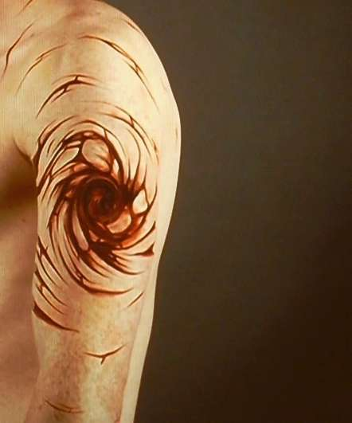
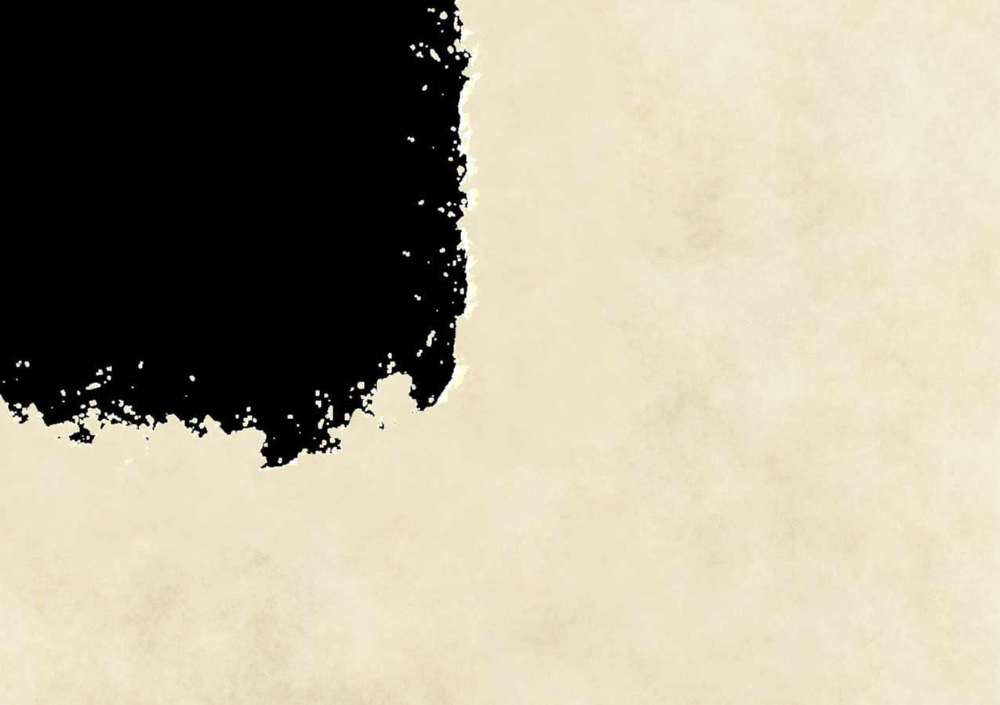
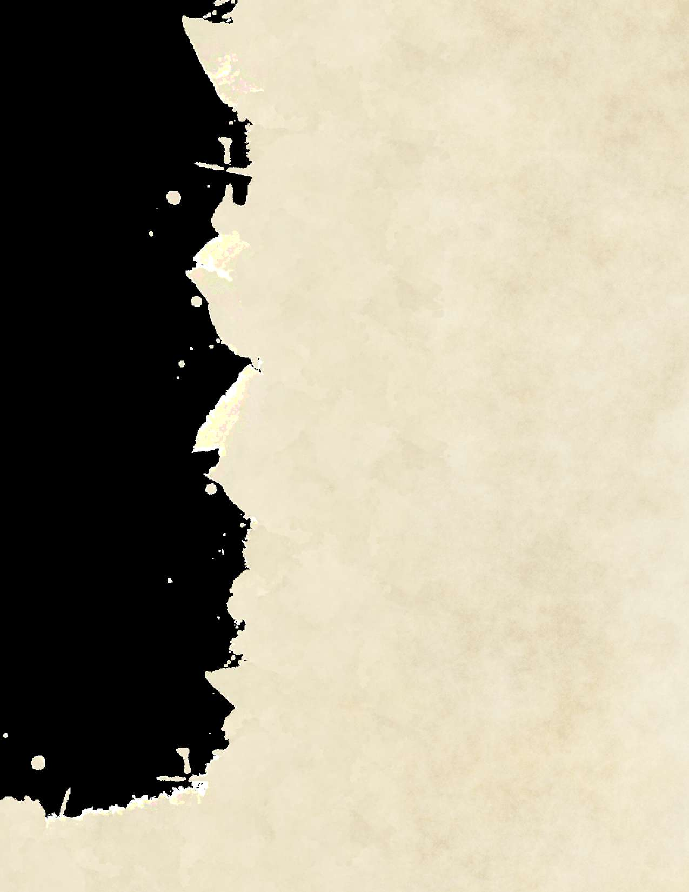

A minor splinch is when the lost body part is generally non
threatening; perhaps an eyebrow, a part of your finger, or a
small section of skin. You determine how much slashing
damage you suffer by rolling a single d10. This damage
cannot be reduced or prevented in any way.
A major splinch is far more severe and often life
threatening. You lose a large body part, such as a leg or arm,
or a piece of flesh is ripped from your body. Roll a number of
d6 dice equal to your level. You suffer that much slashing
damage and a level of exhaustion. This damage cannot be
reduced or prevented in any way. At the start of your following
turns, you take slashing damage equal to half your level as
you bleed out, which ends as soon as you receive hit points
from a healing effect.
If you are splinched, the HM will roll on the appropriate
table to determine the result. If you lose flesh, the HM can
either determine the location arbitrarily, or you can agree on
an appropriate spot. For example, if you were being grabbed
by an enemy on your right arm, the splinch would likely have
occurred there.
d6 Minor Splinch Result

| 1 | You lose a part of a finger. |
|---|---|

2 You lose a toe.

| 3 | You lose a piece of one of your ears. |
|---|---|

Wandless Apparition. Apparating without a wand is far
more difficult and dangerous than other wandless magic,	4 You lose a small piece of skin.
which is already rarely practiced. To attempt to apparate

| 5 | You lose one of your eyebrows. |
|---|---|

without a wand, you must have the Wandless Magic feat, you
cannot gain the benefit of a leisurely departure, you have	6 You lose an article of clothing.
disadvantage on the ability check, and you must expend a
spell slot two levels higher than the slot you normally would
expend.
d6 Major Splinch Result
Side-Along Apparition Side-Along Apparition

| 1-2 | You lose part of a leg. |
|---|---|

When you apparate, you may bring along a number of
creatures equal to your spellcasting ability modifier. Every	3	You lose an arm.
passenger imposes a -2 penalty on your apparition roll. Each

| 4-6 | You lose a large amount of flesh. |
|---|---|

creature must be holding on to either you or another creature
that is also holding on to you, and you must make a separate
apparition ability check for each creature with the same total
side-along penalty and the same advantage or disadvantage.
### Legilimency and Occlumency Legilimency and Occlumency

| i | me |
|---|---|

This roll only determines whether or not that creature is
splinched. Normal splinching rules apply.
Legilimency is the incredibly rare practice of using magic to
Forced Side-Along Apparition. If a creature is grappling
pull information from an individual's mind. While this
you when you disapparate, they side-along apparate with you
mysterious art often goes unnoticed, there are a select few
and you have disadvantage on the roll, in addition to the side-
people who have prepared themselves to resist this magic,
along penalty from the additional passenger. If an enemy
called occlumens. The cerebral battle between a legilimens
creature is within 5 feet of you when you disapparate, they
and an occlumens is a direct contest of discipline. An
can use their reaction to attempt to grapple you before you
occlumens must keep their mind clear in an almost
vanish.
meditative state, while a legilimens must probe and test to
find a weakness in those mental defenses.
Splinching Splinching
When you are splinched, you've left a part of yourself behind
at your previous location, instead of apparating your entire
body. Usually, splinching is a result of not having the proper
determination while apparating. How much of you is left
behind is determined by whether you had a minor or major
splinch.

If a target of the legilimens spell has the Occlumency
Training feat, their training gives them the chance to make a

| Charms Conversions W&W Spell Equivalent 5e Spell |  |
|---|---|
| Abscondi | Pass without Trace |
| Accio Mage Hand |  |
| Alohomora, Cistem Aperio | Knock |
| Cave Inimicum Tiny Hut |  |
| Colloportus | Arcane Lock |
| Colovaria Minor Illusion |  |
| Confundo | Confusion, Suggestion |
| Defodio Mold Earth |  |
| Depulso | Arcane Hand |
| Diminuendo, Reducio Reduce |  |
| Dissonus Ululatus, Vigilatus | Alarm |
| Engorgio Enlarge |  |
| Exhilaro, Rictusempra | Hideous Laughter |
| Finite Incantatem Dispel Magic |  |
| Flagrate | Illusory Script |
| Glacius Shape Water |  |
| Herbivicus | Plant Growth |
| Immobulus Color Spray |  |
| Locomotor, Mobilicorpus | Floating Disk |
| Lumos/Nox Light |  |
| Lumos Maxima | Daylight |
| Novum Spirare Water Breathing |  |
| Obliviate | Modify Memory |
| Pellucidi Pellis Invisibility |  |
| Pereo | Control Flames |
| Piertotum Locomotor Animate Objects |  |
| Protego | Shield |
| Protego Maxima Mage Armor |  |
| Protego Totalum | Globe of Invulnerability |
| Reparo Mending |  |
| Repello Inimicum | Magic Circle |
| Repello Muggletum Suggestion |  |
| Scourgify | Prestidigitation |
| Silencio Silence |  |
| Sonorus/Quietus | Thaumaturgy |
| Tergeo Shape Water |  |
| Wingardium Leviosa | Levitate |

Wisdom saving throw to immediately resist the intrusion into
their mind. Additionally, that occlumens is experienced in the
techniques used to throw a person out of their mind and has
advantage on the Intelligence contests between them and the
legilimens. If the target has the Skilled Occlumens school of
magic feature, their mental defenses are flawless. A
legilimens cannot even read their surface thoughts and the
spell has no effect on them.
Those trained in occlumency have one more trick up their
sleeve. If they resist the effects of the legilimens spell, they
have the choice of immediately ending the spell or fabricating
anything of their choosing to show to the legilimens. The
legilimens has no way of detecting that the information is any
different from the target's true inner thoughts. As a
legilimens probes deeper, the occlumens can invent more and
more intricate details, constructing false memories and
giving misleading information.
### Patronus Casting Patronus Casting
The patronus charm is a special bit of magic that requires a
wizard to envision one of their happiest memories while
casting the spell. If the feeling of happiness is not genuine or
not strong enough, the casting attempt will fail. In its most
basic form, successfully casting the spell results in a non-
corporeal patronus charm, which looks like a beam or ball of
bluish-white light being emitted from the caster’s wand. A
more advanced form of the charm is the corporeal patronus,
which is when that glowing essence forms into the shape of
an animal or magical beast. The corporeal shape of a
patronus is a reflection of the witch’s soul and is often quite
intimate.
A wizard’s corporeal patronus is also the animal that they
will transform into during their animagus transformation.
The first time you cast expecto patronum or complete your
animagus transformation, use Appendix B: Patronus Rolling
Tables to determine its shape. At your HM's discretion, you
can select your desired patronus instead of rolling for it.
### Spell Conversions Spell Conversions
Although the spells of Harry Potter have incredible effects,
some share similiarities with existing 5e spells. The below
tables connect new spell names to equivalent 5e spell names.
Because each spell is designed around the effects within the
Wizarding World, almost every spell is modified in some way.
Players shouldn't assume that just because there's an
equivalent 5e spell, the Harry Potter spell will operate in
exactly the same way or have the exact same description.
More than one new spell can correspond to a single 5e
spell, and the opposite applies if a new spell contains the
function of multiple 5e spells. If a spell is not listed in the
following tables, it means it is an entirely new spell and does
not have a 5e equivalent.

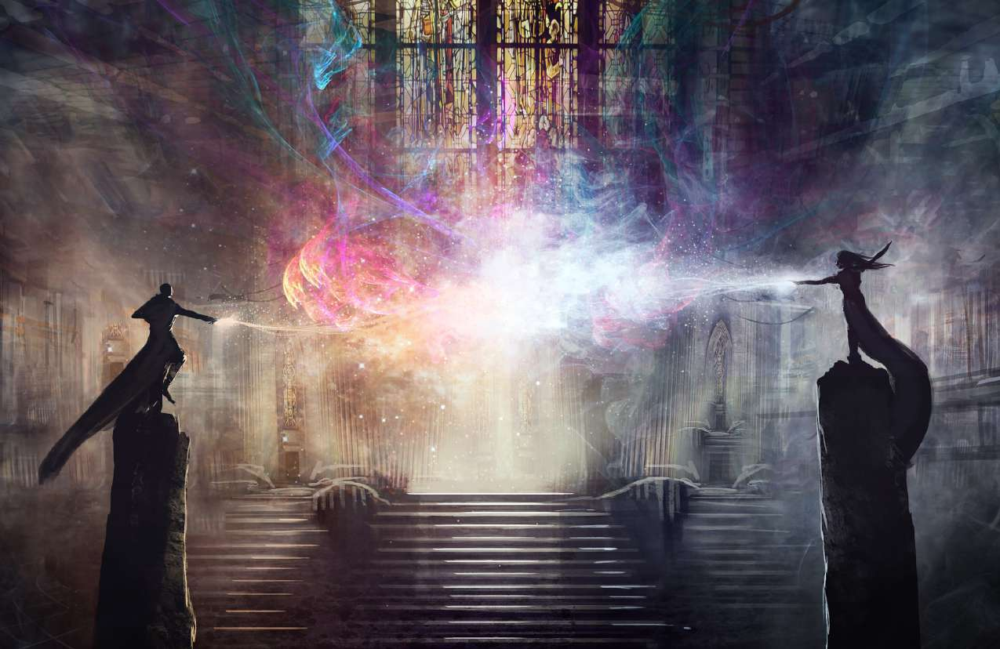
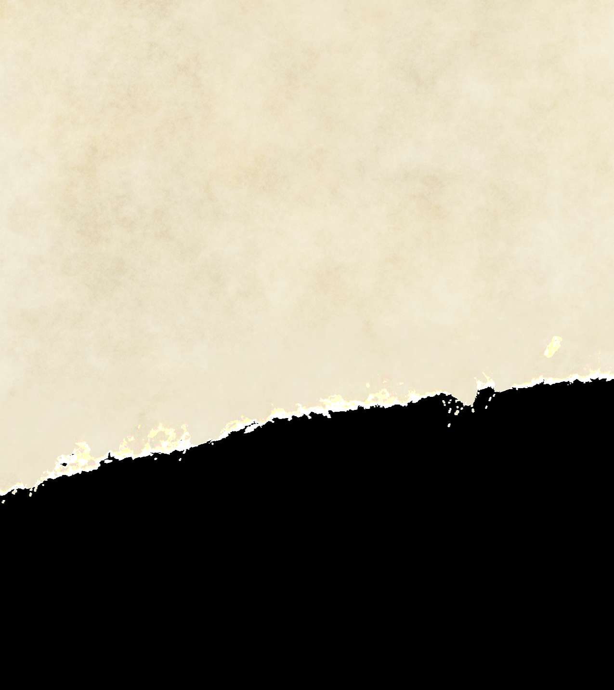
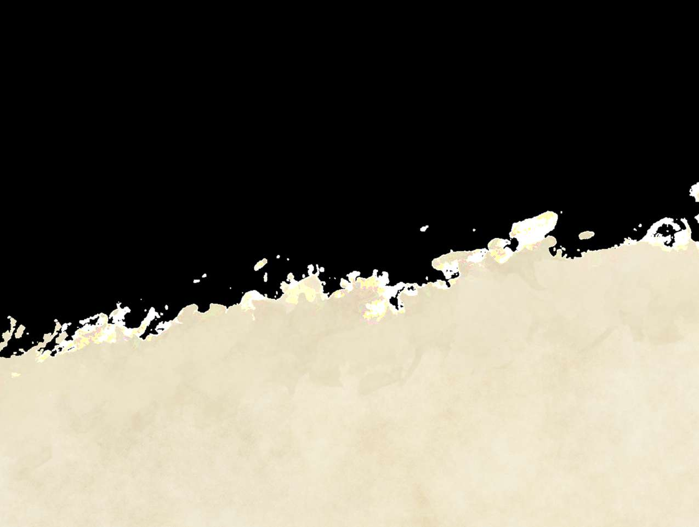

| Jinxes, Hexes and Curses Conversions W&W Spell Equivalent 5e Spell |  |
|---|---|
| Avada Kedavra | Power Word: Kill |
| Azreth Firestorm |  |
| Bombarda | Fire Bolt |
| Colloshoo Entangle |  |
| Confringo | Fireball |
| Conjunctivia Blindness/Deafness |  |
| Crucio | Power Word: Pain |
| Devicto Ray of Frost |  |
| Expulso | Shatter, Thunderwave |
| Furnunculus, Densaugeo Vicious Mockery |  |
| Impedimenta | Slow |
| Imperio Dominate Person |  |
| Infirma Cerebra | Mind Sliver |
| Langlock Counterspell |  |
| Oppugno | Cloud of Daggers |
| Petrificus Totalus Hold Person |  |
| Relashio | Knock |
| Sectumsempra Vitriolic Sphere |  |
| Ventus | Gust |

| Transfiguration Conversions W&W Spell Equivalent 5e Spell |  |
|---|---|
| Aguamenti | Create or Destroy Water |
| Avis Conjure Animals |  |
| Crinus Muto | Disguise Self |
| Draconifors Conjure Elemental |  |
| Ebublio | Watery Sphere |
| Ignis Furore Minute Meteors, Wall of Fire |  |
| Ignis Laqueis | Thorn Whip |
| Incendio Create Bonfire |  |
| Incendio Glacia | Produce Flame |
| Lapifors Polymorph |  |
| Nebulus | Fog Cloud |
| Obscuro, Melofors Blindness/Deafness |  |
| Orbis | Maximilian’s Earthen Grasp |
| Orchideous Druidcraft |  |
| Reparifarge | Dispel Magic |
| Serpensortia Conjure Animal |  |
| Tarantallegra | Irresistable Dance |
| Transmogrify Power Word: Pain |  |

Art by Jeff Brown Art by Jeff Brown Art by Jeff Brown Art by Jeff Brown Art by Jeff Brown Art by Jeff Brown
Art by Jeff Brown Art by Jeff Brown Art by Jeff Brown

| Healing Conversions W&W Spell Equivalent 5e Spell |  |
|---|---|
| Anapneo | Spare the Dying |
| Episkey Healing Word |  |
| Rennervate | Lesser Restoration |
| Reparifors Cure Wounds, Lesser Restoration |  |
| Vulnera Sanentur | Regenerate |

| Divination Conversions W&W Spell Equivalent 5e Spell |  |
|---|---|
| Homenum Revelio | Locate Person |
| Revelio See Invisibility |  |
| Specialis Revelio | Identify |

Geminio 	Flipendo	Orbis*
### Spell List Spell List
Immobulus	Locomotor Mortis	Reparifarge*
Muffliato*	Mimblewimble	Serpensortia
All characters have the same
Partis Temporus	Petrificus Totalus
spell list, but spells that can
3rd Level
Pellucidi Pellis
only be learned through a
2nd Level
Avis Protego Maxima
school of magic or feature
Arania Exumai	Evanesco R Reparo
are indicated with an asterisk.
Oppugno	Ignis Laqueis* R
Silencio
### Relashio	Melofors Charms Charms
Stupefy
Slugulus Eructo
4th Level 3rd Level
Tarantallegra
Cantrips (0 Level)
R Ebublio
R	R Deprimo	Ventus
Accio
Lapifors*
Depulso
Alohomora
3rd Level
Dissonus Ululatus
Capto	5th Level
Confringo R
Expecto Patronum
Carpe Retractum
Draconifors
Conjunctivia Fianto Duri
Cistem Aperio
Transmogrify
Expulso Fortissimum
Colloportus
Impedimenta Herbivicus
6th Level Colovaria
Langlock* R Lumos Maxima
Defodio	Ignis Furore
R Novum Spirare
Duro	4th Level
### Healing Healing Repello Inimicum
Finestra
Levicorpus/Liberacorpus
Flagrate
4th Level	Muco Volatilis
Cantrips (0 Level)
Glisseo
Reducto
Capacious Extremis*
Anapneo*
Illegibilus
Sectumsempra* R
Confundo
Rennervate
Impervius
R Repello Muggletum
Lumos/Nox	5th Level
1st Level
Molliare	5th Level	Imperio
Episkey
Pereo	Nullum Effugium*
Cave Inimicum
Ferula
Periculum/Verdimillious	Omnifracto*
Ne Ustio
Reparifors
Scourgify
Obliviate*
7th Level Sonorus/Quietus
Piertotum Locomotor*	3rd Level
Spongify	Azreth
Salvio Hexia
R Intus Sunt  *
Tergeo	Crucio
6th Level Wingardium Leviosa
4th Level
8th Level
Protego Totalum*
Brackium Emendo
1st Level
Avada Kedavra
9th Level Arresto Momentum
### 6th Level Transfiguration Transfiguration
R Diffindo
Fidelius Mysteria Celare*
Vulnera Sanentur*
R Exhilaro
### Cantrips (0 Level) Jinxes, Hexes, and Jinxes, Hexes, and
### Divination Divination
R Glacius
### Aguamenti Curses Curses
R Locomotor
Crinus Muto
Cantrips (0 Level) R
Mobilicorpus
Epoximise
R Perfusorius	Cantrips (0 Level)	Point Me
Incendio Glacia
Protego	Prior Incantato	Bombarda
Orchideous
R Reducio
Cantis
Vera Verto	1st Level
Rictusempra	Devicto
Specialis Revelio Riddikulus
Furnunculus
1st Level
R Vigilatus
Genu Recurvatum
R Inanimatus Conjurus	3rd Level
Infirma Cerebra
R Incendio
2nd Level	Legilimens*
Locomotor Wibbly
Nebulus
Revelio R Abscondi
R Obscuro
1st Level Diminuendo
4th Level Sagittario
R Engorgio
Colloshoo
R Appare Vestigium
Expelliarmus	Densaugeo
2nd Level
Homenum Revelio
Finite Incantatem	Digitus Wibbly
R Incarcerous
Fumos

### Anapneo Anapneo Spell Descriptions Spell Descriptions
The Airway Clearing Spell - Healing cantrip
The spells are presented in alphabetical order.
Casting Time: 1 action
Range: 30 feet
Abscondi Abscondi
Duration: Instantaneous
The Track Obliteration Charm - 2nd-level Charm (ritual)
Tags: School of Magic - Healing
Casting Time: 1 action
A being's airway is cleared and they are assisted in breathing.
Range: Self
If used on a living being that has 0 hit points, the being
Duration: Concentration, up to 1 hour
becomes stable.
A magical aura makes your impact on your surroundings
Appare Vestigium Appare Vestigium
unseen, masking you and your companions from detection.
The Tracking Spell - 4th-level Divination (ritual) For the duration, each creature you choose within 30 feet of
you (including you) has a +10 bonus to Dexterity (Stealth)
Casting Time: 1 minute
checks and can’t be tracked except by magical means. A
Range: Self (30-foot-radius hemisphere)
creature that receives this bonus leaves behind no tracks or
Duration: Concentration, up to 10 minutes
other traces of its passage.
With a spin and a spray of golden mist, recent magical
Accio Accio	activity is revealed and illuminated through ghostly images
hanging in the air, recreating the magical beings, magical
The Summoning Charm - Charm cantrip
creatures, or magical events that have been in the area within
Casting Time: 1 action
the last 10 minutes. Magical footprints and track marks are
Range: 30 feet
also highlighted on the ground. Any of the effects can be
Duration: Instantaneous
hidden, highlighted, or expanded for the duration.
A target object is pulled directly to the caster as if carried by	At Higher Levels. When you cast this spell using a spell
an invisible hand. The object is selected by pointing at it with	slot of a higher level, the historical window extends to 1 hour
a wand or by naming it, Accio broom. An object heavier than	(5th level), 24 hours (6th level), or a week (7th level).
20 pounds may not be summoned.
Arania Exumai Arania Exumai
At Higher Levels. When you cast this spell using a spell
The Spider Repelling Spell - 2nd-level Curse slot of 1st level or higher, you may select or stack one of the
following effects for each slot level above 0.
Casting Time: 1 action
Range: Self (30 foot cone)
Increase spell range by 100 feet.
Duration: Instantaneous
Increase weight limit by 20 pounds.
Increase the number of targetable objects by 5.	This spell blasts away spiders, Acromantulas, or arachnids
with a cone of bright scorching light. Each spider-like
Aguamenti Aguamenti
creature in a 30-foot cone must make a Constitution saving
The Water-Making Spell - Transfiguration cantrip	throw. On a failed save, a creature takes 4d6 radiant damage
and is knocked back 5 feet plus a number of feet equal to five
Casting Time: 1 action
times your spellcasting ability modifier. On a successful save,
Range: Self (30 foot cone)
it takes half as much damage and isn't knocked back.
Duration: Dedication, up to 1 minute
Any non-arachnid creatures within the area of the spell are
A cone of clear, pure water shoots from the tip of the caster's
unaffected.
wand with the desired force. The water doesn’t go bad and
At Higher Levels. When you cast this spell using a spell
extinguishes exposed flames in the area.
slot of 3rd level or higher, the damage increases by 1d6 and
the shove distance increases by 10 feet for each slot level Alohomora Alohomora
above 2nd.
The Unlocking Charm - Charm cantrip
Arresto Momentum Arresto Momentum
Casting Time: 1 action
Range: 60 feet	The Slowing Charm - 1st-level Charm
Duration: Instantaneous
Casting Time: 1 reaction, which you take when you or a
creature within 60 feet of you falls Choose a door or window that you can see within range, that
Range: 60 feet uses mundane or magical means to prevent access.
Duration: 1 minute A target that is held shut by a mundane lock or that is stuck
or barred becomes unlocked, unstuck, or unbarred. If the
Choose up to five falling creatures within range. A falling
object has multiple locks, only one of them is unlocked.
creature's rate of descent slows to 60 feet per round until the
If you choose a target that is held shut with Colloportus,
spell ends. If the creature lands before the spell ends, it takes
that spell is removed.
no falling damage and can land on its feet, and the spell ends
When you cast the spell, the mechanism noisily turns and
for that creature.
unlocks. This noise emanates from the target object and is
audible from as far away as 100 feet.

Upon reaching 8 cubes, you must make a DC15 Avada Kedavra Avada Kedavra
Constitution saving throw to maintain concentration at the
The Killing Curse - 8th-level Curse
beginning of each of your turns. If your concentration is
Casting Time: 1 action	broken after 4 cubes of fiendfyre are active, the spell doesn't
Range: 60 feet
end and rages out of control. The fiendfyre will continue to
Duration: Instantaneous
double at the beginning of each round, until the end of its
Tags: Dark - Unforgivable Curse	duration. If you decide to end the spell while you still have
concentration, the spell ends as normal and all fiendfyre
The most dangerous of the Unforgivables, Avada Kedavra
disappears.
channels the caster's pure hatred into an unblockable spell
The fiendfyre damages objects in the area and ignites
that kills whatever it strikes. Make a ranged spell attack
flammable objects that aren’t being worn or carried. Even
against a target within range. On a hit and if the target has
magical objects and defenses are damaged or destroyed by
100 hit points or fewer, it dies or is destroyed. Otherwise, the
this spell.
spell has no effect. Defensive spells have no effect against
At Higher Levels. When you cast this spell using a spell
this spell and it can only be blocked by physical objects.
slot of 8th level or higher, the damage increases by 2d10 and
At Higher Levels. When you cast this spell using a spell
the concentration DC increases by 1 for each slot level above
slot of 9th level, there is no hit point restriction.
7th.
Avis Avis
Bombarda Bombarda
The Bird-Conjuring Charm - 3rd-level Transfiguration
The Exploding Charm - Curse cantrip
Casting Time: 1 action
Casting Time: 1 action
Range: 60 feet
Range: 60 feet
Duration: Concentration, up to 1 hour
Duration: Instantaneous
You conjure either a Swarm of Small Birds or two Swarms of
Tags: Dark
Tiny Birds that are a species of your choice. The swarm
The spell blasts whatever it hits, creating a localized
disappears when it drops to 0 hit points or when the spell
concussive explosion upon impact. Make a ranged spell
ends.
attack against a target within range. On a hit, the target takes
The conjured birds are friendly to you and your
1d10 bludgeoning damage.
companions. Roll initiative for the summoned swarms as a
This spell’s damage increases by 1d10 when you reach 5th
group, which has its own turns. They obey any verbal
level (2d10), 11th level (3d10), and 17th level (4d10).
commands that you issue to them (no action required by you).
If you don't issue any commands to them, they defend
Brackium Emendo Brackium Emendo
themselves from hostile creatures, but otherwise take no
The Bone Mending Spell - 4th-level Healing
actions.
The HM has the creatures' statistics.	Casting Time: 1 action
Range: Touch At Higher Levels. When you cast this spell using certain
Duration: Instantaneous higher-level spell slots, more creatures appear - twice as
many with a 5th-level slot, three times as many with a 7th-
This spell heals a being's broken bones immediately, although
level slot, and four times as many with a 9th-level slot.
the process is quite painful. A being you can see that you tap
with your wand regains a number of hit points equal to 5d10
Azreth Azreth
+ your spellcasting ability modifier, and gains a level of
Fiendfyre - 7th-level Curse
exhaustion.
Casting Time: 1 action	At Higher Levels. When you cast this spell using a spell
Range: Self (10 foot cube)	slot of 5th level or higher, the healing increases by 1d10 for
Duration: Dedication, up to 42 seconds	each slot level above 4th.
Tags: Dark
Cantis Cantis
Great plumes of cursed fire pour out from the tip of your
The Singing Jinx - Curse cantrip
wand, rampaging into shapes of beasts and incinerating
anything in their path. Upon casting, the area of the fiendfyre	Casting Time: 1 action
is one 10-foot cube, with the number of 10-foot cubes	Range: 60 feet
doubling at the beginning of each of your turns. As long as	Duration: 1 round
concentration is maintained, you can arrange any newly
When struck by this spell, a being can't help but belt out a
added cubes as you wish. Each cube must have at least one
couple of lines from the first song that comes to mind. Make a
face adjacent to the face of another cube. Each creature in
ranged spell attack against a being within range. On a hit, the
the area must make a Dexterity saving throw. It takes 7d10
target must cast all other spells non-verbally until the end of
fire damage on a failed save, or half as much damage on a
its next turn. If it tries to cast a spell verbally, it must first
successful one. A creature takes the same damage when it
succeed on an Intelligence saving throw, or the casting fails
enters the area for the first time on a turn or ends its turn
and the spell is wasted.
there.

Capacious Extremis Capacious Extremis	Cistem Aperio	Cistem Aperio
The Undetectable Extension Charm - 4th-level Charm	The Container Opening Charm - Charm cantrip
Casting Time: 10 minutes	Casting Time: 1 action
Range: Touch	Range: 60 feet
Duration: Until dispelled	Duration: Instantaneous
Tags: School of Magic - Charms
Choose a box, chest, or another container that you can see
Transform an ordinary small bag/pouch into a Handy	within range that uses mundane or magical means to prevent
Haversack's central pouch, a backpack into a Bag of Holding,	access.
or a trunk’s internal capacity into a Bag of Holding with: 3 ft.	A target that is held shut by a mundane lock or that is stuck
long and 2 ft. wide opening; internal size of 6 ft. long, 4 ft.	or chained becomes unlocked, unstuck, or unchained. If the
wide, and 4 ft. deep; 1000 pounds and 150 cubic ft. limits.	object has multiple locks, only one of them is unlocked.
If you choose a target that is held shut with Colloportus,
Capto Capto
that spell is dispelled.
The Gripping Charm - Charm cantrip
When you cast the spell, the mechanism noisily turns and
unlocks. This noise emanates from the target object and is Casting Time: 1 action
audible from as far away as 100 feet. Range: Touch
Duration: 10 minutes
Colloportus Colloportus
One target object becomes quite easily gripped by one hand,
The Locking Spell - Charm cantrip
almost sticky unless the holder willfully lets go. The holder
Casting Time: 1 action
has advantage against being non-magically disarmed.
Range: Touch
Carpe Retractum Carpe Retractum	Duration: Until dispelled
The Seize and Pull Charm - Charm cantrip
You touch a closed door, window, gate, chest, or other
entryway, and it becomes locked for the duration. It is Casting Time: 1 action
impassable until it is broken or the spell is dispelled or Range: 60 feet
suppressed. Duration: 1 round
While affected by this spell, the object is more difficult to
A bond of light shoots out from the caster and attaches to
break or force open; the DC to break it or pick any locks on it
anything you can see within range, and then retracts, pulling
increases by 10.
caster and target each 10 feet closer. If the caster or target
doesn't move or would easily resist the force of the other	Colloshoo	Colloshoo
being pulled, the other moves 20 feet. If the target is an
The Stickfast Hex - 1st-level Curse
unwilling creature that is able to be moved, it must make a
Casting Time: 1 action
Strength saving throw to resist being moved. The bond of
Range: 90 feet
light keeps the caster and target attached for the duration.
Duration: Concentration, up to 1 minute
At Higher Levels. When you cast this spell using a spell
slot of 1st level or higher, the range and pulling effect both
This creative hex sticks a being's shoes to the ground, rooting
increase by 5 feet for each slot level above 0.
them in place. Choose a being you can see within range that
is wearing shoes to make a Dexterity saving throw. On a
Cave Inimicum Cave Inimicum
failed save, the target is restrained for the duration. If the
The Hiding Charm - 5th-level Charm
saving throw fails by 5 or more, the target is knocked prone
as well. The target can use its action to take off its shoes, or Casting Time: 1 minute
make a Strength check against your spell save DC. On a Range: Self (10-foot-radius hemisphere)
success, it pulls its shoes free. Duration: 1 hour
Tags: Defensive
Colovaria Colovaria
A forcefield-like dome forms a perimeter around the caster
The Color Change Charm - Charm cantrip
that filters vision of anything or anyone designated by the
Casting Time: 1 action
caster, rendering those objects infallibly invisible. The dome
Range: 30 feet
is undetectable from the outside, but slightly visible from the
Duration: 1 hour
inside, like a wavering glass barrier. Anyone can move
through the field freely to see the hidden contents.
You change the color of any target within range that lasts for
At Higher Levels. When you cast this spell using a spell	the duration, to any desired complexity. The color may only
slot of 6th level or higher, you may select or stack one of the	be reverted by dispelling the charm.
following effects for each slot level above 5th.
Physical interaction with the object reveals that the object
has retained its original texture and material, but its color has
Increase the spell radius by 20 feet.
truly changed.
Increase the duration to 8 hours.
Add the ability to completely block sounds.
Add the ability to completely block smells.

Confringo Confringo	Conjunctivia	Conjunctivia
The Blasting Curse - 3rd-level Curse	The Conjunctivitis Curse - 3rd-level Curse
Casting Time: 1 action	Casting Time: 1 action
Range: 90 feet	Range: 60 feet
Duration: Instantaneous	Duration: 1 minute
Tags: Dark
When struck by this curse, a creature's eyes to become
A tiny ball of fire flashes from your wand to a point you	irritated and painful, swelling shut. Make a ranged spell
choose within range and then explodes into a fiery blast on	attack against a creature within range. On a hit, the target
impact. Each creature in a 10-foot-radius sphere centered on	takes 4d8 necrotic damage and is blinded for the duration. At
that point must make a Dexterity saving throw. A target takes	the end of each of its turns, the target can make a
8d6 fire damage on a failed save, or half as much damage on	Constitution saving throw. On a success, the spell ends.
a successful one. The fire spreads around corners. It ignites	Creatures that are normally magically resistant are
flammable objects in the area that aren’t worn or carried.	vulnerable to this spell.
At Higher Levels. When you cast this spell using a spell	At Higher Levels. When you cast this spell using a spell
slot of 4th level or higher, the damage increases by 1d6 and	slot of 4th level or higher, the damage increases by 1d8 for
the radius increases by 5 feet for each slot level above 3rd.	each slot level above 3rd.
Confundo Confundo	Crinus Muto	Crinus Muto
The Confundus Charm - 4th-level Charm (ritual)	The Haircut Spell - Transfiguration cantrip
Casting Time: 1 action	Casting Time: 1 action
Range: 90 feet	Range: Self
Duration: Concentration, up to 1 minute	Duration: 1 hour
The Confundus Charm is a particularly powerful charm that	Your hair is magically lengthened, shortened, styled, or
leaves anything confused, forgetful, and impressionable, often	colored. This may also be applied to eyebrows and facial hair.
causing people to wander off absent-mindedly. If the target is	If your appearance is drastically changed, you may be hard to
an object you can see within range that operates or functions	recognize. To discern that you are disguised, a creature can
on its own, it will operate erratically, malfunction, or	use its action to inspect your appearance and must succeed
completely shut down. This spell has no effect on a	on an Intelligence (Investigation) check against your spell
completely inanimate objects that entirely depend on external	save DC.
manipulation.
Crucio Crucio
If the target is a creature you can see within range, it must
The Cruciatus Curse - 7th-level Curse succeed on a Wisdom saving throw when you cast this spell
or be affected by it. An affected target can’t take reactions
Casting Time: 1 action
and, if not distracted with something, you roll a d10. If you
Range: 30 feet
roll 1-8, the creature must use all its movement to move in a
Duration: Dedication, up to 1 minute
random direction. To determine the direction, assign a
Tags: Dark - Unforgivable Curse
direction to each number 1-8. If you roll a 9-10, the creature
With a single word and a heart full of hatred, waves of intense
doesn't move. Whether it moves or not, the creature doesn’t
pain assail one creature you can see within range. If the
take an action this turn.
target has 100 hit points or fewer, it is subject to crippling
If desired, you can suggest a course of activity (limited to a
pain. Otherwise, the spell has no effect on it.
sentence or two) at the time of casting and magically
While the target is affected by crippling pain, any speed it
influence a creature you can see within range that can hear
has can be no higher than 10 feet. The target also has
and understand you. Creatures that can’t be charmed are
disadvantage on attack rolls, ability checks, and saving
immune to this effect. The suggestion must be worded in
throws, other than Constitution saving throws. Finally, if the
such a manner as to make the course of action sound
target tries to cast a spell, it must first succeed on a
reasonable. Asking the creature to directly hurt itself or its
Constitution saving throw, or the casting fails and the spell is
allies will have no effect. The suggested course of action can
wasted.
continue for the entire duration. You can also specify
A target suffering this pain must make a Constitution
conditions that will trigger a special activity during the
saving throw at the end of each of its turns. On a failed save,
duration. For example, you might suggest that a wizard hug
the target gains one level of exhaustion.
the next blast-ended skrewt he sees. If the condition isn’t met
before the spell expires, the activity isn’t performed.
At the end of each of its turns, an affected target can make
a Wisdom saving throw. If it succeeds, the spell's effects end
for that target.
At Higher Levels. When you cast this spell using a spell
slot of 5th level or higher, you can target one additional target
for each slot level above 4th. The targets must be within 30
feet of each other when you target them.

Defodio Defodio	Depulso	Depulso
The Gouging Spell - Charm cantrip	The Banishing Charm - 3rd-level Charm
Casting Time: 1 action	Casting Time: 1 action
Range: 30 feet (5 foot cube)	Range: 60 feet
Duration: Instantaneous	Duration: Instantaneous
You choose a portion of dirt or stone that you can see within	A target within range is pushed directly away from the caster
range and that fits within a 5-foot cube. You manipulate it in	as if shoved by an invisible hand, being thrown 5 feet away
one of the following ways:	plus a number of feet equal to five times your spellcasting
ability modifier. The target is selected by the caster pointing
If you target an area of stone or earth, you can
at it with their wand.
instantaneously excavate it, move it along the ground, and
If targeting a creature or object that is being worn or
deposit it up to 5 feet away. This movement doesn’t have
carried, make a check with 26 Strength (+8) contested by the
enough force to cause damage.
Strength (Athletics) check of the target creature. If the target
If the dirt or stone you target is on the ground, you cause it
is Medium or smaller, you have advantage on the check. If
to become difficult terrain. Alternatively, you can cause the
you succeed, the target is thrown the same distance.
ground to become normal terrain if it is already difficult
At Higher Levels. When you cast this spell using a spell
terrain. This change lasts for 1 hour. If cast multiple times,
slot of 4th level or higher, the shove distance is increased by
only two of this effect can be active at a time, and you can
10 feet for each slot level above 3rd.
dismiss such an effect as a bonus action.
Devicto Devicto
At Higher Levels. When you cast this spell using a spell
The Stinging Jinx - Curse cantrip
slot of 1st level or higher, the cube's size and distance the
earth can be moved are each increased by 5 feet and the	Casting Time: 1 action
number of active normal/difficult terrain effects increase by 1	Range: 60 feet
for each slot level above 0.	Duration: Instantaneous
This weak jinx is a classic training spell between duelists, a Densaugeo Densaugeo
startling sting on impact. Make a ranged spell attack against
The Bucktooth Hex - 1st-level Curse
a creature within range. On a hit, it takes 1d6 force damage,
Casting Time: 1 action
and it can't take reactions until the start of its next turn.
Range: 60 feet
The spell's damage increases by 1d6 when you reach 5th
Duration: Instantaneous
level (2d6), 11th level (3d6), and 17th level (4d6).
A target's front two teeth grow abnormally long, protruding
Diffindo Diffindo
downwards past its chin. Make a ranged spell attack against a
The Severing Charm - 1st-level Charm (ritual)
creature within range. On a hit, it takes 2d8 psychic damage
and has disadvantage on the next attack roll it makes before	Casting Time: 1 action
the end of its next turn.	Range: 30 feet
At Higher Levels. When you cast this spell using a spell	Duration: Instantaneous
slot of 2nd level or higher, the damage is increased by 1d8 for
An object is precisely torn or cut, as if a magical blade
each slot level above 1st.
extended from the tip of your wand. This spell was not
designed to be used on creatures and only makes very Deprimo Deprimo
shallow cuts. Choose a target you can see within range that
The Crushing Charm - 3rd-level Charm (ritual)
fits within a 5-foot cube. If the target is a creature, it must
Casting Time: 1 action
make a Dexterity saving throw. It takes 4d4 slashing damage
Range: 120 feet
on a failed save or half as much damage on a successful one.
Duration: Instantaneous
This is the counterspell to incarcerous, immediately ending
that spell's effects.
You place immense downward pressure on a target you can
At Higher Levels. When you cast this spell using a spell see within range. If the target is a creature, it must make a
slot of 2nd level or higher, you can target one additional Strength saving throw. On a failed save, a creature takes 5d8
creature or the cube's size increases by 5 feet for each slot bludgeoning damage and is knocked prone. On a successful
level above 1st. If targeting additional creatures, the targets save, the creature takes half as much damage and isn’t
must be within 10 feet of each other when you target them.
knocked prone. If the target is a flat surface, this will either
create a crater or collapse the surface.
At Higher Levels. When you cast this spell using a spell
slot of 4th level or higher, the damage is increased by 1d8 for
each slot level above 3rd.

The dragon construct is friendly to you and your Digitus Wibbly Digitus Wibbly
companions for the duration. Roll initiative for the dragon
The Jelly-Fingers Jinx - 1st-level Curse
construct, which has its own turns. It obeys any verbal
Casting Time: 1 action	commands that you issue to it (no action required by you). If
Range: 60 feet
you don't issue any commands to it, it defends itself from
Duration: 1 minute
hostile creatures, but otherwise takes no actions.
If your concentration is broken, the dragon construct
This jinx makes fingers numb and relaxed. Make a ranged
doesn't disappear. Instead, you lose control of the construct, it
spell attack against a being within range. On a hit, the target
becomes hostile toward you and your companions, and it
has disadvantage on attack rolls for the duration. At the start
might attack. An uncontrolled dragon construct can't be
of each of its turns, the target can make a Dexterity saving
dismissed by you, and it untransfigures 10 minutes after you
throw. On a success, the spell ends.
transfigured it.
Diminuendo Diminuendo
The HM has the creature's statistics.
At Higher Levels. When you cast this spell using a spell The Diminishing Charm - 2nd-level Charm
slot of 7th level, choose one of the following options:
Casting Time: 1 action
Range: 60 feet
Two dragon wyrmlings of challenge rating 3 or lower
Duration: Concentration, up to 1 minute
Three dragon wyrmlings of challenge rating 2 or lower
Make a ranged spell attack against a creature within range.
When you cast this spell using a spell slot of 9th level,
On a hit, the being or beast's size is halved in all dimensions,
choose one of the following options:
and its weight is reduced to one-eighth of normal. This
reduction decreases its size by one category - from Medium	Two dragon wyrmlings of challenge rating 4 or lower
to Small, for example.	Four dragon wyrmlings of challenge rating 2 or lower
Until the spell ends, the target also has disadvantage on
Duro Duro
Strength checks and Strength saving throws. The target's
The Hardening Charm - Charm cantrip items or equipment also shrink to match its new size, but any
item dropped by an affected creature returns to normal size
Casting Time: 1 action
at once. The target deals 1d4 less damage (this can't reduce
Range: 60 feet
the damage below 1).
Duration: 1 minute
Dissonus Ululatus Dissonus Ululatus
An object you can see within range becomes as hard and
tough as stone. It gains resistance to all damage. The Caterwauling Charm - 3rd-level Charm
Casting Time: 10 minutes	Ebublio	Ebublio
Range: Self (30-foot-radius hemisphere)
The Bubble Spell - 4th-level Transfiguration (ritual)
Duration: 8 hours
Casting Time: 1 action
Tags: Defensive
Range: 90 feet
You set an alarm to emit a piercing shriek when an
Duration: Concentration, up to 1 minute
unauthorized person enters the area. Until the spell ends, an
You conjure up a swirling sphere of water with a 5-foot radius
alarm sounds whenever a Tiny or larger creature touches or
at a point you can see within range. The sphere can hover but
enters the warded area. When you cast the spell, you can
no more than 10 feet off the ground. The sphere remains for
designate creatures or areas within the hemisphere that
the spell’s duration.
won't set off the alarm. The alarm produces an unpleasant
Any creature in the sphere’s space must make a Strength
screaming sound for as long as the intruding creature is in
saving throw. On a successful save, a creature is ejected from
the area of the spell, audible from as far away as 300 feet.
that space to the nearest unoccupied space of the creature’s
Draconifors Draconifors
choice outside the sphere. A Huge or larger creature
succeeds on the saving throw automatically, and a Large or The Dragon-Making Spell - 5th-level Transfiguration
smaller creature can choose to fail it. On a failed save, a
Casting Time: 1 action
creature is restrained by the sphere and is engulfed by the
Range: 30 feet
swirling bubble of water. At the end of each of its turns, a
Duration: Concentration, up to 10 minutes
restrained target can repeat the saving throw, ending the
A particularly intimidating display of transfiguration, this	effect on itself on a success.
spell turns a desk-sized object into a miniature version of an	The sphere can restrain as many as four Medium or
adult dragon. Choose either one or two inanimate,	smaller creatures or one Large creature. If the sphere
nonmagical objects you can see within range that each fill a	restrains a creature that causes it to exceed this capacity, a
5-foot cube and choose one of the following options:	random creature that was already restrained by the sphere
falls out of it and lands prone in a space within 5 feet of it.
One dragon wyrmling of challenge rating 4 or lower
Two dragon wyrmlings of challenge rating 2 or lower
The object becomes a Medium-sized dragon construct with
the chosen wyrmling's statistics, which is untransfigured
when it drops to 0 hit points or when the spell ends.

Evanesco Evanesco As an action, you can move the sphere up to 30 feet in a
straight line. If it moves over a pit, a cliff, or other drop-off, it
The Vanishing Spell - 3rd-level Transfiguration
safely descends until it is hovering 10 feet above the ground.
Casting Time: 1 action
Any creature restrained by the sphere moves with it. You can
Range: 30 ft
ram the sphere into creatures, forcing them to make the
Duration: Instantaneous
saving throw.
When the spell ends, the sphere falls to the ground and	One non-magical object or magical construct of your choice
extinguishes all normal flames within 30 feet of it. Any	that you can see within range and that fits within a 1-foot
creature restrained by the sphere is knocked prone in the	cube is vanished. Vanished objects have been described as
space where it falls. The water then vanishes.	being transfigured to go "into non-being, which is to say,
everything." Vanishing is often seen as the magical inverse of
Engorgio Engorgio
conjuration.
The Engorgement Charm - 2nd-level Charm (ritual)	At Higher Levels. When you cast this spell using a spell
slot of 4th level or higher, the cube's size increases by 1 foot
Casting Time: 1 action
for each slot level above 3rd.
Range: Touch
Duration: 1 minute
Exhilaro Exhilaro
You cause a creature or an object you can see within range to
The Cheering Charm - 1st-level Charm (ritual)
grow larger for the duration. Choose either a creature or an
Casting Time: 1 action
object that isn’t being worn or carried. If the target is
Range: 30 feet
unwilling, it can make a Constitution saving throw. On a
Duration: Concentration, up to 1 minute
success, the spell has no effect.
The target's size doubles in all dimensions, and its weight	A creature of your choice that you can see within range
is multiplied by eight. This growth increases its size by one	becomes quite cheerful. For the next 10 minutes, the target
category - from Medium to Large, for example. If there isn't	creature has advantage on any saving throw against
enough room for the target to double its size, the creature or	becoming frightened.
object attains the maximum possible size in the space	If concentration is maintained for one whole round, the
available. Until the spell ends, the target also has advantage	creature perceives everything as hilariously funny and falls
on Strength checks and Strength saving throws. The target's	into fits of laughter if this spell affects it. The target must
items and equipment also grow to match its new size. While	succeed on a Wisdom saving throw or fall prone, becoming
enlarged, the target deals 1d4 extra damage.	incapacitated and unable to stand up for the duration. A
creature with an Intelligence score of 5 or less isn’t affected.
Episkey Episkey
At the end of each of its turns, and each time it takes
The Fast-Healing Spell - 1st-level Healing
damage, the target can make another Wisdom saving throw.
The target has advantage on the saving throw if it’s triggered
Casting Time: 1 bonus action
by damage. On a success, the spell ends.
Range: 10 feet
Duration: Instantaneous
Expecto Patronum Expecto Patronum
A being of your choice that you can see within range regains
The Patronus Charm - 3rd-level Charm (ritual)
hit points equal to 2d4 + your spellcasting ability modifier.
Casting Time: 1 action
This spell has no effect on undead or constructs.
Range: 10 feet
At Higher Levels. When you cast this spell using a spell
Duration: Concentration, up to 1 minute
slot of 2nd level or higher, the healing increases by 1d4 for
Tags: Defensive
each slot level above 1st.
A Patronus Charm is a special bit of magic that requires a
Epoximise Epoximise
wizard to envision one of their happiest memories while
The Sticking Spell - Transfiguration Cantrip	casting the spell. The feeling of happiness must be genuine or
strong enough to produce a radiant, ethereal beast, the
Casting Time: 1 action
embodiment of that wizard's positive emotions that serves as
Range: 30 feet
their protector.
Duration: 1 hour
When you cast this spell, you can choose to conjure an
This spell transfigures the surface of an object to become
incorporeal or corporeal patronus. If you attempt to cast this
extremely sticky. One object of your choice that you can see
spell while frightened or within 60 feet of a dementor, you
within range and that fits within a 1-foot cube adheres to
must make an ability check using your spellcasting ability.
anything it touches for the duration. If a creature wants to
The DC equals 10 + the number of dementors within 60 feet
overcome the sticking effect, it can use its action to make a
of you. A roll of 19-20 on the die automatically succeeds.
Strength check against your spell save DC. On a success, it
On a success, you cast the spell. On a failure, you can only
can pull the target object free or remove one thing from the
conjure an incorporeal patronus, but if you fail the check by 5
target object's surface.
or more, the spell fails entirely.
At Higher Levels. When you cast this spell using a spell
slot of 1st level or higher, the cube's size increases by 1 foot
for each slot level above 0.

At the end of your turn, if you are frightened or there are one	When you cast the spell and as a bonus action on subsequent
or more dementors within 60 feet of you while concentrating	turns, you can move the patronus. The distance you can move
on this spell, you must repeat the ability check. On a failure,	it depends on the size of the patronus. A Medium or smaller
your patronus vanishes and the spell ends.	patronus can move 60 feet, a Large patronus can move 45
feet, and a Huge patronus can move 30 feet. A patronus
ignores objects and terrain. In addition, the Patronus can
enter a creature's space and stop there.
Highly Advanced Magic
At any time during the patronus's movement, you can direct
The Patronus Charm is regarded as a difficult spell
the patronus to charge into a dementor within 5 feet of it.
partly because the caster must relive a truly joyful
Make a melee spell attack for the patronus using your spell
memory when casting. This spell's ability check is
attack modifier. On a hit, the target takes 5d10 radiant
unusual, but represents the challenge of focusing
damage and the patronus pushes the target up to 5 feet plus a
on suitable memory in a stressful situation.
number of feet equal to five times your spellcasting ability
Remember that a frightened creature has
modifier. The patronus moves with the target to remain
disadvantage on ability checks, including this one.
within 5 feet of it and does not use any movement to do so.
Your HM can allow you to spend Inspiration to
At Higher Levels. When you cast this spell using a spell automatically succeed on this check. Your
slot of 4th level or higher, the damage increases by 1d10 and character might bring forth a powerful childhood
the radius of the dim light increases by 5 feet for each slot memory in their time of need.
level above 3rd.
Expelliarmus Expelliarmus

| x | pel |
|---|---|

A patronus sheds light in a radius around it. You and friendly
The Disarming Charm - 2nd-level Charm
creatures can't be frightened while in your patronus's light. A
Casting Time: 1 action
dementor that starts its turn within this light or enters the
Range: 60 feet
light for the first time on a turn must succeed on a Wisdom
Duration: Instantaneous
saving throw or become frightened of the patronus until the
start of its next turn (this fear ignores any immunity to the
Famous for being the spell that finally defeated Voldemort in
frightened condition). While frightened, the dementor must
the Second Wizarding War, this spell can harmlessly end
take the Dash action on its turn and move away from the
duels by disarming a wizard of his wand. Make a ranged spell
patronus by the safest available route until it leaves the light.
attack against a being within range. On a hit, you disarm the
Incorporeal Patronus. Your patronus takes the form of a	target, forcing it to drop one item of your choice that it's
5-foot burst of glowing mist in an unoccupied space adjacent	holding. The object lands 10 feet away from it in a random
to you. The patronus doesn't fill its space. It sheds bright light
direction.
in its space and dim light in a 5-foot radius. On subsequent
At Higher Levels. When you cast this spell using a spell
turns, you can move the patronus to another space adjacent
slot of 3rd level or higher, you can choose the direction the
to you as a bonus action. Additionally, you can move it as a
object travels and the object's distance increases by 10 feet
reaction to a dementor moving within 10 feet of you.
for each slot level above 2nd.
Corporeal Patronus. Your patronus takes the form of a
Expulso Expulso
wispy silver animal in an unoccupied space that you can see
within range. The patronus doesn't fill its space. It has no hit	The Concussive Curse - 3rd-level Curse
points and is immune to all damage, but can be targeted by
Casting Time: 1 action
another spell that affects magic, such as finite incantatem.
Range: 90 feet
The patronus sheds bright light in a 10-foot radius and dim
Duration: Instantaneous
light for an additional 10 feet.
The spell shoots out from your wand and a wave of
thunderous force sweeps out from a point of your choice
within range. Each creature in a 10-foot-radius sphere
More than Dementors
centered on that point must make a Constitution saving
The Patronus Charm is most famous against
throw. On a failed save, a creature takes 4d8 thunder damage
dementors, but it can be a potent protector against
and is pushed 10 feet away from that point. On a successful
other dark creatures in the Wizarding World.
save, the creature takes half as much damage and isn’t
Only dementors and lethifolds have been
pushed. In addition, unsecured objects that are completely
confirmed to be affected by a patronus. At the
within the area of effect are automatically pushed 10 feet
HM's discretion, your patronus can interact with or
away from that point by the spell’s effect, and the spell emits
harm creatures like banshees, inferi, or obscuri. If
a thunderous boom audible out to 100 feet.
your HM decides a creature can be affected by a
At Higher Levels. When you cast this spell using a spell
patronus, the creature is susceptible to the
slot of 4th level or higher, the damage increases by 1d8 for
patronus's fear effect, attacks and damage.
each slot level above 3rd.
Even if a patronus is unable to harm a particular
kind of creature, its soothing presence can still
protect you by preventing fear.

This spell is completely undetectable and the area can t be Ferula Ferula
targeted by divination spells. The spell's effects will only end
The Bandaging Charm - 1st-level Healing
if you dispel it or all Secret-Keepers have died.
Casting Time: 1 action
Finestra Finestra
Range: 30 feet
Duration: 10 minutes	The Glass-Shattering Charm - Charm cantrip
Bandages and splints are conjured on a being you can see	Casting Time: 1 action
within range, with no more than half of its hit point	Range: 10 feet
maximum, and it gains hit points equal to two times your	Duration: Instantaneous
spellcasting ability modifier. Additionally, any Wisdom
A pane of glass you can see within range turns to powder,
(Medicine) checks to stabilize that target within the duration
discreetly turning it into an open entryway.
are made at advantage, and if the target is successfully
stabilized, it regains 1 hit point.	Finite Incantatem	Finite Incantatem
The General Counter-spell - 2nd-level Charm Fianto Duri Fianto Duri
Casting Time: 1 action
The Reinforcing Charm - 3rd-level Charm
Range: 30 feet
Casting Time: 1 action
Duration: Instantaneous
Range: 90 feet
Tags: Defensive
Duration: Instantaneous
Choose any creature, object, or magical effect within range. Tags: Defensive
One non-Transfiguration spell of 2nd level or lower on the
Whenever you cast this spell on an active defensive spell
target ends. If you are aware of at least one spell affecting the
within range that improves a creature’s AC or grants it
target, you can specify that spell in your mind. If you are
temporary hit points, each creature affected by the targeted
unaware of what spells are affecting the target, one randomly
spell gains temporary hit points equal to twice your caster
selected spell ends. For a spell of a higher level on the target,
level + your spellcasting ability modifier. When the targeted
make an ability check using your spellcasting ability. The DC
spell ends or an affected creature is no longer affected by it,
equals 10 + the spell's level. On a successful check, the spell
the creature loses any remaining temporary hit points from
ends.
this spell.
At Higher Levels. When you cast this spell using a spell
If you are maintaining concentration or dedication on a
slot of 3rd level or higher, you automatically end the effects of
defensive spell, this spell can uniquely be cast on that active
a non-Transfiguration spell on the target if the spell's level is
defensive spell without ending that spell or breaking your
equal to or less than the level of the spell slot you used.
concentration or dedication.
Flagrate Flagrate
Fidelius Mysteria Celare Fidelius Mysteria Celare
The Lettering Charm - Charm cantrip
The Fidelius Charm - 9th-level Charm
Casting Time: 1 action
Casting Time: 1 hour
Range: Touch
Range: Self (150-foot-radius hemisphere)
Duration: Until dispelled
Duration: Until dispelled
You trace your wand in the air or over an object, leaving fiery
When cast upon a single dwelling that fits within range, it
marks in that position. You may write any letters or depict any
becomes a secret, infallibly invisible and inaccessible by
shapes, as if you were writing with a quill. Although the
anyone else. This effect reaches to the dwelling's property
glowing letters appear to be made of fire, it is just an illusion
lines, or if no property lines are defined, the edge of the
and it cannot burn anything.
hemisphere centered on the caster at the time of casting.
You choose yourself or one person within the area of the	Flipendo	Flipendo
spell to be the Secret-Keeper. If the Secret-Keeper tells
The Knockback Jinx - 1st-level Curse
someone the secret (the location of the dwelling) verbally or
Casting Time: 1 action
in writing, that person can see the secret like the Secret-
Range: 60 feet
Keeper and step onto the property. It's impossible for anyone
Duration: Instantaneous
other than the Secret-Keeper to share the secret. If the
Secret-Keeper dies, everyone who knows the secret becomes
The spell feels like a very heavy blow, sharply throwing a
Secret-Keepers and can share the secret with others.	creature from its standing position to the ground. Choose a
Three dimensional space is warped around the secret, as if	being you can see within range to make a Strength saving
the space occupied by the secret never existed. If a person	throw. On a failed save, a creature takes 1d10 bludgeoning
walks directly towards the secret, they will magically appear	damage, is knocked back a number of feet equal to five times
on the other side. Nothing will remain that indicates or gives	your spellcasting ability modifier, and is knocked prone. On a
clues to the existence of the secret. If anyone knew the	successful save, the creature takes half as much damage, is
location of the secret before the spell is cast, they forget the	knocked back 5 feet, and isn’t knocked prone.
exact address but remember the general area where the
secret is located.

At Higher Levels. When you cast this spell using a spell slot	Geminio	Geminio
of 2nd level or higher, the damage increases by 1d10 and the
The Doubling Charm - 2nd-level Charm (ritual)
knockback on a failed save increases by 5 feet for each slot
Casting Time: 1 action level above 1st.
Range: Touch
Fortissimum Fortissimum
Duration: 10 days
The Unbreakable Charm - 3rd-level Charm
You tap an object that fits within a 1-foot cube with your wand
Casting Time: 1 action	and a perfect duplicate of it pops out from the object. The
Range: Touch	duplicate is indistinguishable from the object by normal
Duration: Until dispelled	means, but does not share any of its magical qualities or
functions. The duplicate has one quarter of the original
One object of your choice that you can see within range and
object's hit points and vanishes at the end of the spell's
that fits within a 1-foot cube is made completely invulnerable
duration.
to physical destruction. This renders it immune to any
To detect the duplicate's inauthenticity, a creature within 5
damage, magical or mundane, but it can still be affected by
feet of it can use an action to make an Intelligence
spells that directly change the object, such as vera verto or
(Investigation) check against your spell save DC. On a
evanesco.
success, it perceives subtle flaws and understands it to be a
At Higher Levels. When you cast this spell using a spell
fake. 5 days after casting this spell, the duplicate begins to
slot of 4th level or higher, the cube's size increases by 1 foot
show significant signs of degradation, granting advantage on
for each slot level above 3rd.
the Investigation check. If specialis revelio is cast on the
duplicate, the caster is made aware that the object is a Fumos Fumos
duplicate created by this spell.
The Smokescreen Spell - 2nd-level Charm
At Higher Levels. When you cast this spell using a spell
Casting Time: 1 action
slot of 3rd level or higher, the cube's size increases by 1 foot
Range: Self (15 foot cube)
for each slot level above 2nd.
Duration: Concentration, up to 1 minute
Genu Recurvatum Genu Recurvatum
A thick spray of smoke billows out from your wand, filling a
The Knee-Reversal Hex - Curse cantrip
15-foot cube originating from you. This smoke spreads
around corners. It lasts for the duration or until strong wind
Casting Time: 1 action
disperses the smoke, ending the spell. Its area is heavily	Range: 60 feet
obscured.	Duration: 1 minute
When a creature enters the spell's area for the first time on
This hex flips around a beast or being's knees, forcing them
a turn or starts its turn there, that creature must make a
to take awkward, uncoordinated steps. Make a ranged spell
Constitution saving throw. The creature takes 3d6 poison
attack against a creature within range. On a hit, the target's
damage on a failed save, or half as much damage on a
speed is halved for the duration of the spell.
successful one. Constructs and undead are immune to this
damage.	Glacius	Glacius
At Higher Levels. When you cast this spell using a spell
The Water-Freezing Charm - 1st-level Charm (ritual)
slot of 3rd level or higher, the damage increases by 2d6 and
Casting Time: 1 action
the area increases by 5 feet for each slot level above 2nd.
Range: 60 feet
Furnunculus Furnunculus
Duration: 1 hour
The Pimple Jinx - Curse cantrip
You freeze an area of water that you can see within range and
that fits within a 5-foot cube. The area becomes difficult Casting Time: 1 action
terrain for the duration. Each Medium or smaller creature Range: 60 feet
that is covered, submerged or partially submerged in the Duration: Instantaneous
affected water has its speed halved and must make a
Outbreaks of this jinx is a common occurrence when
Constitution saving throw. On a failed save, a creature takes
students get in fights, resulting in grotesque pimples covering
3d8 cold damage, or half as much damage on a successful
the victims face. Make a ranged spell attack against a being
one.
within range. On a hit, it takes 1d4 psychic damage and has
At Higher Levels. When you cast this spell using a spell
disadvantage on the next attack roll it makes before the end
slot of 2nd level or higher, the damage increases by 1d8 and
of its next turn. Additionally, it has disadvantage on the next
the cube's size increases by 5 feet for each slot level above
Charisma ability check it makes.
1st. If a creature of any size fits within the larger cube, it can
This spell’s damage increases by 1d4 when you reach 5th
be affected by this spell.
level (2d4), 11th level (3d4), and 17th level (4d4).

As an action, you can send a tendril of flames lashing out at Glisseo Glisseo
any point within 60 feet of the center of the ring. Each
The Stairs-to-Slide Charm - Charm cantrip
creature within 5 feet of that point must make a Dexterity
Casting Time: 1 action	saving throw. A creature takes 4d8 fire damage on a failed
Range: 30 feet
save, or half as much damage on a successful one. A creature
Duration: Concentration, up to 1 minute
in the area of the wall and fiery burst is affected only once.
The spell damages objects in the area and ignites
Famously used to protect the Hogwarts girls' dormitories
flammable objects that aren’t being worn or carried.
from intruders, this spell changes the angle of all connected
At Higher Levels. When you cast this spell using a spell
steps in a single flight of stairs within range. They angle
slot of 7th level or higher, the damage increases by 1d8 and
downwards, turning into an abnormally slick ramp.
the ring's radius increases by 5 feet for each slot level above
Herbivicus Herbivicus
6th.
The Gardening Charm - 3rd-level Charm
Ignis Laqueis Ignis Laqueis
Casting Time: 1 action or 1 minute
The Fire Whip Spell - 3rd-level Transfiguration
Range: 90 feet
Casting Time: 1 action
Duration: 1 hour or Instantaneous
Range: 60 feet
This spell channels vitality into plants within a specific area.
Duration: Dedication, up to 1 minute
There are two possible uses for the spell, granting either
Tags: School of Magic - Transfiguration
immediate or long-term benefits.
You create a long, snaking whip of fire from the tip of your
If you cast this spell using 1 action, choose a point within	wand, lashing out and coiling around a creature in range.
range. All non-magical plants in a 60-foot radius centered	Make a melee spell attack against the target. On a hit, the
on that point become thick and overgrown for 1 hour,	creature takes 4d10 fire damage and is grappled for the
turning the area into difficult terrain. These plants can't be	duration. As an action, the target can make a Strength or
used in potions, due to being magically manipulated.	Dexterity saving throw to end the spell's effects.
If you cast this spell over 1 minute, you accelerate the
On each of your following turns spent maintaining
growth of a single young plant you can see within range,	dedication, the whip tightens and you deal 4d10 fire damage
magical or mundane. The plant instantly reaches maturity,
to the target automatically. If the creature is Large or smaller,
but does not exceed a healthy "adult" size.
you can use a bonus action to pull the creature up to 10 feet
closer to you.
Homenum Revelio Homenum Revelio
At Higher Levels. When you cast this spell using a spell
The Human-Presence-Revealing Spell - 4th-level Divination
slot of 4th level or higher, the initial damage and subsequent
Casting Time: 1 action	turn damage increases by 1d10 for each slot level above 3rd.
Range: Self (60 foot sphere)
Illegibilus Illegibilus
Duration: Instantaneous
The Word-Scrambling Charm - Charm cantrip
You sense the presence and general direction of each human
Casting Time: 1 action or magical being within range. If any being is moving, you
Range: 10 feet know its direction. If the being is transfigured into a beast or
Duration: 1 hour
object, this spell won’t sense that being.
A being is alerted to being detected by this spell, as the
For the duration, no one can understand any written
spell produces an odd feeling of something standing right
language that the spell is cast upon. The pieces of all the
behind you or over you.
letters are separated and scrambled, rendering it impossible
to try to decode.
Ignis Furore Ignis Furore
Immobulus Immobulus The Firestorm Spell - 6th-level Transfiguration
The Freezing Charm - 2nd-level Charm Casting Time: 1 action
Range: 60 feet
Casting Time: 1 action
Duration: Concentration, up to 1 minute
Range: Self (15 foot cube)
Tags: Dark
Duration: 1 round
You create a ringed wall of fire within range up to 20 feet in
You send a pulse through the area in front of you, freezing
diameter, 20 feet high, and 10 feet thick choosing whether it's
everything in space and time. Roll 7d10; the total is how
touching the ground or in the air. The wall is opaque and
many hit points of creatures this spell can affect. All creatures
lasts for the duration.
and objects in a 15-foot cube originating from you are
When the wall appears, each creature within its area must
affected in the order of nearest to farthest. Each creature
make a Dexterity saving throw. On a failed save, a creature
affected by this spell is paralyzed until the spell ends. While
takes 4d8 fire damage, or half as much damage on a	paralyzed, the creature is fixed in the space they occupied
successful save. A creature takes the same damage when it
when the spell was cast, which may leave it suspended in air.
enters the wall for the first time on a turn or ends its turn
there.

Subtract each creatures current hit points from the total	You can use your action to take total and precise control of
before moving on to another creature. A creature's hit points	the target. Until the end of your next turn, the creature takes
must be equal to or less than the remaining total for that	only the actions you choose, and doesn’t do anything that you
creature to be affected. Any object that is wholly within the	don’t allow it to do. During this time you can also cause the
area is automatically affect by this spell for the duration and	creature to use a reaction, but this requires you to use your
does not count against the number of hit points you can	own reaction as well.
affect. If casting the spell only affects objects and does not	Each time the target takes damage, it makes a new
affect any creatures, the duration is up to 8 hours.	Charisma saving throw at disadvantage against the spell. If
At Higher Levels. When you cast this spell using a spell	the saving throw succeeds, the spell ends.
slot of 3rd level or higher, roll an additional 2d10 for each slot	At Higher Levels. When you cast this spell using a higher
level above 2nd. When you cast this spell using a spell slot of	level spell slot, the duration is concentration, up to 10
4th level or higher, the duration increases by 1 round for each	minutes (6th level), up to 1 hour (7th level), up to 8 hours (8th
two slot levels above 2nd.	level), or until dispelled with no concentration (9th level).
Impedimenta Impedimenta	Impervius	Impervius
The Impediment Jinx - 3rd-level Curse	The Waterproofing Charm - Charm cantrip
Casting Time: 1 action	Casting Time: 1 action
Range: 60 feet	Range: Touch
Duration: 1 minute	Duration: 1 hour
A powerful dueling spell, this jinx alters time around one	For the duration, a target object that you can see within range
creature you can see within range, severely inhibiting its	is waterproof and completely protected from any gas. It's as if
ability in combat. The target must succeed on a Wisdom	any liquid or gas runs into a magnetic field around the object
saving throw or be affected by this spell for the duration.	by which it is repelled, but the spell has no effect against
An affected target's speed is halved, it takes a -2 penalty to	solids impacting the target object.
AC and Dexterity saving throws, and it can't use reactions.
Inanimatus Conjurus Inanimatus Conjurus
On its turn, it can use either an action or a bonus action, not
Conjuration Incantation - 1st-level Transfiguration (ritual) both. Regardless of the creature's abilities or magic items, it
can't make more than one melee or ranged attack during its
Casting Time: 1 action
turn.
Range: 10 feet
If the creature attempts to cast a spell with a casting time
Duration: 1 hour
of 1 action, roll a d20. On an 11 or higher, the spell doesn't
You conjure up an inanimate object in your hand or in an
take effect until the creature's next turn, and the creature
unoccupied space within range that you can see. This object
must use its action on that turn to complete the spell. If it
can be no larger than 2 feet on a side and weigh no more
can't, the spell is wasted.
than 10 pounds, and its form must be that of a nonmagical
A creature affected by this spell makes another Wisdom
object that you have seen.
saving throw at the end of its turn. On a successful save, the
The object disappears at the end of the spell's duration or if
effect ends for it.
it takes any damage.
At Higher Levels. When you cast this spell using a spell

| I | m | pe |
|---|---|---|

slot of 2nd level or higher, you may select or stack one of the
The Imperius Curse - 5th-level Curse
following effects for each slot level above 1st.
Casting Time: 1 action
Range: 10 feet	Increase the side length by 2 feet.
Duration: Concentration, up to 1 minute
Increase the weight limit by 10 pounds.
Tags: Dark - Unforgivable Curse
Incarcerous Incarcerous
When this Unforgivable Curse is cast, an incredibly
The Binding Spell - 2nd-level Transfiguration (ritual)
wonderful, floating feeling comes over the victim, granting
Casting Time: 1 action them a feeling of "untraceable happiness" and peace. In this
Range: 30 feet state, the person's will is completely overridden by the caster
Duration: 24 hours and they will follow any command. A being of your choice
within range must succeed on a Charisma saving throw at
Black cords and ropes are conjured and wrap themselves
disadvantage or be charmed by you for the duration.
forcefully around a target you can see within range. If the
While the target is charmed, you have a telepathic link with
target is an unwilling creature, it must make a Strength
it. You can use this telepathic link to issue commands to the
saving throw. On a failed save, the creature is restrained for
creature while you are conscious (no action required), which
the duration. Upon casting, you can choose to anchor the
it does its best to obey. You can specify a simple and general
ropes to the ground, preventing the target from being moved
course of action, such as “Attack that creature,” “Run over
by external forces.
there,” or “Fetch that object.” If the creature completes the
order and doesn’t receive further direction from you, it
defends and preserves itself to the best of its ability.

The restrained creature or someone else who can reach it	Intus Sunt	Intus Sunt
can use an action to make a Strength check against your spell
The Entrail-Expelling Curse - 3rd-level Healing (ritual)
save DC. On a success, the restrained effect ends.
Casting Time: 1 action
At Higher Levels. When you cast this spell using a spell
Range: 30 feet
slot of 4th level or higher, the creature is also incapacitated,
Duration: Concentration, up to 1 minute
rendering it unable make a Strength check to escape.
Tags: School of Magic - Healing
Incendio Incendio
Invented by Urquhart Rackharrow, this medieval remedy
The Fire-Making Spell - 1st-level Transfiguration (ritual)
causes the recipient to purge and experience great abdominal
pain. Choose one being that you can see within range to Casting Time: 1 action
make a Constitution saving throw. If it fails, the target's Range: 90 feet
exhaustion is set to 2 levels for the duration. At the end of Duration: Concentration, up to 1 minute
each of its turns, the target can make a Constitution saving Tags: Dark
throw, without disadvantage from exhaustion. On a success,
You create a bonfire on ground that you can see within range.
the spell ends. If the target has higher levels of exhaustion
Until the spell ends, the bonfire fills a 5-foot cube. Any
than the spell's effect, the spell does not change its levels of
creature in the bonfire’s space when you cast the spell must
exhaustion. If the target gains any levels of exhaustion within
succeed on a Dexterity saving throw. It takes 3d6 fire damage
the duration of this spell, it stacks with this spell's effect.
on a failed save, or half as much damage on a successful one.
Additionally, if the target is suffering any condition or
A creature must also make the saving throw when it moves
negative effects from something it ingested, such as drinking
into the bonfire’s space for the first time on a turn or ends its
a poison, this spell ends those effects.
turn there.
At Higher Levels. If you cast this spell using a spell slot of
The bonfire ignites flammable objects in its area that aren’t
6th level or higher, the target's exhaustion is set to 3 levels
being worn or carried. If there is adequate fuel for the bonfire
(6th level), 4 levels (7th level), or 5 levels (8th level).
to burn, it will continue burning after the spell ends.
At Higher Levels. When you cast this spell using a spell	Langlock	Langlock
slot of 2nd level or higher, the damage increases by 2d6 for
The Gagging Jinx - 3rd-level Curse
each slot level above 2nd.
Casting Time: 1 action or reaction, which you take when you
Incendio Glacia Incendio Glacia
see a creature within 60 feet of you casting a spell
Range: 60 feet The Bluebell Flames Spell - Transfiguration cantrip
Duration: 1 round
Casting Time: 1 action
Tags: School of Magic - Jinxes, Hexes, and Curses
Range: Touch
You attempt to interrupt a being you can see in the process of Duration: 1 hour
casting a spell. If the creature is verbally casting a spell of 3rd
A flickering blue flame flows out from the tip of your wand,
level or lower, its spell fails and has no effect. If it is verbally
condensing on an object, in a container, or in your hand. The
casting a spell of 4th level or higher, make an ability check
flame remains there for the duration and only emanates heat
using your spellcasting ability. The DC equals 10 + the spell’s
directly upwards. It doesn't harm anything beneath or around
level. On a success, the creature’s spell fails and has no effect.
it, and seems to hover slightly above whatever it's resting
On a success or if the being was casting the spell non-
upon. If placed beneath a flammable object, a natural fire
verbally, the target must cast all other spells non-verbally
may be started from the heat.
until the end of its next turn. If it tries to cast a spell verbally,
The flame sheds bright light in a 10-foot radius and dim
it must first succeed on an Intelligence saving throw, or the
light for an additional 10 feet. The spell ends if you dismiss it
casting fails and the spell is wasted.
as a bonus action.
At Higher Levels. When you cast this spell using a spell
slot of 4th level or higher, the interrupted spell has no effect if Infirma Cerebra Infirma Cerebra
its level is less than or equal to the level of the spell slot you
The Jelly-Brain Jinx - Curse cantrip
used.
Casting Time: 1 action
Lapifors Lapifors
Range: 60 feet
Duration: 1 round
The Babbitty Rabbitty Spell - 4th-level Transfiguration
This jinxes a target's mind, giving them a brief moment of	Casting Time: 1 action
disorientation. Make a ranged spell attack against a creature	Range: 60 feet
within range. On a hit, the target takes 1d6 psychic damage,	Duration: Concentration, up to 1 hour
and the first time it makes a saving throw before the end of	Tags: School of Magic - Transfiguration
your next turn, it must roll a d4 and subtract the number
This spell transforms a creature with at least 1 hit point that
rolled from the save.
you can see within range into the form of a rabbit. An
This spell’s damage increases by 1d6 when you reach
unwilling creature must make a Wisdom saving throw to
certain levels: 5th level (2d6), 11th level (3d6), and 17th level
avoid the effect.
(4d6).

The transformation lasts for the duration, or until the target	One of the few spells that are a non verbal spell by design,
drops to 0 hit points or dies. The target's game statistics,	this jinx yanks a being's feet out from under it and dangles it
including mental ability scores, are replaced by the statistics	in the air, hanging by its ankle. This spell always is cast with
of a rabbit. It retains its alignment and personality. The HM	the effects of the Subtle Spell metamagic, at no sorcery point
has the creature's statistics.	cost and whether you have Subtle Spell or not.
The target assumes the hit points of its new form. When it	A creature you can see within range must make a Wisdom
reverts to its normal form, the creature returns to the number	saving throw or take 3d10 psychic damage and be restrained.
of hit points it had before it transformed. If it reverts as a	Additionally, if the target tries to cast a spell, it must first
result of dropping to 0 hit points, any excess damage carries	succeed on a Wisdom saving throw, or the casting fails and
over to its normal form. As long as the excess damage doesn't	the spell is wasted.
reduce the creature's normal form to 0 hit points, it isn't
Locomotor Locomotor
knocked unconscious.
The Locomotion Charm - 1st-level Charm (ritual) The creature is limited in the actions it can perform by the
nature of its new form, and it can't speak, cast spells, or take
Casting Time: 1 action
any other action that requires hands or speech.
Range: 30 feet
The target's gear melds into the new form. The creature	Duration: 1 hour
can't activate, use, wield, or otherwise benefit from any of its
One object that isn't being worn or carried of your choice that
equipment.
you can see within range rises 3 feet off the ground, and
remains suspended there for the duration. The spell can

| im | e |
|---|---|

levitate a target that weighs up to 500 pounds. If more weight
The Legilimency Spell - 3rd-level Divination
than the limit is placed on top of the object, the spell ends,
Casting Time: 1 action
and it falls to the ground.
Range: 60 feet
The object is immobile while you are within 20 feet of it. If
Duration: Concentration, up to 1 minute
you move more than 20 feet away from it, the object follows
Tags: School of Magic - Divination
you so that it remains within 20 feet of you. It can move
across uneven terrain, up or down stairs, slopes and the like, With legilimency, a being's eyes become windows to their
mind, showing you a vision of their thoughts. For the	but it can't cross an elevation change of 10 feet or more. For
example, the object can't move across a 10-foot-deep pit, nor duration, you can read the thoughts of a being you can see
could it leave such a pit if it was created at the bottom. within range, as soon as eye contact can be made. After the
spell effects begin, eye contact does not need to be	If you move more than 100 feet from the object (typically
maintained.	because it can't move around an obstacle to follow you), the
spell ends. You initially learn the surface thoughts of the being - what
is most on its mind in that moment. As an action, you can
Locomotor Mortis Locomotor Mortis
attempt to probe deeper into its mind. If you probe deeper,
The Leg-Locker Curse - 1st-level Curse the target must make a Wisdom saving throw. If it fails, you
gain insight into its reasoning (if any), its emotional state, and
Casting Time: 1 action
something that looms large in its mind (such as something it
Range: 90 feet
worries over, loves, or hates). If it succeeds, the spell ends.
Duration: 1 minute
You can probe deeper a second time, forcefully pulling
A common tool among bullies, this "curse" binds a creature's
memories from the being's mind if it fails the second Wisdom
legs as if they were tied together with rope. A creature you
saving throw.
can see within range must succeed on a Wisdom saving
Questions verbally directed at the target naturally shape
throw or have its speed halved and suffer disadvantage on
the course of its thoughts, so this spell is particularly effective
Dexterity saving throws. Additionally, each time it moves
as part of an interrogation. If you cast the spell verbally and
within the duration, it must succeed on a Dexterity saving
the target can hear you, it knows you are probing into its
throw without disadvantage from this spell, or be knocked
mind and the creature can use its action on its turn to make
prone and take 2d4 bludgeoning damage.
an Intelligence check contested by your Intelligence check. If
it succeeds, the spell ends.
Locomotor Wibbly Locomotor Wibbly
At Higher Levels. When you cast this spell using a spell
The Jelly-Legs Jinx - Curse cantrip
slot of 4th level or higher, the DC of the Wisdom saving
Casting Time: 1 action throws increases by 1 for each slot level above 3rd.
Range: 60 feet
Levicorpus/Liberacorpus Levicorpus/Liberacorpus
Duration: Instantaneous
The Dangling Jinx - 4th-level Curse
This will make a person's legs so unsteady and weak that
Casting Time: 1 action	they aren't able to keep their balance. Make a ranged spell
Range: 30 feet	attack against a being within range. On a hit, the target is
Duration: 1 minute	knocked prone.

Lumos/Nox Lumos/Nox	Mobilicorpus	Mobilicorpus
The Wand-Lighting Charm - Charm cantrip	The Carrying Charm - 1st-level Charm (ritual)
Casting Time: 1 action	Casting Time: 1 action
Range: Self	Range: 30 feet
Duration: Until dispelled	Duration: 1 hour
Upon muttering the incantation, the tip of your wand sheds	One willing, paralyzed, petrified, restrained, stunned or
bright light in a narrow 15-foot cone and dim light for an	unconscious being of your choice that you can see within
additional 15 feet, much like a flashlight. The light is a bright	range rises 3 feet off the ground, and remains suspended
white with a slight bluish tint. Completely covering the tip of	there for the duration as if it were hoisted by invisible ropes
your wand with something opaque blocks the light. The spell	under its arms. The spell can levitate a target that weighs up
ends if you dismiss it with the nox incantation, as a bonus	to 500 pounds. If more weight than the limit is placed on top
action.	of the being, the spell ends, and it falls to the ground.
The being is immobile while you are within 20 feet of it. If
Lumos Maxima Lumos Maxima
you move more than 20 feet away from it, the being follows
The Daylight Charm - 3rd-level Charm (ritual)	you so that it remains within 20 feet of you. It can move
across uneven terrain, up or down stairs, slopes and the like,
Casting Time: 1 action
but it can't cross an elevation change of 10 feet or more. For
Range: 90 feet
example, the being can't move across a 10-foot-deep pit, nor
Duration: 1 hour
could it leave such a pit if it was created at the bottom.
A 60-foot-radius sphere of light spreads out from a small
If you move more than 100 feet from the being (typically
floating ball of light that hovers in place. The sphere is bright
because it can't move around an obstacle to follow you), the
light and sheds dim light for an additional 60 feet. As a bonus
spell ends.
action, you can direct the ball of light to a new position within
Molliare Molliare range.
The Cushioning Charm - Charm Cantrip
Melofors Melofors
Casting Time: 1 action
The Pumpkin-Conjuring Spell - 3rd-level Transfiguration
Range: Touch
Casting Time: 1 action
Duration: 1 hour
Range: 60 feet
This comfortable charm is most commonly found on a Duration: 1 minute
broomstick. One object you touch with your wand is wrapped
You conjure a pumpkin around a target's head, blinding and
in an invisible cushioning effect for the duration, almost like
deafening it. Choose one creature that you can see within
two magnets repelling one another.
range to make a Wisdom saving throw. If it fails, the target is
Muco Volatilis Muco Volatilis blinded and deafened for the duration. At the end of each of
its turns, the target can make a Wisdom saving throw. On a
The Bat-Bogey Hex - 4th-level Curse
success, the spell's effect ends for that target.
Casting Time: 1 action
At Higher Levels. When you cast this spell using a spell
Range: 60 feet
slot of 4th level or higher, you can target one additional
Duration: Concentration, up to 1 minute
creature for each slot level above 3rd.
This terrifying spell transforms the victim's bogies (or
Mimblewimble Mimblewimble
boogers) into nasty green bats that crawl out of their nose
The Tongue-Tying Curse - 1st-level Curse	and attack. Make a ranged spell attack against a being within
range. On a hit, the target and any hostile creatures within 5
Casting Time: 1 action
feet of the target take 6d4 slashing damage. At the start of the
Range: 90 feet
target's turn and when any hostile creature starts its turn
Duration: 1 round
within 5 feet of the target, it takes 3d4 slashing damage. If
If you're hit with this spell, this produces the strange
any creature has to make a saving throw to maintain
sensation of your tongue being rolled up into the back of your
concentration because of this spell's damage, the saving
mouth. Choose one being you can see within range. If it tries
throw is made at disadvantage.
to cast a spell verbally before the end of its next turn, it must
At Higher Levels. When you cast this spell using a spell
first succeed on a Dexterity saving throw, or the casting fails
slot of 5th level or higher, the initial damage increases by 2d4
and the spell is wasted.
for each slot level above 4th.

Muffliato Muffliato	Nullum Effugium	Nullum Effugium
The Anti-Eavesdropping Charm - 2nd-level Charm	The Anti-Disapparition Jinx - 5th-level Curse
Casting Time: 1 action	Casting Time: 10 minutes
Range: Self	Range: Self (60-foot-radius sphere)
Duration: Concentration, up to 1 hour	Duration: 8 hours
Tags: School of Magic - Charms	Tags: Defensive, School of Magic - Jinxes, Hexes, and Curses
For the duration, each creature you choose within 30 feet of	Commonly used by the Department of Magical Law
you (including you) are able to converse with each other	enforcement, this wards an area against apparition or
without anyone or anything else hearing. Instead of the	disapparition. No one may arrive in the warded area via
voices, nearby creatures hear a faint buzzing, like white	apparition, nor may any creatures within the warded area
noise. If a creature is within 15 feet of you and sees your	cast the spell. Any attempt to do so results in the typical
mouth move when you speak, it is aware that your voice is	apparition effect, except the creature stays exactly where they
being magically masked.	are.
At Higher Levels. When you cast this spell using a spell
Ne Ustio Ne Ustio
slot of 6th level or higher, the radius of the sphere increases
The Flame-Freezing Charm - 5th-level Charm	by 60 feet for each slot level above 5th.
Casting Time: 1 action
Obliviate Obliviate
Range: Touch
The Memory Charm - 5th-level Charm
Duration: Concentration, up to 1 hour
Tags: Defensive	Casting Time: 1 action
Range: 30 feet
For the duration, the creature you touch or yourself has
Duration: Concentration, up to 1 minute
immunity to fire damage, excluding dragon fire and the
Tags: School of Magic - Charms
azreth spell (Fiendfyre).
At Higher Levels. When you cast this spell using a spell	You attempt to reshape another being's memories. One being
slot of 6th level or higher, the duration is doubled for each	you can see within range must make a Wisdom saving throw.
slot level above 5th. When you use a spell slot of 8th level or	If you are fighting the creature, it has advantage on the saving
higher, concentration is no longer required and its effect	throw. On a failed save, the target becomes charmed by you
applies to dragon fire.	for the duration. The charmed target is incapacitated and
unaware of its surroundings, though it can still hear you. If it
Nebulus Nebulus
takes any damage or is targeted by another spell, this spell
The Fog Spell - 1st-level Transfiguration	ends, and none of the target's memories are modified.
You can eliminate the target's memory of an event or detail
Casting Time: 1 action
(or any individual aspect of that event or detail) that it
Range: 120 feet
experienced or perceived within the last 24 hours and that
Duration: Concentration, up to 1 hour
lasted no more than 10 minutes.
You create a 20-foot-radius sphere of fog centered on a point
You must mentally describe or visualize how the memories
within range. The sphere spreads around corners, and its
are affected. The being's mind fills in any gaps in the details
area is heavily obscured. It lasts for the duration or until a
of your description. If the spell ends before you have finished
wind of moderate or greater speed (at least 10 miles per
describing or visualizing the modified memories, the target’s
hour) disperses it.
memory isn’t altered. Otherwise, the modified memories take
At Higher Levels. When you cast this spell using a spell
hold when the spell ends.
slot of 2nd level or higher, the radius of the fog increases by
A modified memory doesn't necessarily affect how a being
20 feet for each slot level above 1st.
behaves, particularly if the memory contradicts the creature's
natural inclinations, alignment, or beliefs. An illogical
Novum Spirare Novum Spirare
modified memory, such as erasing all memory of how they
The Bubble-Head Charm - 3rd-level Charm (ritual)
were transported to and from a location, is dismissed by the
Casting Time: 1 action	target, perhaps as a bad dream. The HM might deem a
Range: Touch	modified memory too nonsensical to affect a being in a
Duration: 24 hours	significant manner.
A vulnera sanentur or obliviate spell cast on the target
Accurately named, the bubble-head charm forms a large
restores the creature's true memory.
bubble-like mask over a creature's mouth, nose, and ears that
At Higher Levels. If you cast this spell using a spell slot of
is magically filled with never-ending fresh air. This spell
6th level or higher, you can eliminate the target's memories of
grants one willing creature you can see within range the
an event that took place up to 7 days ago (6th level), 30 days
ability to breathe underwater or in a vacuum until the spell
ago (7th level), 1 year ago (8th level), or any time in the
ends. Additionally, the creature is immune to poison damage
creature's past (9th level). Alternatively, you can eliminate a
due to inhalation for the duration. The creature can dispel
detail or topic in all memories across those same time
this effect using an action.
frames.

As an action, you can cause the earth to crush the Obscuro Obscuro
restrained target, who must make a Strength saving throw. It
The Blindfold Spell - 1st-level Transfiguration (ritual)
takes 3d6 bludgeoning damage on a failed save, or half as
Casting Time: 1 action	much damage on a successful one.
Range: 60 feet
To break out, the restrained target can use its action to
Duration: Until dispelled
make a Strength check against your spell save DC. On a
success, the target pulls its legs free and is no longer
You can conjure a black blindfold that magically wraps itself
restrained.
around a foe's head. Choose one creature that you can see
At Higher Levels. When you cast this spell using a spell
within range to make a Dexterity saving throw. If it fails, the
slot of 3rd level or higher, the damage increases by 1d6 for
target is blinded for the duration. The creature can remove
each slot level above 2nd. the blindfold as an action.
Orchideous Orchideous
Omnifracto Omnifracto
The Flower-Conjuring Spell - Transfiguration Cantrip
The Shield Penetrating Spell - 5th-level Curse
Casting Time: 1 action
Casting Time: 1 action
Range: 10 feet
Range: 90 feet
Duration: Instantaneous Duration: Instantaneous
Tags: School of Magic - Jinxes, Hexes, and Curses
You conjure a blooming flower, bouquet, or wreath in the
desired location within range.
A piercing beam of light shoots out from the tip of your wand,
shattering any defensive magic it passes through. Choose a
Partis Temporus Partis Temporus
target within range. Protego totalum, repello inimicum, and
The Barrier-Opening Charm - 2nd-level Charm
all defensive spells that are improving that creature’s AC or
granting it temporary hit points are dispelled.	Casting Time: 1 action
Range: 90 feet
Oppugno Oppugno
Duration: Instantaneous
The Swarming Jinx - 2nd-level Curse
Tags: Defensive
Casting Time: 1 action
This unique charm redirects magical effects to create an
Range: 30 feet
opening. On any area spell of 3rd level or lower that forms a
Duration: Concentration, up to 1 minute
line, wall, or perimeter, an opening appears in the spell's
effect at a point of your choice that you can see within range You cast this jinx on a group of tiny objects or a group of birds
and lasts for the duration. You choose the opening’s
within range. The targets start swarming in the air in a 5-foot-
dimensions: up to 5 feet wide and 8 feet tall. For a spell of 4th
diameter sphere in an unoccupied space of your choice. Any
level or higher on the target, make an ability check using your
creature that starts its turn within 5 feet of the swarm or
spellcasting ability. The DC equals 10 + the spell’s level. On a enters the swarm’s area for the first time on a turn must
successful check, the opening is created. The opening can be make a Dexterity saving throw. The creature takes 4d4
dispelled at will.
slashing damage on a failed save, or half as much damage on
At Higher Levels. When you cast this spell using a spell a successful one.
slot of 3rd level or higher, you automatically create an
As a bonus action, you can move the sphere up to 30 feet.
opening in the spell if the spell's level is one level higher than,
While the swarm shares the same space with a creature, that
equal to or less than the level of the spell slot you used. creature has disadvantage on attack rolls. The swarm's space
counts as difficult terrain.
Pellucidi Pellis Pellucidi Pellis
At Higher Levels. When you cast this spell using a spell
The Disillusionment Charm - 2nd-level Charm
slot of 3rd level or higher, the damage increases by 1d4 for
each slot level above 2nd.	Casting Time: 1 action
Range: Touch
Orbis Orbis
Duration: Concentration, up to 1 hour
The Rooting Spell - 2nd-level Transfiguration
With a tap of a wand on the top of the head and a sensation of
Casting Time: 1 action
raw egg being broken where the wand was tapped, a creature
Range: 60 feet
becomes invisible until the spell ends. Anything the target is
Duration: Concentration, up to 1 minute
wearing or carrying is invisible as long as it is on the target’s
Tags: School of Magic - Transfiguration
person. The spell ends for a target that attacks or casts a
spell.
You choose a space on the ground that is currently occupied
At Higher Levels. When you cast this spell using a spell
by a Large or smaller creature you can see within range. The
slot of 3rd level or higher, you can target one additional
ground becomes a thick liquid and swirls out from under the
creature for each slot level above 2nd. The targets must be
creature in an orb-like shape. The material then slams back
within 5 feet of each other when you target them.
down and regains its solidity in an attempt to partially bury
the creature. The target must make a Dexterity saving throw.
On a failed save, the target takes 3d6 bludgeoning damage
and is restrained for the spell’s duration.

As a bonus action, you can mentally command any creature Pereo Pereo
you made with this spell if the creature is within 500 feet of
The Extinguishing Charm - Charm Cantrip
you (if you control multiple creatures, you can command any
Casting Time: 1 action	or all of them at the same time, issuing the same command to
Range: 30 feet
each one). You decide what action the creature will take and
Duration: Instantaneous
where it will move during its next turn, or you can issue a
general command, such as to guard a particular chamber or
You choose a flame that you can see within range and that fits
corridor. If you issue no commands, the creature only
within a 5-foot cube. You instantaneously extinguish the
defends itself against hostile creatures. Once given an order,
flames within the cube.
the creature continues to follow it until its task is complete.
Perfusorius Perfusorius
Animated Object Statistics
The Feather-Light Charm - 1st-level Charm (ritual)
Size	HP AC Attack	Str Dex
Casting Time: 1 action

| Medium | 40 | 13 | +5 to hit, 2d6 + 1 damage | 10 | 12 |
|---|---|---|---|---|---|

Range: Touch
Duration: 1 hour
Large	50 10 +6 to hit, 2d10 + 2 damage	14 10
This spell alters an object of up to 500 pounds, changing its

| Huge | 80 | 10 | +8 to hit, 2d12 + 4 damage | 18 | 6 |
|---|---|---|---|---|---|

weight to be just barely heavier than the atmosphere around
it. The slightest force is needed to move, pick up, or carry this
An animated object is a construct with AC, hit points,
object for the duration. It can be easily thrown as well.
attacks, Strength, and Dexterity determine by its size. Its
Periculum/Verdimillious Periculum/Verdimillious	Constitution is 10 and its Intelligence and Wisdom are 3, and
its Charisma is 1. Its speed is 30 feet, if the Objects lack legs
The Flare Charm - Charm cantrip
or other appendages it can use for locomotion, it instead has
Casting Time: 1 action
a flying speed of 30 feet and can hover. If the object is
Range: Self
securely attached to a surface or larger object, such as a
Duration: Instantaneous
chain bolted to a wall, its speed is 0. It has blindsight with a
radius of 30 feet and is blind beyond that distance. When the This spell sends red (periculum) or green (verdimillious)
animated object drops to 0 hit points, it is destroyed. sparks shooting from the casters wand for signaling
If you command an object to attack, it can make a single purposes. It may also appear as a flare, traveling a desired
distance before exploding in light and hovering in the air.	melee attack against a creature within 5 feet of it. It makes a
slam attack with an attack bonus and bludgeoning damage
Petrificus Totalus Petrificus Totalus
determine by its size. The HM might rule that a specific
The Full Body-Bind Curse - 1st-level Curse	object inflicts slashing or piercing damage based on its form.
At Higher Levels. If you cast this spell using a spell slot of
Casting Time: 1 action
6th level or higher, you can animate one additional object for
Range: 60 feet
each slot level above 5th.
Duration: Dedication, up to 1 minute
Point Me Point Me
This spell makes a being's arms and legs snap together, and it
will fall down, stiff as a board. Make a ranged spell attack
The Four-Point Spell - Divination cantrip
against a being within range. On a hit, the target is knocked
Casting Time: 1 action
prone and paralyzed for the duration.
Range: Self
At Higher Levels. When you cast this spell using a spell
Duration: Instantaneous
slot of 3rd level or higher, you can target a beast instead of a
being.	Placing your wand flat in your open palm, this spell picks up
the wand and points north, much like a compass. The spell's
Piertotum Locomotor Piertotum Locomotor
usefulness is situational, but often grants advantage on
The Animating Charm - 5th-level Charm	Wisdom (Survival) checks to not get lost outdoors.
Casting Time: 1 action
Range: 90 feet
Duration: Concentration, up to 1 minute
Tags: School of Magic - Charms
Objects come to life at your command. Choose up to five
nonmagical objects within range that are not being worn or
carried. Medium targets count as one object, Large targets
count as two objects, Huge targets count as four objects. You
can't animate any object larger than Huge. Each target
animates and becomes a creature under your control until
the spell ends or until reduced to 0 hit points.

Any attack or spell of 5th level or lower cast from outside Prior Incantato Prior Incantato
the barrier can’t affect creatures or objects within it, even if
The Reverse Spell - Divination cantrip
the spell is cast using a higher level spell slot. Such a spell
Casting Time: 1 action	can target creatures and objects within the barrier, but the
Range: Self
spell has no effect on them. Similarly, the area within the
Duration: Instantaneous
barrier is excluded from the areas affected by such spells.
At Higher Levels. When you cast this spell using a spell
Often used as an investigative tool in wizarding crimes, this
slot of 7th level or higher, the barrier blocks spells of one level
spell produces a ghostly recreation of the previous spell cast
higher for each slot level above 6th.
by the currently used wand. If the previously cast spell cannot
be represented visually, you learn the incantation that was
Reducio Reducio
used, regardless of whether the incantation was spoken aloud
The Shrinking Charm - 1st-level Charm (ritual)
at the time of casting. This spell can be cast a total of three
consecutive times on a single wand, revealing the three most	Casting Time: 1 action
recently cast spells.	Range: 30 feet
Duration: 1 hour
Protego Protego
You cause an object that isn't being worn or carried and that
The Shield Charm - 1st-level Charm
you can see within range to shrink in size for the duration.
Casting Time: 1 action or reaction, which you take when you
The target’s size is halved in all dimensions, and its weight is
are hit by an attack
reduced to one-eighth of normal. This reduction decreases its
Range: Self
size by one category – from Medium to Small, for example.
Duration: Dedication, up to 10 minutes
Reducto Reducto
Tags: Defensive
The Reductor Curse - 4th-level Curse
An invisible barrier of magical force appears in front of you
and protects you. For the duration, you have a +5 bonus to	Casting Time: 1 action
AC, including against the triggering attack. If you are targeted	Range: 90 feet
by a spell that requires an attack roll and the spell's level is	Duration: Instantaneous
equal to or lower than half your proficiency bonus, the spell
This spell disintegrates a Large or smaller nonmagical object
has no effect on you.
or transfigured/conjured construct you can see within range.
You can use a bonus action to change which direction the
If the target is a Huge or larger object or construct, this spell
shield is facing. If you are attacked from either of your sides
disintegrates a 10-foot-cube portion of it.
or from behind while casting this spell, you must use your
reaction to redirect the shield to point towards the threat.	Relashio	Relashio
Otherwise, this spell doesn't protect you.
The Revulsion Jinx - 2nd-Level Curse
Protego Maxima Protego Maxima
Casting Time: 1 action
Range: 60 feet
The Orb Shield Charm - 2nd-level Charm
Duration: Instantaneous
Casting Time: 1 action or reaction, which you take when you
This spell forces both living and inanimate targets to release are hit by an attack
their grip. Choose an object or creature that you can see Range: Self
within range. The object can be a set of manacles, a padlock, Duration: Dedication, up to 10 minutes
chains, or another object that is wrapped around or Tags: Defensive
restraining something. If the target is a creature, it must
You cast a fully encompassing protego around yourself,
make a Wisdom saving throw. On a failed save, it must let go
sacrificing durability for coverage. For the duration, you have
of whatever it is restraining. This effect ends any grappled or
a +3 bonus to AC, including against the triggering attack. If
restrained condition that is being imposed by the target.
you are subjected to an effect that allows you to make a
An object that is secured by a mundane or magical lock or
Strength or Dexterity saving throw to take only half damage,
that is stuck becomes unlocked, unstuck, or unbarred. When
you instead take no damage if you succeed on the saving
you cast the spell on an object, a loud rattling or clanking,
throw and only half damage if you fail.
audible from as far away as 100 feet, emanates from the
target object. Protego Totalum Protego Totalum
A creature is not forced to drop any object that it is holding.
The Area Shield Charm - 6th-level Charm
The creature must be restraining the object in some way, like
Casting Time: 1 action
holding onto an object that has had accio cast upon it.
Range: Self (10-foot-radius sphere)
Duration: Concentration, up to 1 minute
Tags: Defensive, School of Magic - Healing
An immobile, faintly shimmering barrier springs into
existence in a 10-foot radius around you and remains for the
duration.

This spell can physically repair a magic item, but the spell Rennervate Rennervate
can’t restore magic to such an object.
The Reviving Spell - Healing cantrip
At Higher Levels. When you cast this spell using a spell
Casting Time: 1 action
slot of 3rd level or higher, the cube's size increases by 10 feet
Range: 10 feet
for each slot level above 2nd.
Duration: Instantaneous
Repello Inimicum Repello Inimicum

| pe | l |
|---|---|

The counterspell to stupefy, this incantation is invaluable in
The Evil Protection Charm - 3rd-level Charm
extended combat or team dueling. Magically induced
unconsciousness is ended for a being of your choice you can	Casting Time: 1 minute
see within range.	Range: Self (20-foot-radius hemisphere)
Duration: 1 hour
Reparifarge Reparifarge
Tags: Defensive
The Untransfiguration Incantation - 2nd-level Transfiguration
You create a 20-foot-radius hemisphere of magical energy to
Casting Time: 1 action
protect you from one or more of the following: Dark wizards,
Range: 90 feet
other Dark beings, or Dark beasts. The circle affects
Duration: Instantaneous
creatures of the chosen type(s) in the following ways.
Tags: Defensive, School of Magic - Transfiguration
The affected creatures can't willingly enter the
Choose any creature, object, or magical effect within range.
hemisphere by nonmagical means. If the creature tries to
One Transfiguration spell of 2nd level or lower on the target
use apparition to do so, it must first succeed on a
ends. If you are aware of at least one spell affecting the target,
Charisma saving throw.
you can specify that spell in your mind. If you are unaware of
The affected creatures have disadvantage on attack rolls
what spells are affecting the target, one randomly selected
against targets within the hemisphere.
spell ends. For a spell of a higher level on the target, make an
Targets within the hemisphere can't be charmed or
ability check using your spellcasting ability. The DC equals
frightened by affected creatures.
10 + the spell's level. On a successful check, the spell ends.
At Higher Levels. When you cast this spell using a spell	At Higher Levels. When you cast this spell using a spell
slot of 3rd level or higher, you automatically end the effects of	slot of 4th level or higher, the duration increases by 1 hour for
a Transfiguration spell on the target if the spell's level is equal	each slot level above 3rd.
to or less than the level of the spell slot you used.
Repello Muggletum Repello Muggletum

| pe | l |
|---|---|

Reparifors Reparifors
The Muggle-Repelling Charm - 4th-level Charm (ritual)
The Curing Spell - 1st-level Healing
Casting Time: 10 minutes
Casting Time: 1 action	Range: Self (60-foot-radius hemisphere)
Range: Touch	Duration: 8 hours
Duration: Instantaneous	Tags: Defensive
With a tap of your wand, a being that you can see within	Frequently used around wizarding areas, this charm keeps
range regains 1d8 hit points. You can also end either one	Muggles away from dangerous situations or overtly magical
disease or one condition afflicting it. The condition can be	locations. You enchant an area to suggest a course of activity
blinded, deafened, paralyzed, or poisoned.	and magically influence a non-magical human. Upon entering
At Higher Levels. When you cast this spell using a spell	the warded area, the subject must make a Wisdom saving
throw at disadvantage. On a failed save, it pursues a course of slot of 2nd level or higher, the healing increases by 1d8 for
action that takes it away from the area of the spell. each slot level above 1st.
The subject's mind naturally thinks of the best reason to
Reparo Reparo
convince itself that it must depart, or barring an actual
The Mending Charm - 2nd-level Charm (ritual)	reason, invents an arbitrary emergency that demands its
attention elsewhere. The spell's effect ends when the subject
Casting Time: 1 action
has either attended to the matter they thought of or when the
Range: 30 feet
subject has decided to take another course of action that does
Duration: Instantaneous
not involve entering the area of the spell.
This spell magically reverses any damage done to any objects
or structures within a 5-foot cube, collecting all the pieces or
components and reassembling them. Anything previously
contained by the broken target, like a spilled liquid, is not
placed back inside it. Anything affected by the breaking of the
target, like a person who fell through a broken platform, is
not undone. There is no effect on anything within the area
that's undamaged, nor on anything damaged by time or decay.

Scourgify Scourgify
Revelio Revelio
The Scouring Charm - Charm cantrip
The Revealing Charm - 3rd-level Divination
Casting Time: 1 action
Casting Time: 1 action
Range: 10 feet
Range: 10 feet
Duration: Instantaneous
Duration: Instantaneous
An object no larger than 5 cubic feet is flawlessly cleaned.
With a twist of your wand, the true appearance of a creature
or object is revealed. A disguised, hidden, invisible or
Sectumsempra Sectumsempra
otherwise magically concealed target is made visible,
The Lacerating Curse - 4th-level Curse
dispelling any spell producing such effects and magically
removing physical alterations. Your wand must be pointing at	Casting Time: 1 action
the target for this spell to take effect.	Range: 60 feet
Duration: Instantaneous
Rictusempra Rictusempra
Tags: Dark, School of Magic - Jinxes, Hexes, and Curses
The Tickling Charm - 1st-level Charm
Make a ranged spell attack against a target within range. On
Casting Time: 1 action
a hit, the target must make a Constitution saving throw. On a
Range: 60 feet
failed save, a creature takes 10d6 slashing damage and
Duration: 1 round
another 5d6 slashing damage at the end of its next turn. On a
successful save, a creature takes half the initial damage and
This low-level dueling spell gives the recipient an intense
half the damage at the end of its next turn.
tickling sensation. Make a ranged spell attack against a being
At Higher Levels. When you cast this spell using a spell
within range. On a hit, the target will double over in laughter
slot of 5th level or higher, the initial damage increases by 2d6 and become incapacitated with its speed halved until the
for each slot level above 4th. start of your next turn.
Serpensortia Serpensortia Riddikulus Riddikulus
The Snake Summons Spell - 2nd-level Transfiguration The Boggart-Banishing Spell - 1st-level Charm
Casting Time: 1 action
Casting Time: 1 action
Range: 30 feet Range: 30 feet
Duration: Instantaneous Duration: Instantaneous
Tags: Dark
This spell has a very specific application: forcing a boggart to
You conjure a venomous snake from thin air. A pit viper
transform into a comedic version of its current form. Only a
appears in an unoccupied space that you can see within
boggart may be targeted by this spell.
range. Roll initiative for the summoned creature, which has
Sagittario Sagittario
its own turns. Although the pit viper won't willingly attack the
caster, you cannot control the actions or targets of the pit The Arrow-Shooting Spell - 1st-level Transfiguration
viper. It is possible for the pit viper to be turned against you
Casting Time: 1 action
through magical means.
Range: 150 feet
At Higher Levels. When you cast this spell using a higher
Duration: Instantaneous
level spell slot, multiple pit vipers are conjured in unoccupied
Tags: Dark
spaces that you can see within range. Choose from the
A conjured arrow streaks toward a designated target. Make a	following options: two pit vipers (4th level), three pit vipers
ranged spell attack against a target within range. On a hit, the	(6th level), or four pit vipers (8th level). Initiative is rolled as a
target takes piercing damage equal to 1d8 + your spellcasting	group.
ability modifier.
Silencio Silencio
At Higher Levels. When you cast this spell using a spell
slot of 2nd level or higher, you conjure one additional arrow	The Silencing Charm - 2nd-level Charm (ritual)
for each slot level above 1st. You can direct the arrows at the
Casting Time: 1 action
same target or at different ones. Make a separate attack roll
Range: 90 feet
for each arrow.
Duration: 1 minute
Salvio Hexia Salvio Hexia
This charm is extremely effective against wizards
unpracticed in non-verbal magic. Choose one target that you The Curse-Blocking Charm - 5th-level Charm
can see within range. If it's a creature, it must make a
Casting Time: 1 action
Wisdom saving throw. If it fails or if it's an object, all sound
Range: Self (10-foot-radius sphere)
created by the target is made completely silent. Casting a
Duration: Concentration, up to 1 minute
spell that includes a verbal component is impossible while
Tags: Defensive
under the effect of this spell.
Each creature within the spell's area gains temporary hit
points equal to your spellcasting modifier at the beginning of
its turn and advantage on all saving throws against spells.

Slugulus Eructo Slugulus Eructo	Stupefy	Stupefy
The Slug-Vomiting Hex - 2nd-level Curse	The Stunning Spell - 2nd-level Charm
Casting Time: 1 action	Casting Time: 1 action
Range: 60 feet	Range: 60 feet
Duration: 1 round	Duration: 10 minutes
This particularly nasty hex causes one to spit up slugs for the	This charm is the most common dueling spell in the
duration. Make a ranged spell attack against a creature	wizarding world, harmlessly ending a duel between two
within range. On a hit, it takes 3d8 psychic damage and gains	wizards. Make a ranged spell attack against a being within
one level of exhaustion. This spell cannot cause it to reach	range. On a hit, the target falls unconscious for the duration,
more than 5 levels of exhaustion. If it tries to cast a spell	or until they are revived with rennervate.
verbally before the end of its next turn, it must first succeed	At Higher Levels. If you cast this spell using a spell slot of
on a Constitution saving throw, or the casting fails and the	3rd level or higher, the duration increases to 1 hour (3rd
spell is wasted.	level) or 8 hours (4th level). Alternatively, when you cast this
At Higher Levels. When you cast this spell using a spell	spell using a spell slot of 4th level or higher, you can target a
slot of 3rd level or higher, the damage increases by 1d8 for	beast instead of a being, for a duration of 10 minutes (4th
each slot level above 2nd.	level), 1 hour (5th level) or 8 hours (6th level).
Sonorus/Quietus Sonorus/Quietus	Tarantallegra	Tarantallegra
The Amplifying Charm - Charm cantrip	The Dancing Feet Jinx - 2nd-level Curse
Casting Time: 1 action	Casting Time: 1 action
Range: Self	Range: 60 feet
Duration: Until dispelled	Duration: Concentration, up to 1 minute
When you hold the tip of your wand to your neck and cast	This entertaining jinx forces its victim to do a comic dance in
this spell, your voice booms up to three times as loud as	place: shuffling, tapping its feet, and capering. Make a ranged
normal. Your voice is loud enough to fill a large stadium, but	spell attack against a target within range. On a hit, a dancing
won't cause any hearing damage. Casting quietus with your	creature must use all its movement to dance without leaving
wand to your throat is the counter-charm and ends the effect.	its space until the end of your next turn. While the creature is
affected by this spell, it has disadvantage on Dexterity saving
Specialis Revelio Specialis Revelio
throws and attack rolls and other creatures have advantage
The Spell Revealing Spell - 1st-level Divination	on attack rolls against it. As an action, a dancing creature can
make a Wisdom saving throw to regain control of itself. On a
Casting Time: 1 action
successful save, the spell ends.
Range: Touch
Duration: Instantaneous
Tergeo Tergeo
You tap your wand on an object or area, revealing magical
The Siphoning Charm - Charm cantrip
influences. If it is a magic item or some other magic-imbued
Casting Time: 1 action
object, you learn its properties and how to use them, whether
Range: Touch
it requires attunement to use, and how many charges it has, if
Duration: Concentration, up to 1 minute
any. You learn whether any spells are affecting the item and
what they are. If the item was created by a spell, you learn	You choose an specific liquid that you can see within range
which spell created it.	and that fits within a 5-foot cube. The liquid gathers up into a
blob floating at the tip of your wand, and you can direct it to If cast on an area, you learn what spells, if any, are
form into simple shapes, animate, or flow into a container. currently active within a 5-foot cube in front of you. The
border of each spell's effect is illuminated within that cube,
Transmogrify Transmogrify
much like blowing dust through laser beams.
The Transmogrifian Torture - 5th-level Transfiguration
Spongify Spongify
Casting Time: 1 action
The Softening Charm - Charm cantrip
Range: 30 feet
Duration: Concentration, up to 1 minute Casting Time: 1 action or reaction, which you take when a
Tags: Dark collision occurs within 30 feet
Range: 30 feet
A dark purpose for transfiguration, this tortuous spell slowly
Duration: 1 minute
rearranges and dissolves a creature's internal organs. A
creature you can see within range must make a Constitution This spell makes an object you can see within range become
saving throw. On a failed save, it takes 2d12 acid damage at soft and bouncy, like a sponge or mattress. Any damage from
the start of each of its turns and is subject to crippling pain. falling on or colliding with this object is nullified. This spell
On a successful save, the spell has no effect. can be cast as a reaction to a collision affecting a creature or
two objects you can see within range.

While the target is affected by crippling pain, any speed it has	Vigilatus	Vigilatus
can be no higher than 10 feet. The target also has
The Intruder Charm - 1st-level Charm (ritual)
disadvantage on attack rolls and ability checks. Finally, if the
Casting Time: 1 minute target tries to cast a spell, it must first succeed on a
Range: 30 feet
Constitution saving throw, or the casting fails and the spell is
Duration: 8 hours
wasted.
Tags: Defensive
A target suffering from this spell can make a Constitution
saving throw at the end of each of its turns. On a successful
You set a mental alarm against unwanted intrusion. Choose a
save, the spell ends.
door, a window, or an area within range that is no larger than
At Higher Levels. When you cast this spell using a spell
a 20-foot cube. Until the spell ends, a ping in your mind alerts
slot of 6th level or higher, the damage increases by 1d12 for	you whenever a Tiny or larger creature touches or enters the
each slot level above 5th.
warded area, if you are within 1 mile of the warded area. This
ping awakens you if you are sleeping.
Ventus Ventus
When you cast the spell, you can designate creatures that
The Cyclone Jinx - 2nd-level Curse (ritual)
won't set off the alarm.
Casting Time: 1 action
Vulnera Sanentur Vulnera Sanentur
Range: 60 feet
The Regenerating Spell - 6th-level Healing Duration: Concentration, up to 1 minute
Casting Time: 1 action
A strong gust of air flows out from the tip of your wand, and
Range: Touch
creates one of the following effects at a point you can see
Duration: Concentration, up to 1 minute
within range:
Tags: School of Magic - Healing
One Medium or smaller creature that you choose must
Tracing your wand over a being's wounds, you weave a
succeed on a Strength saving throw or be instantaneously
complex counter-curse that undoes the damage dealt to a
pushed up to 5 feet away from you and be rendered
being. The target regains four times your spellcasting ability
unable to move closer to you for the duration.
modifier + 4d8 hit points instantaneously, and then 4d4 hit
You create a small blast of air capable of moving one
points for every following turn for the duration of the spell.
object that is neither held nor carried and that weighs no
If the target has lost body members (fingers, legs, and so
more than 5 pounds. The object is pushed up to 10 feet
on) and the severed part is held to its place throughout the
away from you per round, for the duration of the spell. It
entire duration of the spell, the spell causes the limb to heal
isn’t pushed with enough force to cause damage.
back on after 1 minute of casting.
You create a harmless sensory effect using air, such as
At Higher Levels. When you cast this spell using a spell
causing leaves to rustle, wind to slam shutters shut, or
slot of 7th level or higher, the instantaneous healing increases
your clothing to ripple in a breeze. If desired, the air can
by 1d8 and the subsequent healing increases by 3d4 for each
be hot and function like a blow dryer.
slot level above 6th.
At Higher Levels. When you cast this spell using a spell
Wingardium Leviosa Wingardium Leviosa
slot of 3rd level or higher, you can target one additional
The Levitation Charm - Charm cantrip creature for each slot level above 2nd. The creatures must be
within 30 feet of each other when you target them.
Casting Time: 1 action
Range: 30 feet
Vera Verto Vera Verto
Duration: Dedication, up to 1 minute
The General Transfiguration Incantation - Transfiguration
One creature other than yourself or object of your choice that cantrip
you can see within range rises vertically, up to 20 feet, and
Casting Time: 1 action
remains suspended there for the duration. The spell can
Range: Touch
levitate a target that weighs up to 100 pounds. An unwilling
Duration: Until dispelled
creature that succeeds on a Constitution saving throw is
This universal incantation is taught to Hogwarts students in	unaffected.
their first Transfiguration class. You transfigure one	The target can move only by pushing or pulling against a
nonmagical object that you can see within range and that fits	fixed object or surface within reach (such as a wall or a
within a 1-foot cube into another nonmagical object of similar	ceiling), which allows it to move as if it were climbing. You
size and mass and of equal or lesser value.	can change the target’s altitude by up to 20 feet in either
At Higher Levels. When you cast this spell using a spell	direction on your turn. Otherwise, you can use your action to
slot of 1st level or higher, you may select or stack one of the	move the target, which must remain within the spell’s range.
following effects for each slot level above 0.	If the spell is ended voluntarily, the target floats gently to
the ground if it is still aloft. If ended involuntarily, the target
Increase the cube size by 2 feet.
immediately drops.
Target a living Beast (if unwilling, it must succeed on a
At Higher Levels. When you cast this spell using a spell
Wisdom saving throw to avoid the effect).
slot of 1st level or higher, the weight limit is increased by 150
Transfigure into a construct (Duration: Concentration, up
pounds for each slot level above 0.
to 1 minute).

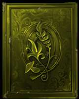
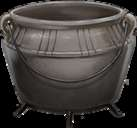
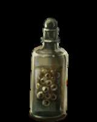
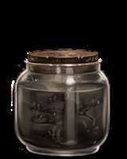
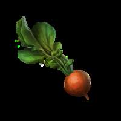

### Appendix A: Potion Brewing Appendix A: Potion Brewing
### P
otions are an essential part of wizarding life,
### Learning Recipes Learning Recipes
especially in the halls of St. Mungo's Hospital
for Magical Maladies and Injuries. Although
Approximately half of all recipes are learned in the standard
Potions is a core class for young witches and
Hogwarts curriculum. At the beginning of every school year,
wizards during their years at Hogwarts, it's not
the new Potions textbook includes five potion recipes. If a
everyone's cup of tea. Brewing your own
student wants to learn additional recipes, they must search
potions is not required. It's an optional pursuit
the Hogwarts library in their spare time, seek more advanced
for the wizards who are so inclined.
potioneers to tutor them and go on adventures to prove
### Brewing Requirements Brewing Requirements	themselves worthy of ancient knowledge.
Alternatively, if a brewed potion is acquired, an aspiring
potioneer can attempt to deconstruct that potion. This
Potion brewing does not require any dice rolls and therefore
requires a potions laboratory, a potioneer's kit, casting
does not require HM supervision. If the requirements are
specialis revelio and a Wisdom (Potion-Making) ability check.
fulfilled, a PC can brew a potion in the background while
The potion is destroyed by this process, but if the check is
other players are playing or while the player is away from the
successful, the potioneer learns the potion's recipe.
table. After a potion is brewed, the HM will confirm the
proper recipe was used and assess the ingredient quality.
### Obtaining Ingredients Obtaining Ingredients
Aside from the few potions with time restrictions, all you
need to instantly brew a potion is:
In a dim clearing of the Forbidden Forest, the private supplies
Access to a properly equipped potions laboratory	of a trusted ally or the dusty shelves of an apothecary, you're
A potioneer's kit in your possession	going to find many magical and mundane essences that can
Knowledge of the potion's recipe	be used as potion ingredients. Because of the magical
The ingredients specified in the recipe	applications of these potions and the danger in harvesting,
potion ingredients are extremely valuable.
A potions laboratory must be equipped with a cauldron,
Different tools will be required to harvest different kinds of
stirring rods, a source of heat, and a source of water. All
ingredients. As a general rule, plant-based ingredients will
Hogwarts students have access to the Potions classroom, but
require the use of herbologist's tools, while harvesting
extracurricular use may require permission from the Potions
ingredients from animals and magical beasts will use the
Master. This is the only potions laboratory available to the
potioneer's kit. Your own skill with these tools will determine
average Hogwarts student, but adult wizards may be able to
the quality of the obtained ingredient. Doing a rough job at
equip their own private laboratory or set up a more portable
harvesting will produce Poor ingredients, while skilled work
arrangement for their travels.
will produce Superior ingredients.
A potioneer's kit is included in the Hogwarts shopping list,
### Potion Effectiveness Potion Effectiveness so every student should have one. It includes a set of brass
scales, silver knife, cutting board, mortar and pestle,
measuring cups, eye dropper and vials, jars and flasks, as
A potion's effectiveness is dependent on the brewer's
well as some staple ingredients that aren't included in
technical skill and the preparation of the ingredients.
recipes. This will last a typical student's time at Hogwarts,
Proficiency in Wisdom (Potion-Making) and proficiency with
but the avid amateur may require replacements or upgrades.
the potioneer's kit are not necessary, but those proficiencies
will improve the effectiveness of your potions. Skill can often
© Pottermore Limited © Pottermore Limited © Pottermore Limited © Pottermore Limited © Pottermore Limited © Pottermore Limited © Pottermore Limited © Pottermore Limited © Pottermore Limited
help a brewer overcome the limitations of Poor ingredients,
but truly Exceptional potions require Superior ingredients.

| Potion-Making + Potioneer's Kit Proficiencies and Potion Quality Poor Normal Superior Proficiency Ingredients Ingredients Ingredients |  |  |  |
|---|---|---|---|
| None | Flawed | Flawed | Normal |
| One Flawed Normal Normal |  |  |  |
| Both | Normal | Normal | Exceptional |

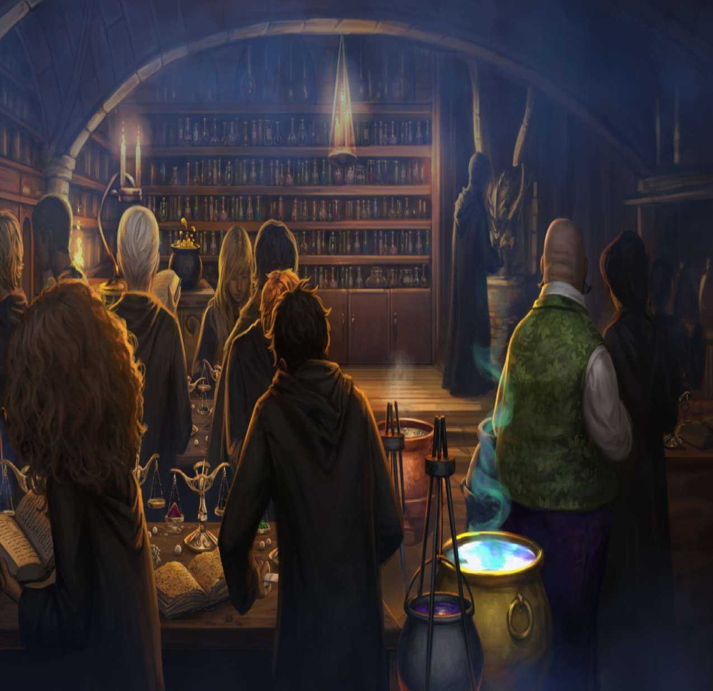

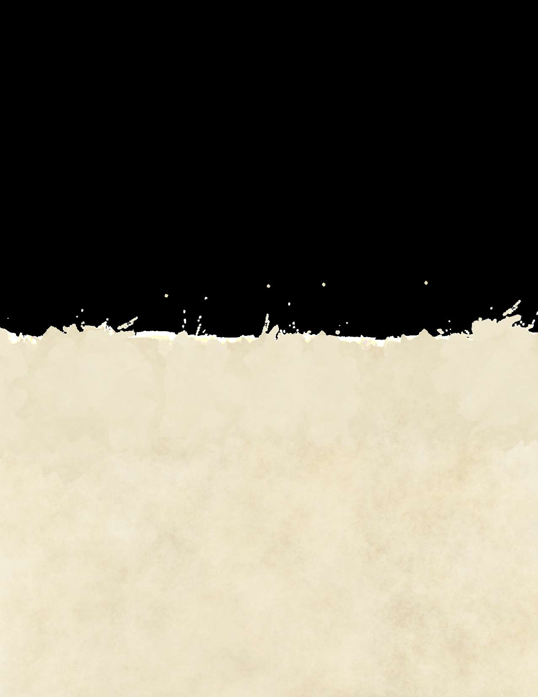

### Recipe List Recipe List

|  | i |
|---|---|

These are the recipes
Second Year Potions	Fourth Year Potions	Sixth Year Potions
included in each Hogwarts
Doxycide	Aging Potion	Draught of Living Death year's Potions class
Dreamless Sleep Potion	Fire Protection Potion	Erumpent Potion curriculum. Upon starting the
Elixir to Induce Euphoria	Garrotting Gas	Memory Potion school year or purchasing
Sleeping Draught	Pepperup Potion	Polyjuice Potion that year's Potions textbook,
Swelling Solution	Wound-Cleaning Potion	Skele-Gro
a character gains access to
these recipes.
Third Year Potions	Fifth Year Potions	Seventh Year Potions
First Year Potions	Antidote of Uncommon	Befuddlement Draught	Essence of Insanity
Poisons	Draught of Peace	Invisibility Potion
Antidote of Common
Baneberry Poison	Murtlap Essence	Mandrake Restorative
Poisons
Girding Potion	Noxious Potion	Draught
Blemish Blitzer
Shrinking Solution	Strengthening Solution	Weedosoros
Confusing Concoction
Wiggenweld Potion	Wit-Sharpening Potion Forgetfulness Potion
Herbicide Potion

### Potion Recipes Potion Recipes
### First Year Potions First Year Potions	Third Year Potions	Third Year Potions
Antidote of Common Poisons Antidote of Common Poisons	Antidote of Uncommon Poisons	Antidote of Uncommon Poisons
1 bundle of galanthus nivalis	1 flask of fire seeds
1 cluster of mistletoe berries	1 vial of billywig stings
1 flask of honeywater	1 vial of chizpurfle carapaces
1 vial of billywig stings
Baneberry Poison Baneberry Poison
Blemish Blitzer Blemish Blitzer
1 bundle of cowbane
1 bundle of nettles	1 bundle of shrivelfigs
1 flask of bubotuber pus	2 clusters of baneberries
1 flask of flobberworm mucus
Girding Potion Girding Potion
1 porcupine quill
1 set of fairy wings
Confusing Concoction Confusing Concoction
1 powdered flying seahorse
1 bundle of gurdyroots	1 vial of doxy eggs
2 bundles of lovage
Shrinking Solution Shrinking Solution
1 flask of ethanol
1 bundle of cowbane
Forgetfulness Potion Forgetfulness Potion
1 bundle of shrivelfigs
1 bundle of lovage	1 flask of wormwood infusion
1 cluster of mistletoe berries	1 vial of woodlice extract
2 flasks of Lethe River water
Wiggenweld Potion Wiggenweld Potion
Herbicide Potion Herbicide Potion
1 bundle of wiggentree bark
1 Flask of flobberworm mucus	1 flask of honeywater
1 powdered lionfish spine	1 powdered root of asphodel
1 powdered streeler shell
1 vial of doxy eggs
### Second Year Potions Second Year Potions	Fourth Year Potions	Fourth Year Potions
Doxycide Doxycide	Aging Potion	Aging Potion
1 bundle of cowbane	1 bursting mushroom
1 bundle of hemlock	1 newt spleen
1 flask of bundimun secretion	1 vial of chizpurfle carapaces
1 powdered streeler shell
Fire Protection Potion Fire Protection Potion
Dreamless Sleep Potion Dreamless Sleep Potion
1 bursting mushroom
1 bundle of poppy heads	1 powdered wartcap
1 cluster of baneberries	1 vial of salamander blood
1 frog brain
Garrotting Gas Garrotting Gas
1 powdered octopus
1 flask of bundimun secretion
Elixir to Induce Euphoria Elixir to Induce Euphoria
1 flask of ethanol
1 bundle of peppermint	1 powdered wartcap
1 bundle of shrivelfigs	1 vial of exploding ginger eyelashes
1 flask of wormwood infusion
Pepperup Potion Pepperup Potion
1 porcupine quill
1 cluster of boom berries
Sleeping Draught Sleeping Draught
1 flask of ethanol
1 bundle of angel's trumpet	1 flask of vervain infusion
1 bundle of scurvy grass	1 powdered octopus
1 flask of flobberworm mucus
Wound-Cleaning Potion Wound-Cleaning Potion
Swelling Solution Swelling Solution
1 bundle of star grass
1 bat spleen	1 flask of vervain infusion
1 bundle of nettles	1 staghorn mushroom
1 flask of pufferfish eyes	1 vial of spirit of myrrh
1 vial of exploding ginger eyelashes

### Fifth Year Potions Fifth Year Potions	Seventh Year Potions	Seventh Year Potions
Befuddlement Draught Befuddlement Draught	Essence of Insanity	Essence of Insanity
1 bundle of lovage	1 bundle of weed-of-sorrows
1 bundle of scurvy grass	1 clutch of runespoor eggs
1 bundle of sneezewort	1 giant purple toad wart
1 vial of belladonna essence
Draught of Peace Draught of Peace
1 vial of syrup of arnica
1 porcupine quill
Invisibility Potion Invisibility Potion
1 powdered moonstone
1 vial of syrup of hellebore	2 boomslang skins
1 unicorn hair
Murtlap Essence Murtlap Essence
1 vial of African sea salt
2 murtlap tentacles	1 vial of doxy eggs
1 vial of spirit of myrrh
Mandrake Restorative Draught Mandrake Restorative Draught
Noxious Potion Noxious Potion
3 mandrake roots
1 bundle of angel's trumpet	1 vial of chizpurfle carapaces
1 cluster of moonseed berries	1 vial of spirit of myrrh
1 vial of syrup of hellebore
Weedosoros Weedosoros
Strengthening Solution Strengthening Solution
1 bundle of hemlock
1 flask of re'em blood	1 bundle of valerian roots
1 vial of fanged geranium fangs	1 bundle of weed-of-sorrows
1 vial of salamander blood	1 vial of belladonna essence
1 vial of syrup of arnica
Wit-Sharpening Potion Wit-Sharpening Potion
### Sixth Year Potions Sixth Year Potions
1 clutch of runespoor eggs
1 newt spleen
Draught of Living Death Draught of Living Death
1 powdered dragon claw
2 bundles of valerian roots
1 powdered scarab beetle
1 powdered root of asphodel
1 sloth brain
1 sloth brain
2 sopophorous beans
1 vial of African sea salt
Erumpent Potion Erumpent Potion
1 bundle of venomous tentacula leaves
1 flask of fire seeds
2 powdered erumpent horns
1 vial of exploding ginger eyelashes
Memory Potion Memory Potion
1 bundle of galanthus nivalis
1 bundle of sneezewort
1 jobberknoll feather
Polyjuice Potion Polyjuice Potion
1 boomslang skin
1 bundle of full-moon fluxweed
2 bundles of knotgrass
1 flask of lacewing flies
1 powdered bicorn horn
1 sopophorous bean
Skele-Gro Skele-Gro
1 chinese chomping cabbage
1 flask of pufferfish eyes
1 murtlap tentacle
1 powdered griffin claw
1 powdered scarab beetle

### Appendix B: Patronus Rolling Tables Appendix B: Patronus Rolling Tables
### Y
our character's corporeal patronus can be	The last method provides customized rolling tables with
determined several different ways. First, you	options based on your character's personality. Find your
can simply choose your patronus. Its form	character's Background on the subsequent pages. Then,
makes no significant mechanical impact on the	locate your House under that Background and use that
expecto patronum spell. The second method is	rolling table to determine your corporeal patronus. If your
getting a random result by rolling on the d100	character is not a Hogwarts student, choose a house based
table below.	on your character's personality and values.
d100 Corporeal Patronus

| 67 | Rhinoceros |
|---|---|

1 Aardvark	34	Hedgehog
2 Adder	35	Heron	68 Robin

| 69 | Rottweiler |
|---|---|

3 Badger	36	Hummingbird
4 Bat	37	Husky	70 Salmon

| 71 | Scops Owl |
|---|---|

5 Beagle	38	Hyena
6 Black and White Cat	39	Impala	72 Seal

| 73 | Shark |
|---|---|

7 Black Bear	40	Irish Wolfhound
8 Black Mamba	41	King Cobra	74 Siberian Cat

| 75 | Snowy Owl |
|---|---|

9 Black Mare/Stallion	42	Kingfisher
10 Bloodhound	43	Leopard	76 Sphynx Cat

| 77 | Squirrel |
|---|---|

11 Borzoi	44	Lion
12 Brown Bear	45	Lynx	78 St. Bernard

| 79 | Stag |
|---|---|

13 Brown Owl	46	Magpie
14 Buffalo	47	Manx Cat	80 Swallow

| 81 | Swan |
|---|---|

15 Calico Cat	48	Marsh Harrier
16 Capuchin Monkey	49	Mastiff	82 Tiger

| 83 | Tortoiseshell Cat |
|---|---|

17 Cheetah	50	Mole
18 Chestnut Mare/Stallion	51	Mountain Hare	84 Vole

| 85 | Vulture |
|---|---|

19 Chow Dog	52	Ocicat
20 Dapple Grey Mare/Stallion	53	Orangutan	86 West Highland Terrier

| 87 | Wild Boar |
|---|---|

21 Doe	54	Orca
22 Dolphin	55	Oryx	88 Wild Rabbit

| 89 | Wildcat |
|---|---|

23 Dragonfly	56	Osprey
24 Eagle	57	Otter	90 Wolf

| 91 | Abraxan Winged Horse |
|---|---|

25 Eagle Owl	58	Peacock
26 Elephant	59	Pine Marten	92 Dragon

| 93 | Erumpent |
|---|---|

27 Falcon	60	Polar Bear
28 Field Mouse	61	Polecat	94 Fire-Dwelling Salamander

| 95 | Granian Winged Horse |
|---|---|

29 Fox	62	Python
30 Ginger Cat	63	Ragdoll Cat	96 Hippogriff

| 97 | Occamy |
|---|---|

31 Goshawk	64	Rat
32 Grass Snake	65	Rattlesnake	98 Runespoor

| 99 | Thestral |
|---|---|

33 Greyhound	66	Raven

### Artist Artist	Bookworm	Bookworm
### Gryffindor Gryffindor	Gryffindor	Gryffindor
d10	Corporeal Patronus	d10	Corporeal Patronus
1-2	Cheetah	1-3	Black and White Cat
3-4	Fox	4-5	Black Bear
5-7	Heron	6-7	Otter
8-9	Robin	8-9	Swift
0 Hippogriff	0	Fire-dwelling Salamander
### Hufflepuff Hufflepuff	Hufflepuff	Hufflepuff
d10 Corporeal Patronus	d10	Corporeal Patronus
1-2 Bay Mare/Stallion	1-2	Deerhound
3-5 Borzoi	3-4	Orangutan
6-7 Wood Mouse	5-7	Red Squirrel
8-9 Swallow	8-9	Tonkinese Cat
0 Granian Winged Horse	0	Fire-dwelling Salamander
### Ravenclaw Ravenclaw	Ravenclaw	Ravenclaw
d10 Corporeal Patronus	d10	Corporeal Patronus
1-3 Dolphin	1-2	Dolphin
4-5 Hummingbird	3-4	Eagle
6-7 Little Owl	5-7	Field Mouse
8-9 Siberian Cat	8-9	Orangutan
0 Fire-dwelling Salamander	0	Runespoor
### Slytherin Slytherin	Slytherin	Slytherin
d10 Corporeal Patronus	d10	Corporeal Patronus
1-2 Adder	1-2	Calico Cat
3-5 Blackbird	3-5	Crow
6-7 Greyhound	6-7	Hyena
8-9 Oryx	8-9	Python
0 Abraxan Winged Horse	0	Runespoor

### Dreamer Dreamer	Groundskeeper	Groundskeeper
### Gryffindor Gryffindor	Gryffindor	Gryffindor
d10 Corporeal Patronus	d10	Corporeal Patronus
1-3 Dapple Grey Mare/Stallion	1-3	Brown Bear
4-5 Manx Cat	4-5	Kingfisher
6-7 Otter	6-7	Lion
8-9 White Swan	8-9	St. Bernard
0 Thestral	0	Erumpent
### Hufflepuff Hufflepuff	Hufflepuff	Hufflepuff
d10	Corporeal Patronus	d10	Corporeal Patronus
1-3	Doe	1-2	Bassett Hound
4-5	Elephant	3-5	Hedgehog
6-7	Vole	6-7	Sparrow
8-9	Wild Rabbit	8-9	Stag
0 Occamy	0	Hippogriff
### Ravenclaw Ravenclaw	Ravenclaw	Ravenclaw
d10	Corporeal Patronus	d10	Corporeal Patronus
1-2	Mountain Hare	1-2	Black Bear
3-4	Raven	3-4	Bloodhound
5-6	Red Squirrel	5-7	Marsh Harrier
7-9	White Swan	8-9	Sparrow
0 Unicorn	0	Occamy
### Slytherin Slytherin	Slytherin	Slytherin
d10	Corporeal Patronus	d10	Corporeal Patronus
1-2	Bat	1-2	Orca
3-4	Black Swan	3-4	Rattlesnake
5-7	Grass Snake	5-6	Shrew
8-9	Python	7-9	Wildcat
0 Thestral	0	Thestral

### Klutz Klutz	Potioneer	Potioneer
### Gryffindor Gryffindor	Gryffindor	Gryffindor
d10	Corporeal Patronus	d10	Corporeal Patronus
1-3	Irish Wolfhound	1-3	Brown Owl
4-5	Pheasant	4-5	Grass Snake
6-7	Salmon	6-7	Piebald Mare/Stallion
8-9	Sparrowhawk	8-9	Tiger
0 Erumpent	0	Abraxan Winged Horse
### Hufflepuff Hufflepuff	Hufflepuff	Hufflepuff
d10	Corporeal Patronus	d10	Corporeal Patronus
1-2	Aardvark	1-3	Chow Dog
3-5	Buffalo	4-5	Dragonfly
6-7	Polar Bear	6-7	Ginger Cat
8-9	Weasel	8-9	Snowy Owl
0 Erumpent	0	Occamy
### Ravenclaw Ravenclaw	Ravenclaw	Ravenclaw
d10	Corporeal Patronus	d10	Corporeal Patronus
1-2	Capuchin Monkey	1-2	Crow
3-4	Mole	3-5	Eagle Owl
5-6	Polecat	6-7	Husky
7-9	Scops Owl	8-9	Russian Blue Cat
0 Thestral	0	Hippogriff
### Slytherin Slytherin	Slytherin	Slytherin
d10 Corporeal Patronus	d10	Corporeal Patronus
1-2 Leopard	1-3	Adder
3-4 Magpie	4-5	Black Mare/Stallion
5-6 Mongrel Dog	6-7	King Cobra
7-9 Stoat	8-9	Nightjar
0 Fire-dwelling Salamander	0	Hippogriff

### Protector Protector	Quidditch Fan	Quidditch Fan
### Gryffindor Gryffindor	Gryffindor	Gryffindor
d10	Corporeal Patronus	d10	Corporeal Patronus
1-2	Great Grey Owl	1-2	Fox Terrier
3-4	Newfoundland	3-5	Lion
5-7	Stag	6-7	Rhinoceros
8-9	Swallow	8-9	Rottweiler
0 Unicorn	0	Dragon
### Hufflepuff Hufflepuff	Hufflepuff	Hufflepuff
d10	Corporeal Patronus	d10	Corporeal Patronus
1-3	Badger	1-2	Beagle
4-5	Dun Mare/Stallion	3-4	Ocicat
6-7	Mastiff	5-6	Osprey
8-9	Sphynx Cat	7-9	Wild Boar
0 Erumpent	0	Dragon
### Ravenclaw Ravenclaw	Ravenclaw	Ravenclaw
d10	Corporeal Patronus	d10	Corporeal Patronus
1-2	Brown Bear	1-2	Black and White Cat
3-4	King Cobra	3-5	Falcon
5-6	Lynx	6-7	Leopard
7-9	Husky	8-9	Robin
0 Unicorn	0	Granian Winged Horse
### Slytherin Slytherin	Slytherin	Slytherin
d10	Corporeal Patronus	d10	Corporeal Patronus
1-2	Goshawk	1-2	Ocicat
3-5	Rhinoceros	3-4	Polar Bear
6-7	Tiger	5-7	Rattlesnake
8-9	Tortoiseshell Cat	8-9	Shark
0 Dragon	0	Runespoor

### Socialite Socialite	Troublemaker	Troublemaker
### Gryffindor Gryffindor	Gryffindor	Gryffindor
d10 Corporeal Patronus	d10	Corporeal Patronus
1-2 Chestnut Mare/Stallion	1-2	Calico Cat
3-5 Hummingbird	3-4	Magpie
6-7 Pine Marten	5-6	Shark
8-9 Rat	7-9	Wolf
0 Granian Winged Horse	0	Dragon
### Hufflepuff Hufflepuff	Hufflepuff	Hufflepuff
d10	Corporeal Patronus	d10	Corporeal Patronus
1-2 Grey Squirrel	1-2	Black Mamba
3-4 Ibizan Hound	3-4	Bat
5-7 Ragdoll Cat	5-7	Buzzard
8-9 West Highland Terrier	8-9	White Mare/Stallion
0 Unicorn	0	Abraxan Winged Horse
### Ravenclaw Ravenclaw	Ravenclaw	Ravenclaw
d10 Corporeal Patronus	d10	Corporeal Patronus
1-3 Brown Hare	1-2	Falcon
4-5 Grey Squirrel	3-5	Fox
6-7 Nebelung Cat	6-7	Seal
8-9 Seal	8-9	Siberian Cat
0 Abraxan Winged Horse	0	Hippogriff
### Slytherin Slytherin	Slytherin	Slytherin
d10 Corporeal Patronus	d10	Corporeal Patronus
1-2 Cheetah	1-3	Black Mamba
3-4 Dragonfly	4-5	Impala
5-6 Mink	6-7	Raven
7-9 Peacock	8-9	Vulture
0 Granian Winged Horse	0	Runespoor

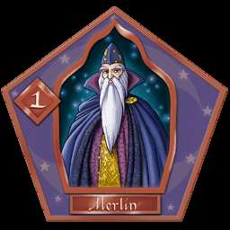
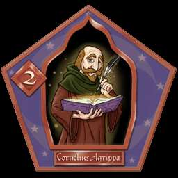
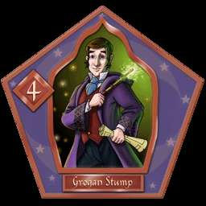
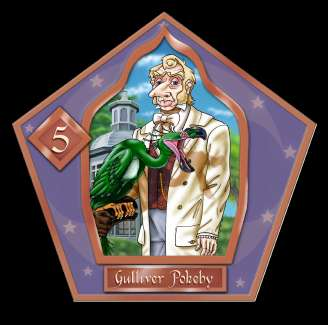
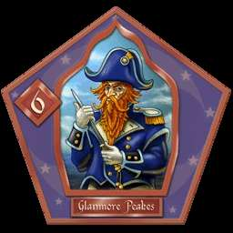
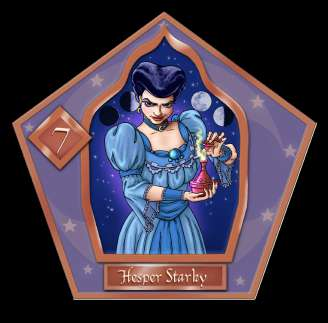

### Appendix C: Chocolate Frog Cards Appendix C: Chocolate Frog Cards
The following images originate from Harry Potter and the Chamber of Secrets (2002 video game) developed by
KnowWonder, Eurocom, EA UK, Argonaut, and Gryptonite Games and published by Electronic Arts.
### Bronze Cards Bronze Cards
### #5 - Gulliver Pokeby #5 - Gulliver Pokeby
A wizard, magizoologist, expert on magical birds and author
### #1 - Merlin #1 - Merlin
of Why I Didn't Die When the Augurey Cried
A legendary British wizard who lived during the Middle Ages
### #6 - Glanmore Peakes #6 - Glanmore Peakes
### #2 - Cornelius Agrippa #2 - Cornelius Agrippa
A Scottish wizard who was famous for having slain the Sea
Serpent of Cromer
A German wizard who authored many magical works
### #7 - Hesper Starkey #7 - Hesper Starkey
### #4 - Grogan Stump #4 - Grogan Stump
A witch who studied how the moon's phases affected potion
A British wizard who was Minister for Magic from 1811 to	fabrication
1819 and was very popular in the job

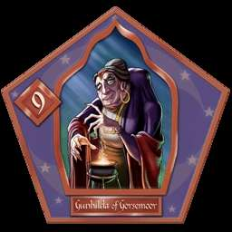
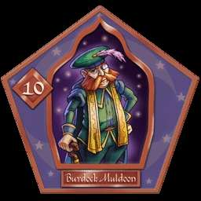
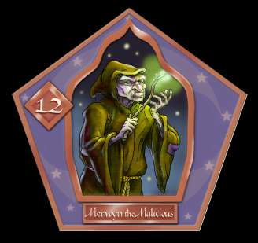
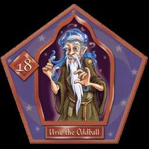
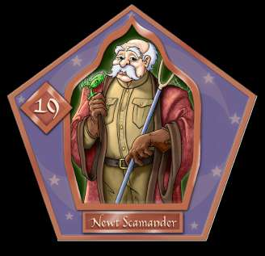
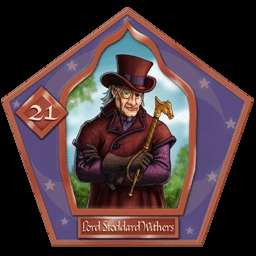

### #9 - Gunhilda of Gorsemoor #9 - Gunhilda of Gorsemoor	#18 - Uric the Oddball	#18 - Uric the Oddball
A one-eyed, hump-backed British witch and healer who	A medieval wizard who became famous for his eccentric
discovered a cure for dragon pox	behavior, such as wearing a jellyfish as a hat and sleeping in a
room with fifty pet augureys
### #10 - Burdock Muldoon #10 - Burdock Muldoon
### #19 - Newt Scamander #19 - Newt Scamander
A British wizard and the Chief of the Wizards' Council either
An English wizard, famed magizoologist and the author of
in the fourteenth or fifteenth century
Fantastic Beasts and Where to Find Them
### #12 - Merwyn the Malicious #12 - Merwyn the Malicious
### #21 - Lord Stoddard Withers #21 - Lord Stoddard Withers
A medieval Dark Wizard credited with the invention of many
unpleasant jinxes and hexes
A wizard and magizoologist who bred winged horses

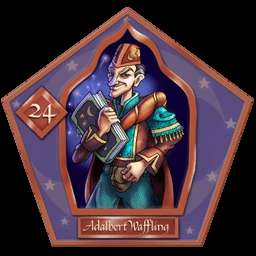
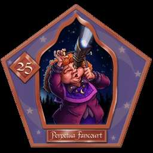
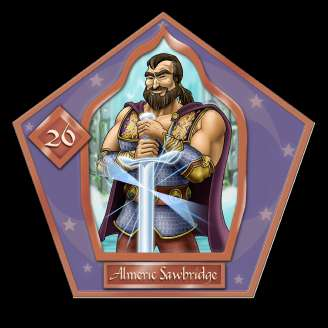
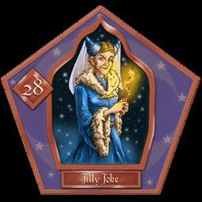
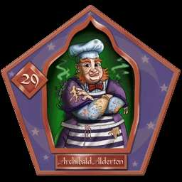
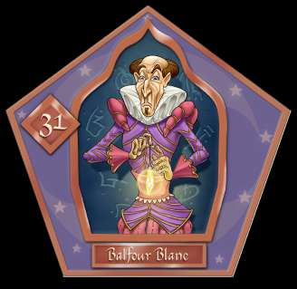

### #24 - Adalbert Waffling #24 - Adalbert Waffling	#28 - Tilly Toke	#28 - Tilly Toke
A British wizard was a Magical Theoretician, credited to have	A British witch who saved the lives of several muggles during
written "All About Magic", and is considered the "Father of	the Ilfracombe Incident in 1932
Magic Theory"
### #29 - Archibald Alderton #29 - Archibald Alderton
### #25 - Perpetua Fancourt #25 - Perpetua Fancourt
A wizard who was known for blowing up the hamlet of Little
A witch who is credited with the invention of the lunascope,	Dropping while attempting to magically mix a birthday cake
an astronomical device used to analyze the phases of the
moon
### #31 - Balfour Blane #31 - Balfour Blane
A British wizard who established the Committee on
### #26 - Almeric Sawbridge #26 - Almeric Sawbridge
Experimental Charms
A British wizard and troll hunter who defeated the largest
river troll to have ever existed in Britain

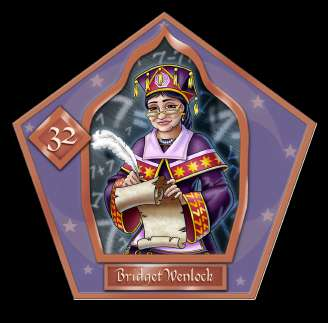
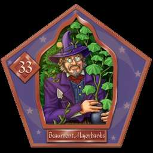
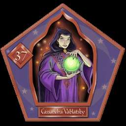
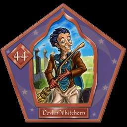
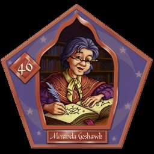
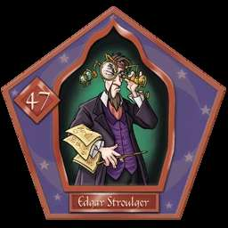

### #32 - Bridget Wenlock #32 - Bridget Wenlock
### #44 - Devlin Whitehorn #44 - Devlin Whitehorn
A famous thirteenth-century English witch and arithmancer
A British wizard who, in 1967, founded the Nimbus Racing
who was the first to establish the magical properties of the
Broom Company, considered to be "the top of the field"
number seven
### #46 - Miranda Goshawk #46 - Miranda Goshawk
### #33 - Beaumont Marjoribanks #33 - Beaumont Marjoribanks
A witch and celebrated author who specialized in writing
A wizard and pioneer in the field of Herbology, having
Charms spellbooks, such as The Standard Book of Spells
collected and classified many rare magical plants and flowers
### #47 - Edgar Stroulger #47 - Edgar Stroulger
### #37 - Cassandra Vablatsky #37 - Cassandra Vablatsky
A wizard who invented the Sneakoscope, a dark detector that
A witch, celebrated Seer and author of Unfogging the Future,
lights up, spins and whistles if someone is doing something
a Divination textbook required at Hogwarts School of
untrustworthy nearby
Witchcraft and Wizardry

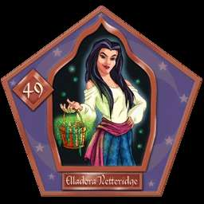
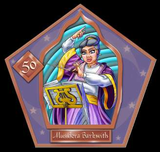
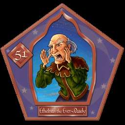
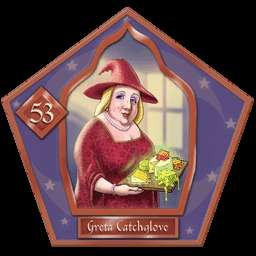
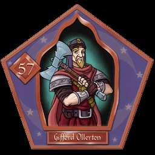
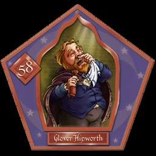

### #49 - Elladora Ketteridge #49 - Elladora Ketteridge	#53 - Greta Catchlove	#53 - Greta Catchlove
The first witch to discover the magical properties of	A witch who wrote the original edition of Charm Your Own
gillyweed, having done so by accident	Cheese
### #50 - Musidora Barkwith #50 - Musidora Barkwith
### #57 - Gifford Ollerton #57 - Gifford Ollerton
A witch and composer. Her unfinished work, the Wizarding
A British wizard famous for his reputation as a giant-slayer,
Suite, featured an exploding tuba and has been banned ever
having killed the giant Hengist of Upper Barnton who
since a performance in 1902 blew the roof off of the town hall
terrorized the small town of Upper Barnton in the fifteenth
of Ackerley
century
### #51 - Ethelred the Ever-Ready #51 - Ethelred the Ever-Ready
### #58 - Glover Hipworth #58 - Glover Hipworth
A medieval Dark Wizard, infamous for being offended for no
A wizard who specialized in Potion development and became
reason and cursing innocent bystanders
famous for the invention of the pepperup potion, the cure for
the common cold

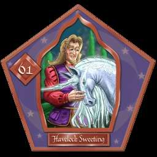
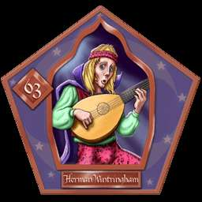
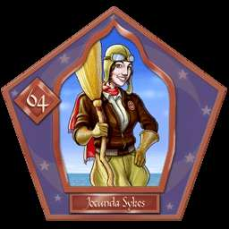
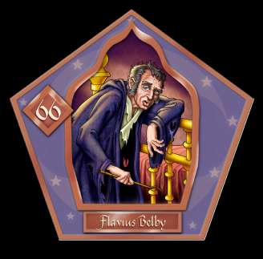
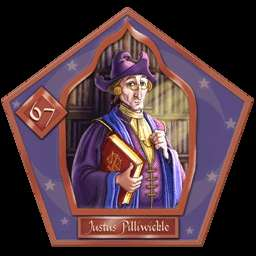
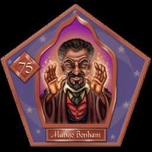

### #66 - Flavius Belby #66 - Flavius Belby
### #61 - Havelock Sweeting #61 - Havelock Sweeting
The only known wizard to survive a lethifold attack
A British wizard and magizoologist well-known for being an
expert on unicorns
### #67 - Justus Pilliwickle #67 - Justus Pilliwickle
### #63 - Herman Wintringham #63 - Herman Wintringham
A British wizard and celebrated Head of the Department of
Magical Law Enforcement
A wizard and lutenist for the popular band The Weird Sisters
### #75 - Mungo Bonham #75 - Mungo Bonham #64 - Jocunda Sykes #64 - Jocunda Sykes
A wizard and healer who founded St. Mungo's Hospital for A witch who was famous for flying across the Atlantic Ocean
Magical Maladies and Injuries in the 1600s

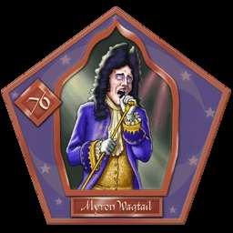
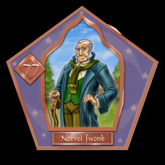
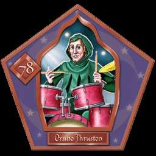
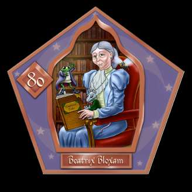
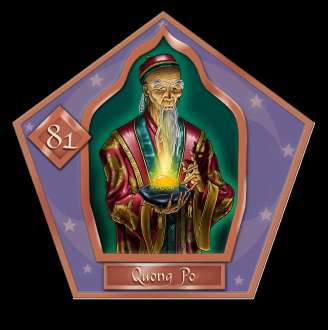
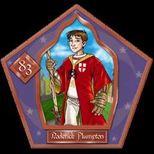

### #76 - Myron Wagtail #76 - Myron Wagtail	#80 - Beatrix Bloxam	#80 - Beatrix Bloxam
A wizard and lead singer of the wizarding world's popular	A witch who wrote the infamous Toadstool Tales,a series of
band The Weird Sisters	children's books featuring bowdlerised adaptations of stories
from earlier works, including The Tales of Beedle the Bard
### #77 - Norvel Twonk #77 - Norvel Twonk
### #81 - Quong Po #81 - Quong Po
A wizard who died saving a muggle child from a manticore
A Chinese wizard and dragonologist who studied the Chinese
Fireball breed and discovered the magical uses of their
powdered eggs
### #78 - Orsino Thruston #78 - Orsino Thruston
A wizard and the drummer for the popular band The Weird
### Sisters	#83 - Roderick Plumpton	#83 - Roderick Plumpton
An English wizard who was the Seeker for the Tutshill
Tornadoes quidditch team during the early 1900s

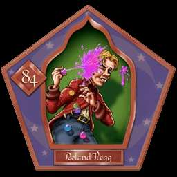
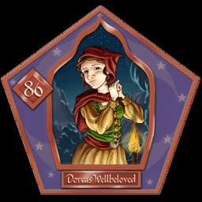
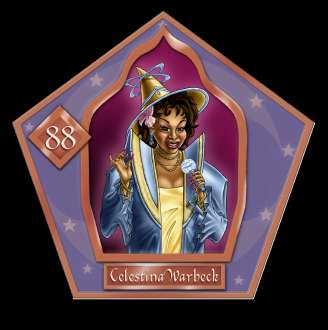
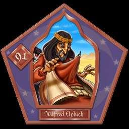
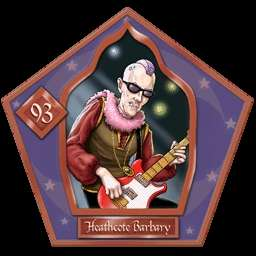
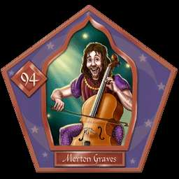

### #84 - Roland Kegg #84 - Roland Kegg	#91 - Wilfred Elphick	#91 - Wilfred Elphick
An English wizard who was President of the English	The first wizard to be gored by an African erumpent, which is
Gobstones team	an extremely unlikely event, given the fact that the horn of an
erumpent almost always explodes on contact, due to the fluid
it contains
### #86 - Dorcas Wellbeloved #86 - Dorcas Wellbeloved
### A witch famous for founding the Society of Distressed	#93 - Heathcote Barbary	#93 - Heathcote Barbary
Witches
A wizard and the rhythm guitarist for the popular wizarding
band The Weird Sisters
### #88 - Celestina Warbeck #88 - Celestina Warbeck
### A Welsh witch and popular singer known as "The Singing	#94 - Merton Graves	#94 - Merton Graves
Sorceress"
A wizard and the cellist for the popular wizarding band The
Weird Sisters

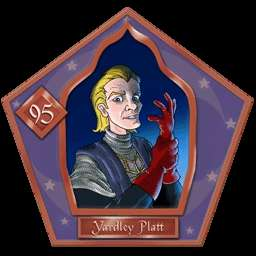
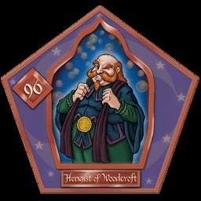
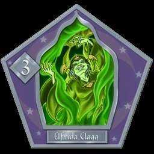
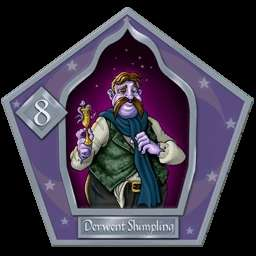
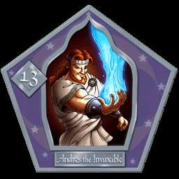
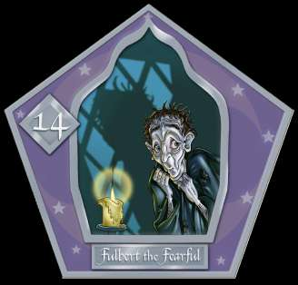

### #95 - Yardley Platt #95 - Yardley Platt	#8 - Derwent Shimpling	#8 - Derwent Shimpling
An infamous Dark wizard who was known for being a serial	A wizarding comedian who once ate an entire Venomous
goblin killer	Tentacula on a bet. Though he survived, his skin was left
purple
### #96 - Hengist of Woodcroft #96 - Hengist of Woodcroft
### #13 - Andros the Invincible #13 - Andros the Invincible
A medieval English wizard best known as the founder of the
village of Hogsmeade	A celebrated Ancient Greek wizard who, reportedly, was able
to conjure a Patronus of giant size
### Silver Cards Silver Cards
### #14 - Fulbert the Fearful #14 - Fulbert the Fearful
A wizard who was famous for being so cowardly that he
### #3 - Elfrida Clagg #3 - Elfrida Clagg
never ventured out of his house
A British witch and the Chieftainess of the Wizards' Council
either in the fourteenth or seventeenth century

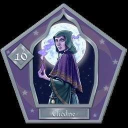
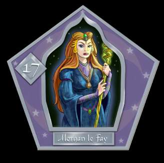
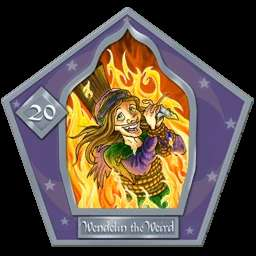
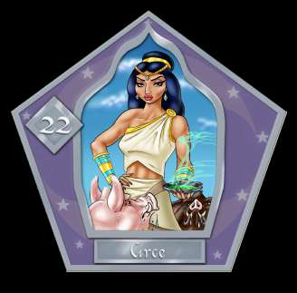
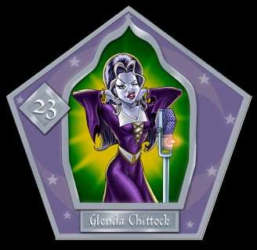
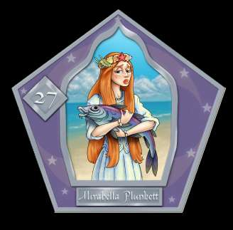

### #22 - Circe #22 - Circe
### #16 - Cliodna (Cliodne) #16 - Cliodna (Cliodne)
A witch who lived in ancient Greece on an island referred to
A famous medieval Irish witch and druidess
as Circe's Island. She enjoyed transfiguring lost sailors into
animals
### #17 - Morgan le Fay (Morgana) #17 - Morgan le Fay (Morgana)
### #23 - Glenda Chittock #23 - Glenda Chittock
A medieval dark witch, famous for being the enemy of the
legendary wizard Merlin and the half-sister of King Arthur
A British witch who was host of the Wizarding Wireless
Network programme, Witching Hour
### #20 - Wendelin the Weird #20 - Wendelin the Weird
### #27 - Mirabella Plunkett #27 - Mirabella Plunkett
An eccentric British medieval witch who was famous for
being burnt at the stake no less than forty-seven times in
A British witch famous for falling in love with a merman in
various disguises
Loch Lomond while on holiday. After her parents forbade her
to marry him, she transfigured herself into a haddock and
was never seen again

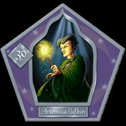
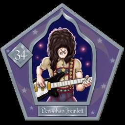
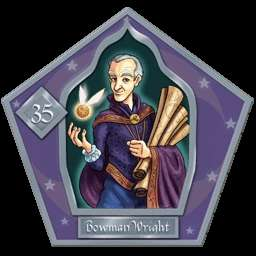
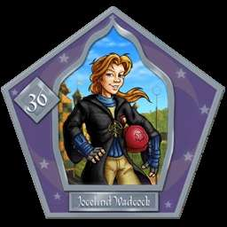
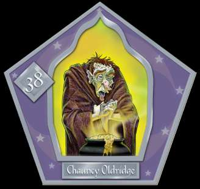
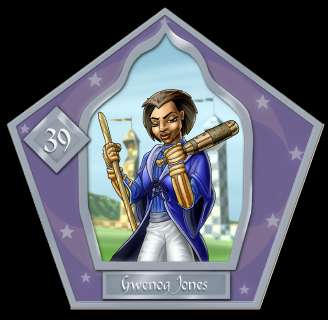

### #30 - Artemisia Lufkin #30 - Artemisia Lufkin	#36 - Joscelind Wadcock	#36 - Joscelind Wadcock
The first witch to serve as Minister for Magic for Great	A British witch who played as a Chaser for the Puddlemere
Britain	United Quidditch team. The record-holder for highest
number of Quidditch goals in the British League during the
20th century
### #34 - Donaghan Tremlett #34 - Donaghan Tremlett
### #38 - Chauncey Oldridge #38 - Chauncey Oldridge
A Muggle-born wizard who played bass for the popular
wizarding band, The Weird Sisters
The first known victim of Dragon Pox
### #39 - Gwenog Jones #39 - Gwenog Jones #35 - Bowman Wright #35 - Bowman Wright
A professional Quidditch player who later achieved fame as A half-blood wizard and a skilled metal charmer who lived in
the captain and beater of the Welsh all-female Quidditch
Godric's Hollow sometime during the Middle Ages
team, the Holyhead Harpies

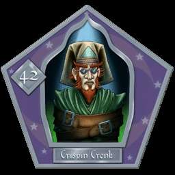
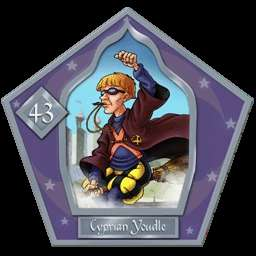
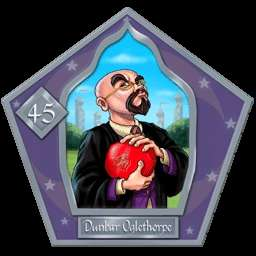
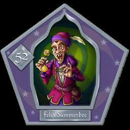
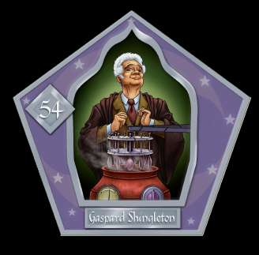
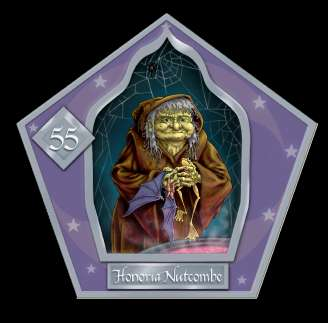

### #42 - Crispin Cronk #42 - Crispin Cronk	#52 - Felix Summerbee	#52 - Felix Summerbee
An Egyptophile British wizard who insisted on keeping	A wizard who invented the Cheering Charm
several sphinxes in his backyard
### #54 - Gaspard Shingleton #54 - Gaspard Shingleton
### #43 - Cyprian Youdle #43 - Cyprian Youdle
A wizarding inventor who first devised the Self-Stirring
Cauldron
An English wizard and Quidditch referee from Norfolk, the
only known referee to have been killed during a Quidditch
match
### #55 - Honoria Nutcombe #55 - Honoria Nutcombe
A witch who founded of the Society for the Reformation of
### #45 - Dunbar Oglethorpe #45 - Dunbar Oglethorpe
Hags
A British wizard who served as the Chief of the Quidditch
Union for the Administration and Betterment of the British
League and its Endeavours

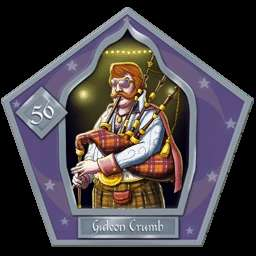
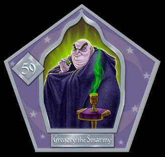
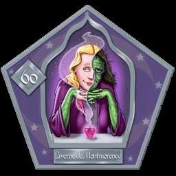
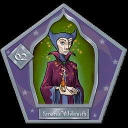
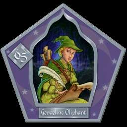
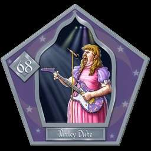

### #56 - Gideon Crumb #56 - Gideon Crumb	#62 - Ignatia Wildsmith	#62 - Ignatia Wildsmith
A wizard who played bagpipes for the popular wizarding	A witch and wizarding inventor who was famously the creator
band, The Weird Sisters	of Floo Powder
### #59 - Gregory the Smarmy #59 - Gregory the Smarmy
### #65 - Gondoline Oliphant #65 - Gondoline Oliphant
A medieval British wizard and Potioneer who invented
A British witch made famous for studying the life and habits
Gregory's Unctuous Unction, a potion that makes the drinker
of trolls
believe whomever gave the potion is his or her best friend
### #68 - Kirley Duke #68 - Kirley Duke
### #60 - Laverne de Montmorency #60 - Laverne de Montmorency
A British wizard and the lead guitarist for the popular band,
A nineteenth-century potioneer who invented a number of
The Weird Sisters, and one of its first three members
love potions

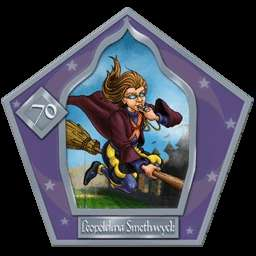
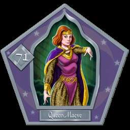
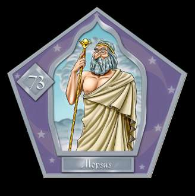
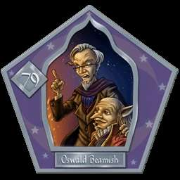
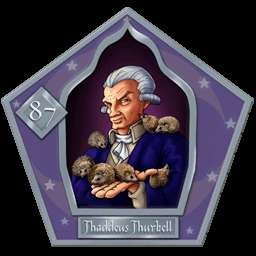

### #70 - Leopoldina Smethwyck #70 - Leopoldina Smethwyck	#79 - Oswald Beamish	#79 - Oswald Beamish
A British witch who was well known for her career as a	A wizarding activist and a pioneer of goblin rights
Quidditch referee
[Card Not Found]                    [Card Not Found]
### #85 - Blenheim Stalk #85 - Blenheim Stalk
A wizard and author who was a well-known expert on
### #71 - Queen Maeve #71 - Queen Maeve
muggles
A famous Irish witch who lived during the Middle Ages
### #87 - Thaddeus Thurkell #87 - Thaddeus Thurkell
### #73 - Mopsus #73 - Mopsus
A wizard who fathered seven sons who were all squibs. He
transfigured them into hedgehogs out of disgust
A blind Seer whose power was great enough for him to
accurately predict future events

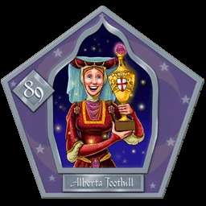
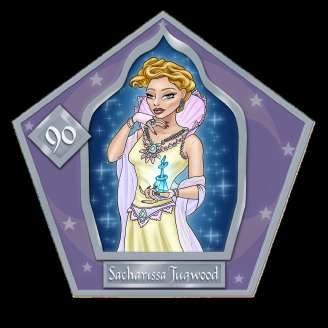
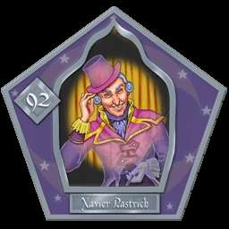
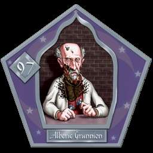
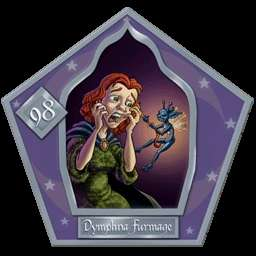
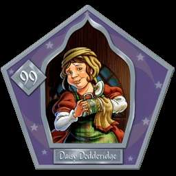

### #89 - Alberta Toothill #89 - Alberta Toothill	#97 - Alberic Grunnion	#97 - Alberic Grunnion
An English medieval witch and duellist who, defying all odds,	A nineteenth century wizard inventor who developed the
won the All-England Wizarding Duelling Competition of	dungbomb, a magical stink bomb that gives off a putrid odor
1430
### #98 - Dymphna Furmage #98 - Dymphna Furmage
### #90 - Sacharissa Tugwood #90 - Sacharissa Tugwood
A British witch who famously campaigned for the destruction
A famous Potioneer and the first witch to use beauty potions,	of pixies after being abducted by them while holidaying in
Cornwall having developed quite a few of them herself
### #92 - Xavier Rastrick #92 - Xavier Rastrick	#99 - Daisy Dodderidge	#99 - Daisy Dodderidge
A lively wizard entertainer who is famous for unexpectedly	The witch who built the Leaky Cauldron in a successful
vanishing during a performance in Painswick before the very	attempt to create a gateway between the muggle and
wizarding worlds eyes of his audience, never to be seen again

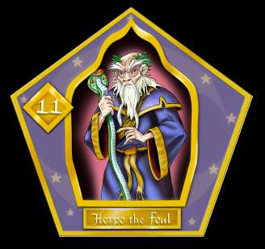
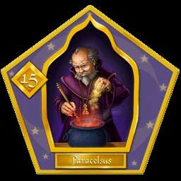
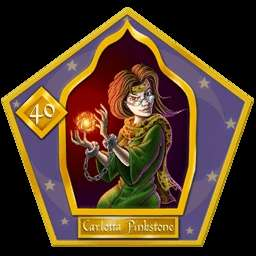
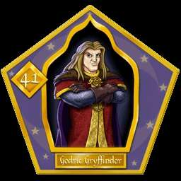
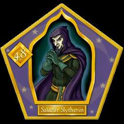
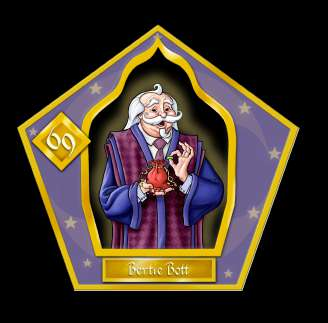

### Gold Cards Gold Cards
### #41 - Godric Gryffindor #41 - Godric Gryffindor
### #11 - Herpo the Foul #11 - Herpo the Foul	An English wizard and one of the four founders of Hogwarts
School of Witchcraft and Wizardry
An ancient Greek Dark wizard, infamous for being a pioneer
the field of the Dark Arts, becoming the first known wizard to
create the Basilisk, in addition to the first known Horcrux
### #48 - Salazar Slytherin #48 - Salazar Slytherin
An English pure-blood wizard and one of the four founders of
### #15 - Paracelsus #15 - Paracelsus	Hogwarts School of Witchcraft and Wizardry, skilled in
Parseltongue
A wizard and alchemist about whom very little is known, but
was credited with the discovery of Parseltongue
### #69 - Bertie Bott #69 - Bertie Bott
### #40 - Carlotta Pinkstone #40 - Carlotta Pinkstone	A wizarding confectioner, who accidentally created Bertie
Bott's Every Flavour Beans
A British witch who famously advocated for the repeal of the
International Statute of Wizarding Secrecy

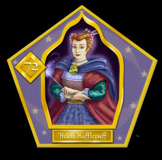
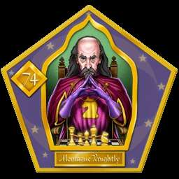
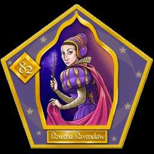
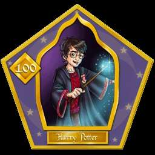
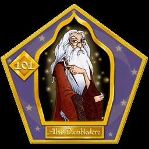

### #72 - Helga Hufflepuff #72 - Helga Hufflepuff	#100 - Harry Potter	#100 - Harry Potter
A Welsh witch and was one of the four founders of Hogwarts	An English half-blood wizard, one of the most famous wizards
School of Witchcraft and Wizardry	of modern times
### #74 - Montague Knightley #74 - Montague Knightley	#101 - Albus Dumbledore	#101 - Albus Dumbledore
A professional Wizard's Chess player. During his career, he	An English half-blood wizard, who was the Defence Against
eventually became the Wizard's Chess Champion	the Dark Arts professor, later the Transfiguration professor,
and later Headmaster of Hogwarts School of Witchcraft and
Wizardry
### #82 - Rowena Ravenclaw #82 - Rowena Ravenclaw
A Scottish witch and one of the four founders of Hogwarts
School of Witchcraft and Wizardry

### Glossary Glossary
### Beauxbatons Academy of Magic Beauxbatons Academy of Magic A
### (Académie de Magie Beauxbâtons) (Académie de Magie Beauxbâtons)
### Alchemy Alchemy
A co-ed wizarding school located somewhere in France, often
A medieval forerunner of chemistry, alchemy was developed	seen as comparable to Hogwarts in quality of education.
out of experiments to find a method of turning base metals
### Broomstick Broomstick
into gold, and of making an elixir of life that would prolong
life indefinitely. A very advanced and complex topic that
One of the most popular forms of wizarding transportation,
requires in-depth knowledge about the nature of magic and
broomsticks have been bewitched with countless
the four basic elements: earth, air, fire, and water.
enchantments to facilitate flight, such as a cushioning charm
### Apparate Apparate	to sit upon, braking charms, and anti-jinx protections. A
broomstick is controlled by the rider's grip on the handle,
To apparate is to magically teleport a limited distance,	accelerating when squeezed.
creating a loud crack or pop whenever used. Apparition
### Butterbeer Butterbeer
requires a licence from the Department of Magical
Transportation, which can only be issued to those seventeen
A frothy butterscotch-flavored drink served hot or cold,
and over. Disapparition is the word to describe when a
depending on the weather. Has diminutive alcoholic content,
person disappears, leaving by apparating.
but that has a severe effect on house-elves.
### Arithmancy Arithmancy
### C
Ancient study of the magical properties of numbers.
### Construct Construct Arithmancy is often needed in the modification or creation of
spells, a very dangerous practice.
Not a magically animated robot, but rather simply a "living"
### Auror Auror
creature that has been transfigured or conjured into
existence. If a rock was transfigured into a dog to distract a
Professional Dark wizard catcher and the equivalent to a
dragon, that dog is a construct, meaning it's a materialization
Muggle detective or special agent. To become an Auror, a
of the wizard's concept of a dog. It behaves how the wizard
witch or wizard must gain at least five N.E.W.T.s with grades
expects a dog to behave. It is an imitation of life and will
no lower than 'Exceeds Expectations' in subjects including:
eventually return to being a rock.
Defence Against the Dark Arts, Potions, Transfiguration, and
### D Charms; pass stringent character and aptitude tests at the
Ministry of Magic's Auror office, then do three years of Auror
training.
### The Daily Prophet The Daily Prophet
### Azkaban Azkaban
The most popular wizarding newspaper in Great Britain.
Island prison fortress where wizarding criminals are sent.
### E
Guarded day and night by the terrifying Dementors, who
drain peace, hope and happiness out of any human in their
### Elves Elves
vicinity.
### See house-elf. B
### Exploding Snap Exploding Snap
### Basilisk Basilisk
The wizarding version of the muggle card game of snap,
A Dark creature much like a gargantuan, heavy-bodied snake,	which uses a specifically-enchanted deck that may explode at
measuring up to 50 feet in length when fully grown. Unlike a
any time.
snake, a basilisk has a full row of fangs, all of which contain
the most deadly venom for which there is no antidote. Its
yellow eyes will kill any creature that looks directly into them,
and petrify (frozen in time, as if turned to stone) anyone who
catches an indirect glimpse.

### HM HM F
HM stands for Headmaster or Headmistress, which typically
### Floo Powder Floo Powder
refers to the witch or wizard in charge of Hogwarts. In the
context of Wands & Wizards, the HM is the master of the
Glittering silver powder that allows witches and wizards to
table and runs the game.
travel magically via the Floo Network by throwing the powder
into a lit fireplace, stepping into the green flames, and
### House-elf House-elf
naming their destination. A wizard may also kneel with their
head in the green fire to merely communicate with whomever	A very small creature dedicated to manual labor and
is near the destination fireplace. The Floo Network is	indentured to a specific wizarding family. House-elves are
managed by the Floo Network Authority under the	freed by
Department of Magical Transportation, and connects
### Howler Howler
wizarding fireplaces to each other.
### G	Wizarding letter which, when opened, shrieks and howls at
the reader in the deafening voice of the sender. Comes in a
red envelope and is usually sent by someone who is very
### Ghoul Ghoul
angry.
A magical beast that resembles a slimy, buck-toothed ogre.
### M
They tend to live in the attics or barns of wizards and
witches. They are relatively harmless creatures and are just
### Mudblood Mudblood
seen as nuisances because of the noise they make. They are
relatively dimwitted, and live off of bugs and other household
Highly offensive and derogatory term for a muggle-born
pests. At most, they will groan and throw objects.
wizard or witch. Only used by blood purists, who believe that
### Giant Giant	those with ancestry of magical blood are superior.
### Muggle duelling Muggle duelling
Huge humanoid beings with extremely violent and tribalistic
tendencies, growing up to 25 feet tall. Although they are
A non-magical physical fight.
intelligent and capable of interacting with other beings
(sometimes resulting in part-giants), they almost invariable
### N
lose patience and resort to violence.
### N.E.W.T.s N.E.W.T.s Gnomes Gnomes
Nastily Exhausting Wizarding Tests. Higher level Very small creatures with leathery skin and large, bald heads
examinations taken at the end of the seventh year at like knobbly potatoes. They have horny feet and razor-sharp
teeth. They live in holes in gardens and aren't very bright. To	Hogwarts.
de-gnome a garden, grab the gnome by the ankles, swing it in
### O
circles until it's dizzy, and throw it as far as you can.
### Goblins Goblins
### O.W.L.s O.W.L.s
Small clever beings with swarthy faces and very long hands
Ordinary Wizarding Levels. Hogwarts standard-level
and feet, showing some traits of the dwarves of Muggle
examinations which are taken at the end of the fifth year.
fiction. Goblins own Gringotts Bank and are responsible for
### P minting wizarding currencies, as well as various metalworks.
They have a deep distrust of wizards due to centuries of
### goblin-wizard conflicts and uprisings. Wizards have	Pensieve	Pensieve
historically oppressed goblins and denied them use of wands.
Stone basin which enables one to view thoughts and
### Gobstones Gobstones
memories, pulled out from one's mind using a wand.
### The wizarding version of marbles. The pieces squirt a stinky	Poltergeist	Poltergeist
substance into other players' faces when they lose a point.
A humanoid spirit born entirely from mischevious energy.
### H
Unlike ghosts, a poltergeist never had a life, has color, and
can turn itself invisible.
### Half-breed Half-breed
A perjorative term used against humans with non-human
ancestry or particular magical curses, like lycanthropy. Never
used in civil conversation.

### Portkey Portkey	Witch	Witch
Any object can be bewitched for use as a portkey to teleport	Gender-specific term for a female human with natural
witches and wizards away to a prearranged destination the	magical ability, often referred to as 'magical blood.'
instant they touch it or at a scheduled time. Physical contact
### Wizard Wizard
must be made to use a portkey. Use of a portkey should be
authorised by the Ministry of Magic.
Gender-specific term for a male human with natural magical
### ability, often referred to as 'magical blood.' R
### Wizarding Wizarding
### Remembrall Remembrall
An adjective to describe anything that belongs to the magical
Magical glass ball, the size of a large marble, filled with white
world.
smoke. The smoke turns to a deep red if there is something
### Wizengamot Wizengamot
you have forgotten to do.
### S	The Wizard High Court, consisting of about fifty witches and
wizards who wear plum-coloured robes with a silver 'W'
### worked onto the left-hand breast. Sorcerer Sorcerer
### WWN WWN
Non-gendered term for a witch or a wizard.
### The Wizarding Wireless Network, a magical radio system Squib Squib
that allows wizards to listen to wizarding music and news
Someone who, despite being born into a wizarding family,	using a Muggle radio and a wand.
has little or no magical ability. Anti-muggle magic typically
doesn't affect them, and they are able to see Dementors.
Squibs are often looked down upon and find themselves as
rejects trapped in the wizarding world.
### U
### Unicorn Unicorn
Mythical white horse-like creature with a golden mane and a
golden horn sprouting from the head. Innocent and beautiful
creatures. The tail hair and horn can be used in magic. It is
considered a monstrous crime to slay a unicorn. Drinking its
blood will keep you alive, even when close to death. However,
you have killed something pure, and will therefore live a half,
cursed life.
### Unspeakable Unspeakable
Employee of the Ministry of Magic's Department of
Mysteries. Little is known about their workplace, and even
less is known about their jobs. They are forbidden from
discussing their jobs or disclosing any information about
their department, hence the name "Unspeakable."
### W
### Warlock Warlock
A very old term that has two meanings: to describe a wizard
of unusually fierce appearance or as a title denoting
particular skill or achievement. It originally denoted one
learned in duelling and all martial magic or was given as a
title to a wizard who had performed feats of bravery (as
Muggles are sometimes knighted). It is sometimes incorrectly
used as interchangeable with the term "wizard."